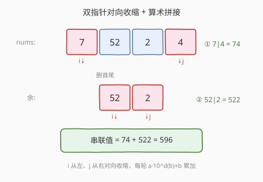
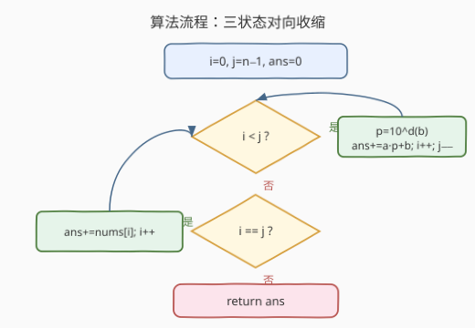

# 找出数组的串联值

- **题目名称**：找出数组的串联值
- **链接**：[2562. 找出数组的串联值](https://leetcode.cn/problems/find-the-array-concatenation-value/)
- **难度**：简单
- **标签**：数组、双指针、数学、模拟

## 1. 题目概述

给定下标从 0 开始的整数数组 `nums`。定义两个数的**串联**为把它们的十进制表示直接拼起来得到的新数——例如 $15$ 与 $49$ 的串联是 $1549$。

`nums` 的串联值初始为 $0$，重复执行下述操作直到 `nums` 为空：

- 若 `nums` 长度 $>1$：取**首元素** $a$ 与**尾元素** $b$，把二者串联值加到总串联值上，再删去首尾；
- 若 `nums` 仅剩 $1$ 个元素：把该元素本身加到总串联值上，再删去它。

返回最终串联值。

**示例 1**：

```text
输入：nums = [7,52,2,4]
输出：596
解释：① 7|4=74，删后 [52,2]；② 52|2=522，删后为空。74+522=596。
```

**示例 2**：

```text
输入：nums = [5,14,13,8,12]
输出：673
解释：① 5|12=512，余 [14,13,8]；② 14|8=148，余 [13]；③ 仅剩 13，累加 13。512+148+13=673。
```

**约束条件**：

- $1\le\text{nums.length}\le1000$
- $1\le\text{nums}[i]\le10^4$

> 💡 **规模读法**：长度 $\le1000$，单值 $\le10^4$（至多 5 位）。单次串联 $\le10^4\times10^5+10^4\approx10^9$；约 $500$ 次配对，总和上界 $\sim5\times10^{11}$，**超过 32 位 `int`**，累加须用 64 位。

---

## 2. 解题思路

### 2.1 暴力思路：首尾出队 + 字符串拼接

最直接的模拟：用一个可双端删除的容器（如 `deque`），每轮取 `a=front, b=back`，弹出两端，用 `stoi(to_string(a)+to_string(b))` 算串联值并累加；若只剩一个则直接加。这能 AC，但有两处"笨重"：

1. **字符串往返**：`int → string → 拼接 → int`，分配释放频繁；
2. 若误用 `vector` 删首尾则单次 $O(n)$、总 $O(n^2)$；`deque` 删端虽 $O(1)$ 但常数大。

瓶颈在于未察觉"删首尾"只是一次**双指针对向收缩**，而"拼接"可用**算术**一步完成。

### 2.2 核心观察：双指针对向收缩 + 算术拼接



两个洞察把模拟从"容器+字符串"压成"两变量+算术"：

**① 删首尾 = 双指针对向收缩。** 操作固定取首尾配对，等价于 $i$ 从 $0$ 向右、$j$ 从 $n-1$ 向左同步推进。每轮配对 $(\text{nums}[i],\text{nums}[j])$ 后 `i++；j--`，无需真正删除元素。$i<j$ 时成对处理，$i=j$ 时剩唯一中间元素单独加，$i>j$ 即结束。

**② 拼接 = $a\times10^{d(b)}+b$。** 设 $b$ 的十进制位数为 $d(b)$，则 $a$ 后接 $b$ 的串联值为 $a\cdot10^{d(b)}+b$。位数用一个 `t=b; while t>0: p*=10; t//=10` 的循环得到 $p=10^{d(b)}$，全程算术，零字符串分配。

$$\text{concat}(a,b)=a\cdot 10^{d(b)}+b,\qquad d(b)=\lfloor\log_{10}b\rfloor+1$$

> 💡 **为什么用除法循环而非 `log10`？** 浮点 `log10` 在 $b=10^k$ 处可能算成略小于 $k$ 的值，取整后位数少 1，把 $p$ 缩小 10 倍、串联值算错。连除 $10$ 的整数循环无精度风险，且 $d(b)\le5$ 至多 5 次迭代。

> ⚠️ **无前导零顾虑**：$\text{nums}[i]\ge1$，故 $b\ge1$，$d(b)$ 至少 1，$p$ 至少 10；不会出现 $b=0$ 时 $p=1$ 的退化（那会把 $a|0$ 错算成 $a$）。

### 2.3 算法流程图



三状态循环：

1. `i<j`：算 $c=a\cdot10^{d(b)}+b$，`ans+=c`，`i++`，`j--`，回到判定；
2. `i==j`：`ans+=nums[i]`，`i++`（或 `j--`），回到判定；
3. `i>j`：返回 `ans`。

### 2.4 示例演算

![示例演算：[7,52,2,4] 两步收缩，串联值 0→74→596](../images/2562_example_walkthrough.svg)

**示例 1** $\text{nums}=[7,52,2,4]$（$n=4$ 偶，无中间单元素）：

| 步骤 | 配对 $(a,b)$ | 拼接 $a\cdot10^{d(b)}+b$ | 删除后 nums | 串联值 |
|------|--------------|--------------------------|-------------|--------|
| 初始 | — | — | $[7,52,2,4]$ | $0$ |
| ① | $(7,4)$ | $7\times10+4=74$ | $[52,2]$ | $74$ |
| ② | $(52,2)$ | $52\times10+2=522$ | $\varnothing$ | $596$ |

**示例 2** $\text{nums}=[5,14,13,8,12]$（$n=5$ 奇，命中 $i=j$ 分支）：

| 步骤 | 配对 $(a,b)$ | 拼接 | 删除后 nums | 串联值 |
|------|--------------|------|-------------|--------|
| 初始 | — | — | $[5,14,13,8,12]$ | $0$ |
| ① | $(5,12)$ | $5\times100+12=512$ | $[14,13,8]$ | $512$ |
| ② | $(14,8)$ | $14\times10+8=148$ | $[13]$ | $660$ |
| ③ | 仅 $13$ | $13$ | $\varnothing$ | $673$ |

> 💡 第 ③ 步 $i=j=2$，走"单元素"分支，直接加 $13$。它也可视作 $d=0$、$p=1$ 时 $a\cdot1+\text{(无)}$ 的退化——但代码里单列判断最清晰，避免把"无第二操作数"塞进同一公式。

---

## 3. 参考代码

### C++

```cpp
class Solution {
public:
    long long findTheArrayConcVal(vector<int>& nums) {
        long long ans = 0;
        int i = 0, j = (int)nums.size() - 1;
        while (i < j) {
            int a = nums[i], b = nums[j];
            long long p = 1;                       // p = 10^{位数(b)}
            for (int t = b; t > 0; t /= 10) p *= 10;
            ans += (long long)a * p + b;           // 算术拼接 a|b
            ++i; --j;
        }
        if (i == j) ans += nums[i];                // 奇数个：中间元素单独累加
        return ans;
    }
};
```

> 💡 **实现要点**：① `ans` 与 `p` 用 `long long`：总和 $\sim5\times10^{11}$、单次 $a\cdot p$ 可达 $10^9$，均超 32 位。② `(long long)a * p` 显式提升，避免 `int*int` 中间溢出。③ 位数循环用 `t>0` 整数除法，杜绝 `log10` 浮点坑。④ 奇偶由 `i==j` 判定，单元素分支独立处理，不与拼接公式混用。

### Python

```python
class Solution:
    def findTheArrayConcVal(self, nums: List[int]) -> int:
        ans = 0
        i, j = 0, len(nums) - 1
        while i < j:
            a, b = nums[i], nums[j]
            p, t = 1, b
            while t:
                p *= 10
                t //= 10
            ans += a * p + b
            i += 1
            j -= 1
        if i == j:
            ans += nums[i]
        return ans
```

> 💡 Python 大整数无溢出，但仍用算术拼接以省字符串开销。求"10 的 $d(b)$ 次幂"也可写 `p = 10 ** len(str(b))`，但会重新引入字符串；除法循环最纯粹。

---

## 4. 复杂度分析

| 维度 | 复杂度 | 说明 |
|------|--------|------|
| **时间** | $O(n\cdot L)$ | $n/2$ 次配对，每次位数循环 $\le L\le5$ 步，合计 $O(n)$；$n\le1000$ 毫秒级 |
| **空间** | $O(1)$ | 仅 `i,j,ans,p,t` 几个变量，原地处理不复制数组 |
| 对照：deque+字符串 | $O(n\cdot L)$ 时间 / $O(n)$ 空间 | 同阶但常数大、需双端容器与字符串缓冲 |
| 对照：vector 删首尾 | $O(n^2)$ 时间 | 每轮 `erase` 前段搬移 $O(n)$，应避免 |

> 💡 因 $\text{nums}[i]\le10^4$，$L\le5$ 为常数，故时间实为 $O(n)$。若值域放大（如 $\le10^{18}$），$L\le18$ 仍极小，渐进不变。

---

## 5. 扩展：拼接的两种实现与位数预算

**算术拼接 vs 字符串拼接**：

| 实现 | 写法 | 优劣 |
|------|------|------|
| 算术 | $a\cdot10^{d(b)}+b$ | 零分配、$O(L)$ 整数运算；需手算位数 |
| 字符串 | `int(str(a)+str(b))` | 直观一行；分配字符串、`stoi` 解析 |

本题 $n\le1000$ 两者皆 AC，差异在常数与风格。但**当拼接进入高频路径**（如 $n\sim10^6$）或值域很大时，算术版省去堆分配，显著更优；字符串版胜在可读性。

**位数预算**：$d(b)=\lfloor\log_{10}b\rfloor+1$ 可由三种方式取得：

1. **除法循环**（本解）：`while t>0: p*=10; t//=10`——稳，$O(L)$；
2. **查表**：值域 $\le10^4$ 时 $d\in\{1,2,3,4,5\}$，可 `p=pow10[d]` 预处理，$O(1)$；
3. **`log10`**：$O(1)$ 但浮点坑，$b=10^k$ 处易错，**慎用**。

> ⚠️ 把"拼接"想成 $a\cdot10^{d(b)}+b$ 是本题的关键抽象：它把"字符串操作"翻译成"数位 + 乘加"，是后续 [258 各位相加](https://leetcode.cn/problems/add-digits/)、[9 回文数](https://leetcode.cn/problems/palindrome-number/) 等"数位重组"题的通用思路。

---

## 6. 面试要点

1. **为什么删首尾等价于双指针对向，而非真需要 deque？**

   > 操作固定取"当前首"与"当前尾"配对。删除首尾后，新首恰是旧 `i+1`、新尾恰是旧 `j-1`，故首尾序列由 $i$ 递增、$j$ 递减唯一确定，不需要任何删除——双指针 `(i,j)` 收缩即完整刻画。deque/容器只是把"逻辑下标"物化成"物理搬移"，徒增开销。

2. **算术拼接 $a\cdot10^{d(b)}+b$ 为什么对？$b$ 是 $10$ 的幂时呢？**

   > $b$ 有 $d$ 位 $\Leftrightarrow 10^{d-1}\le b<10^d$。把 $a$ 左移 $d$ 位即 $a\cdot10^d$，再加 $b$（$<10^d$，不进位污染）即得 $a$ 后接 $b$。$b=100=10^2$ 时 $d=3$（$100$ 是 3 位数），$p=10^3=1000$，$a\cdot1000+100$ 正确——这正是 `log10` 易错而除法循环正确的根源。

3. **单元素分支能否并入拼接公式？**

   > 形式上令 $b$ "缺失"、$p=1$，则 $a\cdot1=a$ 与"加 $a$"一致。但代码里"无第二操作数"与"有 $b$"是两种语义，强行合并要用 `b=0` 哨兵并特判 $d(0)$，反而绕——独立 `if (i==j) ans+=nums[i]` 最直白、最不易错。

4. **为什么必须 64 位整数？**

   > 单值 $\le10^4$（5 位），单次拼接 $a\cdot10^5+b\le10^4\cdot10^5+10^4\approx10^9$，已逼近 `int` 上界 $\approx2.1\times10^9$；约 $500$ 次累加总和 $\sim5\times10^{11}$，远超 32 位。C++ 须 `long long` 累加，且 `a*p` 中间值也先提升到 64 位。Python 无此虑。

5. **`log10` 求位数的坑具体在哪？**

   > $b=10^k$ 时 `log10(b)` 在 IEEE754 下可能得 $k-1+\varepsilon$（如 $2.999\ldots$），`int()` 截断成 $k-1$，于是 $p=10^{k-1}$ 小了 10 倍，串联值错。除法循环 `t/=10` 在整数域精确，$b=10^k$ 时正好迭代 $k$ 次得 $p=10^k$。这是"能用整数就别绕浮点"的典型例。

> 💡 **一句话总结**：首尾配对 = 双指针 `(i,j)` 对向收缩，拼接 = $a\cdot10^{d(b)}+b$ 算术一步——把"deque+字符串"的模拟压成 $O(n)$ 时间 / $O(1)$ 空间，注意 64 位累加与除法循环求位数。

---

## 7. 同类练习题

- [344. 反转字符串](https://leetcode.cn/problems/reverse-string/)：双指针从两端向中间交换，"首尾配对收缩"骨架同构（本题是配对求和而非交换）
- [2119. 反转两次的数字](https://leetcode.cn/problems/a-number-after-a-double-reversal/)（[题解](../2101-2200/2119_反转两次的数字.md)）：数位拆分重组，承接"算术拼接 $a\cdot10^d+b$"的数位思路
- [258. 各位相加](https://leetcode.cn/problems/add-digits/)（[题解](../0201-0300/258_各位相加.md)）：数位操作基础母题，承接 $n\bmod10$ 取位与 $10$ 的幂
- [9. 回文数](https://leetcode.cn/problems/palindrome-number/)（[题解](../0001-0100/9_回文数.md)）：从右取位 $n\bmod10$ 重组数字的经典套路，与算术拼接同源
