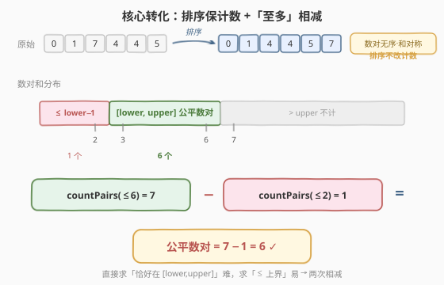
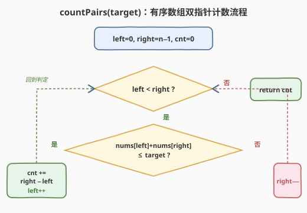
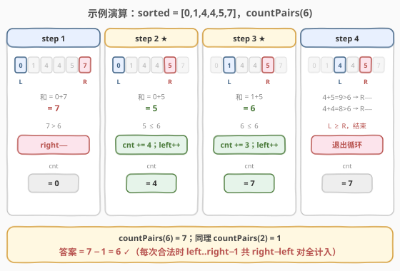

# 统计公平数对的数目

- **题目名称**：统计公平数对的数目
- **链接**：[2563. 统计公平数对的数目](https://leetcode.cn/problems/count-the-number-of-fair-pairs/)
- **难度**：中等
- **标签**：数组、双指针、排序、二分查找

## 1. 题目概述

给你一个下标从 0 开始、长度为 `n` 的整数数组 `nums`，和两个整数 `lower` 与 `upper`，返回**公平数对的数目**。

数对 `(i, j)` 满足以下条件即为公平数对：

- `0 <= i < j < n`，且
- `lower <= nums[i] + nums[j] <= upper`

**示例 1**：

```text
输入：nums = [0,1,7,4,4,5], lower = 3, upper = 6
输出：6
解释：共计 6 个公平数对：(0,3)、(0,4)、(0,5)、(1,3)、(1,4) 和 (1,5)。
```

**示例 2**：

```text
输入：nums = [1,7,9,2,5], lower = 11, upper = 11
输出：1
解释：只有单个公平数对：(2,3)。
```

**约束条件**：

- `1 <= nums.length <= 10^5`
- `nums.length == n`
- `-10^9 <= nums[i] <= 10^9`
- `-10^9 <= lower <= upper <= 10^9`

> ⚠️ **数值范围**：`n` 最大 $10^5$，数对总数可达 $\binom{n}{2} \approx 5 \times 10^9$，**超过 32 位有符号整数上限**。C++ 计数变量必须用 `long long`；`nums[i] + nums[j]` 也可能到 $\pm 2 \times 10^9$，建议用 `long long` 存和以避坑。

---

## 2. 解题思路

### 2.1 暴力思路

两重循环枚举所有 `(i, j)`（`i < j`），判断 `lower <= nums[i] + nums[j] <= upper` 后计数。时间 $O(n^2)$，在 $n = 10^5$ 时约 $10^{10}$ 次运算，**超时**。

破局的关键是：题目只问**数对的个数**，不关心数对的下标身份。而「两个位置的和」是**对称的**——交换 `i`、`j` 不改变和。这给了我们排序的自由。

### 2.2 核心观察：排序保计数 +「至多」相减



本题是两个经典技巧的合体：

**观察一：排序不改变数对计数**（与 [611. 有效三角形的个数](../0601-0700/611_有效三角形的个数.md)、[15. 三数之和](../0001-0100/15_三数之和.md) 同源）

排序只是对**位置**做了一次置换。每个无序位置对 $\{i, j\}$（$i \neq j$）在排序前后一一对应，而 `nums[i] + nums[j]` 的值不变。因此「和落在 `[lower, upper]` 的位置对数」排序前后完全相等。排序后只需在有序数组上数 `i < j` 的对数即可。

**观察二：把「区间计数」拆成两个「上界计数」之差**（与 [1248. 统计「优美子数组」](../1201-1300/1248_统计优美子数组.md) 的 `exactly(K) = atMost(K) − atMost(K−1)` 同构）

直接数「`lower <= 和 <= upper`」需要同时卡两端，双指针难以下手。但「和 $\le$ 某个上界」是单调可数的：

$$
\#\{\text{公平}\} = \text{countPairs}(\le \text{upper}) - \text{countPairs}(\le \text{lower} - 1)
$$

> 💡 **为什么是 `lower − 1`？** 「`<= upper`」包含了所有和 $\le$ upper 的对，多算了「和 $<$ lower」的部分。和为整数的「$<$ lower」即「$\le$ lower − 1」，两者相减正好得到 `[lower, upper]` 闭区间。

**观察三：`countPairs(≤ target)` 用有序双指针 $O(n)$ 搞定**

在升序数组上，`left = 0`、`right = n − 1`，对撞移动：

- 若 `nums[left] + nums[right] <= target`：固定 `left`，则 `left+1` 到 `right` 的每个 `j` 都满足 `nums[left] + nums[j] <= nums[left] + nums[right] <= target`（升序保证 `nums[j] <= nums[right]`）。**一次性计入** `right − left` 对，再 `left++`。
- 否则和过大，`right−−`（换一个更小的 `right`）。

这正是 [611](../0601-0700/611_有效三角形的个数.md)「计数型双指针」的招牌手法——找到合法分界线后按**区间长度** `right − left` 一次性计数，而非逐对枚举。

> ⚠️ **单调性成立的前提**：`left++` 让 `nums[left]` 变大、和变大；`right−−` 让 `nums[right]` 变小、和变小。两端同向变化、单调受控，所以双指针不会回头、不漏不重。**对负数同样成立**——单调性只取决于「有序」，与正负无关。

### 2.3 算法流程图



`countPairs(target)` 的步骤：

1. 初始化 `left = 0, right = n − 1, cnt = 0`
2. 当 `left < right`：
   - 若 `nums[left] + nums[right] <= target`：`cnt += right − left`，`left++`
   - 否则：`right−−`
3. 返回 `cnt`

最终答案为 `countPairs(upper) − countPairs(lower − 1)`。

### 2.4 示例演算

以示例 1 为例，`nums` 排序后为 `[0,1,4,4,5,7]`，`lower = 3, upper = 6`。先演算 `countPairs(6)`：



| 步骤 | left | right | nums[l]+nums[r] | 判定 | 动作 | cnt |
|------|------|-------|-----------------|------|------|-----|
| 1 | 0 (0) | 5 (7) | 0+7=7 | 7 > 6 | right−− | 0 |
| 2 | 0 (0) | 4 (5) | 0+5=5 | 5 ≤ 6 | cnt += 4，left++ | 4 |
| 3 | 1 (1) | 4 (5) | 1+5=6 | 6 ≤ 6 | cnt += 3，left++ | 7 |
| 4 | 2 (4) | 4→3→2 (5,4,4) | 9, 8 均 > 6 | right−−×2 至 L≥R | 退出 | 7 |

**步骤 2 详解**：`left=0` 指向 `0`，`right=4` 指向 `5`，`0+5=5 ≤ 6`。固定 `left`，则 `left+1..right` 即下标 `1,2,3,4`（值 `1,4,4,5`）与 `left=0` 配对都合法——共 `right − left = 4` 对。计数后 `left` 右移。

同理计算 `countPairs(2) = 1`（仅 `(0,1)` 的和 `0+1=1 ≤ 2`）。最终：

$$
\text{答案} = \text{countPairs}(6) - \text{countPairs}(2) = 7 - 1 = 6 \quad \checkmark
$$

> 💡 **与 1248 的对偶**：1248 在**子数组**（连续、需维护窗口）上做 `atMost(K) − atMost(K−1)`；2563 在**数对**（不连续、排序后双指针对撞）上做同样相减。一个是滑窗计数 `right−left+1`，一个是双指针计数 `right−left`——骨架相同，载体不同。

---

## 3. 参考代码

### C++

```cpp
// 统计公平数对的数目.cpp —— 排序 + 「至多」相减 + 双指针计数
// 编译: g++ -O2 -std=c++17 统计公平数对的数目.cpp -o fair_pairs
#include <vector>
#include <algorithm>
using namespace std;

class Solution {
  public:
    long long countFairPairs(vector<int>& nums, int lower, int upper) {
        sort(nums.begin(), nums.end());
        return countLE(nums, upper) - countLE(nums, (long long)lower - 1);
    }
  private:
    // 统计满足 nums[i]+nums[j] <= target 的数对 (i<j) 数
    long long countLE(vector<int>& nums, long long target) {
        long long cnt = 0;
        int left = 0, right = nums.size() - 1;
        while (left < right) {
            if ((long long)nums[left] + nums[right] <= target) {
                cnt += right - left;   // left+1..right 全部合法
                ++left;
            } else {
                --right;               // 和过大，换更小的 right
            }
        }
        return cnt;
    }
};
```

### Python

```python
class Solution:
    def countFairPairs(self, nums: List[int], lower: int, upper: int) -> int:
        nums.sort()
        def count_le(target: int) -> int:
            cnt = 0
            left, right = 0, len(nums) - 1
            while left < right:
                if nums[left] + nums[right] <= target:
                    cnt += right - left   # left+1..right 全部合法
                    left += 1
                else:
                    right -= 1            # 和过大，换更小的 right
            return cnt
        return count_le(upper) - count_le(lower - 1)
```

> 💡 **溢出细节**：C++ 中 `(long long)lower - 1` 把 `lower = −10^9` 时 `lower − 1` 安全放到 `long long`；`nums[left] + nums[right]` 先转 `long long` 再比较，避免两端各 $−10^9$ 相加到 $−2 \times 10^9$ 触发 `int` 溢出。`cnt` 用 `long long` 承载最多约 $5 \times 10^9$ 的对数。

---

## 4. 复杂度分析

| 维度 | 复杂度 | 说明 |
|------|--------|------|
| **时间复杂度** | $O(n \log n)$ | 排序 $O(n \log n)$；`countLE` 调用两次，每次 `left`/`right` 合计至多移动 $n$ 步，共 $O(n)$ |
| **空间复杂度** | $O(\log n)$ | 排序的栈空间（C++ `sort` 为快排变种） |

> 💡 排序是时间主导项，两次 $O(n)$ 计数是「免费」的。本题不存在 $O(n)$ 解法（必须先建立有序性），$O(n \log n)$ 已是最优。

---

## 5. 扩展：二分查找解法

双指针并非唯一解法。固定每个 `i`，要在 `j > i` 中找满足 `lower − nums[i] <= nums[j] <= upper − nums[i]` 的 `j` 个数。有序数组上用**两次二分**锁定区间即可：

```python
from bisect import bisect_left, bisect_right

class Solution:
    def countFairPairs(self, nums: List[int], lower: int, upper: int) -> int:
        nums.sort()
        n = len(nums)
        ans = 0
        for i in range(n):
            a, b = lower - nums[i], upper - nums[i]
            lo = bisect_left(nums, a, i + 1, n)          # 第一个 >= a 的位置
            hi = bisect_right(nums, b, i + 1, n) - 1      # 最后一个 <= b 的位置
            if lo <= hi:
                ans += hi - lo + 1
        return ans
```

| 解法 | 时间 | 空间 | 思路 |
|------|------|------|------|
| 暴力 | $O(n^2)$ | $O(1)$ | 双重循环枚举 + 判断 |
| 二分查找 | $O(n \log n)$ | $O(\log n)$ | 固定 `i`，两次二分锁定 `j` 区间 |
| **双指针 + 相减** | $O(n \log n)$ | $O(\log n)$ | `countPairs(upper) − countPairs(lower−1)`，计数阶段 $O(n)$ |

> 💡 **面试建议**：渐进讲法是加分项——先讲暴力 $O(n^2)$，再引出「排序 + 二分」$O(n \log n)$（容易想到），最后优化为「排序 + 双指针 + 相减」$O(n \log n)$ 但常数更优，并点出与 [1248](../1201-1300/1248_统计优美子数组.md)、[611](../0601-0700/611_有效三角形的个数.md) 的套路同源。

---

## 6. 面试要点

1. **为什么排序不破坏 `i < j` 的约束？**

   - 题目要的是**位置对**的个数。排序是对位置的一次置换，每个无序位置对 $\{i, j\}$（$i \neq j$）在排序前后一一对应，和值不变。所以「和落在区间内的位置对数」不变。排序后我们数 `left < right` 的对，正好对应每个无序位置对数一次，不重不漏。

2. **为什么用 `upper − (lower − 1)` 而不是直接数 `[lower, upper]`？**

   - 双指针天然处理「$\le$ 单边上界」的单调判定；同时卡 `[lower, upper]` 闭区间两端，指针移动方向无法确定（一边要放大、一边要缩小，相互耦合）。拆成两个单边上界相减，就把双向约束化为两次单向扫描——与 1248「恰好 K = 至多 K − 至多(K−1)」异曲同工。

3. **`cnt += right − left` 的正确性？**

   - 当 `nums[left] + nums[right] <= target` 时，升序保证对任意 `j ∈ [left+1, right]` 有 `nums[j] <= nums[right]`，故 `nums[left] + nums[j] <= target` 也成立。这 `right − left` 对都以 `left` 为较小端、互不相同；计数后 `left++`，这些对不再被访问。反之 `right−−` 时，当前 `right` 对当前及更靠后的 `left` 都偏大，安全丢弃。

4. **负数会影响双指针吗？**

   - 不会。单调性只依赖「数组有序」，与元素正负无关。`left++` 使 `nums[left]` 增大、和增大；`right−−` 使 `nums[right]` 减小、和减小。两端同向受控、不回头。示例中 `nums[i]` 可低至 $−10^9$，算法照常运行。

5. **哪些地方要防溢出？**

   - C++ 中 `nums[i] + nums[j]` 可达 $\pm 2 \times 10^9$，需 `long long` 存和；计数最多约 $5 \times 10^9$ 对，`cnt` 必须用 `long long`；`lower − 1` 在 `lower = −10^9` 时仍 > `INT_MIN` 但稳妥起见也放 `long long`。Python 整数任意精度，无需操心。

> 💡 **一句话总结**：2563 是 1248「至多相减」与 611「排序 + 计数型双指针」的合体——排序保数对计数不变，把 `[lower, upper]` 拆成 `countPairs(≤upper) − countPairs(≤lower−1)`，每个上界用对撞双指针按 `right − left` 区间计数，$O(n \log n)$ 一次过。

---

## 7. 同类练习题

- [1248. 统计「优美子数组」](https://leetcode.cn/problems/count-number-of-nice-subarrays/)（[题解](../1201-1300/1248_统计优美子数组.md)）：`atMost(K) − atMost(K−1)` 母题，滑窗载体；2563 把同一相减搬到数对载体
- [611. 有效三角形的个数](https://leetcode.cn/problems/valid-triangle-number/)（[题解](../0601-0700/611_有效三角形的个数.md)）：排序 + 计数型双指针招牌题，`count += right − left` 的来源
- [2824. 统计和小于等于下标之差的数对数目](https://leetcode.cn/problems/count-pairs-whose-sum-is-less-than-target/)：`countPairs(≤target)` 单次版，2563 的子问题
- [16. 最接近的三数之和](https://leetcode.cn/problems/3sum-closest/)：排序 + 双指针的母题家族，对比「枚举型」与「计数型」
- [713. 乘积小于 K 的子数组](https://leetcode.cn/problems/subarray-product-less-than-k/)（[题解](../0701-0800/713_乘积小于K的子数组.md)）：「至多」类滑窗计数，对比 `right − left + 1` 与本题 `right − left`
