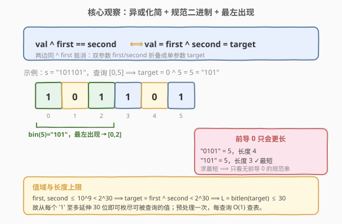
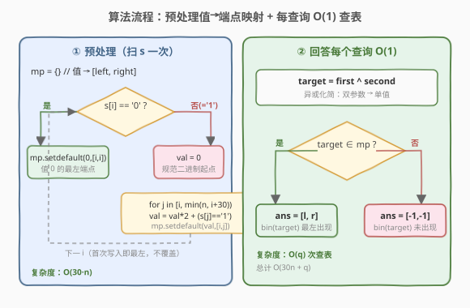

# 子字符串异或查询

- **题目名称**：子字符串异或查询
- **链接**：[2564. 子字符串异或查询](https://leetcode.cn/problems/substring-xor-queries/)
- **难度**：中等
- **标签**：位运算、数组、哈希表、字符串

## 1. 题目概述

给定一个**二进制字符串** `s` 和一个整数数组 `queries`，其中 `queries[i] = [first_i, second_i]`。对第 `i` 个查询，找到 `s` 的**最短子字符串**，其对应的**十进制**值 `val` 满足 `val ^ first_i == second_i`。返回 `ans[i] = [left_i, right_i]` 为该子字符串的端点（下标从 `0` 开始）；不存在则 `[-1, -1]`；有多个答案时取 `left_i` 最小者。

**示例 1**：

```text
输入：s = "101101", queries = [[0,5],[1,2]]
输出：[[0,2],[2,3]]
解释：第一个查询 val ^ 0 = 5 ⟹ val = 5（"101"），s[0..2] = "101" → [0,2]；
     第二个查询 val ^ 1 = 2 ⟹ val = 3（"11"），s[2..3] = "11" → [2,3]。
```

**示例 2**：

```text
输入：s = "0101", queries = [[12,8]]
输出：[[-1,-1]]
解释：val ^ 12 = 8 ⟹ val = 4（"100"），"0101" 中不含子串 "100"，返回 [-1,-1]。
```

**示例 3**：

```text
输入：s = "1", queries = [[4,5]]
输出：[[0,0]]
解释：val ^ 4 = 5 ⟹ val = 1（"1"），s[0..0] = "1" → [0,0]。
```

**约束条件**：

- $1 \le \text{s.length} \le 10^4$
- `s[i]` 为 `'0'` 或 `'1'`
- $1 \le \text{queries.length} \le 10^5$
- $0 \le \text{first}_i,\ \text{second}_i \le 10^9$

> 💡 本题是把「查询条件」用**异或的线性可逆性**化简、再做「子串值→端点」**离线预处理**的典型题：`val ^ first == second` 等价于 `val = first ^ second`，于是每个查询被还原成「在 `s` 中找十进制值恰为 `target` 的最短子串」。与 [187. 重复的 DNA 序列](../0101-0200/187_重复的DNA序列.md)（2 位滚动哈希编码子串）同属「子串值编码」一脉，只是本题编码后还要回答查询。

---

## 2. 解题思路

### 2.1 暴力思路

对每个查询 `[first, second]`：枚举 `s` 的所有子串 `[l, r]`，算其十进制值 `val`，判断 `val == first ^ second`，取长度最短（再取 `l` 最小）者。单查询 $O(n^2)$，$q=10^5$、$n=10^4$ 时约 $10^{13}$，远超时限。

> ⚠️ 暴力的根因有二：一是**没有化简查询条件**，每查询都重新扫描全串；二是**没有利用「最短子串」的结构**——其实最短长度只与 `target` 的二进制位数有关，不需要枚举所有长度。

### 2.2 核心观察：异或化简 + 规范二进制 + 预处理映射



三个观察层层递进：

1. **异或的线性可逆性**：`val ^ first == second` ⟺ `val = first ^ second`。令 $\text{target} = \text{first} \oplus \text{second}$，查询等价于「找 `s` 中十进制值恰为 `target` 的最短子串」。条件里的 `first`、`second` 双参数被折叠成单参数 `target`。

2. **最短 = 规范二进制表示**：设 $L = \text{bitlen}(\text{target})$（`target` 的二进制位数）。
   - 任何值为 `target` 的子串长度 $\ge L$（长度 $<L$ 的子串值 $< 2^{L-1} \le \text{target}$，不可能相等）；
   - 长度恰为 $L$ 且值为 `target` 的子串**唯一**，就是 `bin(target)`（无前导 0，因 `target>0` 首位必 1）；
   - 长度 $>L$ 且值为 `target` 的子串必有**前导 0**（非零主体仍是 `bin(target)` 的 $L$ 位），故严格更长。

   因此对 `target > 0`，最短子串**就是 `bin(target)` 这条串本身**，长度恰为 $L$；它出现 ⟺ 存在答案，且**最左出现**即满足「`left` 最小」。`target = 0` 时最短是单字符 `"0"`，取最左 `"0"`。

   > 💡 一句话：前导 0 只会让子串变长，对「求最短」毫无贡献——所以只需在无前导 0 的「规范」位置（`s[i]=='1'`）出发统计各值即可，最左出现天然给出最小 `left`。

3. **预处理映射 + $O(1)$ 查询**：`s` 长度仅 $10^4$、而 `target < 2^{30}$（`first,second ≤ 10^9 < 2^{30}`，故 $\text{first}\oplus\text{second} < 2^{30}$，$L \le 30$）。于是从每个 `s[i]=='1'` 出发**至多延伸 30 位**滚动累值，把每个值首次出现时记录 `[i, j]`；`s[i]=='0'` 时记录值 0 的最左端点。建一张 `值 → [left, right]` 的哈希表后，每查询 $O(1)$ 取表。

> ⚠️ **识别信号**：「**多查询 + 主串不变**」⟹ 想「**预处理一次、离线回答**」；查询条件含 `^` ⟹ 想「**异或两边同时 ^ 同一数自抵**」化简。两个信号叠加即得本题骨架。

### 2.3 算法流程图



预处理（遍历 `s` 一次）：

- `mp = {}`（值 → `[left, right]`，首次写入即最左）
- 对每个 `i`：
  - 若 `s[i] == '0'`：`mp.setdefault(0, [i, i])`（值 0 的最左端点），`continue`
  - 若 `s[i] == '1'`：`val = 0`，`for j in [i, min(n, i+30))`：`val = val*2 + (s[j]=='1')`；`mp.setdefault(val, [i, j])`

回答查询：

- `target = first ^ second`
- `mp` 中有 `target` ⟹ 返回 `[l, r]`；否则 `[-1, -1]`

### 2.4 示例演算

![示例演算：s="101101" 的两查询映射到 [0,2] 与 [2,3]](../images/subxor_walkthrough.svg)

以示例 1 `s = "101101"` 为例。预处理得到的（部分）映射：`5 → [0,2]`（`s[0..2]="101"`）、`3 → [2,3]`（`s[2..3]="11"`）、`0 → [1,1]`、`1 → [0,0]`、`2 → [0,1]`、`11 → [0,3]`……

- 查询 `[0,5]`：`target = 0^5 = 5` ⟹ 查表得 `[0,2]` ✓
- 查询 `[1,2]`：`target = 1^2 = 3` ⟹ 查表得 `[2,3]` ✓

> ⚠️ **为何 `5` 记成 `[0,2]` 而非更右的 `s[3..]="1..."`？** 因为 `i` 递增扫描、`setdefault` 只写首次出现，`i=0` 时 `"101"` 已把值 5 占住，更右的同值出现一律不覆盖——这正保证了「`left` 最小」。

---

## 3. 参考代码

### C++

```cpp
class Solution {
public:
    vector<vector<int>> substringXorQueries(string s, vector<vector<int>>& queries) {
        unordered_map<int, pair<int,int>> mp;   // 值 → {left, right}，首次写入即最左
        int n = s.size();
        for (int i = 0; i < n; ++i) {
            if (s[i] == '0') {
                if (mp.find(0) == mp.end()) mp[0] = {i, i};   // 值 0：最左的单字符 0
                continue;
            }
            // s[i]=='1'：从 i 出发的规范二进制（无前导 0），至多延伸 30 位
            int val = 0;
            for (int j = i; j < min(n, i + 30); ++j) {
                val = val * 2 + (s[j] - '0');                 // target < 2^30，int 不溢出
                if (mp.find(val) == mp.end()) mp[val] = {i, j};
            }
        }
        vector<vector<int>> ans;
        ans.reserve(queries.size());
        for (auto& q : queries) {
            int target = q[0] ^ q[1];                          // 异或化简
            auto it = mp.find(target);
            if (it == mp.end()) ans.push_back({-1, -1});
            else ans.push_back({it->second.first, it->second.second});
        }
        return ans;
    }
};
```

### Python

```python
class Solution:
    def substringXorQueries(self, s: str, queries: List[List[int]]) -> List[List[int]]:
        mp = {}                                # 值 → (left, right)，首次写入即最左
        n = len(s)
        for i, ch in enumerate(s):
            if ch == '0':
                if 0 not in mp:
                    mp[0] = (i, i)              # 值 0：最左的单字符 0
                continue
            val = 0
            for j in range(i, min(n, i + 30)):  # 规范二进制，至多 30 位
                val = val * 2 + (ord(s[j]) - 48)
                if val not in mp:
                    mp[val] = (i, j)
        ans = []
        for first, second in queries:
            target = first ^ second             # 异或化简
            if target in mp:
                l, r = mp[target]
                ans.append([l, r])
            else:
                ans.append([-1, -1])
        return ans
```

> ⚠️ **四个易错点**：
> 1. **`s[i]=='0'` 要单独记值 0**：规范二进制只从 `'1'` 出发，值 0 只能来自单字符 `"0"`；漏写会导致 `target=0` 的查询误报 `[-1,-1]`（如 `first==second` 时）。
> 2. **延伸上限取 30**：因 `first,second ≤ 10^9 < 2^{30}`，故 `target = first ^ second < 2^{30}`，二进制位数 $L \le 30$，`min(n, i+30)` 恰好覆盖。取小会漏长值、取大则多做无用功（且需注意溢出）。
> 3. **只写首次出现（`setdefault`/`find==end`）**：`i` 递增时首次出现即最左，覆盖反而会破坏「`left` 最小」。
> 4. **`target=0` 的最短是单字符**：长度 1 的 `"0"` 即最短，无需考虑更长全零串；`mp[0]=[p,p]` 直接给出。

---

## 4. 复杂度分析

| 维度 | 复杂度 | 说明 |
|------|--------|------|
| **时间** | $O(30n + q)$ | 预处理：每个 `i` 至多延伸 30 位，共 $\le 30n$；查询：$q$ 次 $O(1)$ 查表 |
| **空间** | $O(30n)$ | 哈希表最多存 $30n$ 个「值→端点」条目（实际更少，因值会重复） |
| 对照：暴力枚举 | $O(q\cdot n^2)$ | 每查询全扫所有子串，$10^{13}$ 级不可行 |

> 💡 $n=10^4$、$q=10^5$ 时，预处理约 $3\times10^5$ 次、查询 $10^5$ 次查表，总量 $\sim 4\times10^5$，远低于时限。瓶颈在查询数而非主串长度——这正是「预处理映射 + 离线查表」范式对「多查询」问题的降维价值。

---

## 5. 扩展：最短子串唯一性的证明与边界

### 5.1 为何最短子串必为 `bin(target)` 本身？

设 $\text{target}>0$，$L=\text{bitlen}(\text{target})$（故 $2^{L-1} \le \text{target} < 2^L$）。对任意值为 `target` 的子串 $s[l..r]$，长度 $k=r-l+1$：

- 若 $k < L$：其值 $< 2^{L-1} \le \text{target}$，不可能等于 `target`；
- 若 $k = L$：值为 `target` ⟺ $s[l..r]$ 恰为 `target` 的 $L$ 位二进制（首位必为 1，无前导 0），唯一；
- 若 $k > L$：值为 `target` ⟺ $s[l..r]$ 为若干前导 0 接 `bin(target)`，长度严格 $>L$。

故全局最短长度恰为 $L$，由 `bin(target)` 的出现给出；不存在出现 ⟺ 任何长度的子串值都不为 `target`（因更长版本必含 `bin(target)` 作后缀，`bin(target)` 不出现则全无）。`target=0` 同理：最短是长度 1 的 `"0"`。

### 5.2 为何 `target < 2^{30}` 只需延伸 30 位？

约束 $\text{first},\text{second} \le 10^9$，而 $2^{30} = 1\,073\,741\,824 > 10^9$，故两者均 $< 2^{30}$（最高有效位 $\le$ 第 29 位）。异或只在这些位上翻转，结果仍 $< 2^{30}$，即 $L \le 30$。所以从每个 `'1'` 起延伸 30 位即可枚尽所有可能被查到的值；第 30 位之后的延伸只会产生 $\ge 2^{30}$ 的值，永不被查询。若约束放宽到 $10^{18}$，只需把 `30` 调为 `60` 并用 `long long`。

### 5.3 与「子串值编码」家族的对照

| 维度 | 2564（本题） | 187（重复 DNA） |
|------|------|------|
| 编码对象 | 子串的十进制值 | 长度 10 子串的 2 位/碱基编码 |
| 编码方式 | 从 `'1'` 起滚动 `val=val*2+bit` | `<<2 \| code` 滚动哈希 |
| 编码目的 | 建「值→端点」表回答查询 | 计频找出现 ≥2 次的串 |
| 长度上限 | 30（受 `target<2^30` 约束） | 10（固定） |

---

## 6. 面试要点

1. **为什么查询条件能从双参数化成单参数？**

   > 异满足消去律：`val ^ first == second` 两边同 ^ `first`，得 `val = first ^ second`。`first`、`second` 合成 `target` 一个参数，查询变成「找值为 `target` 的最短子串」。

2. **为什么最短子串就是 `bin(target)` 本身、而不是带前导 0 的更长串？**

   > 设 $L=\text{bitlen}(\text{target})$。长度 $<L$ 不可能（值 $<2^{L-1}\le\text{target}$）；长度 $=L$ 唯一对应 `bin(target)`；长度 $>L$ 必带前导 0 故更长。故最短就是 `bin(target)`，取其最左出现。

3. **为什么 `s[i]=='0'` 要单独处理、规范二进制只从 `'1'` 出发？**

   > 规范二进制无前导 0，故首位必为 1，只能从 `'1'` 起；但 `target=0` 的值无法由 `'1'` 起的串产生（最小是 1），须由单字符 `"0"` 单独记录，否则 `first==second` 的查询会误报 `[-1,-1]`。

4. **延伸上限为何取 30？取小/取大各有什么后果？**

   > `first,second ≤ 10^9 < 2^{30}` ⟹ `target<2^{30}` ⟹ $L\le 30$，延伸 30 位即枚尽。取小会漏掉 $L$ 较大的值（漏答）；取大则多算无用的高位值（且 `val=val*2+bit` 可能溢出 `int`，需换 `long long`）。

5. **多查询、主串不变的题一般怎么破？**

   > 「预处理一次、离线回答」：把会重复用到的信息（本题是「值→最左端点」）在主串上预先算好存表，之后每查询 $O(1)$ 取用。核心是把 $O(q\cdot\text{scan})$ 降到 $O(\text{scan}+q)$，适用于主串不变、查询独立的问题。

> 💡 **一句话总结**：2564 = 异或化简 + 规范二进制 + 预处理映射——`val=first^second` 把查询折叠成单值，`bin(target)` 的最左出现即最短子串，从每个 `'1'` 延伸 30 位建表后每查询 $O(1)$。

---

## 7. 同类练习题

- [187. 重复的 DNA 序列](https://leetcode.cn/problems/repeated-dna-sequences/)（[题解](../0101-0200/187_重复的DNA序列.md)）：同为「子串值编码」，用 2 位/碱基滚动哈希代替本题的十进制滚动累值，对照编码目的（计频 vs 查表）
- [371. 两整数之和](https://leetcode.cn/problems/sum-of-two-integers/)（[题解](../0301-0400/371_两整数之和.md)）：位运算家族母题，强化对「异或可逆、按位运算」的直觉，是化简本题查询条件的基础
- [30. 串联所有单词的子串](https://leetcode.cn/problems/substring-with-concatenation-of-all-words/)（[题解](../0001-0100/30_串联所有单词的子串.md)）：在主串中按定长匹配特定子串，对照「主串不变 + 多查询/多模式」的离线处理范式
- [2552. 统计上升四元组](https://leetcode.cn/problems/count-increasing-quadruplets/)（[题解](../2501-2600/2552_统计上升四元组.md)）：同区间预处理映射后回答计数查询，对照「预处理一次、查询复用」的离线骨架
- [2524. 子数组的最大频率分数](https://leetcode.cn/problems/maximum-frequency-score-of-a-subarray/)：子数组值域预处理 + 查询型，对照「把扫描成本前置到预处理」的思路
