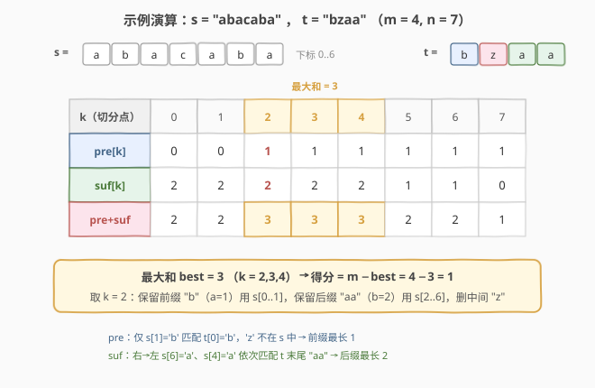

# LeetCode 最少得分子序列 题解

## 1. 题目概述

- **标题 / 题号**：最少得分子序列（#2565，hard）
- **链接**：https://leetcode.cn/problems/subsequence-with-the-minimum-score/
- **难度**：困难
- **标签**：字符串、贪心、双指针、子序列匹配

**题意**：给定两个字符串 `s` 和 `t`（均只含小写字母）。你可以从 `t` 中删除**任意数目**的字符。若没有删除任何字符，得分为 `0`；否则记被删字符中最小下标为 `left`、最大下标为 `right`，得分 $=\text{right}-\text{left}+1$。要求使**删除后的 `t` 成为 `s` 的子序列**，返回**最小得分**。

**示例 1**：

```text
输入：s = "abacaba", t = "bzaa"
输出：1
解释：删除下标 1 的字符 'z'，t 变为 "baa"，它是 "abacaba" 的子序列，得分 1-1+1=1。
```

**示例 2**：

```text
输入：s = "cde", t = "xyz"
输出：3
解释：删除下标 0、1、2 的 'x','y','z'，t 变为 ""，是 "cde" 的子序列，得分 2-0+1=3。
```

**约束**：

- $1\le \text{s.length},\ \text{t.length}\le 10^5$
- `s`、`t` 只含小写英文字母。

> 💡 得分只由**被删字符的最左/最右下标**决定，与中间删了多少无关——这一"只看端点"的结构是把问题降维为「删除一个连续段」的钥匙。

## 2. 解题思路

### 2.1 暴力思路

得分 $=\text{right}-\text{left}+1$ 恰是"被删下标集合的跨度"。枚举"删除哪些字符"的子集不可行（$2^m$ 级）。退一步：既然得分只看跨度，等价地枚举**删除的连续段 $[l,r]$**（$O(m^2)$ 段），对每段验证"保留 $t[0\!:\!l]\ +\ t[r\!+\!1\!:\!m]$ 是否为 $s$ 的子序列"，每次验证 $O(n+m)$，总计 $O(m^2(n+m))\approx10^{15}$，$m=10^5$ 不可行。

> ⚠️ 瓶颈在于**对每个候选段都从头做一次子序列匹配**。突破点是：把这些匹配结果**预处理成两张表**——`s` 的每个前缀能匹配 `t` 的多长前缀、每个后缀能匹配 `t` 的多长后缀，之后每个候选段 $O(1)$ 出答案。

### 2.2 核心观察：删除必为连续段 → 前缀 + 后缀双子序列匹配

![核心观察：删除一个连续段，保留 t 的前缀和后缀；用 pre[] 与 suf[] 双向贪心匹配](../images/2565_concept.svg)

三个观察递进：

1. **最优删除必为连续段。** 设某方案删了下标集合 $D$，$\min D=l,\ \max D=r$，得分 $=r-l+1$。把 $[l,r]$ 内**未删**的字符也一并删掉，得分不变（跨度仍 $[l,r]$），而保留的 $t$ 更短 $\Rightarrow$ 更易成为 $s$ 的子序列。故存在最优解删的是**一整段** $t[l..r]$，保留 $t[0..l-1]$ 与 $t[r+1..m-1]$（前缀 + 后缀）。

2. **保留的前缀匹配 `s` 前段、后缀匹配 `s` 后段。** 设保留前缀长 $a$、后缀长 $b$（$a+b\le m$），则前缀 $t[0..a-1]$ 须是 $s$ 某前缀的子序列、后缀 $t[m-b..m-1]$ 须是 $s$ 某后缀的子序列，且两段 `s` **不重叠**。得分 $=m-(a+b)$，于是**最小得分 $=m-\max(a+b)$**。

3. **两张贪心表 $O(n)$ 出 $a,b$。** 令
   - $\text{pre}[k]=t$ 的前缀在 $s[0..k-1]$ 中能匹配的**最大长度**（左 $\to$ 右贪心）；
   - $\text{suf}[k]=t$ 的后缀在 $s[k..n-1]$ 中能匹配的**最大长度**（右 $\to$ 左贪心）。

   在 `s` 的**切分点 $k\in[0,n]$** 处：前缀用 $s[0..k-1]$、后缀用 $s[k..n-1]$，两者天然不重叠。故 $a=\text{pre}[k],\ b=\text{suf}[k]$，候选 $a+b=\text{pre}[k]+\text{suf}[k]$。

$$\text{答案}=\max\!\Big(0,\ m-\max_{k=0}^{n}\big(\text{pre}[k]+\text{suf}[k]\big)\Big)$$

> ⚠️ 当 $\text{pre}[k]+\text{suf}[k]\ge m$ 时，前缀与后缀在 $t$ 中已"接上/重叠"，意味着整个 $t$ 已是 $s$ 的子序列 $\Rightarrow$ 删空得分 $0$，故公式用 $\max(0,\cdot)$ 截断。这正是 [392 判断子序列](../0301-0400/392_判断子序列.md) 的特例（$a+b=m$）。

### 2.3 算法流程图

![算法流程：左→右贪心求 pre，右→左贪心求 suf，扫一遍取 max(pre[k]+suf[k])](../images/2565_algorithm_flow.svg)

两遍扫描 + 一次取最值：

- **求 pre**：指针 $p=0$ 遍历 $k=1..n$；若 $p<m$ 且 $s[k-1]==t[p]$，$p\!+\!+$；$\text{pre}[k]=p$。
- **求 suf**：指针 $q=m-1$ 逆序遍历 $k=n\!-\!1..0$；若 $q\ge0$ 且 $s[k]==t[q]$，$q\!-\!-$；$\text{suf}[k]=(m-1)-q$；$\text{suf}[n]=0$。
- **求答案**：$\text{best}=\max_{k=0..n}(\text{pre}[k]+\text{suf}[k])$；返回 $\max(0,\ m-\text{best})$。

### 2.4 示例演算



以示例 1 $s=$`abacaba`（$n=7$）、$t=$`bzaa`（$m=4$）为例。

| $k$ | 0 | 1 | 2 | 3 | 4 | 5 | 6 | 7 |
|-----|---|---|---|---|---|---|---|---|
| $\text{pre}[k]$ | 0 | 0 | **1** | 1 | 1 | 1 | 1 | 1 |
| $\text{suf}[k]$ | 2 | 2 | **2** | 2 | 2 | 1 | 1 | 0 |
| 和 | 2 | 2 | **3** | 3 | 3 | 2 | 2 | 1 |

- $\text{pre}$：只有 $s[1]=\,$`b` 匹配了 $t[0]=\,$`b`，`zaa` 的 `z` 在 `s` 里不存在，故前缀最长 $1$。
- $\text{suf}$：从右往左，$s[6]=\,$`a`、$s[4]=\,$`a` 依次匹配 $t$ 末尾的 `aa`，最长 $2$。
- 最大和 $=3$（$k=2,3,4$），得分 $=4-3=1$。取 $k=2$：保留前缀 `b`（$a=1$）用 $s[0..1]$、保留后缀 `aa`（$b=2$）用 $s[2..6]$，删中间 `z`。

**示例 2** $s=$`cde`、$t=$`xyz`：`s` 中无 `x/y/z`，$\text{pre},\text{suf}$ 全 $0$，最大和 $0$，得分 $3-0=3$。

## 3. 参考代码

### C++

```cpp
class Solution {
public:
    int minimumScore(string s, string t) {
        int n = s.size(), m = t.size();
        vector<int> pre(n + 1, 0), suf(n + 1, 0);
        // pre[k]: t 的前缀在 s[0..k-1] 中能匹配的最大长度（左→右贪心）
        for (int k = 1, p = 0; k <= n; ++k) {
            if (p < m && s[k - 1] == t[p]) ++p;
            pre[k] = p;
        }
        // suf[k]: t 的后缀在 s[k..n-1] 中能匹配的最大长度（右→左贪心）
        for (int k = n - 1, q = m - 1; k >= 0; --k) {
            if (q >= 0 && s[k] == t[q]) --q;
            suf[k] = (m - 1) - q;
        }
        int best = 0;
        for (int k = 0; k <= n; ++k)
            best = max(best, pre[k] + suf[k]);
        return max(0, m - best);
    }
};
```

### Python

```python
class Solution:
    def minimumScore(self, s: str, t: str) -> int:
        n, m = len(s), len(t)
        pre = [0] * (n + 1)
        p = 0
        for k in range(1, n + 1):
            if p < m and s[k - 1] == t[p]:
                p += 1
            pre[k] = p
        suf = [0] * (n + 1)
        q = m - 1
        for k in range(n - 1, -1, -1):
            if q >= 0 and s[k] == t[q]:
                q -= 1
            suf[k] = (m - 1) - q
        best = max(pre[k] + suf[k] for k in range(n + 1))
        return max(0, m - best)
```

> ⚠️ **三个易错点**：
> 1. **`pre`/`suf` 长度 $n+1$ 且含两端哨兵**：$\text{pre}[0]=0$（空前缀）、$\text{suf}[n]=0$（空后缀），分别对应"只保留后缀"与"只保留前缀"两种删法，缺一即漏解。
> 2. **贪心匹配即最优**：左 $\to$ 右扫 `s`、能配就配，得到的是 $s[0..k-1]$ 能匹配的 $t$ **最长**前缀（标准子序列贪心，[392](../0301-0400/392_判断子序列.md) 同理）；后缀从右 $\to$ 左同理。无需 DP。
> 3. **`max(0, ·)` 截断**：当 $t$ 本就是 $s$ 子序列时 $\text{pre}[n]=m$，最大和 $\ge m$，公式给 $0$，对应"不删"得分 $0$。

## 4. 复杂度分析

| 维度 | 复杂度 | 说明 |
|------|--------|------|
| **时间** | $O(n+m)$ | 求 `pre`、`suf` 各一遍 $O(n)$；扫一遍取最值 $O(n)$；$n,m\le10^5$ |
| **空间** | $O(n)$ | 两张长度 $n+1$ 的表 |
| 对照：枚举删除段 | $O(m^2(n+m))$ | 每段重做子序列匹配，$10^{15}$ 级不可行 |

> 💡 若只问"能否让 $t$ 成为 $s$ 子序列"（[392](../0301-0400/392_判断子序列.md)）单次贪心 $O(n)$ 即可；本题要在所有切分点里找最大前后缀和，故预计算两张表，仍是线性。

## 5. 扩展：换个枚举量——按"保留前缀长度"

公式 $\max_k(\text{pre}[k]+\text{suf}[k])$ 是按 **$s$ 的切分点 $k$** 枚举；也可按 **保留的 $t$ 前缀长度 $a$** 枚举：

- 对每个 $a\in[0,m]$，找到使 $\text{pre}[k]\ge a$ 的**最小 $k$**（即匹配 $t[0..a-1]$ 所需的最短 $s$ 前缀右端 $+1$，记 $\text{endA}$）；
- 后缀可用 $s[\text{endA}..]$ 匹配，长度 $b=\text{suf}[\text{endA}]$；
- 候选得分 $=m-a-b$，取最小。

由于 $\text{pre}$ 非降，$\text{endA}$ 随 $a$ 递增，可两指针线性推进，复杂度同为 $O(n+m)$。两种枚举等价、数据同源（都用 `pre`/`suf`），按 $k$ 枚举的写法最短，故主解用之。

> ⚠️ **单调性记忆点**：$\text{pre}[k]$ 随 $k$ **非降**（$s$ 越长能配的前缀越长）、$\text{suf}[k]$ 随 $k$ **非增**（$s$ 后段越短能配的后缀越短）。两者反向单调，故 $\text{pre}[k]+\text{suf}[k]$ 一般**非单峰**，必须遍历取 $\max$，不能只看两端。

## 6. 面试要点

1. **为什么可以假设删除的是连续段？**

   > 得分只依赖被删下标的 $\min/\max$（跨度）。把跨度 $[l,r]$ 内未删的字符也删掉，跨度不变、保留的 $t$ 更短 $\Rightarrow$ 更易成为子序列。故任一最优解都可"补成"删整段 $[l,r]$ 而不变差，只需考虑连续段。

2. **为什么最小得分 $=m-\max(a+b)$？**

   > 删连续段 $t[l..r]$ 后保留前缀长 $l$、后缀长 $m-1-r$，共 $l+(m-1-r)$，删去 $r-l+1=m-(a+b)$。要让得分最小即让保留的 $a+b$ 最大，受 $a+b\le m$ 约束（前后缀在 $t$ 中不能重叠）。

3. **`pre[k]`/`suf[k]` 为什么就是"最长"？**

   > 子序列匹配的贪心：扫 $s$ 时遇 $t$ 当前位字符就配一位、指针前移。这是 [392 判断子序列](../0301-0400/392_判断子序列.md) 的标准贪心，对"用 $s$ 的某前缀匹配 $t$ 的最长前缀"也是最优（越早配完越省 $s$）。后缀从右往左同理。

4. **切分点 $k$ 的物理含义？前后缀用的 $s$ 会不会重叠？**

   > $k$ 是 $s$ 的切分：前缀匹配用 $s[0..k-1]$、后缀用 $s[k..n-1]$，两段 $s$ **天然不重叠**，故 $a=\text{pre}[k]$ 与 $b=\text{suf}[k]$ 可同时成立。这是"按 $k$ 枚举"相对"按段 $[l,r]$ 枚举"省掉重复匹配的关键。

5. **$t$ 本身就是 $s$ 的子序列时返回什么？**

   > 返回 $0$。此时 $\text{pre}[n]=m$（在整条 $s$ 里匹配完整个 $t$），取 $k=n$ 得 $\text{pre}[n]+\text{suf}[n]=m+0=m$，$\max(0,m-m)=0$。对应"不删任何字符"。题目显式约定不删得分 $0$，与公式一致。

> 💡 **一句话总结**：删除即"砍掉 $t$ 一个连续段"，最小得分 $=m-\max$（保留的前后缀长度和）；用左 $\to$ 右/右 $\to$ 左两遍贪心得到 `pre`/`suf` 表，扫一遍取最大前后缀和，$O(n+m)$ 出解。

## 同类练习题

| # | 题目 | 与本题的关联 |
|---|------|-------------|
| 392 | [判断子序列](https://leetcode.cn/problems/is-subsequence/)（[题解](../0301-0400/392_判断子序列.md)） | 子序列贪心匹配母题，`pre` 表即其推广（每个 `s` 前缀的最长匹配前缀） |
| 2486 | [追加字符以获得子序列](https://leetcode.cn/problems/append-characters-to-string-to-make-subsequence/)（[题解](../2401-2500/2486_追加字符以获得子序列.md)） | 只用后缀匹配（`suf` 思想）求"需补几个字符"，对照本题"前后缀双端匹配" |
| 727 | [最小窗口子序列](https://leetcode.cn/problems/minimum-window-subsequence/)（[题解](../0701-0800/727_最小窗口子序列.md)） | 同样前后缀预处理 + 切分点枚举求 `s` 中最短窗口，与本题"按 $k$ 扫表取最值"同骨架 |
| 1055 | [形成字符串的最短路径](https://leetcode.cn/problems/shortest-way-to-form-string/)（[题解](../1001-1100/1055_形成字符串的最短路径.md)） | 子序列覆盖计数，贪心匹配的多次复用，对照单次 `pre` 的扩展 |
