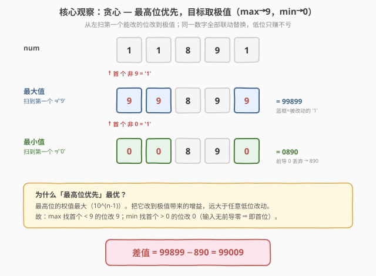
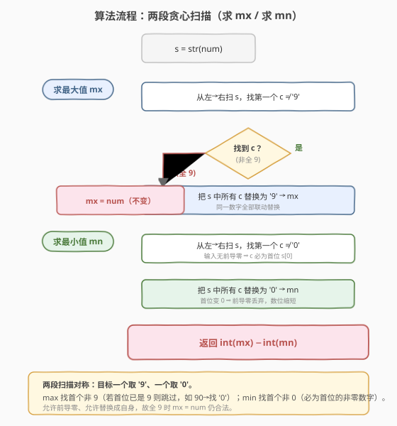
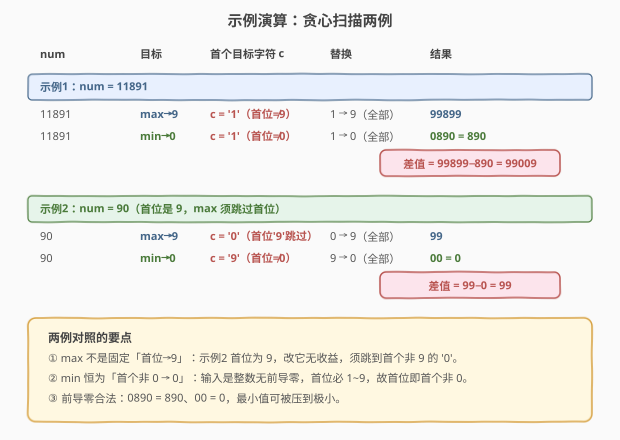

# LeetCode 替换一个数字后的最大差值 题解

## 1. 题目概述

- **标题 / 题号**：替换一个数字后的最大差值（#2566，easy）
- **链接**：https://leetcode.cn/problems/maximum-difference-by-remapping-a-digit/
- **难度**：简单
- **标签**：贪心、字符串、数学

**题意**：给你一个整数 `num`。你可以选择 `num` 中**恰好一种数字**（即 `0` 到 `9` 中某个**在 `num` 中出现过**的数字 `d`），把 `num` 中**所有** `d` 都替换成另一个数字 `x`（`x` 可取 `0`–`9`，含 `d` 自身，即可以保持不变）。

**求最大值与最小值的差**：最大值和最小值可以使用**两次不同的替换**各自得到，替换后允许出现**前导零**。

**示例 1**：

```text
输入：num = 11891
输出：99009
解释：最大值把 1 替换成 9，得到 99899；最小值把 1 替换成 0，得到 0890 = 890。差值 99899 − 890 = 99009。
```

**示例 2**：

```text
输入：num = 90
输出：99
解释：最大值把 0 替换成 9，得到 99；最小值把 9 替换成 0，得到 00 = 0。差值 99 − 0 = 99。
```

**约束**：

- $1 \le \text{num} \le 10^{8}$（即位数 $\le 9$）

> ⚠️ **注意三个细节**：① 选的 `d` 必须**在 `num` 中出现过**（不能选没出现的数字去"替换"）；② 替换是**全部联动**——同一个 `d` 一次性全改；③ 前导零合法，故最小值可被压到很小（甚至 `0`）。

## 2. 解题思路

### 2.1 暴力思路：枚举所有 (源数字, 目标数字) 组合

最朴素的做法：把 `num` 转成字符串 `s`，枚举每一个出现过的源数字 `d`（最多 10 种）和每一个目标数字 `x`（`0`–`9`，共 10 种），把 `s` 中所有 `d` 替换为 `x` 得到一个候选值，取其中最大与最小，作差即可。

```python
s = str(num)
vals = []
for d in set(s):            # d 必须在 num 中出现过
    for x in range(10):
        vals.append(int(s.replace(d, str(x))))
return max(vals) - min(vals)
```

时间 $O(10 \cdot 10 \cdot n) = O(n)$（$n$ 为位数，$n \le 9$），空间 $O(n)$。能 AC，但**做了一百次替换、抓不住问题的贪心结构**——面试官会追问「能不能一次扫完就定下来？」。

> 💡 转机：要让结果尽量大/尽量小，**目标数字 `x` 一定是极值**——最大取 `9`、最小取 `0`，没必要枚举 10 个。剩下的问题只是：**选哪个源数字 `d`**？

### 2.2 核心观察：贪心——最高位优先，目标取极值



把替换拆成两个独立的贪心问题，各做一次：

- **最大值**：要让结果尽量大，应让**最靠左（权值最高）**的那一位尽量大。从左到右扫描，找到**第一个不等于 `9`** 的字符 `c`，把 `s` 中所有 `c` 替换为 `9`。若所有位都已是 `9`，则无法更大，保持原数。
- **最小值**：要让结果尽量小，应让最靠左的那一位尽量小（最好是 `0`，靠前导零缩短位数）。从左到右扫描，找到**第一个不等于 `0`** 的字符 `c`，把 `s` 中所有 `c` 替换为 `0`。由于 `num` 是正整数、无前导零，**首位必为 `1`–`9`**，所以这个 `c` 恰好就是首位。

> 💡 **为什么「最高位优先」最优？** 设第一个可改（即非极值）的位在第 $i$ 位（从左起，权值 $10^{n-1-i}$）。改动第 $i$ 位带来的增益/减益量级是 $10^{n-1-i}$，远大于任意更低位（$\le 10^{n-1-i-1}$）改动的总和。因此**优先把最高位可改的位改到极值**必然最优；而「把同一数字全部联动替换」会让所有同值低位一起改到极值——这些低位改动**只赚不亏**（它们原本就 $\ne$ 极值，改成极值只会让结果更极端）。

> ⚠️ **一个常见误区**：最大值**不是**固定「首位 → `9`」。例如 `num = 90`，首位 `9` 已是极值，改它无收益，必须**跳过首位**去找首个非 `9` 的字符 `'0'`，改成 `'9'` 得 `99`。最小值则因输入无前导零，**恒为首位的非零数字 → `0`**，无需跳过。

### 2.3 算法流程图



算法是**两段对称的扫描**：第一段求 `mx`（找首个非 `9` → 替换为 `9`，全 `9` 则不变）；第二段求 `mn`（找首个非 `0` → 替换为 `0`，输入无前导零故即首位）。最后返回 `mx − mn`。每段只扫一遍、替换一遍，$O(n)$ 终结。

### 2.4 示例演算



对照两个示例：

- **`num = 11891`**：最大值首个非 `9` 是 `'1'`（首位），全替换为 `9` 得 `99899`；最小值首个非 `0` 也是 `'1'`，全替换为 `0` 得 `0890 = 890`。差值 $99899 - 890 = 99009$。
- **`num = 90`**：最大值首位 `'9'` 跳过，首个非 `9` 是 `'0'`，替换为 `9` 得 `99`；最小值首个非 `0` 是 `'9'`，替换为 `0` 得 `00 = 0`。差值 $99 - 0 = 99$。此例正说明最大值须「跳过已是 `9` 的首位」。

## 3. 参考代码

### C++

```cpp
class Solution {
  public:
    int minMaxDifference(int num) {
        string s = to_string(num);

        // 最大值：第一个非 '9' 的字符全部换成 '9'
        string a = s;
        for (char c : s) {
            if (c != '9') {
                for (char& x : a)
                    if (x == c) x = '9';
                break;
            }
        }
        // 最小值：第一个非 '0' 的字符全部换成 '0'
        string b = s;
        for (char c : s) {
            if (c != '0') {
                for (char& x : b)
                    if (x == c) x = '0';
                break;
            }
        }
        return stoi(a) - stoi(b);
    }
};
```

### Python

```python
class Solution:
    def minMaxDifference(self, num: int) -> int:
        s = str(num)

        # 最大值：第一个非 '9' 的字符全部替换为 '9'
        mx = s
        for c in s:
            if c != '9':
                mx = s.replace(c, '9')
                break

        # 最小值：第一个非 '0' 的字符全部替换为 '0'
        mn = s
        for c in s:
            if c != '0':
                mn = s.replace(c, '0')
                break

        return int(mx) - int(mn)
```

> 💡 两段循环写法对称：`break` 保证只取**第一个**符合条件的目标字符。`num ≤ 10^8` 故位数 $\le 9$，`stoi` / `int` 不会溢出（最大结果 $\le 9\times10^8 < 2^{31}-1$）。

## 4. 复杂度分析

| 维度 | 复杂度 | 说明 |
|------|--------|------|
| 时间复杂度 | $O(n)$ | 两段各扫一遍字符串 + 各做一次全量替换，$n$ 为位数（$n \le 9$，实际可视为 $O(1)$） |
| 空间复杂度 | $O(n)$ | 存放 `s` 及其替换副本 `a`、`b`，均为位数级 |

> ⚠️ 与暴力枚举的 $O(100n)$ 相比，贪心降到 $O(2n)$，且常数极小。本质上由于位数 $n \le 9$，两者实测无差异，但贪心抓住了问题的结构，是面试期望的解法。

## 5. 扩展：只求最大值的退化版

### 5.1 只求最大值

若题目只要求最大值（不求差），正是 [1323. 6 和 9 组成的最大数字](https://leetcode.cn/problems/maximum-69-number/) 的推广：1323 中数字只含 `6`/`9`，把**第一个 `6` 换成 `9`** 即可——与本题「最大值」分支完全同构，只是源数字集合从 `{6}` 扩到 `0`–`8`、目标固定 `9`。

### 5.2 与「交换一次使数最大」的对照

[670. 最大交换](https://leetcode.cn/problems/maximum-swap/) 允许**交换两个数位**使数最大。思路相近——都是「最高位优先找最优替换」——但 670 受限于「交换」而非「替换」，需在右侧找**比当前大的最大数字**来交换，并处理重复取最右。本题是「替换」，目标恒为 `9`，逻辑更简单。

> 💡 **一类套路**：「数位贪心」——从最高位起，逐位让该位尽量大（最大值问题）或尽量小（最小值问题），低位改动随最高位贪心自然联动。2566、1323、670、2231 同属此类。

## 6. 面试要点

1. **为什么最大值要找「第一个非 `9`」而不是固定首位？**

   - 首位若已是 `9`，把它替换成 `9` 没有任何收益。要让结果更大，必须找到**第一个还能变大**的位——即首个 `≠ '9'` 的位，把它改到 `9` 才有增益。示例 `num = 90` 正是此情形：首位 `9` 跳过，改 `'0'` 得 `99`。

2. **为什么最小值恒为「首个非 `0` → `0`」，即首位？**

   - 输入 `num ≥ 1` 是正整数，十进制表示**无前导零**，故首位必为 `1`–`9`（非零）。它就是「首个 `≠ '0'`」的位，把它改成 `0` 会让最高位归零、整个数的前导零被丢弃，位数缩短一截——这是能带来的最大缩减。任何不触及首位的替换都保持首位 $\ge 1$，结果必大于「首位改 `0`」的值。

3. **「同一数字全部联动替换」会不会帮倒忙？**

   - 不会。对最大值而言，被替换的字符 `c < 9`，所有 `c` 的位置改成 `9` 都是**变大**，只赚不亏；对最小值而言，被替换的 `c > 0`，改成 `0` 都是变小，同样只赚不亏。这正是「联动替换」可以放心做的原因——贪心只需关心首个目标位，其余同值位自动跟着变好。

4. **全 `9` 的输入怎么处理？返回多少？**

   - 如 `num = 999`：最大值找不到非 `9` 字符，循环不触发 `break`，`mx` 保持原串 `999`（等价于把 `9` 换成 `9`，合法）；最小值首个非 `0` 是 `'9'`，改成 `0` 得 `000 = 0`。差值 $999 - 0 = 999$。注意「替换成自身」是题目允许的，故全 `9` 时 `mx = num` 仍合法。

5. **前导零为什么不影响答案？**

   - 题目明确允许前导零。求最小值时首位改 `0` 会产生前导零（如 `11891 → 0890`），但 `int("0890") = 890` 自动丢弃，恰好对应「位数缩短」带来的数值减小——这正是贪心想要的极小值效果。

> 💡 **一句话总结**：最大值把首个非 `9` 的数字全部换成 `9`、最小值把首个非 `0` 的数字全部换成 `0`，作差即终。两段对称贪心，各扫一遍，$O(n)$ 解决。

## 同类练习题

| # | 题目 | 与本题的关联 |
|---|------|-------------|
| 1323 | [6 和 9 组成的最大数字](https://leetcode.cn/problems/maximum-69-number/)（[题解](../1301-1400/1323_6和9组成的最大数字.md)） | 本题「只求最大值」的退化版，把首个 `6` 换成 `9`，思路与本题 max 分支同构 |
| 670 | [最大交换](https://leetcode.cn/problems/maximum-swap/)（[题解](../0601-0700/670_最大交换.md)） | 交换两数位使数最大，同为「最高位优先找最优替换」的数位贪心，对照「替换 vs 交换」 |
| 2231 | [按奇偶性交换后的最大数字](https://leetcode.cn/problems/largest-number-after-digit-swaps-by-parity/)（[题解](../2201-2300/2231_按奇偶性交换后的最大数字.md)） | 按同奇偶性选最大填高位，数位贪心的另一变体 |
| 7 | [整数反转](https://leetcode.cn/problems/reverse-integer/)（[题解](../0001-0100/7_整数反转.md)） | 按位弹出 / 压入的数字处理基本功，本题位级操作的基础 |
