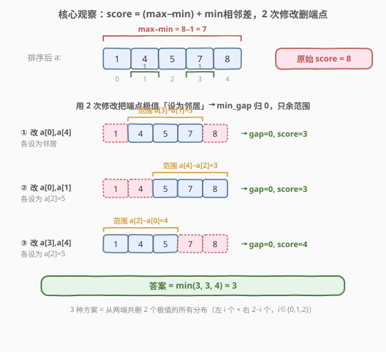
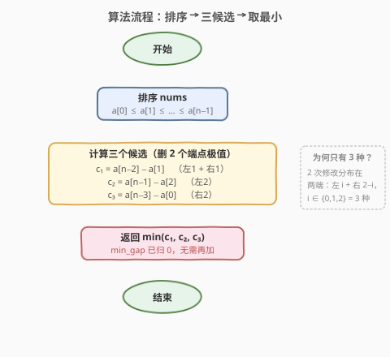

# LeetCode 修改两个元素的最小分数 题解

## 1. 题目概述

- **标题 / 题号**：修改两个元素的最小分数（#2567，medium）
- **链接**：https://leetcode.cn/problems/minimum-score-by-changing-two-elements/
- **难度**：中等
- **标签**：贪心、数组、排序

**题意**：给定一个下标从 **0** 开始的整数数组 `nums`，定义：

- **最小得分**：满足 $0 \le i < j < \text{nums.length}$ 的 $|\text{nums}[i] - \text{nums}[j]|$ 的最小值。
- **最大得分**：满足 $0 \le i < j < \text{nums.length}$ 的 $|\text{nums}[i] - \text{nums}[j]|$ 的最大值。
- **得分**：最大得分与最小得分之和。

你**最多**可以修改 `nums` 中 **2** 个元素的值（可改成任意值）。求修改后能得到的最小得分。$|x|$ 表示 $x$ 的绝对值。

**示例 1**：

```text
输入：nums = [1,4,3]
输出：0
解释：将 nums[1] 和 nums[2] 都改为 1，nums 变为 [1,1,1]。
      |nums[i] - nums[j]| 恒为 0，故返回 0 + 0 = 0。
```

**示例 2**：

```text
输入：nums = [1,4,7,8,5]
输出：3
解释：将 nums[0] 和 nums[1] 都改为 6，nums 变为 [6,6,7,8,5]。
      最小得分 = |6-6| = 0；最大得分 = |8-5| = 3；得分 = 0 + 3 = 3。
```

**约束**：

- $3 \le \text{nums.length} \le 10^5$
- $1 \le \text{nums}[i] \le 10^9$

## 2. 解题思路

### 2.1 暴力思路

最朴素的思路是枚举「修改哪 0/1/2 个位置、各自改成什么值」的全部方案，逐一计算得分取最小。但新值取值域达 $10^9$，方案数随 $n$ 与取值空间爆炸，完全不可行。

退一步可观察：**得分只由「最大值、最小值、相邻最小差」决定**，而这些量只对数组中已有的值敏感——把一个被修改的元素改成「某个已有值」绝不会比改成新值更差（因为生成全新的最大/最小/相邻对只会让指标不降）。因此只需在「已有值集合」里枚举新值，复杂度为 $O(n^2 \cdot n^2) = O(n^4)$，对 $n = 10^5$ 仍超时。

我们需要把「修改 2 个元素」这一自由度直接转化为对得分的结构性影响，避免枚举。

### 2.2 核心观察：删端点极值 + min_gap 归零



先给数组**排序**，设升序后为 $a_0 \le a_1 \le \cdots \le a_{n-1}$。由绝对差的单调性可知：

- **最大得分** = $a_{n-1} - a_0$（全局最大减全局最小）。
- **最小得分** = $\min_{0 \le i < n-1}(a_{i+1} - a_i)$（最小相邻差；最小绝对差必由排序后相邻两元素取得）。

于是 $\text{score} = (a_{n-1} - a_0) + \min\text{gap}$。两条关键结论把问题压成一行：

> 💡 **结论 1：min_gap 可以「免费」归零。** 只要把任意一个元素改成它的邻居（例如令 $a_0 = a_1$），就制造了一个为 $0$ 的相邻差，于是 $\min\text{gap} = 0$。这只需 1 次修改；而且当被改的恰好是端点极值时，它同时还能缩小范围，一举两得。

> 💡 **结论 2：缩小范围 = 删端点极值。** 要让 $(a_{n-1} - a_0)$ 变小，只能「抬高最小值」或「压低最大值」，即把若干个最小的元素改成更大、把若干个最大的元素改成更小——等价于从两端**删除**极值。修改中间元素对范围毫无帮助。

把 2 次修改全花在「删端点」上，且每次删端点都顺手令 $\min\text{gap} = 0$（因为把端点设为它的邻居）。于是 $\text{score}$ 退化成「删除后剩余范围」。2 次删除分布在两端，左删 $i$ 个、右删 $2-i$ 个，$i \in \{0,1,2\}$，只有 **3 种**：

| 方案 | 删除 | 剩余范围（= 得分，因 min_gap=0） |
|------|------|----------------------------------|
| ① 左 1 + 右 1 | $a_0, a_{n-1}$ | $a_{n-2} - a_1$ |
| ② 左 2 | $a_0, a_1$ | $a_{n-1} - a_2$ |
| ③ 右 2 | $a_{n-2}, a_{n-1}$ | $a_{n-3} - a_0$ |

> ⚠️ **为什么不考虑「删 1 个 + 另一次制造 0 间隔」或「不删端点」？** 删端点本身就免费制造了 0 间隔（设为邻居），所以「把 2 次都用来删端点」严格不劣于任何把修改花在中间的方案——后者只能制造 0 间隔而无法缩小范围。3 种方案已是「2 次修改」的全部有效分布。

最终答案即三者取最小：

$$\text{ans} = \min\bigl(a_{n-2}-a_1,\; a_{n-1}-a_2,\; a_{n-3}-a_0\bigr)$$

### 2.3 算法流程图



排序是唯一非 $O(1)$ 的步骤，三个候选与取最小都是常数次比较。

### 2.4 示例演算

![示例演算：nums = [1,4,7,8,5]](../images/2567_example_walkthrough.svg)

以示例 2 演算：排序后 $a = [1,4,5,7,8]$（$n=5$）。

- $c_1 = a_{n-2} - a_1 = a_3 - a_1 = 7 - 4 = 3$（改 $a_0,a_4$）
- $c_2 = a_{n-1} - a_2 = a_4 - a_2 = 8 - 5 = 3$（改 $a_0,a_1$）
- $c_3 = a_{n-3} - a_0 = a_2 - a_0 = 5 - 1 = 4$（改 $a_3,a_4$）

$\text{ans} = \min(3,3,4) = 3$，与示例一致。

## 3. 参考代码

### C++

```cpp
class Solution {
public:
    int minimizeSum(vector<int>& nums) {
        int n = nums.size();
        sort(nums.begin(), nums.end());
        return min({nums[n - 2] - nums[1],      // 左 1 + 右 1
                    nums[n - 1] - nums[2],      // 左 2
                    nums[n - 3] - nums[0]});    // 右 2
    }
};
```

### Python

```python
class Solution:
    def minimizeSum(self, nums: List[int]) -> int:
        a = sorted(nums)
        return min(a[-2] - a[1],      # 左 1 + 右 1
                   a[-1] - a[2],      # 左 2
                   a[-3] - a[0])      # 右 2
```

> ⚠️ 题目保证 $n \ge 3$，故 `a[-3]`、`a[-2]`、`a[1]`、`a[2]` 均合法。若可能传入 $n < 3$，应特判返回 $0$（元素少于 3 时 2 次修改可令全数组相等）。

## 4. 复杂度分析

| 维度 | 复杂度 | 说明 |
|------|--------|------|
| 时间复杂度 | $O(n \log n)$ | 排序主导；三个候选与取最小均为 $O(1)$ |
| 空间复杂度 | $O(\log n)$ | 排序的递归栈空间（C++ `std::sort` 原地；Python `sorted` 需 $O(n)$ 额外空间） |

## 5. 扩展：可改 k 个元素的一般化

若把「改 2 个」推广为「至多改 $k$ 个」，思路完全一致：把 $k$ 次删除分配到两端，左删 $i$ 个、右删 $k-i$ 个，$i \in \{0,\dots,k\}$，共 $k+1$ 种方案，取

$$\min_{0 \le i \le k}\bigl(a_{n-1-(k-i)} - a_i\bigr)$$

（保证 $i \le n-1-(k-i)$，否则范围非正直接得 $0$）。本题即 $k=2$ 的特例。该模式与 [1509. 三次操作后得到的最小差值]($k=3$ 版本）完全同构。

## 6. 面试要点

1. **为什么最小绝对差一定出现在排序后相邻元素之间？**

   - 对任意 $i < j$，由排序有 $a_i \le a_j$，且 $a_j - a_i = (a_j - a_{j-1}) + \cdots + (a_{i+1} - a_i) \ge a_{i+1} - a_i$。故非相邻对的差不小于其夹的某个相邻差，最小绝对差必为某个相邻差。

2. **为什么把端点「设为邻居」能同时缩小范围并令 min_gap 归 0？**

   - 设 $a_0 = a_1$ 后，新数组的最小值变为 $a_1$（范围左端右移），同时 $a_0$ 与 $a_1$ 之间出现 $0$ 相邻差，$\min\text{gap}=0$。一次修改同时达成两个目标，这是「删端点」优于「改中间」的根本原因。

3. **为什么只有 3 种方案，而不是 $O(n^2)$ 种位置组合？**

   - 改中间元素既不缩小范围（最大/最小不变）也不能比删端点更多地缩小 $\min\text{gap}$（删端点已使其为 $0$）。有效修改只能作用在两端极值上；2 次删除分到两端只有「左 $i$ 右 $2-i$」$i\in\{0,1,2\}$ 三种分布。

4. **如果允许改「恰好 2 个」而非「至多 2 个」，答案会变吗？**

   - 不会。当最优方案本身就需要 2 次修改时不变；若 $n=3$ 等情形最优只需 1 次（已能令得分 $0$），多出的修改可设在某元素上改成自身，不改变结果。故「至多」与「恰好」在此题等价。

5. **能否做到 $O(n)$？**

   - 可以：最大/最小、第二小/第二大都可一次遍历取得，无需完整排序，从而把时间降到 $O(n)$。但 $O(n \log n)$ 的排序写法更直观、常数下限可接受，是面试首选；可在被追问时主动给出 $O(n)$ 优化。

## 同类练习题

| # | 题目 | 与本题的关联 |
|---|------|-------------|
| 1509 | [三次操作后得到的最小差值](https://leetcode.cn/problems/minimum-difference-between-largest-and-smallest-value-in-three-moves/) | 同模式——可改 $k=3$ 个元素最小化 $\max-\min$，枚举两端删除 $k+1$ 种分布。 |
| 910 | [最小差值 II](https://leetcode.cn/problems/smallest-range-ii/) | 每个元素 $\pm k$ 后最小化 $\max-\min$，排序后枚举分界点，贪心同族。 |
| 1984 | [学生分数的最小差值](https://leetcode.cn/problems/minimum-difference-between-highest-and-lowest-of-k-scores/) | 选 $k$ 个元素最小化 $\max-\min$，排序后定长滑窗取最小窗口。 |
| 164 | [最大间距](https://leetcode.cn/problems/maximum-gap/) | 对偶题——求排序后相邻元素最大差，可用桶做到 $O(n)$。 |
