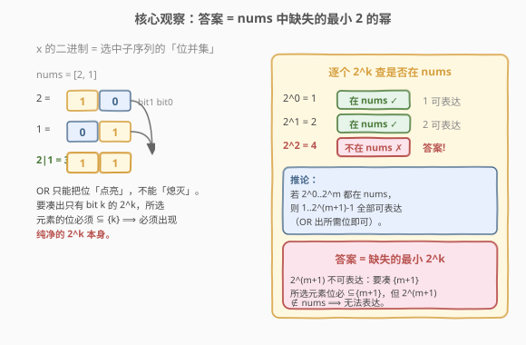
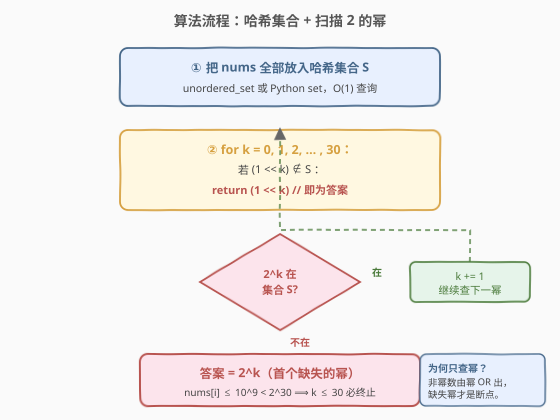

# LeetCode 最小无法得到的或值 题解

## 1. 题目概述

- **标题 / 题号**：最小无法得到的或值（#2568，medium）
- **链接**：https://leetcode.cn/problems/minimum-impossible-or/
- **难度**：中等
- **标签**：位运算、数组、哈希表

**题意**：给定下标从 `0` 开始的整数数组 `nums`。若存在某个子序列 `nums[index1] | nums[index2] | ... | nums[indexk] = x`，则称 `x` 是**可表达的**。换言之，能由 `nums` 某子序列的**按位或**得到的整数都是可表达的。返回 `nums` **不可表达的最小非零整数**。

**示例 1**：

```text
输入：nums = [2,1]
输出：4
解释：1 和 2 本就在数组中；nums[0] | nums[1] = 2 | 1 = 3，所以 3 可表达。
      而 4 无法由任何子序列的 OR 得到，返回 4。
```

**示例 2**：

```text
输入：nums = [5,3,2]
输出：1
解释：1 是最小不可表达的数字。
```

**约束**：

- $1 \le \text{nums.length} \le 10^5$
- $1 \le \text{nums[i]} \le 10^9$

> 💡 本题看似要枚举「不可表达的整数」，但 $10^9$ 的值域排暴力枚举。突破口在于认识到 **OR 只能点亮位、不能熄灭位**，于是「可表达性」被少数几个**纯净的 2 的幂**所决定——答案正是 `nums` 中**缺失的最小 2 的幂**。与 [187. 重复的 DNA 序列](../0181-0200/187_重复的DNA序列.md)、[191. 位 1 的个数](../0181-0200/191_位1的个数.md) 同属「按位分析」一脉。

## 2. 解题思路

### 2.1 暴力思路

把 `nums` 所有子序列的 OR 值算出来扔进一个「可表达集合」，再从 `1` 开始逐个查第一个不在集合里的数。但子序列数 $2^n$，$n=10^5$ 时根本无法枚举；即便用子序列 OR 自动机（位并集），不同 OR 值最多 $\sim 2^{30}$ 种，集合仍可能巨大。

> ⚠️ 暴力的根因在于把「可表达」当作**集合扩张**处理。一旦理解 OR 的**单调性**（只点亮位）和**纯净幂的瓶颈作用**，就能把问题从「枚举所有可达值」收缩到「只查少数几个 2 的幂」。

### 2.2 核心观察：答案 = nums 中缺失的最小 2 的幂



三个观察层层递进：

1. **OR 只点亮位**：子序列的 OR 结果，其每个二进制位为 `1` 当且仅当所选元素中至少有一个该位为 `1`。换言之，结果的位集合 = 所选元素位集合的**并集**。OR 永远不会把已亮的位熄灭，只会增多。

2. **凑出纯幂 $2^k$ 的必要条件**：要得到恰好只有 bit $k$ 为 `1` 的 $2^k$，所选子序列每个元素的位集合都必须 $\subseteq\{k\}$，即每个元素只能是 $0$ 或 $2^k$。又 `nums[i] >= 1`，唯一能贡献的元素就是 $2^k$ 本身。故

   $$2^k \text{ 可表达} \;\Longleftrightarrow\; 2^k \in \text{nums}.$$

3. **非幂数全由幂 OR 出**：设 $2^0,2^1,\ldots,2^m$ 全在 `nums` 中。任取 $1\le x\le 2^{m+1}-1$，$x$ 的每个置位 $k\le m$ 都对应 $2^k\in\text{nums}$，把这些幂 OR 起来即得 $x$。故 $1\ldots 2^{m+1}-1$ **全部可表达**；而 $2^{m+1}\notin\text{nums}$ 时它不可表达。于是**最小不可表达数 = 缺失的最小 $2^k$**。

> 💡 **识别信号**：题目问「最小的、满足某位运算性质的正整数」+ 数据规模大 $\Rightarrow$ 先想「答案是否落在某个特殊结构上」。本题答案恒为 $2^k$（位单点），只需扫 $\sim 30$ 个幂即可定位，是经典的**按位瓶颈**题。

### 2.3 算法流程图



将 `nums` 装入哈希集合 $S$，从 $k=0$ 起逐个检测 $2^k$ 是否在 $S$ 中：

- 在 $\Rightarrow$ $k\mathrel{+}=1$，继续查下一个幂；
- 不在 $\Rightarrow$ 返回 $2^k$（即答案）。

由于 $\text{nums}[i]\le 10^9<2^{30}$，$2^{30}$ 不可能出现在 `nums`，故循环至多走到 $k=30$ 必终止。

### 2.4 示例演算

![示例演算：nums=[2,1] 逐幂查询过程](../images/minimum_impossible_or_walkthrough.svg)

以示例 1 `nums = [2,1]` 为例：$S=\{1,2\}$。

- $k=0$：$2^0=1\in S$ ✓（1 可表达）
- $k=1$：$2^1=2\in S$ ✓（2 可表达，$3=2|1$ 也可表达）
- $k=2$：$2^2=4\notin S$ ✗ ⟹ 返回 `4`，与示例一致。

> ⚠️ **易错点**：不要去枚举子序列本身。$2^k\notin\text{nums}$ 时它一定不可表达——因为没有任何元素只含 bit $k$，OR 出来要么缺 bit $k$、要么多出别的位，永远凑不出「恰好只有 bit $k$」。

## 3. 参考代码

### C++

```cpp
class Solution {
public:
    int minImpossibleOr(vector<int>& nums) {
        unordered_set<int> s(nums.begin(), nums.end());
        for (int k = 0; k <= 30; ++k) {
            int p = 1 << k;
            if (!s.count(p)) return p;   // 首个缺失的 2^k 即答案
        }
        return 1 << 31;                  // 不可达：nums[i] < 2^30
    }
};
```

### Python

```python
class Solution:
    def minImpossibleOr(self, nums: List[int]) -> int:
        s = set(nums)
        for k in range(31):
            p = 1 << k
            if p not in s:        # 首个缺失的 2^k 即答案
                return p
        return 1 << 31            # 不可达
```

> ⚠️ **三个细节**：
> 1. **只查幂**：不必枚举所有数，非幂数的可达性由幂决定，扫 $31$ 个幂即可覆盖 $10^9$ 内全部情况。
> 2. **循环上界 $k\le 30$**：$\text{nums}[i]\le 10^9<2^{30}$，故 $2^{30}$ 必不在 `nums`，答案 $\le 2^{30}$，循环到 $30$ 必返回。
> 3. **哈希集合 $O(1)$ 查询**：用 `unordered_set`/`set` 装载 `nums`，每次查幂 $O(1)$，整体 $O(n)$。

## 4. 复杂度分析

| 维度 | 复杂度 | 说明 |
|------|--------|------|
| **时间** | $O(n)$ | 构造哈希集合 $O(n)$；扫描至多 $31$ 个幂，每次 $O(1)$ 查询，合计 $O(31)=O(1)$ |
| **空间** | $O(n)$ | 哈希集合存全部 `nums`，最坏 $n=10^5$ 个元素 |
| 对照：枚举子序列 OR | $O(2^n)$ | 子序列数爆炸，$n=10^5$ 完全不可行 |

> 💡 若内存紧张可不开集合、改用位掩码：维护一个 `seen` 掩罩，对每个 `nums[i]` 若它是纯幂（`(x & (x-1)) == 0`）则把对应位标进掩码，最后 `~seen` 的最低置位即答案，空间降到 $O(1)$。但常数与可读性不如哈希集合版，主解用集合即可。

## 5. 扩展：位掩码压缩解法与正确性证明

### 5.1 位掩码压缩 $O(1)$ 空间

注意到只有**纯幂**会贡献「单点可达性」，非幂数（如 $3=11_2$）对判定 $2^k$ 是否可表达毫无帮助——它带上别的位，OR 出来必不纯。故只需记录 `nums` 中出现的纯幂集合：

```cpp
class Solution {
public:
    int minImpossibleOr(vector<int>& nums) {
        int seen = 0;
        for (int x : nums)
            if ((x & (x - 1)) == 0)        // 纯幂（含 x==1 的特例也成立）
                seen |= x;                 // 记录该位可达
        int k = __builtin_ctz(~seen);     // 第一个未置位的 k
        return 1 << k;
    }
};
```

- `(x & (x-1)) == 0` 判纯幂（[231. 2 的幂](../0201-0300/231_2的幂.md) 同款技巧）；
- `~seen` 取反后最低置位 $k$ 即首个缺失幂，`1 << k` 为答案；
- 空间 $O(1)$，时间 $O(n)$，无额外数据结构。

### 5.2 正确性证明

**引理**：正整数 $x$ 可表达 $\Leftrightarrow$ 对 $x$ 的每个置位 $k$，$2^k\in\text{nums}$。

- **充分性**：把 $x$ 的每个置位 $k$ 对应的 $2^k$ 取出 OR，结果恰为 $x$。
- **必要性**：设子序列 $S$ 的 $\text{OR}=x$。对 $x$ 任一置位 $k$，必存在 $e\in S$ 使 bit $k$ 为 $1$；又 OR 结果位集合 $=S$ 各元素位集合的并，要结果恰为 $x$（不含额外位），则 $e$ 的位集合 $\subseteq\{k\}$，故 $e=2^k$，即 $2^k\in\text{nums}$。

**主结论**：设 $m=\max\{k:2^0,2^1,\ldots,2^k\in\text{nums}\}$（连续前缀的最大下标）。由引理，$1\ldots 2^{m+1}-1$ 均可表达（位数 $\le m$），而 $2^{m+1}$ 不可表达（$2^{m+1}\notin\text{nums}$）。故最小不可表达数 $=2^{m+1}$ = 缺失的最小 $2^k$。$\blacksquare$

### 5.3 与「枚举可达集合」的对照

| 维度 | 枚举子序列 OR | 本解：扫幂 |
|------|------|------|
| 搜索对象 | 所有子序列的 OR 值 | 仅 $2^0..2^{30}$ 共 31 个幂 |
| 关键洞察 | 直接建模「可达集合」 | OR 单调性 + 纯幂瓶颈 |
| 复杂度 | $O(2^n)$ 不可行 | $O(n)$ |

## 6. 面试要点

1. **为什么答案一定是 2 的幂？**

   > 由引理：$x$ 可表达 $\Leftrightarrow$ $x$ 的每个置位 $k$ 都有 $2^k\in\text{nums}$。设纯幂 $2^0..2^m$ 都在 `nums`，则位数 $\le m$ 的所有数（即 $1..2^{m+1}-1$）可表达；而 $2^{m+1}$ 的唯一置位 $m+1$ 无纯幂对应，不可表达。故最小不可表达数必是缺失的最小纯幂 $2^{m+1}$。

2. **为什么 $2^k\notin\text{nums}$ 时它一定不可表达？**

   > 凑出恰含 bit $k$ 的 $2^k$，所选每个元素的位集合必须 $\subseteq\{k\}$，即只能是 $0$ 或 $2^k$；`nums[i] >= 1` 排除 $0$，故必须有 $2^k\in\text{nums}$。其不在则不可表达，非幂数（如 $3$）因带额外位无法替代。

3. **循环上界为什么取 30？答案不会超过 $2^{30}$ 吗？**

   > $\text{nums}[i]\le 10^9<2^{30}=1073741824$，故 $2^{30}$ 永不在 `nums`，扫描到 $k=30$ 必命中缺失并返回，答案 $\le 2^{30}$。若题面放宽 `nums[i]` 上界，只需相应抬高循环上界（值域位数的两倍足够安全）。

4. **能否做到 $O(1)$ 额外空间？**

   > 可以。只关心 `nums` 中的纯幂，用一个 `int seen` 掩罩收集 `(x&(x-1))==0` 的 $x$（即把可达位标 1），最后 `~seen` 的最低置位 $k$ 给出答案 $2^k$。`__builtin_ctz` 或 `(x & -x)` 定位最低位，全程 $O(1)$ 空间。

5. **这题与一般「子集 OR」题的区别？**

   > 普通子集 OR 题（如求不同 OR 值个数）往往要枚举可达集合、用「或后继扩张」做；本题问的是「最小不可达」，关键在**瓶颈位**——纯幂是否出现直接决定下界，无需展开整个可达集合。识别「问最小缺失」+「位运算」就应往纯幂方向想。

> 💡 **一句话总结**：2568 = 按位瓶颈题——OR 只点亮位、纯幂是唯一「单点可达」元素，故「最小不可表达」必是 `nums` 中缺失的最小 $2^k$；哈希集合扫 31 个幂即可 $O(n)$ 定位。

## 同类练习题

| # | 题目 | 与本题的关联 |
|---|------|-------------|
| 231 | [2 的幂](https://leetcode.cn/problems/power-of-two/)（[题解](../0201-0300/231_2的幂.md)） | `(x & (x-1)) == 0` 判纯幂，本题位掩码压缩解法直接复用该判定 |
| 191 | [位 1 的个数](https://leetcode.cn/problems/number-of-1-bits/)（[题解](../0181-0200/191_位1的个数.md)） | `n & (n-1)` 消最低位 1，与纯幂判定同源技巧 |
| 187 | [重复的 DNA 序列](https://leetcode.cn/problems/repeated-dna-sequences/)（[题解](../0181-0200/187_重复的DNA序列.md)） | 2 位编码 + 滚动哈希，按位压缩思路的另一应用 |
| 137 | [只出现一次的数字 II](https://leetcode.cn/problems/single-number-ii/) | 按位独立统计，体会「位运算只看单点」的分解思维 |
