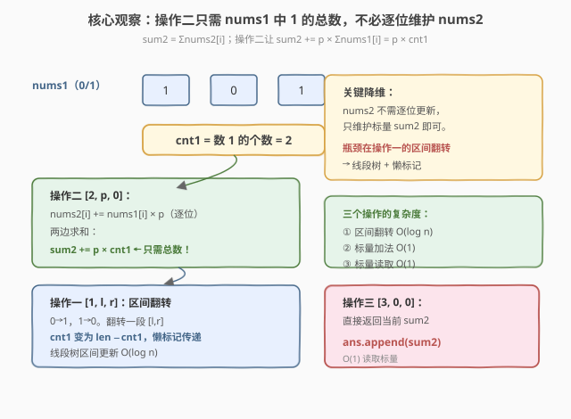
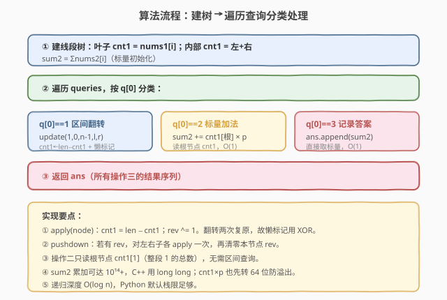
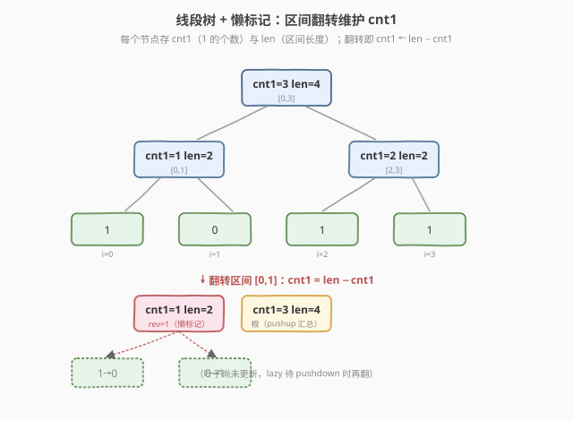

# 更新数组后处理求和查询

- **题目名称**：更新数组后处理求和查询
- **链接**：[2569. 更新数组后处理求和查询](https://leetcode.cn/problems/handling-sum-queries-after-update/)
- **难度**：困难
- **标签**：线段树、数组

## 1. 题目概述

两个下标从 $0$ 开始的数组 `nums1`、`nums2`（长度均为 $n$），给定 `queries` 表示一系列操作，共三类：

1. `[1, l, r]`：将 `nums1` 中下标 $l$ 到 $r$ 的所有位翻转（$0\to1$、$1\to0$）。
2. `[2, p, 0]`：对所有 $i$，`nums2[i] += nums1[i] * p`。
3. `[3, 0, 0]`：求 `nums2` 全体元素之和。

返回一个数组，包含所有第三类操作的答案。

**示例 1**：

```text
输入：nums1 = [1,0,1], nums2 = [0,0,0], queries = [[1,1,1],[2,1,0],[3,0,0]]
输出：[3]
解释：操作一后 nums1=[1,1,1]；操作二后 nums2=[1,1,1]，和为 3；操作三返回 3。
```

**示例 2**：

```text
输入：nums1 = [1], nums2 = [5], queries = [[2,0,0],[3,0,0]]
输出：[5]
解释：p=0，nums2 不变，和为 5。
```

**约束条件**：

- $1\le n\le 10^5$，$1\le \text{queries.length}\le 10^5$
- $0\le l\le r\le n-1$，$0\le p\le 10^6$
- $0\le \text{nums1}[i]\le 1$，$0\le \text{nums2}[i]\le 10^9$

> ⚠️ **规模读法**：$n$、查询数均达 $10^5$，操作一若逐位翻转需 $O(n)$，总复杂度 $O(nq)=10^{10}$ 必然超时。$p\le10^6$、$\text{cnt1}\le n=10^5$，单次操作二增量可达 $10^{11}$，累加后 `sum2` 可达 $\sim10^{14}$+，**必须 64 位**。

---

## 2. 解题思路

### 2.1 暴力思路：逐位执行

对每个操作按字面意义逐位执行：操作一逐位翻转、操作二逐位乘加、操作三逐位求和。操作一与操作二各 $O(n)$，操作三 $O(n)$，总计 $O(nq)=10^{10}$，超时。瓶颈在于未察觉**操作二/三只需 `nums1` 中 $1$ 的总数与 `nums2` 的总和**，不必逐位维护。

### 2.2 核心观察：操作二只需 1 的总数 → 线段树维护 cnt1



关键降维有两点：

**① `nums2` 只需维护总和标量 `sum2`。** 操作二对每个 $i$ 执行 `nums2[i] += nums1[i] * p`，两边求和：

$$
\sum_i \text{nums2}[i] \mathrel{+}= p\cdot \sum_i \text{nums1}[i] = p\cdot \text{cnt1}
$$

其中 $\text{cnt1}=\sum\text{nums1}[i]$ 是 `nums1` 中 $1$ 的个数。于是操作二化为**标量加法** `sum2 += cnt1 * p`，操作三直接返回 `sum2`，均 $O(1)$。

**② `cnt1` 需支持区间翻转 → 线段树 + 懒标记。** 操作一翻转区间 $[l,r]$，会使该段内 $1$ 变 $0$、$0$ 变 $1$。若该段长度为 $\text{len}$、原 $1$ 的个数为 $c$，翻转后 $1$ 的个数变为 $\text{len}-c$。这正是**线段树区间更新**的经典模型：

- 节点维护 `cnt1`（该段 $1$ 的个数）与 `len`（该段长度）。
- 翻转（`apply`）：`cnt1 = len - cnt1`；懒标记 `rev ^= 1`。
- `pushdown`：若有 `rev`，对左右子各 `apply` 一次，再清零本节点 `rev`。

> 💡 **为什么懒标记用 XOR？** 翻转满足「翻转两次复原」的幂等性：翻转偶数次等价于不翻转。故懒标记用布尔异或 `rev ^= 1` 累积，`pushdown` 时下传一次即可，无需累加计数。

### 2.3 算法流程图



```text
build(1, 0, n-1)           // 叶子 cnt1=nums1[i]，内部 cnt1=左+右
sum2 = Σ nums2[i]           // 标量初始化
ans = []
for q in queries:
    if q[0]==1: update(1,0,n-1, l=q[1], r=q[2])   // 区间翻转 O(log n)
    elif q[0]==2: sum2 += cnt1[根] * q[1]         // 读根 cnt1，O(1)
    else: ans.append(sum2)                        // O(1)
return ans
```

> ⚠️ **只读根节点**：操作二需要的是**整段** `nums1` 中 $1$ 的总数，即根节点 `cnt1[1]`，无需区间查询。建树后只需「区间翻转更新」一种操作，根的 `cnt1` 始终是当前全数组 $1$ 的个数。

### 2.4 线段树结构与翻转演示



以 `nums1=[1,0,1,1]` 为例建树（$n=4$ 满二叉树便于演示）。根 `cnt1=3`、`len=4`。翻转区间 $[0,1]$ 时：该节点 `cnt1` 由 $1$ 变为 $\text{len}-1=2-1=1$，打上 `rev=1`；左右叶子暂不更新（虚框），待后续访问时 `pushdown` 下传翻转。根经 `pushup` 汇总后 `cnt1=3`。

### 2.5 示例演算

![示例演算：翻转 [1,1] 后 cnt1=3，操作二 sum2=3×1=3，操作三返回 3](../images/2569_example_walkthrough.svg)

$\text{nums1}=[1,0,1]$，$\text{nums2}=[0,0,0]$，$\text{sum2}=0$，$\text{cnt1}=2$。

| 查询 | 操作 | 变化 | 结果 |
|------|------|------|------|
| `[1,1,1]` | 翻转 `nums1[1]`：$0\to1$ | `nums1=[1,1,1]`，`cnt1=3` | `sum2` 不变 $=0$ |
| `[2,1,0]` | `sum2 += cnt1 × p = 3×1` | `sum2 = 0+3 = 3` | — |
| `[3,0,0]` | 返回 `sum2` | — | `ans=[3]` |

**示例 2**：$\text{nums1}=[1]$、$p=0$，操作二 `sum2 += 1×0=0` 不变，返回 $[5]$。

---

## 3. 参考代码

### C++

```cpp
class Solution {
public:
    vector<long long> handleQuery(vector<int>& nums1, vector<int>& nums2,
                                  vector<vector<int>>& queries) {
        int n = nums1.size();
        vector<int> cnt1(4 * n), len(4 * n), rev(4 * n, 0);
        function<void(int,int,int)> build = [&](int node, int l, int r) {
            len[node] = r - l + 1;
            if (l == r) { cnt1[node] = nums1[l]; return; }
            int mid = (l + r) / 2;
            build(2 * node, l, mid);
            build(2 * node + 1, mid + 1, r);
            cnt1[node] = cnt1[2 * node] + cnt1[2 * node + 1];
        };
        auto apply = [&](int node) {
            cnt1[node] = len[node] - cnt1[node];
            rev[node] ^= 1;
        };
        auto pushdown = [&](int node) {
            if (rev[node]) {
                apply(2 * node);
                apply(2 * node + 1);
                rev[node] = 0;
            }
        };
        function<void(int,int,int,int,int)> update = [&](int node, int l, int r, int ql, int qr) {
            if (qr < l || r < ql) return;
            if (ql <= l && r <= qr) { apply(node); return; }
            pushdown(node);
            int mid = (l + r) / 2;
            update(2 * node, l, mid, ql, qr);
            update(2 * node + 1, mid + 1, r, ql, qr);
            cnt1[node] = cnt1[2 * node] + cnt1[2 * node + 1];
        };
        build(1, 0, n - 1);
        long long sum2 = 0;
        for (int x : nums2) sum2 += x;
        vector<long long> ans;
        for (auto& q : queries) {
            if (q[0] == 1)      update(1, 0, n - 1, q[1], q[2]);
            else if (q[0] == 2) sum2 += (long long)cnt1[1] * q[1]; // cnt1[1]=根=全段1的总数
            else                ans.push_back(sum2);
        }
        return ans;
    }
};
```

> 💡 **实现要点**：① `cnt1[1]` 是根节点，覆盖 $[0,n-1]$，其值即整段 $1$ 的总数，操作二直接读取。② `sum2` 与 `cnt1[1]*q[1]` 都可能超 32 位：$\text{cnt1}\le10^5$、$p\le10^6$，乘积达 $10^{11}$；累加可达 $10^{14}$+，故 `sum2` 用 `long long`，乘法前显式转 64 位。③ `apply` 翻转节点时同时更新自身 `cnt1` 与懒标记 `rev`，`pushdown` 只把 `rev` 下传给子节点，逻辑自洽。

### Python

```python
class Solution:
    def handleQuery(self, nums1: List[int], nums2: List[int],
                    queries: List[List[int]]) -> List[int]:
        n = len(nums1)
        cnt1 = [0] * (4 * n)
        length = [0] * (4 * n)
        rev = [0] * (4 * n)

        def build(node, l, r):
            length[node] = r - l + 1
            if l == r:
                cnt1[node] = nums1[l]
                return
            mid = (l + r) // 2
            build(node * 2, l, mid)
            build(node * 2 + 1, mid + 1, r)
            cnt1[node] = cnt1[node * 2] + cnt1[node * 2 + 1]

        def apply(node):
            cnt1[node] = length[node] - cnt1[node]
            rev[node] ^= 1

        def pushdown(node):
            if rev[node]:
                apply(node * 2)
                apply(node * 2 + 1)
                rev[node] = 0

        def update(node, l, r, ql, qr):
            if qr < l or r < ql:
                return
            if ql <= l and r <= qr:
                apply(node)
                return
            pushdown(node)
            mid = (l + r) // 2
            update(node * 2, l, mid, ql, qr)
            update(node * 2 + 1, mid + 1, r, ql, qr)
            cnt1[node] = cnt1[node * 2] + cnt1[node * 2 + 1]

        build(1, 0, n - 1)
        sum2 = sum(nums2)
        ans = []
        for q in queries:
            if q[0] == 1:
                update(1, 0, n - 1, q[1], q[2])
            elif q[0] == 2:
                sum2 += cnt1[1] * q[1]      # cnt1[1]=根=全段1的总数
            else:
                ans.append(sum2)
        return ans
```

> 💡 **对照 C++**：逻辑一致；Python 整数任意精度无溢出。线段树递归深度 $O(\log n)\approx17$，远低于默认栈限 1000，无需手动提升 `sys.setrecursionlimit`。

---

## 4. 复杂度分析

| 维度 | 复杂度 | 说明 |
|------|--------|------|
| 时间 | $O(n + q\log n)$ | 建树 $O(n)$；每个操作一区间翻转 $O(\log n)$；操作二/三 $O(1)$ |
| 空间 | $O(n)$ | 线段树 $4n$ 节点存 `cnt1`/`len`/`rev` |
| 对照：逐位暴力 | $O(nq)$ | 操作一/二逐位 $O(n)$，$nq=10^{10}$ 超时 |

> 💡 关键在于把操作二/三的 $O(n)$ 逐位开销降为 $O(1)$ 标量运算，把操作一的 $O(n)$ 翻转移交给线段树 $O(\log n)$ 区间更新。瓶颈从「逐位」转移到「线段树」，整体降到 $O((n+q)\log n)$，$n=q=10^5$ 时约 $2\times10^6$ 级，毫秒级通过。

---

## 5. 扩展：懒标记的标记类型与下传规则

本题懒标记是「翻转」（幂等、用 XOR 累积）。线段树区间更新的懒标记常见三类：

| 懒标记类型 | 累积方式 | `apply` 对节点信息的影响 | 典型题 |
|------------|----------|--------------------------|--------|
| **区间赋值**（set） | 后写覆盖（新值覆盖旧标记） | 区间和 = val × len | 量化区间覆盖 |
| **区间加**（add） | 累加 `add += v` | 区间和 += v × len | 量化区间加减 |
| **区间翻转**（flip） | XOR 累积 `rev ^= 1` | cnt1 = len − cnt1（本题） | 0/1 翻转 |

> ⚠️ **混合标记的处理**：当区间「赋值」与「加」并存时（如 [PUSH][POP] 顺序敏感），需约定 `pushdown` 时赋值覆盖加法标记（先 set 后 add），或规定「set 清空 add」。判断标记是否可累积、累积顺序是否交换律成立，是设计线段树前的关键分流。

---

## 6. 面试要点

1. **为什么操作二不必逐位更新 `nums2`？**

   > 操作二对每个 $i$ 执行 `nums2[i] += nums1[i]*p`。由于我们只关心操作三的「全体之和」，两边求和得 $\Delta\text{sum2}=p\cdot\sum\text{nums1}[i]=p\cdot\text{cnt1}$。`cnt1` 是标量，故 `sum2` 也是标量，操作二化为一次乘加，操作三化为一次读取，均 $O(1)$。

2. **区间翻转为什么用 XOR 懒标记？**

   > 翻转满足幂等性：翻转两次复原。故同一段多次翻转可用 `rev ^= 1` 累积奇偶次，`pushdown` 时据 `rev` 决定是否下传一次翻转给子节点，无需记录翻转次数。对节点自身，翻转使 `cnt1` 变为 `len − cnt1`（$1$ 与 $0$ 互换，总数互补）。

3. **为什么操作二读根节点 `cnt1[1]` 而非做区间查询？**

   > 操作二需要的是**整段** `nums1` 中 $1$ 的总数，对应根节点（覆盖 $[0,n-1]$）的 `cnt1`。每次区间翻转后 `pushup` 已维护根的正确值，故直接读 `cnt1[1]` 即可，$O(1)$。只有当操作二需对**部分区间**加权时才需区间查询。

4. **`pushdown` 的时机与正确性如何保证？**

   > 只在「需要访问子节点」时（即当前节点未被查询区间完整覆盖、需继续下钻）调用 `pushdown`，把本节点的 `rev` 下传给子节点（各 `apply` 一次）并清零。被完整覆盖的节点只 `apply` 自身、不下传，保证子节点信息延迟但一致——后续若访问到再 `pushdown` 补齐。这是懒更新「按需下传」的核心，保证 $O(\log n)$ 而非 $O(n)$。

5. **为什么必须 64 位整数？**

   > $\text{cnt1}\le n=10^5$、$p\le10^6$，单次操作二增量 $\text{cnt1}\times p\le10^{11}$；最多 $10^5$ 次操作二，累加上界 $\sim10^{16}$，远超 32 位 `int`（$\approx2.1\times10^9$）。初始 $\text{sum2}\le n\times10^9=10^{14}$ 也已超 32 位。C++ 中 `sum2` 与乘法均须 `long long`；Python 整数任意精度无此虑。

> 💡 **一句话总结**：操作二/三降为标量 $O(1)$，操作一交给线段树区间翻转——用 `cnt1 = len − cnt1` + XOR 懒标记把 $O(nq)$ 压成 $O((n+q)\log n)$。

---

## 7. 同类练习题

- [307. 区域和检索 - 数组可修改](https://leetcode.cn/problems/range-sum-query-mutable/)：单点修改 + 区间求和的线段树母题，对照「只读根节点」与「需要区间查询」的差异
- [699. 掉落的方块](https://leetcode.cn/problems/falling-squares/)：区间赋值取 max + 懒标记，对照「赋值型」与「翻转型」懒标记的累积规则
- [732. 我的日程安排表 III](https://leetcode.cn/problems/my-calendar-iii/)：区间加 + 查询全局最大，对照「加法型」懒标记（本题翻转的姊妹模型）
- [2280. 表示一个折线图的最小线段数](https://leetcode.cn/problems/minimum-lines-to-represent-a-line-chart/)：区间更新思想的另一载体，对照不同语义下的区间操作
- [1622. 奇幻的密码锁](https://leetcode.cn/problems/fancy-sequence/)：序列上混合运算（加、乘、取模）的懒标记设计，对照「混合标记」的下传顺序敏感性
