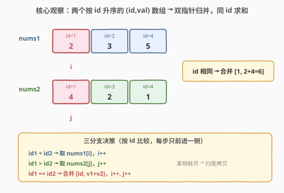
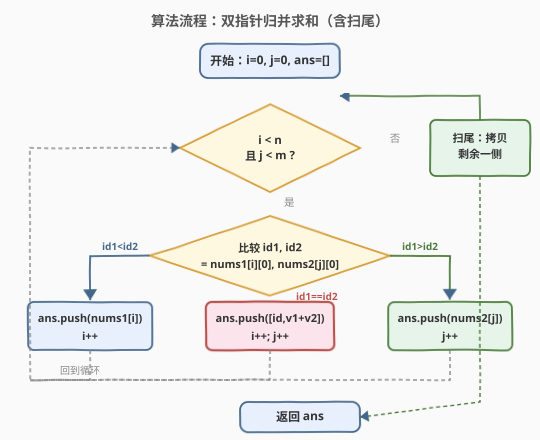

# LeetCode 合并两个二维数组求和 题解

## 1. 题目概述

- **标题 / 题号**：合并两个二维数组求和（#2570，easy）
- **链接**：https://leetcode.cn/problems/merge-two-2d-arrays-by-summing-values/
- **难度**：简单
- **标签**：数组、双指针、归并

**题意**：给定两个**二维**整数数组 `nums1` 与 `nums2`，每个元素形如 `[id, val]`：`nums1[i] = [idi, vali]` 表示编号为 `idi` 的数字对应值 `vali`，`nums2` 同理。两数组各自内部的 id **互不相同**，且均按 id **严格递增**排列。

把两数组合并为一个按 id 递增的结果数组，规则：

- 只要某 id 在**至少一个数组**出现过，就纳入结果；
- 每个 id 在结果中**只出现一次**，其值 = 两数组中该 id 对应值之和（只出现一次则另一边按 `0` 计）。

**示例 1**：

```text
输入：nums1 = [[1,2],[2,3],[4,5]], nums2 = [[1,4],[3,2],[4,1]]
输出：[[1,6],[2,3],[3,2],[4,6]]
解释：
- id=1：2 + 4 = 6
- id=2：仅 nums1 有，值 3
- id=3：仅 nums2 有，值 2
- id=4：5 + 1 = 6
```

**示例 2**：

```text
输入：nums1 = [[2,4],[3,6],[5,5]], nums2 = [[1,3],[4,3]]
输出：[[1,3],[2,4],[3,6],[4,3],[5,5]]
解释：两数组无共同 id，结果就是把两侧的 id 求并集、各自原值列出。
```

**约束**：

- $1 \le \text{nums1.length}, \text{nums2.length} \le 200$
- $\text{nums1[i].length} = \text{nums2[j].length} = 2$
- $1 \le \text{idi}, \text{vali} \le 1000$
- 每个数组内 id 互不相同，且按 id **严格递增**排列

> 💡 「两侧均已按 id 升序」是本题的支点。若无视它，可把所有 `[id, val]` 倒进哈希表累加再排序输出，$O((n+m)\log(n+m))$；利用双侧有序，则可双指针归并，做到 $O(n+m)$ 时间、$O(1)$ 额外空间（不计结果数组），且无需排序——结果天然升序。

## 2. 解题思路

### 2.1 暴力思路：哈希表累加 + 排序

最直接的写法：用一个哈希表（字典）以 id 为键累加 val，遍历完两数组后按键排序输出。

```python
from collections import defaultdict
d = defaultdict(int)
for id_, val in nums1: d[id_] += val
for id_, val in nums2: d[id_] += val
return [[id_, d[id_]] for id_ in sorted(d)]
```

时间 $O((n+m)\log(n+m))$（排序）、空间 $O(n+m)$（哈希表）。对 $n,m \le 200$ 规模可轻松 AC，但**完全无视了「两数组各自已按 id 升序」**这一关键性质，多花了排序与哈希的开销。既然两侧都有序，就该用归并把时间压到线性、空间压到 $O(1)$。

### 2.2 核心观察：双指针归并求和



**关键直觉**：两数组都按 id 升序，等价于两条已排好序的队列。各取游标 $i,j$ 从队首出发，比较两侧当前 id：

- $\text{id}_1 < \text{id}_2$：`nums1` 当前 id 偏小，它在 `nums2` 中不可能再有匹配（`nums2` 之后只会更大），故**直接收下 `nums1[i]`**，$i \mathrel{+}= 1$；
- $\text{id}_1 > \text{id}_2$：对称地收下 `nums2[j]`，$j \mathrel{+}= 1$；
- $\text{id}_1 = \text{id}_2$：两侧都有此 id，**合并为 $[\text{id},\ v_1+v_2]$ 收下**，$i,j$ 各前进一格。

某侧游标先耗尽时，另一侧剩余的 id 必然还没出现过（归并只放过更小者），直接把剩余整段拷进结果即可——这就是「扫尾」。

> 💡 **为什么扫尾直接拷贝是正确的？** 归并过程中，每次只收下严格较小一侧的 id（或两侧相等的合并）。当 $i=n$ 时，说明 `nums1` 的所有 id 已被处理；此时 `nums2` 中 $j$ 及之后的 id 都严格大于已处理的最大 id，**此前绝未被收过**，故整段拷贝不会重复、且天然保持升序。

> ⚠️ 与「求最小公共值」（2540）对照：那里相等即返回、提前终止；这里相等要**求和收下并两侧各前进一步**，且需把「只出现一侧」的 id 也纳入结果——相当于把 2540 的「求交集取最小」推广为「求并集带求和」。骨架同是归并三分支，差别仅在命中分支的动作。

### 2.3 算法流程图



流程为一个 `while` 循环内的三分支决策，外加两段扫尾：

1. 初始化 $i=0,\ j=0,\ \text{ans}=[]$；
2. 当 $i<n$ 且 $j<m$：
   - $\text{id}_1 < \text{id}_2$ → 收 `nums1[i]`，$i\mathrel{+}=1$；
   - $\text{id}_1 > \text{id}_2$ → 收 `nums2[j]`，$j\mathrel{+}=1$；
   - 相等 → 收 $[\text{id},\ v_1+v_2]$，$i\mathrel{+}=1,\ j\mathrel{+}=1$；
3. 扫尾：把 `nums1` 或 `nums2` 剩余段全部追加；
4. 返回 `ans`。

> 💡 把比较条件写成严格 $<$ 与 $>$，让 $=$ 单独成支，避免把相等漏入 $<$ 分支导致漏合并、漏求和。这和归并排序的 merge 步骤、88 题「合并两个有序数组」是同一套模板。

### 2.4 示例演算

![示例演算：四步比较 + 一步扫尾，得到 [[1,6],[2,3],[3,2],[4,6]]](../images/merge2d_walkthrough.svg)

以示例 1 `nums1=[[1,2],[2,3],[4,5]]`、`nums2=[[1,4],[3,2],[4,1]]` 为例：

| 步 | $i,j$ | 比较 id | 动作 | ans 追加后 |
|----|-------|---------|------|-----------|
| 0 | 0,0 | $1=1$ | 合并 $[1,\,2+4=6]$；$i{=}1,j{=}1$ | $[[1,6]]$ |
| 1 | 1,1 | $2<3$ | 取 $[2,3]$；$i{=}2$ | $[[1,6],[2,3]]$ |
| 2 | 2,1 | $4>3$ | 取 $[3,2]$；$j{=}2$ | $\dots,[3,2]$ |
| 3 | 2,2 | $4=4$ | 合并 $[4,\,5+1=6]$；$i{=}3,j{=}3$ | $\dots,[4,6]$ |
| 4 | 3,3 | $i{=}n,\ j{=}m$ | 扫尾两侧均空，退出 | $[[1,6],[2,3],[3,2],[4,6]]$ |

示例 2 无共同 id：归并全程落在「取小者」两分支，把两侧 id 交错并入，扫尾补齐末尾，自然得到升序并集。

## 3. 参考代码

### C++（双指针归并，$O(n+m)$ / $O(1)$ 额外空间）

```cpp
class Solution {
public:
    vector<vector<int>> mergeArrays(vector<vector<int>>& nums1, vector<vector<int>>& nums2) {
        int n = nums1.size(), m = nums2.size();
        int i = 0, j = 0;
        vector<vector<int>> ans;
        while (i < n && j < m) {
            int id1 = nums1[i][0], id2 = nums2[j][0];
            if (id1 < id2) {
                ans.push_back(nums1[i++]);
            } else if (id1 > id2) {
                ans.push_back(nums2[j++]);
            } else {
                ans.push_back({id1, nums1[i][1] + nums2[j][1]});
                ++i; ++j;
            }
        }
        while (i < n) ans.push_back(nums1[i++]);
        while (j < m) ans.push_back(nums2[j++]);
        return ans;
    }
};
```

> 💡 三分支严格对应「$<$、$>$、$=$」。相等分支用聚合初始化 `{id1, sum}` 直接构造一行，比先 `push_back` 再改更简洁。两段扫尾保证只耗尽一侧也能补齐。

### Python（双指针归并，$O(n+m)$ / $O(1)$ 额外空间）

```python
class Solution:
    def mergeArrays(self, nums1: List[List[int]], nums2: List[List[int]]) -> List[List[int]]:
        n, m = len(nums1), len(nums2)
        i = j = 0
        ans = []
        while i < n and j < m:
            id1, v1 = nums1[i]
            id2, v2 = nums2[j]
            if id1 < id2:
                ans.append([id1, v1]); i += 1
            elif id1 > id2:
                ans.append([id2, v2]); j += 1
            else:
                ans.append([id1, v1 + v2]); i += 1; j += 1
        if i < n: ans.extend(nums1[i:])
        if j < m: ans.extend(nums2[j:])
        return ans
```

> 💡 Python 用切片 `extend` 一次扫尾，比逐个 `append` 更地道、更省解释器开销。`id1, v1 = nums1[i]` 解包让比较与取值合一。

## 4. 复杂度分析

| 维度 | 复杂度 | 说明 |
|------|--------|------|
| **时间复杂度** | $O(n+m)$ | 每次循环至少推进一个游标，合计至多 $n+m$ 次比较 + 扫尾拷贝 |
| **空间复杂度** | $O(1)$ 额外 | 仅 $i,j$ 与常数临时量；结果数组不计入（题目要求返回它） |
| 对照：哈希表版 | $O((n+m)\log(n+m))$ 时间 / $O(n+m)$ 空间 | 无视两侧有序，需排序+哈希 |
| 对照：值域桶版 | $O(C+n+m)$ 时间 / $O(C)$ 空间 | $C{=}1000$，下标即 id，见第 5 节 |

> 💡 $O(n+m)$ 已是最优：最坏情形两数组 id 完全不重叠，必须把两侧全部扫完才能确定并集，至少 $n+m$ 次访问。双指针利用双侧有序免排序、免哈希，是本题的最优解；当 id 值域很小（本题 $\le 1000$）时，值域桶是更短、常数更小的等价写法。

## 5. 扩展：值域桶（id 值域小时的最简写法）

题目保证 $1 \le \text{id} \le 1000$，可直接开一个大小 $1001$ 的桶，下标即 id。由于 $\text{val}\ge 1$，桶值为 $0$ 即「该 id 未出现过」，无需额外存在性标记：

```cpp
int bucket[1001] = {0};
for (auto& p : nums1) bucket[p[0]] += p[1];
for (auto& p : nums2) bucket[p[0]] += p[1];
vector<vector<int>> ans;
for (int id = 1; id <= 1000; ++id)
    if (bucket[id] > 0) ans.push_back({id, bucket[id]});
return ans;
```

时间 $O(C+n+m)$、空间 $O(C)$（$C=1001$，常数级）。它**不依赖两侧有序**（甚至能处理乱序输入），代码最短，但代价是 $O(C)$ 空间且需扫描整个值域。当 id 范围很大（如 $10^9$）时桶不可行，回到双指针归并。

> 💡 选型口诀：**id 值域小且固定 → 值域桶最简；id 值域大或希望 $O(1)$ 额外空间 → 双指针归并（依赖双侧有序）；输入可能乱序且值域大 → 哈希表+排序**。本题两侧已升序、规模小，双指针与值域桶皆可，面试先给双指针体现对「有序」性质的利用，再点出值域桶作为「利用约束」的备选。

## 6. 面试要点

1. **为什么双指针归并得到的结果天然按 id 升序？**

   > 每次只收下「两侧当前较小者」（或相等者），被收入结果的 id 序列严格不减；又因每侧本身升序、归并只在游标处取值，结果中相邻 id 必保持升序，无需再排序。

2. **扫尾时为什么直接整段拷贝剩余一侧就正确、不会重复？**

   > 当某侧游标耗尽，另一侧剩余 id 都严格大于已处理过的最大 id（归并只放过更小者），此前绝未被收过，故拷贝不重复且天然衔接升序。这等价于归并排序 merge 末尾的「直接复制剩余」。

3. **相等分支为什么要两侧各前进一步、而不是只走一侧？**

   > 两数组内部 id 互不相同，但两侧可有共同 id。命中后两侧的该 id 都已用完，必须各前进一格，否则会把同一 id 收两次（重复）或漏收另一侧的后续 id。对比 2540 命中即返回、无需前进——那是「取首个交集」，本题是「取带求和的并集」。

4. **值域桶为什么不用额外标记「是否出现过」？**

   > 题目保证 $\text{val}\ge 1$，故累加后桶值 $>0$ 即代表出现过、$=0$ 即未出现，桶值本身兼任「存在性 + 求和」双重语义。若 $\text{val}$ 允许为 $0$，则需另开布尔存在数组，否则无法区分「未出现」与「出现且和为 0」。

5. **本题与「合并两个有序数组（88）」的关系？**

   > 88 题把 `nums2` 原地并入 `nums1` 末尾（从后往前填防覆盖），是「归并写回」的母题；本题是「归并生成新数组」并带「同 id 求和」语义。两者骨架同构：双指针比当前元素、较小者（或相等合并者）写入、扫尾补齐。把 88 的「相等都写入」改为「相等求和写入」即得本题。

> 💡 **一句话总结**：两个按 id 升序的 `(id,val)` 数组，双指针比较当前 id——较小者直接收下、相等者求和收下并两侧各前进一步、一侧耗尽则扫尾拷贝；$O(n+m)$ 时间、$O(1)$ 额外空间，结果天然升序，是「归并求并集带求和」的招牌模板。

## 同类练习题

| # | 题目 | 与本题的关联 |
|---|------|-------------|
| 88 | [合并两个有序数组](https://leetcode.cn/problems/merge-sorted-array/)（[题解](../0001-0100/88_合并两个有序数组.md)） | 归并写回的母题，双指针从后往前填防覆盖，本题是其「生成新数组 + 同 id 求和」变体 |
| 21 | [合并两个有序链表](https://leetcode.cn/problems/merge-two-sorted-lists/)（[题解](../0001-0100/21_合并两个有序链表.md)） | 同样双指针归并，对象是链表节点，哑节点 + 串接，同骨架不同载体 |
| 2540 | [最小公共值](https://leetcode.cn/problems/minimum-common-value/)（[题解](../2501-2600/2540_最小公共值.md)） | 双指针归并求交集取最小（相等即返回），对照本题「相等求和两侧前进」的并集版 |
| 986 | [区间列表的交集](https://leetcode.cn/problems/interval-list-intersections/)（[题解](../0901-1000/986_区间列表的交集.md)） | 双指针归并取交集，对象是区间而非单值，对照「归并求交/并」的区间版 |
| 977 | [有序数组的平方](https://leetcode.cn/problems/squares-of-a-sorted-array/)（[题解](../0901-1000/977_有序数组的平方.md)） | 双数组双指针归并的另一招牌题（对撞指针合并平方值），同骨架不同目标 |
