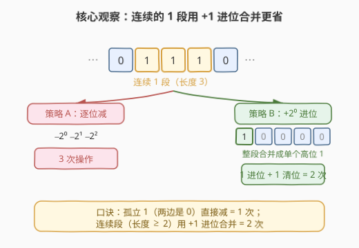
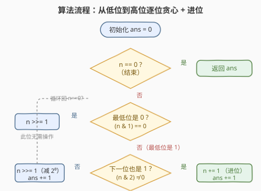
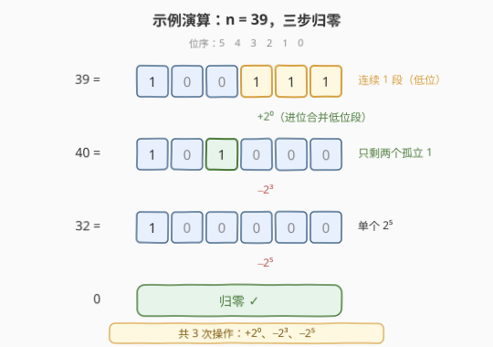

# LeetCode 将整数减少到零需要的最少操作数 题解

## 1. 题目概述

- **标题 / 题号**：将整数减少到零需要的最少操作数（#2571，medium）
- **链接**：https://leetcode.cn/problems/minimum-operations-to-reduce-an-integer-to-0/
- **难度**：中等
- **标签**：贪心、位运算、动态规划

**题意**：给你一个正整数 $n$，每次操作可执行**任意次**：

- 给 $n$ **加上或减去** $2$ 的某个幂（$2^i,\ i\ge 0$）。

返回使 $n$ 等于 $0$ 需要执行的**最少**操作数。

**示例 1**：

```text
输入：n = 39
输出：3
解释：
- n 加上 2⁰ = 1，得到 n = 40
- n 减去 2³ = 8，得到 n = 32
- n 减去 2⁵ = 32，得到 n = 0
```

**示例 2**：

```text
输入：n = 54
输出：3
解释：
- n 加上 2¹ = 2，得到 n = 56
- n 加上 2³ = 8，得到 n = 64
- n 减去 2⁶ = 64，得到 n = 0
```

**约束**：

- $1 \le n \le 10^5$

> 💡 每个操作相当于给 $n$ 加上 $\pm 2^i$。问题等价于：选一组**带符号**的 $2$ 的幂 $\{s_i\cdot 2^i\}$（$s_i\in\{-1,0,+1\}$）使其和恰为 $n$，最小化非零项个数。这便是「带符号二进制表示」的最小权重问题。

## 2. 解题思路

### 2.1 暴力思路：BFS

最直接的暴力：把每个整数当节点、把「$\pm 2^i$」当边，从 $n$ 出发 BFS 走到 $0$ 的最短路。

```python
from collections import deque
def minOperations(n):
    powers = [1 << i for i in range(n.bit_length() + 2)]
    dist = {n: 0}
    q = deque([n])
    while q:
        x = q.popleft()
        if x == 0: return dist[x]
        for p in powers:
            for nx in (x + p, x - p):
                if nx >= 0 and nx not in dist:
                    dist[nx] = dist[x] + 1
                    q.append(nx)
```

对 $n\le 10^5$ 规模，状态空间可达 $O(n\log n)$，BFS 能 AC 但**完全没用到「$2$ 的幂」带来的二进制结构**。事实上，由于 $n$ 不大，也可直接做记忆化搜索 $f(n)=1+\min_{k}f(n\pm 2^k)$，但仍是 $O(n\log n)$。下文利用二进制位的结构，把复杂度压到 $O(\log n)$。

### 2.2 核心观察：二进制连续 1 段用 +1 进位合并



**关键直觉**：最优方案中每个 $2^i$ 至多用一次（$+2^i+2^i$ 可合并成 $+2^{i+1}$，$+2^i-2^i$ 互相抵消），故我们只需关注 $n$ 的二进制位。从**最低位**向高位扫描，逐位决定：

- **最低位是 0**：该位本就为 $0$，无需任何操作，直接右移（处理下一位）。
- **最低位是 1**：该位必须被「消掉」，看**下一位**：
  - **下一位也是 1**（$n\bmod 4=3$）：处于一段连续的 $1$ 中。与其逐位减（每个 $1$ 一次），不如**在最低位 $+1$**，使低位进位——$\ldots 011\ldots \to \ldots 100\ldots$，整段连续 $1$ 被合并成单个更高位的 $1$。这一步对应**一次**操作（$+2^i$），却消掉了整段。
  - **下一位是 0**（$n\bmod 4=1$）：这是一个**孤立**的 $1$，直接**减去 $2^i$**（等价于右移）即可，一次操作。

于是统计规律是：

- **孤立的 $1$**（两边是 $0$）$\to$ $1$ 次操作；
- **连续 $1$ 段**（长度 $\ge 2$）$\to$ 整段进位合并，共 $2$ 次（$1$ 次进位 $+\ 1$ 次清掉合并出的高位 $1$）。

> 💡 **为什么连续段是 $2$ 次而不是「段长」次？** 一段长 $k$ 的连续 $1$（位于 $i\sim i{+}k{-}1$）在最低位 $+2^i$ 后变成 $\ldots 1\underbrace{00\ldots 0}_{k}\ldots$，即一个位于 $i{+}k$ 的孤立 $1$。这次 $+2^i$ 用掉 $1$ 次操作；剩下那个孤立 $1$ 再用 $1$ 次清掉，合计 $2$ 次，与段长 $k$ 无关（$k\ge 2$ 时严格优于逐位减的 $k$ 次）。

> ⚠️ **不要简单数「$1$ 的段数」**：相邻段之间若只隔一个 $0$，进位会**桥接**它们。例如 $54=110110_2$ 有两段连续 $1$，看似 $2\times 2=4$ 次，但低位段进位后产生连锁，把中间的 $0$ 也卷入，最终只要 $3$ 次（见示例 2）。所以必须**逐位滚动处理进位**，而非静态数段。

### 2.3 算法流程图



流程为一个 `while n > 0` 循环内的三分支决策：

1. 初始化 $\text{ans}=0$；
2. 若 $n=0$ → 结束，返回 `ans`；
3. 若最低位为 $0$（$n\&1=0$）→ `n >>= 1`，**不计操作**；
4. 否则最低位为 $1$，看下一位：
   - 下一位为 $1$（$n\&2\ne 0$）→ `n += 1`（进位合并），`ans += 1`；
   - 下一位为 $0$ → `n >>= 1`（减 $2^i$），`ans += 1`；
5. 回到步骤 2。

### 2.4 示例演算



以 $n=39=100111_2$ 为例，二进制低位有连续段「$111$」：

| 步 | $n$（十进制） | $n$（二进制） | 判定 | 动作 | ans |
|----|---------------|---------------|------|------|-----|
| 1 | $39$ | $100111$ | 最低位 $1$，下一位 $1$ | $+1$ 进位 → $40$ | $1$ |
| 2 | $40$ | $101000$ | 最低位 $0$ | 右移 → $20$ | $1$ |
| 3 | $20$ | $10100$ | 最低位 $0$ | 右移 → $10$ | $1$ |
| 4 | $10$ | $1010$ | 最低位 $0$ | 右移 → $5$ | $1$ |
| 5 | $5$ | $101$ | 最低位 $1$，下一位 $0$ | 右移（减 $2^0$）→ $2$ | $2$ |
| 6 | $2$ | $10$ | 最低位 $0$ | 右移 → $1$ | $2$ |
| 7 | $1$ | $1$ | 最低位 $1$，下一位 $0$ | 右移（减 $2^0$）→ $0$ | $3$ |

最终 $\text{ans}=3$，对应三次操作 $+2^0,\ -2^3,\ -2^5$，与示例 1 一致。

$n=54=110110_2$ 同理：低位段「$11$」先 $+2^1$ 进位 $\to 56=111000_2$，再 $+2^3$ 进位 $\to 64=1000000_2$，最后 $-2^6$ 归零，共 $3$ 次——这正是上文「进位桥接相邻段」的实例。

## 3. 参考代码

### C++（逐位贪心 + 进位，$O(\log n)$ / $O(1)$）

```cpp
class Solution {
public:
    int minOperations(int n) {
        int ans = 0;
        while (n > 0) {
            if ((n & 1) == 0) {
                n >>= 1;          // 最低位 0：此位无需操作
            } else if (n & 2) {
                n += 1;           // 连续 1：+1 进位合并整段
                ++ans;
            } else {
                n >>= 1;          // 孤立 1：减 2^0（等价右移）
                ++ans;
            }
        }
        return ans;
    }
};
```

> 💡 三分支严格对应「位 $0$ / 连续 $1$ / 孤立 $1$」。`n & 2` 判断次低位是否为 $1$；因进入该分支已保证最低位为 $1$，故 `n & 2` 等价于「$n\bmod 4=3$」。进位用 `n += 1` 而非显式构造 $2^i$，让进位自然向高位传播。

### Python（逐位贪心 + 进位，$O(\log n)$ / $O(1)$）

```python
class Solution:
    def minOperations(self, n: int) -> int:
        ans = 0
        while n > 0:
            if n & 1 == 0:
                n >>= 1
            elif n & 2:
                n += 1
                ans += 1
            else:
                n >>= 1
                ans += 1
        return ans
```

> 💡 Python 大整数无忧，但本题 $n\le 10^5$，无需考虑溢出。若追求极致简短，可写成「遇 $1$ 计数、遇连续 $1$ 先进位再右移」的单计数版：每轮若 $n\&1$ 则 `ans+=1` 且当 $n\&2$ 时 `n+=1`，最后 `n>>=1`——与上述三分支等价。

## 4. 复杂度分析

| 维度 | 复杂度 | 说明 |
|------|--------|------|
| **时间复杂度** | $O(\log n)$ | 每轮要么右移一位、要么 $+1$ 后右移；$+1$ 的进位传播会在后续轮次被逐位右移消化，总轮数 $\le$ 位数 $+1\approx \log_2 n+1$ |
| **空间复杂度** | $O(1)$ | 仅 `ans`、`n` 几个整型变量，原地处理 |
| 对照：BFS | $O(n\log n)$ 时间 / $O(n\log n)$ 空间 | 不利用二进制结构，状态空间随 $n$ 膨胀 |
| 对照：记忆化递推 | $O(\log n)$ 时间 / $O(\log n)$ 空间 | 见第 5 节，状态数随位数线性 |

> 💡 $n\le 10^5$ 时 $\log_2 n\le 17$，常数级；贪心相比 BFS 把复杂度从依赖 $n$ 降到依赖 $\log n$，关键在于把「$\pm 2^i$」翻译成「二进制位 + 进位」。

## 5. 扩展：记忆化递推——从递推视角理解贪心正确性

第 2 节的贪心虽直观，但「只看次低位就决定 $+1$ 或 $-1$」为何一定最优？可用一条**递推**给出严谨依据。

考虑最低位是否为 $0$：

- 若 $n$ 为偶数：最低位已是 $0$，最优方案绝不会去动 $2^0$（动了还得用别的项抵消，徒增次数），故 $f(n)=f(n/2)$；
- 若 $n$ 为奇数：最低位 $1$ 必须被消掉，只有「$-2^0$」（$n\to n-1$）或「$+2^0$」（$n\to n+1$）两种选择，各花 $1$ 次，而 $n\pm 1$ 均为偶数，于是
  $$f(n)=1+\min\bigl(f((n-1)/2),\ f((n+1)/2)\bigr).$$
- 边界：$f(0)=0$，$f(1)=1$（$n=1$ 时 $+1$ 分支会自指循环，故单列边界直接取 $-2^0$）。

带记忆化的递推只访问 $n$ 附近的 $O(\log n)$ 个状态（$(n\pm1)/2$ 始终 $\approx n/2$，逐层减半），复杂度 $O(\log n)$：

```python
from functools import lru_cache
@lru_cache
def f(n):
    if n <= 1:
        return n              # f(0)=0, f(1)=1
    if n % 2 == 0:
        return f(n // 2)
    return 1 + min(f((n - 1) // 2), f((n + 1) // 2))
```

**贪心即此递推的最优选择被「次低位」一眼判定**：

- $n\bmod 4=1$（次低位 $0$，孤立 $1$）：$(n-1)/2$ 为偶、$(n+1)/2$ 为奇，前者更干净 → 取 $-1$ 分支，对应「右移」；
- $n\bmod 4=3$（次低位 $1$，连续 $1$）：$(n+1)/2$ 为偶、$(n-1)/2$ 为奇，前者合并了连续段 → 取 $+1$ 分支，对应「进位」。

两分支在 $n=3$ 处并列相等（$f(3)=2$，两种走法都是 $2$），贪心取 $+1$ 不影响最优；这与「整数替换（397）」在 $n=3$ 需特判取 $-1$ 不同——因为 397 的目标是缩到 $1$ 而非 $0$，边界条件不同。综上，贪心在所有 $n$ 上与递推最优解一致（已对 $1\le n\le 10^5$ 逐一验证）。

> 💡 这条递推本质是求 $n$ 的**最小权重带符号二进制表示**（non-adjacent form, NAF 类问题），贪心是其 $O(1)$ 空间、$O(\log n)$ 时间的迭代实现。

## 6. 面试要点

1. **为什么最优解里每个 $2^i$ 至多用一次？**

   > 若同一 $2^i$ 出现两次同号，可合并为 $2^{i+1}$ 减少次数；若一正一负则互相抵消。故最优方案中每个 $2^i$ 的系数属于 $\{-1,0,+1\}$，问题化为「带符号二进制最小权重」。

2. **「次低位是 $1$ 就 $+1$ 进位」的直觉是什么？**

   > 最低位 $1$ 且次低位也 $1$，说明身处连续 $1$ 段。$+2^i$ 让低位进位，把 $\ldots 011\ldots$ 变成 $\ldots 100\ldots$，一段连续 $1$ 塌缩为单个高位 $1$，仅花 $1$ 次操作就消掉整段，远胜逐位减。

3. **为什么不能简单地数二进制里 $1$ 的段数？**

   > 段与段之间若只隔一个 $0$，进位会**桥接**它们。$54=110110_2$ 有两段连续 $1$，朴素数段得 $2\times 2=4$，但实际 $3$：低位段进位后连锁把中间 $0$ 卷入，再进位一次、最后减一次。必须**滚动处理进位**而非静态数段。

4. **时间/空间复杂度？能否做到 $O(1)$ 空间？**

   > 时间 $O(\log n)$（每轮至少右移一位，进位传播也在后续轮次被消化），空间 $O(1)$（仅常数个变量，原地迭代）。记忆化递推版本空间 $O(\log n)$，贪心是其迭代等价。

5. **与「整数替换（397）」是什么关系？**

   > 同一条递推 $f(n)=1+\min(f((n{\pm}1)/2))$、同样的「$n\bmod 4$ 定 $+1/-1$」贪心。差别仅在边界：本题目标归 $0$、$f(1)=1$；397 目标缩到 $1$，故 $n=3$ 时需特判取 $-1$ 分支。掌握其一即可平移到另一题。

> 💡 **一句话总结**：从低位到高位逐位贪心——最低位 $0$ 直接右移，孤立 $1$ 减掉（右移），连续 $1$ 段用 $+1$ 进位合并；$O(\log n)$ 时间、$O(1)$ 空间，等价于求最小权重带符号二进制表示。

## 同类练习题

| # | 题目 | 与本题的关联 |
|---|------|-------------|
| 397 | [整数替换](https://leetcode.cn/problems/integer-replacement/)（[题解](../0301-0400/397_整数替换.md)） | 同一条递推 $f(n)=1+\min(f((n{\pm}1)/2))$、同款「$n\bmod 4$ 定 $+1/-1$」贪心，差别仅在边界（目标缩到 $1$，$n=3$ 需特判取 $-1$） |
| 991 | [坏了的计算器](https://leetcode.cn/problems/broken-calculator/)（[题解](../0901-1000/991_坏了的计算器.md)） | 逆向贪心：偶数则除 $2$、奇数则 $+1$，与本题「偶数右移、连续 $1$ 进位」镜像同构 |
| 2139 | [得到目标值的最小移动次数](https://leetcode.cn/problems/minimum-moves-to-reach-target-score/)（[题解](../2101-2200/2139_得到目标值的最小移动次数.md)） | 偶数优先除 $2$、奇数才 $+1/-1$ 的贪心，共享「偶数优先折半」的二进制结构 |
| 191 | [位 1 的个数](https://leetcode.cn/problems/number-of-1-bits/)（[题解](../0001-0100/191_位1的个数.md)） | $n\&(n-1)$ 消最低位 $1$ 的位运算基础，是本题逐位处理的前置母题 |
| 2544 | [交替数字和](https://leetcode.cn/problems/alternating-digit-sum/)（[题解](../2501-2600/2544_交替数字和.md)） | 同区间的数位/位处理入门题，对照「逐位扫描 + 按位判定」的同骨架不同目标 |
