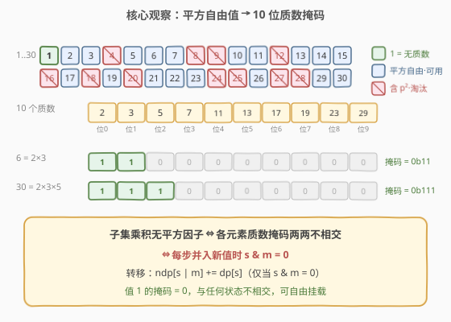

# 无平方子集计数

- **题目名称**：无平方子集计数
- **链接**：[2572. 无平方子集计数](https://leetcode.cn/problems/count-the-number-of-square-free-subsets/)
- **难度**：中等
- **标签**：位运算、动态规划、状态压缩、数学、质因数分解

## 1. 题目概述

给定一个正整数数组 `nums`。如果某个**子集**的元素**乘积**是一个 **无平方因子数**（square-free number），则称该子集为**无平方子集**。

- **无平方因子数**：无法被除 $1$ 之外的任何**完全平方数**整除的数，等价于它的质因数分解中每个质数的指数都 $\le 1$。
- 返回 `nums` 中**非空**的无平方子集数目，答案对 $10^9 + 7$ 取余。
- 两个子集只要选中的**下标集合**不同，即视为不同子集（即使元素值完全一样）。

**示例 1**：

```text
输入：nums = [3,4,4,5]
输出：3
解释：无平方子集有 [3]、[5]、[3,5]（乘积分别为 3、5、15，均为无平方因子数）。
      两个 4 自带 2²，含 4 的子集乘积必被 4 整除，故不计数。
```

**示例 2**：

```text
输入：nums = [1]
输出：1
解释：子集 [1] 的乘积为 1，1 不能被任何 >1 的平方数整除，是无平方因子数，故计 1 个。
```

**约束条件**：

- $1 \le \text{nums.length} \le 1000$
- $1 \le \text{nums[i]} \le 30$

> 💡 **关键信号**：`nums[i] ≤ 30` 是本题的「题眼」。$30$ 以内的质数只有 $2, 3, 5, 7, 11, 13, 17, 19, 23, 29$ 共 **10 个**；而无平方因子数的每个质数至多出现一次——因此每个元素可用一个 **10 位掩码**刻画它「用到哪些质数」，状态空间仅 $2^{10} = 1024$，是典型的**状压 DP 甜区**。同时 $n \le 1000$ 不大，可逐元素做 0-1 式转移，无需像孪生题 1994 那样「按值分组」。

---

## 2. 解题思路

### 2.1 暴力思路

枚举 `nums` 的全部 $2^n$ 个子集，对每个子集算乘积并判定是否为无平方因子数。

- **正确性**：穷举覆盖所有子集。
- **效率**：$n = 1000$ 时 $2^n$ 是天文数字，完全不可行；且子集乘积会膨胀到极大整数，无法存储。

> ⚠️ 暴力的浪费在于「直接枚举下标子集」。由于值域只有 $1 \sim 30$、质数只有 10 个，子集乘积是否无平方因子**只取决于每个质数被用到几次**，而与元素的具体位置无关——应当把「$n$ 个元素的选/不选」压缩成「在 10 位质数掩码上凑出互不相交的并」。

### 2.2 核心观察：平方自由过滤 + 质数位掩码 + 不相交并



**第一步：哪些值根本不能出现在无平方子集里？**

子集乘积无平方因子，意味着其中**每个元素自身必须无平方因子**（否则某个元素自带 $p^2$，乘积必含 $p^2$）。在 $1 \sim 30$ 中，含 $p^2$（只需检查 $p \in \{2,3,5\}$，因 $7^2 > 30$）的值即被淘汰：

$$4=2^2,\ 8=2^3,\ 9=3^2,\ 12=2^2{\cdot}3,\ 16=2^4,\ 18=2{\cdot}3^2,\ 20=2^2{\cdot}5,\ 24=2^3{\cdot}3,\ 25=5^2,\ 27=3^3,\ 28=2^2{\cdot}7$$

判断只需一行：$v$ 平方自由 $\iff v\bmod 4 \ne 0 \land v\bmod 9 \ne 0 \land v\bmod 25 \ne 0$。剩下的**平方自由值**共 19 个：$1,2,3,5,6,7,10,11,13,14,15,17,19,21,22,23,26,29,30$。

**第二步：用 10 位掩码记录每个平方自由值用到的质数集合。**

对平方自由值 $v$，定义质数掩码

$$m_v = \sum_{i:\, p_i \mid v} 2^i,\qquad p_i \in \{2,3,5,7,11,13,17,19,23,29\}$$

例如 $m_2 = 0000000001_2$（仅质数 2），$m_6 = m_{2\cdot3} = 0000000011_2$，$m_{30} = m_{2\cdot3\cdot5} = 0000000111_2$；而 $m_1 = 0$（$1$ 无质因数）。

**第三步：无平方子集 ⇔ 选出若干平方自由值，它们的掩码两两按位与为 $0$。**

两个值能共存当且仅当它们**不共享任何质数**，即 $m_a\ \&\ m_b = 0$。等价地，把选中值的掩码按位或成总掩码 $S$ 的过程中，每一步都要求 $S\ \&\ m_v = 0$（新值与已选质数不相交）才可并入。这就把「数子集」转成「在质数掩码上的不相交并计数」。

> 💡 **值 1 的特殊性（与孪生题 1994 的分水岭）**：$m_1 = 0$，它与任何掩码都不相交（$S\ \&\ 0 = 0$ 恒成立），并入后也不改变总掩码（$S \mid 0 = S$）。因此**若干个 1 可任意挂载**到任何无平方子集上而不破坏无平方性。更关键的是：本题中乘积 $1$（即只选若干个 1）**算作无平方因子数**（见示例 2），所以 $\{1\}$ 本身就计入答案——这决定了我们最终用 $\sum_s \text{dp}[s] - 1$ 直接扣除「空集」即可，而 1994 因「好子集乘积必须是 ≥1 个质数之积」需把 1 单独乘 $2^{\text{cnt}[1]}$ 并排除全 1。

### 2.3 算法流程图

![流程：dp[0]=1 → 逐元素复制 ndp、对每个不相交状态 s 做 ndp[s|m]+=dp[s] → 汇总减 1](../images/sfss_dp_flow.svg)

定义 $\text{dp}[s]$ = 当前已处理元素中，凑出总质数掩码为 $s$ 的**子集数**（含空集，$s=0$ 时含空集）。逐元素做 0-1 式转移：

1. **初始化**：$\text{dp}[0] = 1$（空集），其余为 $0$；
2. **对每个平方自由元素** $v$（掩码 $m = m_v$）：
   - 复制 $\text{ndp} = \text{dp}$（「不选 $v$」分支原样保留）；
   - 对每个状态 $s$：若 $s\ \&\ m = 0$（与已选质数不相交），则
     $$\text{ndp}[s \mid m]\ \mathrel{+}=\ \text{dp}[s]$$
   - 令 $\text{dp} = \text{ndp}$；
3. **答案**：$\displaystyle\Bigl(\sum_{s} \text{dp}[s]\Bigr) - 1 \pmod{10^9{+}7}$（扣除唯一不算的**空集**）。

> 💡 **为什么用「副本 ndp」而非原地逆序？** 0-1 式转移要求每个元素**至多贡献一次**。用新数组 $\text{ndp}$ 读取旧 $\text{dp}$、写入新 $\text{ndp}$，源与汇物理分离，天然杜绝「同元素自我合并」的重复，无需像 0-1 背包那样依赖「逆序枚举容量」的顺序约定，最易讲清、最不易错。代价仅多一个 $O(2^{10})$ 的临时数组，常数级。

> ⚠️ **不相交判定 $s\ \&\ m = 0$ 是唯一剪枝**：它既保证新值不与已选值共享质数（无平方因子），也顺带处理了「同值重复元素」——两个 $3$ 的掩码都是 $\{3\}$，并入第一个后 $s$ 含 $3$ 位，第二个的 $s\ \&\ m \ne 0$ 自动跳过，故同值最多选一个、且不同下标算不同子集（分别计入 $\text{dp}[s \mid m]$）。

### 2.4 示例演算

以 `nums = [3,4,4,5]` 为例（两个 $4$ 因含 $2^2$ 直接淘汰，实际入 DP 的只有 $3,5$）：

![示例演算：处理 3 后得 dp[∅]=dp[{3}]=1；两个 4 跳过；处理 5 后得四个掩码各 1，汇总 4−1=3](../images/sfss_example.svg)

| 阶段 | 处理 | $\text{dp}[\emptyset]$ | $\text{dp}[\{3\}]$ | $\text{dp}[\{5\}]$ | $\text{dp}[\{3,5\}]$ | 说明 |
|------|------|:---:|:---:|:---:|:---:|------|
| 初始 | — | 1 | 0 | 0 | 0 | 仅空集 |
| $v=3$ | $m=\{3\}$ | 1 | 1 | 0 | 0 | $s=\emptyset$ 与 $\{3\}$ 不相交 → 并入 $\{3\}$ |
| $v=4$ | $2^2$ 淘汰 | 1 | 1 | 0 | 0 | 平方自由过滤，不入 DP |
| $v=4$ | $2^2$ 淘汰 | 1 | 1 | 0 | 0 | 同上 |
| $v=5$ | $m=\{5\}$ | 1 | 1 | 1 | 1 | $\emptyset\to\{5\}$、$\{3\}\to\{3,5\}$ |

- 汇总 $\sum_s \text{dp}[s] = 1+1+1+1 = 4$，扣除空集得 $4 - 1 = 3$。
- 对应三个无平方子集：$\{3\}$（乘积 3）、$\{5\}$（乘积 5）、$\{3,5\}$（乘积 15），与示例输出一致。✓

> 💡 **观察要点**：① 两个 $4$ 因含 $2^2$ 在**入 DP 前**就被过滤，根本不参与转移；② 处理 $5$ 时同时由 $\emptyset$ 和 $\{3\}$ 出发，分别落到 $\{5\}$ 与 $\{3,5\}$，体现「不相交才可并」；③ 四个非空/空掩码各贡献 1，恰好对应「以不同质数集合为乘积」的子集，相加后减 1 即答案。

---

## 3. 参考代码

### Python（逐元素状压 DP，$O(n\cdot 2^{10})$ / $O(2^{10})$）

```python
class Solution:
    def squareFreeSubsets(self, nums: List[int]) -> int:
        MOD = 10**9 + 7
        primes = [2, 3, 5, 7, 11, 13, 17, 19, 23, 29]

        # 预处理 1..30：是否平方自由、及其质数掩码
        valid = [False] * 31
        mask = [0] * 31
        for v in range(1, 31):
            if v % 4 == 0 or v % 9 == 0 or v % 25 == 0:   # 含 p²，淘汰
                continue
            valid[v] = True
            m = 0
            for i, p in enumerate(primes):
                if v % p == 0:
                    m |= 1 << i
            mask[v] = m

        K = 1 << 10
        dp = [0] * K
        dp[0] = 1                              # 空集
        for v in nums:
            if not valid[v]:
                continue                       # 非平方自由，跳过
            m = mask[v]
            ndp = dp[:]                        # 不选 v：原样保留
            for s in range(K):
                if dp[s] and (s & m) == 0:     # 与已选质数不相交
                    ndp[s | m] = (ndp[s | m] + dp[s]) % MOD
            dp = ndp

        return (sum(dp) - 1) % MOD             # 扣除空集
```

> 💡 `dp[s]` 为 0 时跳过可省掉无意义转移；`(s & m) == 0` 是「可并」的唯一判据。值 $1$（`m=0`）会使所有 $s$ 满足条件且 `s | 0 = s`，于是每个 `dp[s]` 自身翻倍——这正是「每个 1 选/不选都合法」的体现，无需特判。

### C++（逐元素状压 DP，$O(n\cdot 2^{10})$ / $O(2^{10})$）

```cpp
class Solution {
    static constexpr int PRIMES[10] = {2,3,5,7,11,13,17,19,23,29};
public:
    int squareFreeSubsets(vector<int>& nums) {
        const int MOD = 1000000007;
        bool valid[31] = {};
        int maskv[31] = {};
        for (int v = 1; v <= 30; ++v) {
            if (v % 4 == 0 || v % 9 == 0 || v % 25 == 0) continue; // 含 p²，淘汰
            valid[v] = true;
            int m = 0;
            for (int i = 0; i < 10; ++i) if (v % PRIMES[i] == 0) m |= 1 << i;
            maskv[v] = m;
        }

        const int K = 1 << 10;
        vector<long long> dp(K, 0), ndp(K, 0);
        dp[0] = 1;                                          // 空集
        for (int v : nums) {
            if (!valid[v]) continue;                         // 非平方自由，跳过
            int m = maskv[v];
            ndp = dp;                                        // 不选 v：原样保留
            for (int s = 0; s < K; ++s) {
                if (dp[s] && (s & m) == 0) {                // 与已选质数不相交
                    ndp[s | m] = (ndp[s | m] + dp[s]) % MOD;
                }
            }
            dp.swap(ndp);
        }

        long long ans = 0;
        for (int s = 0; s < K; ++s) ans = (ans + dp[s]) % MOD;
        return int((ans - 1 + MOD) % MOD);                   // 扣除空集
    }
};
```

> 💡 用 `long long` 承接加法避免 `int` 溢出（两项均 $< 10^9{+}7$，相加 $< 2\cdot10^9$ 略超 `INT_MAX`）；末尾 `+ MOD` 防止减 1 后变负。`ndp = dp` 整表复制后只写「并入」分支，与 Python 版逻辑一致。

---

## 4. 复杂度分析

| 维度 | 复杂度 | 说明 |
|------|--------|------|
| **时间复杂度** | $O(n\cdot 2^{10})$ | 每个元素扫一遍 $2^{10}=1024$ 个状态；$n\le 1000$ 约 $10^6$ 次操作 |
| **空间复杂度** | $O(2^{10})$ | 两个长 $1024$ 的数组 `dp`/`ndp`，常数级；预处理表 $O(31)$ |
| 对照：按值分组版 | $O(19\cdot 2^{10})$ 时间 / $O(2^{10})$ 空间 | 仅 19 个平方自由值各扫一遍，适合 $n$ 极大时（见第 5 节、孪生题 1994） |
| 对照：暴力枚举 | $O(2^n)$ 时间 | $n=1000$ 完全不可行 |

> 💡 $O(n\cdot 2^{10})$ 对 $n\le 1000$ 极其宽裕。之所以不强行写「按值分组」$O(19\cdot 2^{10})$，是因为本题 $n$ 不大、逐元素版**最直白**且天然处理「同值不同下标算不同子集」——分组版要在权重里写 $2^{\text{cnt}[v]}-1$，反而绕。只有当 $n$ 涨到 $10^5$（如 1994）才必须分组。

---

## 5. 扩展：按值分组 + 原地逆序（应对 $n$ 极大）

当 $n$ 极大（如孪生题 1994 的 $n\le 10^5$）时，逐元素扫 $2^{10}$ 共 $10^8$ 量级偏慢，应**按值分组**：同一平方自由值 $v$ 出现 $\text{cnt}[v]$ 次，选中「至少一个」$v$ 的下标子集有 $2^{\text{cnt}[v]}-1$ 种（对乘积贡献相同，但下标不同算不同子集），于是该值的权重 $w_v = 2^{\text{cnt}[v]}-1$，转移改为

$$\text{dp}[s \mid m_v]\ \mathrel{+}=\ \text{dp}[s]\cdot w_v\quad(s\ \&\ m_v = 0)$$

只对 19 个值各扫一遍，共 $19\cdot 2^{10}\approx 2\times10^4$ 次。配合**原地逆序枚举** $s$（从 $(1\ll 10)-1$ 到 $0$）可省掉 $\text{ndp}$：因 $s \mid m_v \ge s$ 且 $s \mid m_v = s$ 仅当 $m_v=0$（值 1，按 $2^{\text{cnt}[1]}$ 末尾统一乘），故非 1 值的「并入目标」严格更大、逆序时已被越过，不会在本轮被当作源再读，保证每个值至多用一次——与 0-1 背包逆序容量同理。

> ⚠️ **本题 $(n\le 1000)$ 不必如此**：逐元素副本法已足够快且更不易错。分组 + 逆序是「同套路在更大 $n$ 下的等价改写」，详见 [1994. 好子集的数目](../1901-2000/1994_好子集的数目.md)。

> 💡 **2572 vs 1994 的两处本质差异**：① 规模——$n\le 1000$ vs $n\le 10^5$，决定逐元素 vs 按值分组；② 值 1 的语义——本题乘积 1 **是**无平方因子数（$\{1\}$ 计入，故 $\sum\text{dp}-1$），1994 中乘积须为「≥1 个互异质数之积」故全 1 **不计**（须 $\sum_{s\ne0}\text{dp}[s]\cdot 2^{\text{cnt}[1]}$）。骨架同是「质数掩码状压 DP」，收尾公式不同。

---

## 6. 面试要点

1. **为什么子集乘积无平方因子要求每个元素自身平方自由？**

   > 若某元素 $x$ 含 $p^2$（$p^2 \mid x$），则 $p^2 \mid x \mid$ 子集乘积，乘积必被 $p^2$ 整除，不无平方因子。故含平方因子的元素在入 DP 前全部淘汰，只保留 19 个平方自由值。

2. **10 位质数掩码为何足以刻画所有平方自由值？**

   > 值域 $1\sim 30$，其质数仅 10 个；平方自由值的每个质数指数恰为 0 或 1，故用每质数一位的 10 位掩码即可唯一表示「用到哪些质数」。状态空间 $2^{10}=1024$，是状压 DP 的标准甜区。

3. **「不相交并」为何同时解决同值重复元素？**

   > 两个 $3$ 的掩码都是 $\{3\}$。并入第一个后状态含「3」位，第二个的 $s\ \&\ m \ne 0$ 被判不相交失败而跳过——天然保证同值至多选一个；而不同下标的 $3$ 分别从同一 $s$ 贡献到 $s\mid m$，下标差异被 $\text{dp}$ 的累加自然区分。

4. **为什么用副本 `ndp` 而不是原地逆序？**

   > 副本法让「源」读旧 `dp`、「汇」写新 `ndp`，物理隔离保证每个元素至多贡献一次，无需依赖枚举顺序的约定，最易讲清且 $n\le 1000$ 下多一个 $1024$ 长数组的开销可忽略。原地逆序需论证「目标严格更大、逆序已越过」才等价，适合 $n$ 极大时省数组（见第 5 节）。

5. **值 1 在本题与 1994 中的处理为何不同？**

   > $m_1=0$，与一切不相交且并入不改掩码。本题乘积 1 是无平方因子数，故 $\{1\}$ 计入，$\text{cnt}[1]$ 个 1 使每个 $\text{dp}[s]$ 翻 $\text{cnt}[1]$ 倍（等价乘 $2^{\text{cnt}[1]}$），最后 $\sum\text{dp}-1$ 扣空集即可；1994 要求乘积为 ≥1 个互异质数之积，全 1 不算好子集，故须先把非零掩码求和再乘 $2^{\text{cnt}[1]}$，排除「仅 1」。

> 💡 **一句话总结**：过滤含 $p^2$ 的元素，把每个平方自由值压成 10 位质数掩码；逐元素做「不相交才并」的状压 DP（$\text{ndp}[s\mid m]\mathrel{+}=\text{dp}[s]$，当 $s\ \&\ m=0$）；答案 $=\sum_s\text{dp}[s]-1$。$O(n\cdot 2^{10})$ 时间、$O(2^{10})$ 空间，值 1 与同值重复均被掩码 $0$ 和不相交判定自然吸收。

---

## 7. 同类练习题

- [1994. 好子集的数目](https://leetcode.cn/problems/the-number-of-good-subsets/)（[题解](../1901-2000/1994_好子集的数目.md)）：本题的孪生题，定义几乎一致但 $n\le 10^5$，必须「按值分组 + 原地逆序」$O(19\cdot 2^{10})$，且值 1 须末尾乘 $2^{\text{cnt}[1]}$（排除全 1），对照体会规模与语义差异
- [526. 优美的排列](https://leetcode.cn/problems/beautiful-arrangement/)（[题解](../0501-0600/526_优美的排列.md)）：10 位量级的状态压缩 DP 模板，`popcount` 定位置、位掩码记已用集合，与本题同属「小集合状压」甜区
- [1125. 最小的必要团队](https://leetcode.cn/problems/smallest-sufficient-team/)（[题解](../1101-1200/1125_最小的必要团队.md)）：把「所需技能」压成位掩码、在人上做状压 DP 凑并集，与本题「质数掩码凑不相交并」对偶（一个求最小、一个求数目）
- [1494. 并行课程 II](https://leetcode.cn/problems/parallel-courses-ii/)（[题解](../1401-1500/1494_并行课程II.md)）：以「已修课程集合」为掩码、枚举子集转移的状压 DP，体会「掩码上凑并集/子集」的通用套路
- [204. 计数质数](https://leetcode.cn/problems/count-primes/)（[题解](../0201-0300/204_计数质数.md)）：质数筛法基础，为本题「$30$ 以内 10 个质数」的判断与 $p^2$ 过滤提供数论底座
