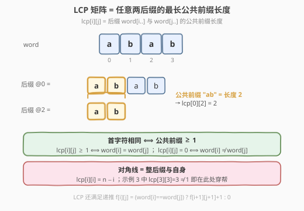
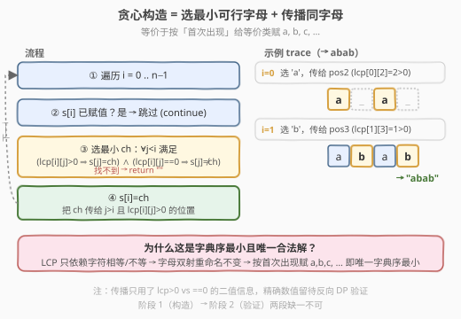
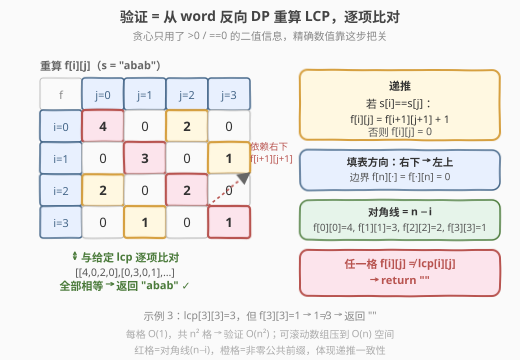

# 找出对应 LCP 矩阵的字符串

- **题目名称**：找出对应 LCP 矩阵的字符串
- **链接**：[2573. 找出对应 LCP 矩阵的字符串](https://leetcode.cn/problems/find-the-string-with-lcp/)
- **难度**：困难
- **标签**：数组、贪心、动态规划、字符串、并查集（隐式）

## 1. 题目概述

对任一由 `n` 个小写英文字母组成的字符串 `word`，定义 `n × n` 矩阵 `lcp`：`lcp[i][j]` 等于子串 `word[i, …, n-1]` 与 `word[j, …, n-1]` 的**最长公共前缀**长度。给定矩阵 `lcp`，返回与之对应的、字典序最小的 `word`；若不存在则返回空字符串 `""`。

**示例 1**：

```text
输入：lcp = [[4,0,2,0],[0,3,0,1],[2,0,2,0],[0,1,0,1]]
输出："abab"
解释：lcp 对应由两个交替字母组成的任意 4 字母串，字典序最小的是 "abab"。
```

**示例 2**：

```text
输入：lcp = [[4,3,2,1],[3,3,2,1],[2,2,2,1],[1,1,1,1]]
输出："aaaa"
解释：lcp 对应只有一个不同字母的任意 4 字母串，字典序最小的是 "aaaa"。
```

**示例 3**：

```text
输入：lcp = [[4,3,2,1],[3,3,2,1],[2,2,2,1],[1,1,1,3]]
输出：""
解释：lcp[3][3] 无法等于 3，因为 word[3, …, 3] 仅由单个字母组成，LCP 只能为 1。
```

**约束条件**：

- `1 <= n == lcp.length == lcp[i].length <= 1000`
- `0 <= lcp[i][j] <= n`

---

## 2. 解题思路

### 2.1 暴力思路

枚举所有长度为 `n` 的小写串，逐个计算其 LCP 矩阵并与给定矩阵比对。候选数为 $26^n$，`n ≤ 1000` 时完全不可行。需要直接从矩阵「反解」出字符串。

### 2.2 核心观察：贪心构造 + 反向验证

**观察一：LCP 矩阵编码了字符的相等 / 不等关系。** 最长公共前缀长度 $\geq 1$ 当且仅当两个后缀首字符相同：

$$\text{lcp}[i][j] \geq 1 \iff \text{word}[i] = \text{word}[j], \qquad \text{lcp}[i][j] = 0 \iff \text{word}[i] \neq \text{word}[j]$$



**观察二：LCP 满足递推。** 记后缀 $i$ 与后缀 $j$ 的 LCP 为 $f[i][j]$，则：

$$f[i][j] = \begin{cases} f[i+1][j+1] + 1, & \text{word}[i] = \text{word}[j] \\ 0, & \text{word}[i] \neq \text{word}[j] \end{cases}$$

边界 $f[n][\cdot] = f[\cdot][n] = 0$。注意 $f[i][i] = n - i$（整个后缀与自身完全相同）。

**观察三：解在「字母重命名」下唯一。** LCP 只依赖字符间的相等 / 不等，与具体字母无关。若某串 `w` 合法，则对字母做任意双射重命名后仍合法（矩阵不变）。因此字典序最小解唯一确定：**把所有「等价类」（必须同字母的位置集合）按其首次出现的位置排序，依次赋 `a, b, c, …`**。

> 💡 这意味着：只要解存在，贪心地「按首次出现赋 `a, b, c, …`」就给出唯一答案；贪心构造出的串若能通过验证即为答案，否则无解。

**观察四：贪心构造 = 隐式并查集。** 从左到右扫描，对每个未赋值位置 `i` 选最小字母 `ch`，满足对所有已赋值 `j < i`：`(lcp[i][j] > 0 ⇒ word[j] = ch)` 且 `(lcp[i][j] == 0 ⇒ word[j] ≠ ch)`；随后把 `ch` 传播给所有 `j > i` 且 `lcp[i][j] > 0` 的位置（它们必与 `i` 同字母）。这等价于按首次出现赋 `a, b, c, …`。



**观察五：验证不可省。** 贪心只用到 `lcp > 0` 与 `lcp == 0` 的二值信息（首字符关系），完全忽略 `lcp` 的精确数值与递推一致性。例如 `lcp[i][j] = 5` 但 `lcp[i+1][j+1] = 0` 自相矛盾，贪心却照常产出一个串。因此必须用构造出的 `word` 反向 DP 重算 LCP，逐项比对原矩阵；全部相等才返回 `word`，任一格不符即 `""`。

### 2.3 算法流程图



### 2.4 示例演算

以示例 1 `lcp = [[4,0,2,0],[0,3,0,1],[2,0,2,0],[0,1,0,1]]` 为例：

| 步骤 | 位置 i | 动作 | word 状态 |
|------|--------|------|-----------|
| 1 | 0 | 无约束，选最小字母 `a`；传播 `lcp[0][2]=2>0` → 位置 2 也赋 `a` | `a _ a _` |
| 2 | 1 | `lcp[1][0]=0` ⇒ 与位置 0(`a`) 不同 → `a` 被禁；选 `b`；传播 `lcp[1][3]=1>0` → 位置 3 赋 `b` | `a b a b` |
| 3 | 2 | 已赋 `a`，跳过 | `a b a b` |
| 4 | 3 | 已赋 `b`，跳过 | `a b a b` |

得到 `word = "abab"`，反向 DP 重算 LCP 与原矩阵逐项相等 → 返回 `"abab"`。

> ⚠️ 示例 3 的 `lcp[3][3] = 3`，而递推给出 `f[3][3] = n - 3 = 1`，验证阶段 `1 ≠ 3` 即返回 `""`。这正是「验证不可省」的体现——贪心阶段并未检查对角线数值。

---

## 3. 参考代码

### C++

```cpp
class Solution {
public:
    string findTheString(vector<vector<int>>& lcp) {
        int n = lcp.size();
        string s(n, ' ');                       // ' ' 表示未赋值
        // ---- 阶段 1：贪心构造 ----
        for (int i = 0; i < n; ++i) {
            if (s[i] != ' ') continue;           // 已被传播赋值
            char chosen = 0;                    // 0 表示尚未选出
            for (char ch = 'a'; ch <= 'z'; ++ch) {
                bool ok = true;
                for (int j = 0; j < i; ++j) {
                    bool same = (s[j] == ch);
                    bool needSame = (lcp[i][j] > 0);
                    if (same != needSame) { ok = false; break; }
                }
                if (ok) { chosen = ch; break; }
            }
            if (chosen == 0) return "";          // 找不到合法字母 → 无解
            s[i] = chosen;
            for (int j = i + 1; j < n; ++j)      // 传播同字母
                if (lcp[i][j] > 0) s[j] = chosen;
        }
        // ---- 阶段 2：反向 DP 验证 ----
        vector<vector<int>> f(n + 1, vector<int>(n + 1, 0));
        for (int i = n - 1; i >= 0; --i)
            for (int j = n - 1; j >= 0; --j) {
                f[i][j] = (s[i] == s[j]) ? f[i + 1][j + 1] + 1 : 0;
                if (f[i][j] != lcp[i][j]) return "";
            }
        return s;
    }
};
```

### Python

```python
class Solution:
    def findTheString(self, lcp: List[List[int]]) -> str:
        n = len(lcp)
        s = [''] * n
        # ---- 阶段 1：贪心构造 ----
        for i in range(n):
            if s[i]:
                continue                        # 已被传播赋值
            chosen = ''
            for k in range(26):
                ch = chr(ord('a') + k)
                ok = True
                for j in range(i):
                    if (s[j] == ch) != (lcp[i][j] > 0):
                        ok = False
                        break
                if ok:
                    chosen = ch
                    break
            if not chosen:
                return ""                       # 找不到合法字母 → 无解
            s[i] = chosen
            for j in range(i + 1, n):            # 传播同字母
                if lcp[i][j] > 0:
                    s[j] = chosen
        # ---- 阶段 2：反向 DP 验证 ----
        f = [[0] * (n + 1) for _ in range(n + 1)]
        for i in range(n - 1, -1, -1):
            for j in range(n - 1, -1, -1):
                if s[i] == s[j]:
                    f[i][j] = f[i + 1][j + 1] + 1
                else:
                    f[i][j] = 0
                if f[i][j] != lcp[i][j]:
                    return ""
        return ''.join(s)
```

> 💡 贪心阶段可优化到 $O(n^2)$：对位置 `i` 一次遍历 `j < i` 即可得到「强制字母」（若有 `lcp[i][j] > 0` 则 `word[i]` 被钉死为 `word[j]`，并校验所有这类 `j` 一致）与「禁用字母集合」（`lcp[i][j] == 0` 对应的 `word[j]`），二者直接定出 `chosen`，无需逐个试 26 个字母。此处保留 26 循环以贴近「选最小可行字母」的直觉。

---

## 4. 复杂度分析

| 维度 | 阶段 | 复杂度 | 说明 |
|------|------|--------|------|
| 时间 | 贪心构造 | $O(26 \cdot n^2)$ | 每个位置至多试 26 个字母，每个字母扫 `j < i`；可优化到 $O(n^2)$ |
| 时间 | 反向验证 | $O(n^2)$ | 双层倒序 DP，每格 $O(1)$ |
| 时间 | 总计 | $O(n^2)$ | $n \leq 1000$ ⇒ $\sim 10^6$，可接受 |
| 空间 | 验证 DP 表 | $O(n^2)$ | `f` 表 $(n+1)^2$；可用滚动数组压到 $O(n)$ |
| 空间 | 构造 | $O(n)$ | `s` 数组 |

> ⚠️ 验证 DP 的双层循环虽嵌套，但每格 $O(1)$、共 $n^2$ 格，故 $O(n^2)$，非 $O(n^3)$。空间 $O(n^2)$ 对 $n=1000$ 约 $10^6$ 个 `int`，可接受；若内存紧张可用单行滚动数组：`f[j]` 表示「下一行」的值，倒序更新即可。

---

## 5. 扩展

**为何贪心得到的串若通过验证就一定是字典序最小解？** 关键在「字母重命名不变性」：LCP 只关心字符相等 / 不等，双射重命名后矩阵不变。故所有合法解互为「重命名」关系，按首次出现赋 `a, b, c, …` 后都收敛到同一个串——即字典序最小者。因此「解存在 $\iff$ 贪心串通过验证」，不存在「贪心串通过验证却非字典序最小」的情形。

**用并查集显式建等价类**：把所有 `lcp[i][j] > 0` 的 `(i, j)` 并起来得到等价类，再校验 `lcp[i][j] == 0` 时 `i, j` 必属不同类，最后按类首次出现赋字母。这与本文贪心传播等价，只是把「传播」换成显式 `find / union`。无论哪种构造，**反向 DP 验证都不可省**，因为等价类只刻画首字符关系，`lcp` 的精确数值仍需递推核对。

---

## 6. 面试要点

1. **为什么贪心要传播同字母给 `lcp[i][j] > 0` 的 `j`？**
   - `lcp[i][j] > 0` 意味着 `word[i] = word[j]`，一旦定下 `word[i]`，所有这类 `j` 就被钉死为同字母，立即传播可避免后续重复决策并保一致性。

2. **贪心阶段为什么不会漏掉无解情形？**
   - 不会。若解存在，贪心串即唯一合法解、必通过验证；若贪心串未通过验证，说明矩阵自相矛盾（如对角线数值、递推不一致），确属无解。验证阶段是判定无解的最终关卡。

3. **为什么不能只做贪心不做验证？**
   - 贪心只用二值信息（`> 0` vs `== 0`）。矩阵可能在对角线、对称性、递推一致性上出错（如示例 3 的 `lcp[3][3] = 3`），这些都不影响贪心产串，但使该串重算的 LCP 与原矩阵不符——必须逐项比对才能判出。

4. **字典序最小如何保证？**
   - 处理到位置 `i` 时，`0..i-1` 已定，`i` 是当前最靠前未决位，选最小可行字母即让前缀最小。结合「重命名不变性」，该贪心串就是全局字典序最小（且唯一）合法解。

5. **验证 DP 的填表方向为什么是从右下到左上？**
   - `f[i][j]` 依赖 `f[i+1][j+1]`（右下方），故须先算更大的 `i, j`，倒序双循环保证依赖已就绪；边界 `f[n][\cdot] = f[\cdot][n] = 0`。

6. **空间能优化吗？**
   - 验证可用长度 `n+1` 的滚动数组（只依赖下一行），降到 $O(n)$；构造仅需 $O(n)$。总空间 $O(n)$。

---

## 7. 同类练习题

- [1143. 最长公共子序列](https://leetcode.cn/problems/longest-common-subsequence/)：LCS 二维 DP 依赖左上格，与本文验证 DP 同骨架
- [718. 最长重复子数组](https://leetcode.cn/problems/maximum-length-of-repeated-subarray/)：公共子串 DP，不匹配归零，与 $f[i][j] = \text{word}[i] = \text{word}[j]\ ?\ f[i+1][j+1]+1 : 0$ 同形
- [547. 省份数量](https://leetcode.cn/problems/number-of-provinces/)：并查集刻画的等价类，与本文「`lcp > 0` ⇒ 同类」同思想
- [14. 最长公共前缀](https://leetcode.cn/problems/longest-common-prefix/)：LCP 概念入门，纵向 / 横向扫描
- [1062. 最长重复子串](https://leetcode.cn/problems/longest-repeating-substring/)：二分 + LCP 判定重复，与本文 LCP 递推呼应
