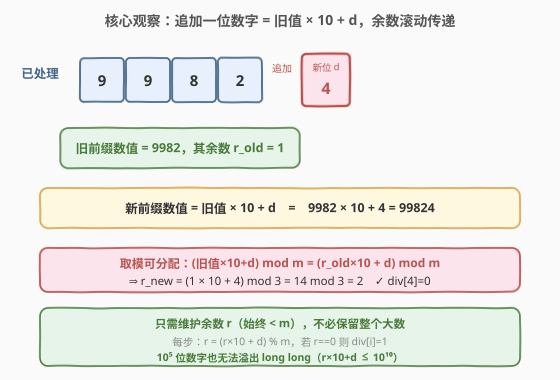

# 找出字符串的可整除数组

- **题目名称**：找出字符串的可整除数组
- **链接**：[2575. 找出字符串的可整除数组](https://leetcode.cn/problems/find-the-divisibility-array-of-a-string/)
- **难度**：中等
- **标签**：数组、数学、字符串

## 1. 题目概述

给定一个下标从 $0$ 开始的字符串 `word`，长度为 $n$，由 `0`–`9` 的数字组成；另给一个正整数 $m$。`word` 的**可整除数组** `div` 长度为 $n$，满足：

- 若 `word[0..i]` 所表示的**数值**能被 $m$ 整除，则 `div[i] = 1`；
- 否则 `div[i] = 0`。

返回 `div`。

**示例 1**：

```text
输入：word = "998244353", m = 3
输出：[1,1,0,0,0,1,1,0,0]
解释：能被 3 整除的前缀有 4 个："9"、"99"、"998244" 和 "9982443"。
```

**示例 2**：

```text
输入：word = "1010", m = 10
输出：[0,1,0,1]
解释：能被 10 整除的前缀有 2 个："10" 和 "1010"。
```

**约束条件**：

- $1 \le n \le 10^5$
- $\text{word.length} = n$
- `word` 由数字 `0`–`9` 组成
- $1 \le m \le 10^9$

> 💡 关键观察：`word[0..i]` 的数值随 $n$ 可达 $10^{10^5}$ 量级，**任何整数类型都装不下**。但判断整除只需知道「该数值 $\bmod m$ 是否为 $0$」——而取模运算对加法与乘法可分配，于是只需维护一个**滚动余数 $r$**（始终 $< m$），逐位「左移乘 $10$ 再加当前位」并取模，即可在不保留大数的前提下判定每个前缀的可整除性。

---

## 2. 解题思路

### 2.1 暴力思路：每个前缀转成整数再判整除

最直白的写法：对每个 $i$，把子串 `word[0..i]` 解析成一个整数，再做 `% m == 0` 判断。

```python
div = []
for i in range(len(word)):
    if int(word[: i + 1]) % m == 0:   # 每次重新解析整段前缀
        div.append(1)
    else:
        div.append(0)
return div
```

问题有二：

- **大数溢出 / 解析代价**：`word` 最长 $10^5$ 位，对应数值远超 `long long`（$\sim 9.2\times 10^{18}$，仅约 $19$ 位）。C++ 中根本没有原生的「$10^5$ 位整数」类型，必须自写取模。即便在 Python 中 `int` 能装任意大数，每次 `int(word[:i+1])` 都要 $O(i)$ 重解析，总计 $O(n^2) \approx 10^{10}$，超时。
- **重复计算**：每算一个前缀都从首位重头解析一次，前缀间的大量重叠信息（前 $i-1$ 位早已算过）被完全浪费。

### 2.2 核心观察：模运算可分配，余数滚动传递



**关键直觉**：设已处理前缀 `word[0..i-1]` 表示的数值为 $V_{old}$，它对 $m$ 的余数 $r = V_{old} \bmod m$。当追加新数字 $d = \text{word}[i]$ 时，新前缀数值为

$$
V_{new} = V_{old} \times 10 + d.
$$

判断 $V_{new}$ 能否被 $m$ 整除，只需关心 $V_{new} \bmod m$。由**取模对乘法与加法的分配律**：

$$
V_{new} \bmod m = \big((V_{old} \bmod m) \times 10 + d\big) \bmod m = (r \times 10 + d) \bmod m.
$$

于是把「算 $10^5$ 位大数的余数」化归为「**只维护一个 $< m$ 的滚动余数 $r$**，每步做 $r \gets (r \times 10 + d) \bmod m$」——$r$ 永远不超过 $m-1 \le 10^9-1$，配合一个乘 $10$ 加 $d$（$d \le 9$）中间值 $\le 10^{10}+9$，**`long long` 完全够用、绝不溢出**。

> 💡 **为什么能省掉大数？** 「能否被 $m$ 整除」是 $V \bmod m$ 是否为 $0$ 的判定，而模运算对组成数值的乘加运算可分配。所以不需要完整保存 $V$，只需保存 $V \bmod m$ 这条「摘要」并随追加位数滚动更新即可。这是「**只关心结果模某值、就不必保留原值**」这一经典思路的直接应用。

> ⚠️ **溢出红线**：`r` 取自 `r < m`，而 $m \le 10^9$；故中间量 `r * 10 + d` 上界 $\approx 10^{10}+9$，超出 32 位 `int`（$\approx 2.1\times 10^9$）。C++ 必须用 `long long` 存放 `r * 10 + d` 或令 `r` 为 `long long`；Python 无此虑。

### 2.3 算法流程图

![算法流程：r=0 → 遍历 i：d=word[i]−'0'，r=(r×10+d)%m，div[i]=1 if r==0 else 0 → 返回](../images/divarr_flow.svg)

流程分三阶段：

1. **初始化**：`r = 0`（空前缀数值记为 $0$，$0 \bmod m = 0$，但空前缀不在答案范围内，$i$ 从 $0$ 起算）；
2. **滚动扫描**：对 $i$ 从 $0$ 到 $n-1$：
   - $d = \text{word}[i] - \text{'0'}$；
   - $r = (r \times 10 + d) \bmod m$；
   - $\text{div}[i] = 1$ 若 $r == 0$ 否则 $0$；
3. **返回** `div`。

> 💡 「先用后无需加」：本题每步只用 `r` 算新 `r` 并直接写答案，没有「先加后用」的时序陷阱（对照 2574 的 `leftSum` 必须「先用后加」）。`r` 一开始代表空前缀余数 $0$，第一次循环就自然算出 `word[0..0]` 的余数。

### 2.4 示例演算

![示例演算：word="998244353"，m=3，逐位滚动 r，余数为 0 处 div[i]=1](../images/divarr_walkthrough.svg)

以示例 1 `word="998244353"`、$m=3$ 为例，逐位滚动余数：

| 步 | $i$ | $d$ | $r_{old}$ | $r_{old}\times 10+d$ | $r_{new}=\cdot\bmod 3$ | `div[i]` |
|----|-----|-----|-----------|----------------------|------------------------|----------|
| 0 | 0 | 9 | 0 | $0\times 10+9=9$ | $9\bmod 3=0$ | 1 |
| 1 | 1 | 9 | 0 | $0\times 10+9=9$ | $9\bmod 3=0$ | 1 |
| 2 | 2 | 8 | 0 | $0\times 10+8=8$ | $8\bmod 3=2$ | 0 |
| 3 | 3 | 2 | 2 | $2\times 10+2=22$ | $22\bmod 3=1$ | 0 |
| 4 | 4 | 4 | 1 | $1\times 10+4=14$ | $14\bmod 3=2$ | 0 |
| 5 | 5 | 4 | 2 | $2\times 10+4=24$ | $24\bmod 3=0$ | 1 |
| 6 | 6 | 3 | 0 | $0\times 10+3=3$ | $3\bmod 3=0$ | 1 |
| 7 | 7 | 5 | 0 | $0\times 10+5=5$ | $5\bmod 3=2$ | 0 |
| 8 | 8 | 3 | 2 | $2\times 10+3=23$ | $23\bmod 3=2$ | 0 |

输出 `[1,1,0,0,0,1,1,0,0]`。注意 $i=0,1$ 时 $r$ 两次归零（`9`、`99` 均为 $3$ 的倍数）；$i=5,6$ 连续归零——一旦某前缀整除 $m$，$r$ 复位为 $0$，其后若新位 $d$ 本身也是 $m$ 的倍数则立即可整除（$i=5$ 时 $24\bmod 3=0$，$i=6$ 时 $3\bmod 3=0$）。

示例 2 `word="1010"`、$m=10$：$i=0\, d{=}1\Rightarrow r{=}1$（`div[0]=0`）；$i=1\, d{=}0\Rightarrow r{=}10\bmod 10{=}0$（`div[1]=1`）；$i=2\, d{=}1\Rightarrow r{=}1$（`div[2]=0`）；$i=3\, d{=}0\Rightarrow r{=}10\bmod 10{=}0$（`div[3]=1`），输出 `[0,1,0,1]`。

---

## 3. 参考代码

### C++（一遍扫描，$O(n)$ / $O(1)$ 额外空间）

```cpp
class Solution {
public:
    vector<int> divisibilityArray(string word, int m) {
        int n = word.size();
        vector<int> div(n);
        long long r = 0;                 // 滚动余数，恒有 0 <= r < m <= 1e9
        for (int i = 0; i < n; ++i) {
            int d = word[i] - '0';
            r = (r * 10 + d) % m;        // 追加一位，取模滚动
            div[i] = (r == 0) ? 1 : 0;
        }
        return div;
    }
};
```

> 💡 `r` 用 `long long` 是为了容纳 `r * 10 + d`（上界 $\approx 10^{10}$，超 `int`）；最终 `% m` 又把它压回 $< m$。若误用 `int`，`r * 10` 一旦 $r \ge 214748365$ 就溢出导致答案错误。`div.reserve` 这里 `vector<int> div(n)` 直接定长，避免反复扩容。

### Python（一遍扫描，$O(n)$ / $O(1)$ 额外空间）

```python
class Solution:
    def divisibilityArray(self, word: str, m: int) -> List[int]:
        div = []
        r = 0
        for ch in word:
            d = ord(ch) - 48          # ord('0') == 48
            r = (r * 10 + d) % m      # 追加一位，取模滚动
            div.append(1 if r == 0 else 0)
        return div
```

> 💡 Python 大整数本就不溢出，但 `% m` 每步执行能把 `r` 压在 $< m$，避免 `r` 越长越大（虽然即便不取模 Python 也能算，但 `r` 会随位数线性膨胀，每步 `r*10` 的代价 $O(\text{位数})$ 退化为 $O(n^2)$）。**取模既是正确性需要，更是性能需要**。

---

## 4. 复杂度分析

| 维度 | 复杂度 | 说明 |
|------|--------|------|
| **时间复杂度** | $O(n)$ | 一趟扫描，每位做一次乘加、一次取模，共 $n$ 步 |
| **空间复杂度** | $O(1)$ 额外 | 仅 `r` / `d` 两个标量；结果数组不计入 |
| 对照：暴力版 | $O(n^2)$ 时间 / 超大整数 | 每个前缀从头解析整段；C++ 还需自写大数取模 |

> 💡 $O(n)$ 已是最优：必须至少把每个字符读一遍，$\Omega(n)$ 不可破。模运算的分配律把「维护 $10^5$ 位大数」压缩为「维护一个 $< m$ 的余数」，是本题从「大数模拟」降到「$O(n)$ 标量滚动」的关键。

---

## 5. 扩展：不取模会怎样？为什么取模既是正确性也是性能需要

设想省去 `% m`，直接令 `r = r * 10 + d` 累积原始数值，再 `div[i] = (r % m == 0)`：

- **正确性**：在 Python 中数值无限大，结果**正确**；在 C++ 中 `r` 会在第约 $19$ 位就溢出，**答案错误**。
- **性能**：即便 Python 正确，`r` 的位数随 $i$ 线性增长到 $10^5$ 位，每次 `r * 10` 都是对 $O(i)$ 位大数运算，总代价 $\sum_i i = O(n^2) \approx 10^{10}$，**超时**。

而**每步取模**把 `r` 永远钳制在 $< m \le 10^9$（一个机器字内），乘加取模都是 $O(1)$，总 $O(n)$。这说明：**取模不仅保住正确性（避免溢出），更保住复杂度（保持单步 $O(1)$）**——是本题「大数 → 标量」的核心机制。

> 💡 推广口诀：**凡是要对一串数字（按位拼接成的数）做整除 / 同余 / 哈希等「只关心模某值」的判定，就用「$r \gets (r \times 10 + d) \bmod m$」滚动余数**。这条递推是「大数取模」类问题的通用模板。

---

## 6. 面试要点

1. **为什么不能直接把前缀转成 `long long` 再 `% m`？**

   > `word` 最长 $10^5$ 位，对应数值远超 `long long`（$\sim 9.2\times 10^{18}$，约 $19$ 位）。任何原生整数类型都装不下，直接转换必然溢出失真。即便用 Python 大整数也因每步重解析 $O(i)$ 而退化到 $O(n^2)$。正确做法是利用模运算分配律，只维护滚动余数 $r < m$。

2. **`r = (r * 10 + d) % m` 这一递推的数学依据是什么？**

   > 取模对加法与乘法可分配：$(a \cdot b + c) \bmod m = \big((a \bmod m)\cdot b + c\big) \bmod m$。设旧前缀数值 $V_{old}$、余数 $r = V_{old} \bmod m$，追加位 $d$ 后新数值 $V_{new} = V_{old}\times 10 + d$，则 $V_{new}\bmod m = (r\times 10 + d)\bmod m$。于是只凭 $r$ 与 $d$ 即可推出新余数，无需 $V_{old}$ 本身。

3. **C++ 中 `r` 为什么要用 `long long`？用 `int` 会出什么问题？**

   > `r` 始终 $< m \le 10^9$，存 `int` 看似够；但 `r * 10 + d` 的中间量上界 $\approx 10^{10}+9$，超过 `int` 上界 $\approx 2.1\times 10^9$，在 `% m` 之前就发生**有符号整数溢出**（未定义行为），得到错误余数。用 `long long`（上界 $\approx 9.2\times 10^{18}$）让中间量安全，取模后再压回。可记口诀：**「先放大、后压回」的中间量按乘数 $10$ 倍预留类型宽度**。

4. **如果题目改成判断能否被 $m$ 整除的前缀**个数**（而非返回 0/1 数组），算法要改吗？**

   > 几乎不用改。仍是同一条滚动余数递推，只需把 `div[i] = (r==0)?1:0` 换成 `if (r==0) ++ans;`，最后返回计数即可。这正体现「维护余数」这一抽象的通用性——题目问的是 0/1 数组还是计数，只影响最后一步如何消费 $r==0$，不影响核心递推。

5. **本题与「分数到小数（166）」的「长除法 + 余数」有何异同？**

   > 二者都用「**保留余数、丢弃商**」的取模滚动思想。166 是**做除法**：每步拿余数 $r\to r\times 10$、用被除数补位、商一位、更新余数，并靠哈希检测余数循环以定位循环节。本题是**判整除**：每步 $r\gets (r\times 10+d)\bmod m$，只看 $r$ 是否归零。共同点是「数值太大存不下，但余数足够小且能滚动传递」；差异在于 166 要输出商的序列并检测环、本题只判余数是否为零。

> 💡 **一句话总结**：抓住取模对乘加的分配律，用滚动余数 $r \gets (r\times 10 + d)\bmod m$ 把「$10^5$ 位大数能否被 $m$ 整除」压成「一个 $< m$ 的标量是否为零」，一遍扫描 $O(n)$ 时间、$O(1)$ 额外空间完成；是「大数取模」类问题的招牌模板。

---

## 7. 同类练习题

- [166. 分数到小数](https://leetcode.cn/problems/fraction-to-recurring-decimal/)（[题解](../0101-0200/166_分数到小数.md)）：同用「保留余数、滚动 $\times 10$ 补位」的长除法思想，进阶到用哈希检测余数循环以定位循环节，对照本题只判余数为零的简版
- [8. 字符串转换整数 (atoi)](https://leetcode.cn/problems/string-to-integer-atoi/)（[题解](../0001-0100/8_字符串转换整数atoi.md)）：同样是「逐位拼接数值 $r \gets r\times 10 + d$」的滚动，但目标不同（得到原值而非余数），故需处理溢出截断，对照本题靠 `% m` 把数值压回 $< m$ 规避溢出
- [415. 字符串相加](https://leetcode.cn/problems/add-strings/)（[题解](../0401-0500/415_字符串相加.md)）：大数模拟的姊妹题，逐位相加维护进位，对照本题逐位相接维护余数——同为「数值过大用模拟、只保留有限状态滚动」的范式
- [29. 两数相除](https://leetcode.cn/problems/divide-two-integers/)（[题解](../0001-0100/29_两数相除.md)）：另一道「整数除法」题，用位运算左移翻倍做「成倍减」模拟除法；对照本题用十进制逐位「乘加取模」模拟，体现不同进制下除法 / 取模的模拟套路
