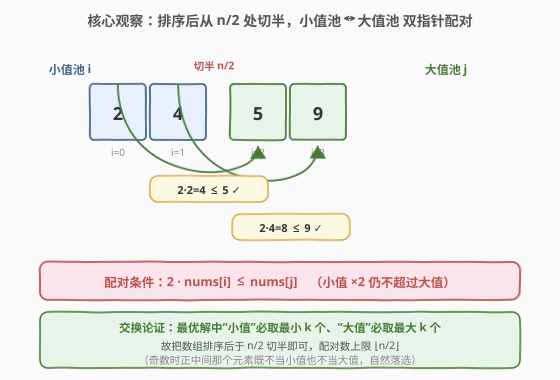

# LeetCode 求出最多标记下标 题解

## 1. 题目概述

- **标题 / 题号**：求出最多标记下标（#2576，medium）
- **链接**：https://leetcode.cn/problems/find-the-maximum-number-of-marked-indices/
- **难度**：中等
- **标签**：数组、双指针、贪心、排序

**题意**：给定下标从 $0$ 开始的整数数组 `nums`，长度为 $n$。一开始所有下标都未标记，可执行以下操作**任意次**：

- 选择两个**互不相同且未标记**的下标 $i$ 和 $j$，满足 $2 \times \text{nums}[i] \le \text{nums}[j]$，将 $i$ 和 $j$ **都标记**。

返回最多能标记的下标数目。

**示例 1**：

```text
输入：nums = [3,5,2,4]
输出：2
解释：选 i=2(nums[2]=2)、j=1(nums[1]=5)，2×2=4 ≤ 5，标记下标 2 和 1。无更多操作可做。
```

**示例 2**：

```text
输入：nums = [9,2,5,4]
输出：4
解释：先选 (i=3, j=0)：2×4=8 ≤ 9，标记 3、0；再选 (i=1, j=2)：2×2=4 ≤ 5，标记 1、2。全部标记。
```

**示例 3**：

```text
输入：nums = [7,6,8]
输出：0
解释：2×6=12 > 8，2×7=14 > 8，2×8=16 > 6/7，无任何可行操作。
```

**约束**：

- $1 \le n \le 10^5$
- $1 \le \text{nums}[i] \le 10^9$

> 💡 关键观察：一次操作要“成对”消耗两个元素——一个当“小值” $i$（被 $\times 2$ 的那个）、一个当“大值” $j$（作上界的那个）。要**最大化标记数**，等价于**最大化能配成的对数**。而配对的上界是 $\lfloor n/2 \rfloor$ 对（即 $2 \times \lfloor n/2 \rfloor$ 个下标）。把数组排序后，配对结构会自然显露：**小值应取最小的若干个、大值应取最大的若干个**，于是排序 + 双指针一趟贪心即可锁定答案。

## 2. 解题思路

### 2.1 暴力思路：枚举所有配对方案

最直白的写法：对 $n$ 个下标做“配对回溯”——每次挑一个未标记的 $i$，再挑一个未标记且满足 $2 \times \text{nums}[i] \le \text{nums}[j]$ 的 $j$，标记二者并递归，取所有方案的最大标记数。

```python
def maxNumOfMarkedIndices(nums):
    n = len(nums); used = [False]*n; best = 0
    def rec(start, count):
        nonlocal best
        best = max(best, count)
        for i in range(start, n):
            if used[i]: continue
            for j in range(i+1, n):
                if not used[j] and 2*nums[i] <= nums[j]:
                    used[i] = used[j] = True
                    rec(i+1, count+2)
                    used[i] = used[j] = False
    rec(0, 0)
    return best
```

问题：这是在所有“配对方案”上做指数级搜索，复杂度 $O(\text{配对方案数} \times n)$，方案数随 $n$ 爆炸式增长，$n = 10^5$ 完全不可行。需要挖掘结构，把“搜索”降为“贪心”。

### 2.2 核心观察：排序 + 切半配对，交换论证保证贪心最优



**关键直觉一：每对里必有一个“小值”和一个“大值”。** 配对条件 $2 \times \text{nums}[i] \le \text{nums}[j]$ 中，$\text{nums}[i]$ 是被翻倍的一方（小值），$\text{nums}[j]$ 是上界（大值）。由于翻倍后仍不超过对方，必有 $\text{nums}[i] \le \text{nums}[j]$，即**小值不大于大值**。所以每对天然是“小配大”。

**关键直觉二（交换论证）：存在一个最优解，其中所有“小值”取数组中最小的 $k$ 个、所有“大值”取最大的 $k$ 个。** 设某最优解里，小值集合 $S$ 中有一个元素 $x$、大值集合 $L$ 中有一个元素 $y$，但 $x > y$（即小值比某大值还大）。把 $x$ 与 $y$ 的角色互换：$y$ 当小值、$x$ 当大值。由于 $y < x$，$2y < 2x$，原来满足 $2x \le \text{伴侣}$，现在 $2y \le 2x \le \text{伴侣}$ 更宽松；而 $x$ 当大值比 $y$ 当大值更大，更易被满足。互换后仍可行且对数不变。反复交换直到“所有小值都不大于任何大值”，便得到一个“小值全在左半、大值全在右半”的最优解。

> 💡 由此推论：把数组**升序排序**后，最优配对的 $k$ 个小值必落在左半 $[0, n/2)$、$k$ 个大值必落在右半 $[n/2, n)$。配对数 $k \le \lfloor n/2 \rfloor$。于是只需在“左半当小值池、右半当大值池”上做一次双指针贪心。

**关键直觉三（双指针贪心）：左指针 $i$ 从 $0$ 起、右指针 $j$ 从 $n/2$ 起，对每个右值 $y = \text{nums}[j]$，若 $2 \times \text{nums}[i] \le y$ 就配成一对（$i{+}{+},\ j{+}{+}$），否则 $y$ 太小不够当大值、$j{+}{+}$ 换更大的。** 这是经典“尽量匹配最小可行”贪心：用最小的右值去满足最小的小值，把更大的右值留给后续可能更大的小值，保证不浪费。配满 $i$ 达到 $n/2$（小值池耗尽）即停。

> ⚠️ **必须有上界 $i < n/2$**：配对数上界是 $\lfloor n/2 \rfloor$，若不加约束让 $i$ 一直涨，奇数长度时会把“正中间那个元素”先当大值用过、又当小值再配一次，造成**重复标记**、返回超过真实可行的对数。详见第 5 节的“重复使用陷阱”。

### 2.3 算法流程图

![算法流程：排序 → i=0,j=n/2 → 判 2·nums[i]≤nums[j] → 是则标记 i++j++ans+=2 / 否则 j++ → 循环 → 返回 ans](../images/markedidx_flow.svg)

流程分四阶段：

1. **排序**：对 `nums` 升序排序；
2. **初始化**：`i = 0`（小值池指针，范围 $[0, n/2)$）、`j = n/2`（大值池指针，范围 $[n/2, n)$）、`ans = 0`；
3. **双指针扫描**：当 $i < n/2$ 且 $j < n$：
   - 若 $2 \times \text{nums}[i] \le \text{nums}[j]$：配对成功，`ans += 2`，`i += 1`，`j += 1`；
   - 否则：当前 $j$ 不够大，`j += 1` 找更大的大值；
4. **返回** `ans`。

> 💡 **为什么贪心不会“用错大值”？** 右值按升序扫描，遇到第一个满足 $2 \times \text{nums}[i] \le y$ 的 $y$ 就配。若改用更大的 $y'$ 配 $i$，则当前 $y$ 浪费、而后续小值只会更大更难配，得不偿失。故“用最小可行右值配当前最小小值”是最不浪费的策略，交换论证可严格证明其最优。

### 2.4 示例演算

![示例演算：[9,2,5,4] 排序后 [2,4,5,9] 全配成两对；[3,5,2,4] 排序后 [2,3,4,5] j 扫到尽头仍不够](../images/markedidx_walkthrough.svg)

以示例 2 `nums = [9,2,5,4]`、排序后 $[2,4,5,9]$、$n=4$、$n/2=2$ 为例：

| 步 | $i$ | $\text{nums}[i]$ | $j$ | $\text{nums}[j]$ | $2\times\text{nums}[i]\le\text{nums}[j]$? | 动作 | `ans` |
|----|-----|------------------|-----|------------------|-------------------------------------------|------|-------|
| ① | 0 | 2 | 2 | 5 | $4 \le 5$ ✓ | 标记 0、2，`i→1, j→3` | 2 |
| ② | 1 | 4 | 3 | 9 | $8 \le 9$ ✓ | 标记 1、3，`i→2 = n/2` 停 | 4 |

输出 `4`（全部标记）。

以示例 1 `nums = [3,5,2,4]`、排序后 $[2,3,4,5]$、$n/2=2$ 为例：

| 步 | $i$ | $\text{nums}[i]$ | $j$ | $\text{nums}[j]$ | $2\times\text{nums}[i]\le\text{nums}[j]$? | 动作 | `ans` |
|----|-----|------------------|-----|------------------|-------------------------------------------|------|-------|
| ① | 0 | 2 | 2 | 4 | $4 \le 4$ ✓ | 标记 0、2，`i→1, j→3` | 2 |
| ② | 1 | 3 | 3 | 5 | $6 \le 5$ ✗ | `j` 不够大，`j→4 = n` 停 | 2 |

输出 `2`（$j$ 扫到尽头仍找不到更大的大值，$3$ 落选）。

## 3. 参考代码

### C++（排序 + 双指针，$O(n\log n)$ / $O(\log n)$ 额外空间）

```cpp
class Solution {
public:
    int maxNumOfMarkedIndices(vector<int>& nums) {
        sort(nums.begin(), nums.end());
        int n = nums.size();
        int i = 0, j = n / 2, ans = 0;
        while (i < n / 2 && j < n) {       // i 锁在小值池 [0,n/2)，j 扫大值池 [n/2,n)
            if (2LL * nums[i] <= nums[j]) { // 小值×2 仍不超过大值 → 可配对
                ans += 2;
                ++i;
                ++j;
            } else {
                ++j;                       // 当前大值不够大，换更大的
            }
        }
        return ans;
    }
};
```

> 💡 用 `2LL * nums[i]` 是为防止 `2 * nums[i]` 在 32 位 `int` 上溢出：$\text{nums}[i] \le 10^9$，$2 \times 10^9 \approx 2.0\times 10^9$ 虽恰好不超 `INT_MAX`（$\approx 2.147\times 10^9$），但临界值极易因约束微调而越界，用 `long long` 中间量更稳妥。循环条件 `i < n/2` 是正确性的“保险丝”，缺之则奇数长度会重复标记（见第 5 节）。

### Python（排序 + 双指针，$O(n\log n)$ / $O(\log n)$ 额外空间）

```python
class Solution:
    def maxNumOfMarkedIndices(self, nums: List[int]) -> int:
        nums.sort()
        n = len(nums)
        i, j, ans = 0, n // 2, 0
        while i < n // 2 and j < n:        # i 锁在小值池 [0,n//2)，j 扫大值池 [n//2,n)
            if 2 * nums[i] <= nums[j]:     # 小值×2 仍不超过大值 → 可配对
                ans += 2
                i += 1
                j += 1
            else:
                j += 1                     # 当前大值不够大，换更大的
        return ans
```

> 💡 Python 大整数本就不溢出，但 `i < n // 2` 这条上界仍不可省——它保证小值池与大值池不相交，防止奇数长度时把中间元素既当大值又当小值重复计数。

## 4. 复杂度分析

| 维度 | 复杂度 | 说明 |
|------|--------|------|
| **时间复杂度** | $O(n\log n)$ | 排序主导 $O(n\log n)$；双指针 $i$、$j$ 各至多走 $n$ 步合计 $O(n)$ |
| **空间复杂度** | $O(\log n)$ 额外 | 排序的递归栈（库实现，如 `std::sort` 内省排序）；双指针仅 $O(1)$ 标量 |
| 对照：暴力回溯 | 指数级时间 | 在所有配对方案上搜索，$n=10^5$ 不可行 |

> 💡 $O(n\log n)$ 已是此题下界级别的做法：判断“哪些能配对”本质上需对值排序以暴露小/大结构，排序的 $\Omega(n\log n)$ 不可避免。双指针部分是线性的，不构成瓶颈。

## 5. 扩展：重复使用陷阱与等价的“切半方式”

### 5.1 奇数长度时的“重复标记”陷阱

把双指针写成“无上界”的简版，乍看自然却暗藏 bug：

```python
# ⚠️ 有 bug：缺少 i < n//2 上界
nums.sort()
n = len(nums); i = 0
for j in range(n // 2, n):        # j 从 n//2 起，但 i 无约束
    if 2 * nums[i] <= nums[j]:
        i += 1
return i * 2
```

以 `nums = [1,2,100,200,300]`（$n=5$，$n/2=2$）为例，排序后即原序：

- $j=2$：$2\times1=2 \le 100$ ✓ → $i=1$（用 $100$ 当大值配 $1$）
- $j=3$：$2\times2=4 \le 200$ ✓ → $i=2$（用 $200$ 当大值配 $2$）
- $j=4$：$2\times100=200 \le 300$ ✓ → $i=3$（**把 $100$ 又当小值**配 $300$）
- 返回 $3\times2=6$。

但真实答案只有 $4$（$5$ 个元素最多配 $2$ 对）：例如 $(1,200),(100,300)$ 或 $(1,100),(2,300)$。$100$ 在简版里被**既当大值又当小值**重复使用，导致多算一对。根因是奇数长度时，从 $n/2$ 起的大值池含 $\lceil n/2 \rceil$ 个元素，多于可配的 $\lfloor n/2 \rfloor$ 对，$i$ 会越界侵入大值池“回吃”已用元素。**加上 `i < n//2` 这条上界**即修复：$i$ 到 $n/2$ 就停，小值池与大值池严格不相交。

### 5.2 等价的“切半方式”：从 $(n+1)/2$ 起、无需上界

另一种写法把切点右移一位——大值池从 $(n+1)/2$（$\lceil n/2 \rceil$）起，**跳过正中间那个元素**，令大值池恰好含 $\lfloor n/2 \rfloor$ 个元素，于是 $i$ 自然被循环次数钳制、无需显式上界：

```python
nums.sort()
n = len(nums); i = 0
for j in range((n + 1) // 2, n):   # 大值池恰好 ⌊n/2⌋ 个，i 天然上界
    if 2 * nums[i] <= nums[j]:
        i += 1
return i * 2
```

它为何不劣于“从 $n/2$ 起”的版本？正中间元素若当大值参与配对，必是某小值 $x$ 满足 $2x \le \text{mid}$；但比 mid 更大的右值也满足 $2x \le \text{mid} \le \text{更大右值}$，故总能用更大的右值替代，**跳过 mid 不损任何配对**。两版对同一组数据给出相同的最优配对数。

> 💡 推广口诀：**配对型贪心要看清“两池是否不相交”**。凡是用两个指针在排序数组上代表“两类角色”（此处是小值/大值），务必确保两池大小之和 $\le n$、且配对数不超过 $\min(|\text{池}_1|,|\text{池}_2|)$ 的理论上界，否则极易写出“重复消费同一元素”的隐蔽 bug。

### 5.3 另一种视角：二分答案

也可把“配成 $k$ 对”视作单调谓词做二分：$k$ 对可行 $\Rightarrow$ 排序后检查 $2\times\text{nums}[i] \le \text{nums}[n-k+i]$ 是否对所有 $i \in [0,k)$ 成立（$k$ 个最小值配 $k$ 个最大值）。$k$ 越大越难满足，谓词关于 $k$ 单调递减，二分 $k \in [0, \lfloor n/2 \rfloor]$ 即可，单次检查 $O(k)$、总体 $O(n\log n)$。与双指针同阶但常数更大，仅作思路对照。

## 6. 面试要点

1. **为什么可以排序？排序不会改变答案吗？**

   > 不会。题目只关心“能标记多少个下标”，而标记条件 $2\times\text{nums}[i] \le \text{nums}[j]$ 只依赖**值的大小关系**，与下标在原数组中的位置无关。任何配对方案在原序与排序后都同样可行，故排序不改变最大配对数，却能暴露“小值/大值”的结构以便贪心。

2. **“小值取最小 $k$ 个、大值取最大 $k$ 个”这一结论怎么证？**

   > 交换论证。若某最优解中小值 $x$ 反而大于某大值 $y$（$x > y$），把二者角色互换：$y$ 当小值（$2y < 2x$ 更易满足）、$x$ 当大值（更大更易被满足），配对仍可行且对数不变。反复交换直到“所有小值 $\le$ 所有大值”，即得“小值全在左半、大值全在右半”的最优解。这是“排序 + 切半”贪心的理论根基。

3. **双指针为什么是“$j$ 从 $n/2$ 起”而不是从 $0$ 起？**

   > 从 $0$ 起会让 $i$、$j$ 落在同一池里，无法保证“小值/大值”两类角色不相交，易重复消费。从 $n/2$ 起是把数组切成“左半小值池 $[0,n/2)$、右半大值池 $[n/2,n)$”，两池不相交，每个指针只在自己池内移动，配对天然不重复。再叠加 $i < n/2$ 的上界，连奇数长度的“中间元素被双重计数”也一并防住。

4. **`2LL * nums[i]` 在 C++ 里为何要用 `long long`？`int` 不够吗？**

   > $\text{nums}[i] \le 10^9$，$2\times 10^9 = 2.0\times 10^9$ 恰在 `INT_MAX`（$\approx 2.147\times 10^9$）之下，理论够。但这是“贴着天花板”的临界值，约束稍有上浮即溢出、且溢出属有符号整数未定义行为难调试。用 `2LL` 把中间量提为 `long long`，安全裕度达 $\sim 9.2\times 10^{18}$，零成本消除风险。

5. **如果题目改成“每对只需 $i$ 被标记、$j$ 不标记”或“求最大对数而非标记数”，算法要变吗？**

   > 几乎不变。核心仍是“排序 + 切半双指针贪心”求最大配对数 $k$。若只标 $i$，答案即 $k$；若求最大对数，也是 $k$；若仍按原题标双方，答案是 $2k$。改动的只是最后“消费 $k$”的方式（乘 2 与否），配对的搜索逻辑完全一致。这正体现“最大匹配数”这一抽象的通用性。

> 💡 **一句话总结**：把数组排序后于 $n/2$ 切半——左半当小值池、右半当大值池，双指针一趟贪心配对，配成几对就标记 $2\times$几对；务必给 $i$ 套上 $< n/2$ 的上界，以防奇数长度时正中间元素被重复计数。$O(n\log n)$ 时间、$O(\log n)$ 额外空间搞定，是“排序 + 双指针贪心配对”的招牌模板。

## 同类练习题

| # | 题目 | 与本题的关联 |
|---|------|-------------|
| 881 | [救生艇](https://leetcode.cn/problems/boats-to-save-people/)（[题解](../0801-0900/881_救生艇.md)） | 同为“排序 + 双指针贪心配对”，每条船装两人且不超载——最轻者配最重者能省船，对照本题最小小值配最小可行大值以省大值 |
| 948 | [令牌放置](https://leetcode.cn/problems/bag-of-tokens/)（[题解](../0901-1000/948_令牌放置.md)） | 排序 + 双指针贪心，左右指针分别代表“用分数换令牌”与“用令牌换分数”，方向相反但同为排序后双端贪心配对 |
| 435 | [无重叠区间](https://leetcode.cn/problems/non-overlapping-intervals/)（[题解](../0401-0500/435_无重叠区间.md)） | 排序 + 贪心区间调度的范式题，按右端点贪心选不冲突区间，对照本题排序后按值贪心配对 |
| 45 | [跳跃游戏 II](https://leetcode.cn/problems/jump-game-ii/)（[题解](../0001-0100/45_跳跃游戏 II.md)） | 贪心维护“当前一跳能到”与“下一跳能到”两个边界指针，对照本题维护小值/大值两个指针推进，同为双指针贪心框架 |
