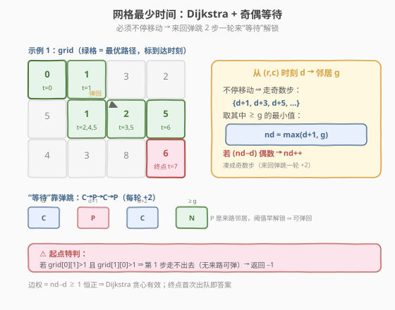
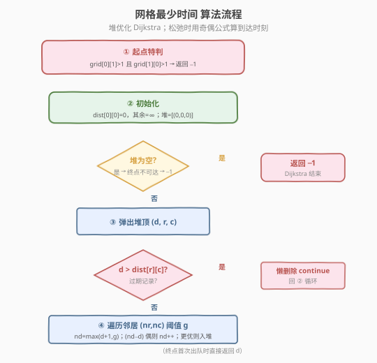
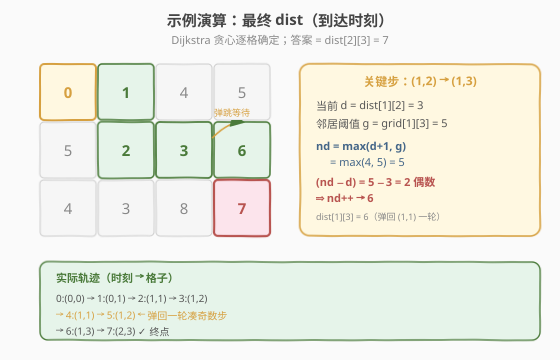

# 在网格图中访问一个格子的最少时间

- **题目名称**：在网格图中访问一个格子的最少时间
- **链接**：[2577. 在网格图中访问一个格子的最少时间](https://leetcode.cn/problems/minimum-time-to-visit-a-cell-in-a-grid/)
- **难度**：困难
- **标签**：图、最短路径、Dijkstra、堆/优先队列、贪心

## 1. 题目概述

给定 `m x n` 的非负矩阵 `grid`，`grid[row][col]` 表示**最早**能访问格子 `(row, col)` 的时刻——即到达它时已经经过的时间必须 $\geq \text{grid[row][col]}$。从**左上角** `(0,0)` 在时刻 `0` 出发，**必须一直移动**到上下左右相邻格子（不能停留），每次移动耗时 `1`。求**最早**到达右下角 `(m-1, n-1)` 的时刻；不可达返回 `-1`。

> ⚠️ 「必须一直移动」是本题的灵魂约束：当邻居阈值未解锁时，不能傻等，得靠**来回弹跳**消耗时间。

**示例 1**：

```text
输入：grid = [[0,1,3,2],[5,1,2,5],[4,3,8,6]]
输出：7
解释：0→(0,0) 1→(0,1) 2→(1,1) 3→(1,2) 4→(1,1) 5→(1,2) 6→(1,3) 7→(2,3)
      （在第 4、5 步来回弹回一次，把时刻从 3 拖到 6 才满足 grid[1][3]=5）
```

**示例 2**：

```text
输入：grid = [[0,2,4],[3,2,1],[1,0,4]]
输出：-1
解释：起点 (0,0) 时刻 0，第一步只能到 (0,1) 或 (1,0)，阈值分别是 2、3 均 >1，
      无法迈出第一步，故返回 -1。
```

**约束条件**：

- `2 <= m, n <= 1000`
- `4 <= m * n <= 10^5`
- `0 <= grid[i][j] <= 10^5`
- `grid[0][0] == 0`

---

## 2. 解题思路

### 2.1 暴力思路：BFS / 逐时刻模拟为何不行？

若把「时刻」当层数做 BFS，问题在于同一格子可在不同时刻被反复到达（弹跳让它时偶/时奇），且「能不能进」取决于阈值 `g`，是**带等待的最短路**而非等权 BFS——层数 ≠ 距离。若逐时刻模拟到某个上界，时刻值域可达约 `grid[i][j] + 2·mn`（边等边走），量级 $\sim 10^5 + 2\cdot10^5$ 勉强能枚举但每步要维护多状态、常数大、易错。

> ⚠️ 关键转化：本质是**边权不固定但恒为正**的单源最短路——每条边的权等于「到达时刻 − 出发时刻」，它 $\geq 1$。只要边权非负，**Dijkstra 的贪心假设就成立**：当前 `dist` 最小的格子，其最短到达时刻已被确定。

### 2.2 核心观察：Dijkstra + 奇偶等待公式



**模型**：`dist[r][c]` = 最早到达 `(r,c)` 的时刻，`dist[0][0]=0`。从 `(r,c)` 时刻 `d` 走向邻居 `(nr,nc)`（阈值 `g`）时，由于**只能走奇数步**（1、3、5…，每来回一轮 `+2`），可到达邻居的时刻集合为 $\{d+1,\ d+3,\ d+5,\dots\}$，取其中 $\geq g$ 的**最小值**即得：

$$
\text{nd} = \max(d+1,\ g),\qquad \text{若 }(\text{nd}-d)\text{ 为偶数则 } \text{nd} \mathrel{+}{=} 1
$$

> 💡 **为何奇数步？** 从当前格出发，走 1 步到邻居、走 3 步（弹回一次再到邻居）、走 5 步……都是奇数；偶数步只会把你送回当前格自身。所以到达邻居的时刻必须与 `d` **奇偶相异**，即 `nd - d` 为奇数。

**弹跳的可行性**：到达某格后，它一定有「来路邻居」`P`（最短路树上的父节点），而 `grid[P] ≤ dist[P] ≤ d-1 < d+1`，故可随时弹回 `P` 再回来，每轮稳定 `+2`。**唯一的例外是起点**——`(0,0)` 没有来路，若它两个邻居的阈值都 $>1$，则连第一步都迈不出去（无处可弹），直接返回 `-1`。

> ⚠️ 因此代码开头必须特判：`grid[0][1] > 1 && grid[1][0] > 1 → 返回 -1`。其余情形只要能迈出第一步，整张连通网格都能靠弹跳无限等待，必然可达终点。

### 2.3 算法流程图



### 2.4 示例演算

以示例 1 为例，Dijkstra 逐格确定 `dist`，最终矩阵（到达时刻）如下；关键步是 `(1,2)→(1,3)`：`d=3, g=5`，`nd=max(4,5)=5`，而 `5-3=2` 为偶数故 `nd=6`，即在 `(1,2)` 与 `(1,1)` 间弹回一轮。



| 步骤 | 弹出 `(d, r, c)` | 松弛邻居（nd 计算） | dist 更新 |
|------|------------------|---------------------|----------|
| 1 | `(0,0,0)` | `(0,1)`:max(1,1)=1 奇→1；`(1,0)`:max(1,5)=5 奇→5 | `dist[0][1]=1` |
| 2 | `(1,0,1)` | `(1,1)`:max(2,1)=2 奇→2；`(0,2)`:max(2,3)=3 偶→4 | `dist[1][1]=2` |
| 3 | `(2,1,1)` | `(1,2)`:max(3,2)=3 奇→3；`(2,1)`:max(3,3)=3 奇→3 | `dist[1][2]=3` |
| 4 | `(3,1,2)` | `(1,3)`:max(4,5)=5 **偶→6**；`(2,2)`:max(4,8)=8 奇→8 | `dist[1][3]=6` |
| …  | …                | …                   | …        |
| 末 | `(6,1,3)` | `(2,3)`:max(7,6)=7 奇→7 | **`dist[2][3]=7` 命中终点** |

堆以 `(7,2,3)` 弹出即返回 `7`。

---

## 3. 参考代码

### C++

```cpp
class Solution {
  public:
    int minimumTime(vector<vector<int>>& grid) {
        int m = grid.size(), n = grid[0].size();
        // 起点特判：两个邻居阈值都 >1 则连第一步都迈不出
        if (grid[0][1] > 1 && grid[1][0] > 1) return -1;

        const int INF = INT_MAX / 2;
        vector<vector<int>> dist(m, vector<int>(n, INF));
        dist[0][0] = 0;

        // 最小堆：(时刻, r, c)
        priority_queue<tuple<int,int,int>, vector<tuple<int,int,int>>, greater<>> pq;
        pq.push({0, 0, 0});

        int dirs[4][2] = {{1,0},{-1,0},{0,1},{0,-1}};
        while (!pq.empty()) {
            auto [d, r, c] = pq.top(); pq.pop();
            if (d > dist[r][c]) continue;          // 懒删除：旧记录已失效
            if (r == m - 1 && c == n - 1) return d; // 终点首次出队即最短
            for (auto& dt : dirs) {
                int nr = r + dt[0], nc = c + dt[1];
                if (nr < 0 || nr >= m || nc < 0 || nc >= n) continue;
                int g = grid[nr][nc];
                int nd = max(d + 1, g);
                if ((nd - d) % 2 == 0) nd++;       // 凑成奇数步
                if (nd < dist[nr][nc]) {
                    dist[nr][nc] = nd;
                    pq.push({nd, nr, nc});
                }
            }
        }
        return -1; // 理论上经起点特判后不会走到这里
    }
};
```

### Python

```python
class Solution:
    def minimumTime(self, grid: List[List[int]]) -> int:
        m, n = len(grid), len(grid[0])
        # 起点特判：两个邻居阈值都 >1 则连第一步都迈不出
        if grid[0][1] > 1 and grid[1][0] > 1:
            return -1

        INF = float('inf')
        dist = [[INF] * n for _ in range(m)]
        dist[0][0] = 0

        pq = [(0, 0, 0)]  # 最小堆：(时刻, r, c)
        dirs = [(1, 0), (-1, 0), (0, 1), (0, -1)]
        while pq:
            d, r, c = heapq.heappop(pq)
            if d > dist[r][c]:          # 懒删除：旧记录已失效
                continue
            if r == m - 1 and c == n - 1:
                return d                 # 终点首次出队即最短
            for dr, dc in dirs:
                nr, nc = r + dr, c + dc
                if 0 <= nr < m and 0 <= nc < n:
                    g = grid[nr][nc]
                    nd = max(d + 1, g)
                    if (nd - d) % 2 == 0:
                        nd += 1           # 凑成奇数步
                    if nd < dist[nr][nc]:
                        dist[nr][nc] = nd
                        heapq.heappush(pq, (nd, nr, nc))
        return -1
```

> 💡 **两点工程细节**：①「懒删除」——堆里同一格可能有多条过期记录，弹出时 `d > dist[r][c]` 直接跳过，无需真删；②「终点首次出队即返回」——Dijkstra 按时刻单调弹出，第一次见到终点 `d` 即为答案，省去扫全表。

---

## 4. 复杂度分析

| 维度 | 复杂度 | 说明 |
|------|--------|------|
| 时间复杂度 | $O(mn \log(mn))$ | 格子数 $V=mn$、边数 $E\leq 4mn$，每条边至多松弛入堆一次，堆操作 $O(\log V)$ |
| 空间复杂度 | $O(mn)$ | `dist` 矩阵与堆（堆最坏 $O(E)=O(mn)$） |

> ⚠️ 本题 $mn \leq 10^5$，$O(mn\log mn)\approx 10^5\times 17\approx 1.7\times 10^6$，远低于时限。边权 $nd-d\geq 1$ 恒正，是 Dijkstra 贪心有效的根本保证。

---

## 5. 扩展：为何不能去掉奇偶修正？

若把到达时刻直接取 `max(d+1, g)` 不做奇偶修正，会得到一个**偶数步到达邻居**的伪解——而偶数步对应的物理位置是「回到当前格自身」，不可能站在邻居。例如 `(1,2)` 时刻 3 想去 `(1,3)` 阈值 5：朴素得 5，但 5-3=2 步会把你送回 `(1,2)` 自身而非 `(1,3)`；必须再走一步到 6（实际是 3→4 回 `(1,1)`→5 回 `(1,2)`→6 到 `(1,3)`）。奇偶修正 $\text{nd}\mathrel{+}{=}1$ 本质就是补这一步。

- **如果边权可变/带负权**：Dijkstra 失效，需换 Bellman-Ford；本题边权恒正无需考虑。
- **如果允许原地停留**：则退化为普通 Dijkstra，边权恒为 $\max(d+1,g)-(d)$，无需奇偶修正——本题正是用「弹跳」把「停留」模拟成奇数步。

---

## 6. 面试要点

1. **为什么这题是 Dijkstra 而不是 BFS？**

   - BFS 把层数当距离，只适用于等权图；本题「能否进入邻居」取决于阈值 `g`，等价于边权随时间变化的正权最短路，需让**当前到达时刻最小**的格子优先处理，这正是 Dijkstra 的堆优化。

2. **奇偶修正 `(nd-d)%2==0 → nd++` 的依据是什么？**

   - 从当前格走到**相邻**格必须走奇数步（1、3、5…），偶数步只能回到自身。`nd-d` 为偶意味着落到自身而非邻居，故补 1 步使之奇。等价于「取 $\{d+1,d+3,\dots\}$ 中 $\geq g$ 的最小值」。

3. **为什么弹跳等待总是可行？什么时候不行？**

   - 到达某格后必有「来路邻居」`P`，且 `grid[P] ≤ dist[P] ≤ d-1 < d+1`，可随时弹回再回来，每轮 `+2`。**唯一例外是起点**：它无来路，若两个邻居阈值都 `>1` 则第一步都迈不出 → 返回 `-1`，故需开头特判。

4. **起点特判 `grid[0][1]>1 && grid[1][0]>1` 是否充分？**

   - 充分。只要能迈出第一步，整张连通网格靠弹跳可无限等待、阈值迟早满足，必然可达终点；不能迈出第一步则一定 `-1`。该特判恰好覆盖全部 `-1` 情形（也省去了 Dijkstra 自然判 `-1` 时公式对起点的误判）。

5. **懒删除与终点提前返回为什么对？**

   - 懒删除：堆里同一格的旧记录被更小的 `dist` 取代后仍残留，弹出时 `d > dist[r][c]` 跳过即可，仍是 $O(E\log V)$。终点提前返回：Dijkstra 按时刻单调出队，首次弹出终点时 `d` 即最短，直接返回省时。

6. **复杂度与数据范围是否安全？**

   - $mn\leq 10^5$，$O(mn\log mn)\approx 1.7\times 10^6$；`dist` 矩阵与堆均 $O(mn)$ 空间，内存约数 MB，安全。

---

## 7. 同类练习题

- [743. 网络延迟时间](https://leetcode.cn/problems/network-delay-time/)：堆优化 Dijkstra 单源最短路母题，本题的算法骨架
- [1631. 最小体力消耗路径](https://leetcode.cn/problems/path-with-minimum-effort/)：网格 Dijkstra 变体，路径代价定义为边上最大权差
- [1976. 到达目的地的方案数](https://leetcode.cn/problems/number-of-ways-to-arrive-destination/)：Dijkstra 求最短路 + 统计最短路条数
- [2290. 到达角落需要移除障碍物的最小数量](https://leetcode.cn/problems/minimum-obstacle-removal-to-reach-corner/)：0-1 BFS / Dijkstra，边权 0 或 1 的网格最短路
- [1928. 规定时间内到达终点的最小花费](https://leetcode.cn/problems/minimum-cost-to-reach-destination-in-time/)：带时间维度的分层 Dijkstra，与本题「时刻即状态」思想相通
