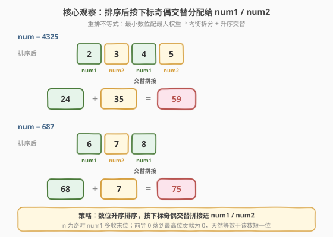
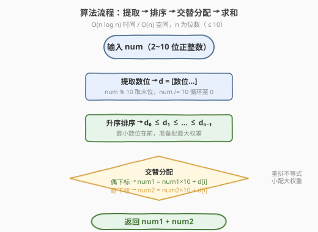
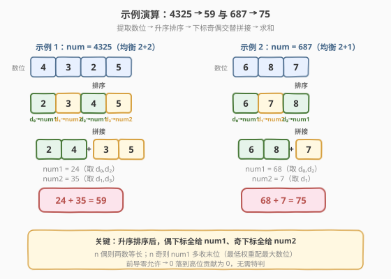

# LeetCode 最小和分割 题解

## 1. 题目概述

- **标题 / 题号**：最小和分割（#2578，easy）
- **链接**：https://leetcode.cn/problems/split-with-minimum-sum/
- **难度**：简单
- **标签**：贪心、排序、数学

**题意**：给你一个正整数 `num`，请你将它分割成两个非负整数 `num1` 和 `num2`，满足：

- `num1` 和 `num2` 直接连起来，得到 `num` 各数位的一个 **排列**（即两数中所有数字出现次数之和等于 `num` 中所有数字出现次数）；
- `num1` 和 `num2` **可以包含前导 0**；
- 数位顺序可与 `num` 中顺序不同。

返回 `num1 + num2` 可取得的**最小**值。

**注意**：`num` 保证没有前导 0。

**示例 1**：

```text
输入：num = 4325
输出：59
解释：分割为 num1 = 24、num2 = 35，和为 59，是最小值。
```

**示例 2**：

```text
输入：num = 687
输出：75
解释：分割为 num1 = 68、num2 = 7，和为 75，是最优值。
```

**约束**：

- $10 \le \text{num} \le 10^9$（即 `num` 有 $2 \sim 10$ 位十进制数字，且无前导 0）

> 💡 题眼一句话：**所有数位必须用上、分成两个数、求和最小**。和最小 ↔ 两个数都尽量小 ↔ 小数字放高位、两数位数尽量均衡。把这两点想清楚，答案就剩「排序 + 交替拼接」两步。

## 2. 解题思路

### 2.1 暴力思路：枚举所有排列与切分点

最直白的做法：提取 `num` 的全部数位，枚举这些数位的**所有排列**，再枚举一个**切分点**把排列切成前段（num1）与后段（num2），计算每种方案的和取最小。

- $n$ 位数共有 $n!$ 种排列，每种又有 $n-1$ 个切分点，共 $n! \cdot (n-1)$ 种方案；
- $n = 10$ 时约 $3.6 \times 10^7$ 种，勉强可过但已逼近时限，且**没有利用任何结构**——既不优雅也难推广。

> 💡 暴力能过不等于会做。我们需要回答两个问题：① 两个数各占几位最优？② 每个数位该放到哪个位置（哪个数的哪一位）？

### 2.2 核心观察：均衡拆分 + 升序交替分配



把问题写成「加权和」：每个数位 $d$ 被放到某一位，对总和贡献 $d \times 10^k$（$10^k$ 为该位的权重）。于是

$$
\text{num1} + \text{num2} = \sum_{\text{所有位}} d_i \times w_i, \qquad w_i \in \{\,10^k \mid \text{num1/num2 的各位权重}\,\}.
$$

**最小化和** $\Leftrightarrow$ **最小数位配最大权重**（重排不等式）。由此导出两条结论：

**观察一：两个数的位数应尽量均衡（差不超过 1）。**

设两数位数分别为 $L_1, L_2$（$L_1 + L_2 = n$）。最大的权重是 $10^{\max(L_1,L_2)-1}$，它要配最小的数位 $d_0 \ge 0$。要让这个「最大权重」尽量小，就得让 $\max(L_1, L_2)$ 尽量小，即 **$L_1, L_2$ 均衡**：$L_1 = \lceil n/2 \rceil$、$L_2 = \lfloor n/2 \rfloor$。

> ⚠️ 为什么不能让一个数特别长？长出的一位权重是 $10^{L_{\text{长}}-1}$，远大于把它让给短数后新增的低位权重 $10^{L_{\text{短}}}$（因为非均衡时 $L_{\text{短}} \le L_{\text{长}}-2$，故 $10^{L_{\text{短}}} \le 10^{L_{\text{长}}-2} \ll 10^{L_{\text{长}}-1}$）。把高位稀释成更多低位，能压低总代价——这正是 2160「2+2 优于 1+3」同一道理在 $n$ 位下的推广。

**观察二：升序排序后，按下标奇偶交替分配。**

确定均衡拆分后，把数位升序排序为 $d_0 \le d_1 \le \cdots \le d_{n-1}$。均衡拆分下，两个数的权重集合降序排列恰好是

$$
10^{\lceil n/2\rceil-1},\; 10^{\lfloor n/2\rfloor-1},\; 10^{\lceil n/2\rceil-2},\; 10^{\lfloor n/2\rfloor-2},\; \ldots
$$

按重排不等式，这串**最大权重先配最小数位**，即 $d_0$ 配第一个（num1 最高位）、$d_1$ 配第二个（num2 最高位）、$d_2$ 配第三个（num1 次高位）、$d_3$ 配第四个（num2 次高位）…… 这正是**按下标奇偶交替分配**：偶下标 $\to$ num1，奇下标 $\to$ num2。$n$ 为奇时 num1 多收末位 $d_{n-1}$（最小的剩位配最低权重）。

> 💡 **前导零的处理**：`num` 本身无前导 0，但 $0$ 可能出现在中间/末尾。升序后 $0$ 落到 $d_0, d_1$ 这种最小位，被分到两数最高位——而前导零允许，权重 $10^{k}$ 上挂 $0$ 贡献为 $0$，自动等价于「该数短一位」。所以无需对 $0$ 特判，策略天然覆盖。

### 2.3 算法流程图



三步走：

1. **提取数位**：`num % 10` 取末位、`num //= 10` 循环至 $0$，得到 $n$ 个数位；
2. **升序排序**：得 $d_0 \le d_1 \le \cdots \le d_{n-1}$；
3. **交替拼接**：从 $i=0$ 起，`i` 偶则 `num1 = num1*10 + d[i]`，`i` 奇则 `num2 = num2*10 + d[i]`；
4. 返回 `num1 + num2`。

### 2.4 示例演算



**示例 1：`num = 4325`**（$n=4$，均衡 $2+2$）

- 提取数位：`[4, 3, 2, 5]`
- 升序排序：`[2, 3, 4, 5]` → $d_0{=}2, d_1{=}3, d_2{=}4, d_3{=}5$
- 交替分配：num1 取 $d_0, d_2$ → `24`；num2 取 $d_1, d_3$ → `35`
- 最小和：$24 + 35 = 59$ ✓

**示例 2：`num = 687`**（$n=3$，均衡 $2+1$）

- 提取数位：`[6, 8, 7]`
- 升序排序：`[6, 7, 8]` → $d_0{=}6, d_1{=}7, d_2{=}8$
- 交替分配：num1 取 $d_0, d_2$ → `68`；num2 取 $d_1$ → `7`
- 最小和：$68 + 7 = 75$ ✓

> 💡 注意 $n$ 奇时 num1 多一位——因为它承担「最高位」$10^{\lceil n/2\rceil-1}$，而该权重恰好配最小的 $d_0$；末位 $d_{n-1}$（最大数位）配最低权重 $10^0$，落到 num1 末位。整体仍满足「最小配最大权重」。

## 3. 参考代码

### C++（字符串排序 + 交替拼接，$O(n \log n)$ / $O(n)$）

```cpp
class Solution {
public:
    int splitNum(int num) {
        string s = to_string(num);
        sort(s.begin(), s.end());
        int num1 = 0, num2 = 0;
        for (int i = 0; i < (int)s.size(); ++i) {
            if (i % 2 == 0) num1 = num1 * 10 + (s[i] - '0');
            else            num2 = num2 * 10 + (s[i] - '0');
        }
        return num1 + num2;
    }
};
```

### Python（排序 + 交替拼接）

```python
class Solution:
    def splitNum(self, num: int) -> int:
        d = sorted(str(num))
        a = b = 0
        for i, c in enumerate(d):
            if i % 2 == 0:
                a = a * 10 + int(c)
            else:
                b = b * 10 + int(c)
        return a + b
```

### Python（算术取位版，避免字符串转换）

```python
class Solution:
    def splitNum(self, num: int) -> int:
        d = []
        while num > 0:
            d.append(num % 10)
            num //= 10
        d.sort()
        a = b = 0
        for i, v in enumerate(d):
            if i % 2 == 0:
                a = a * 10 + v
            else:
                b = b * 10 + v
        return a + b
```

> ⚠️ Python 整除用 `//`，`/` 得浮点会使后续 `*10 +` 出错。`while num > 0` 对 $n \ge 10$ 恒成立，无需担心空数组。

## 4. 复杂度分析

| 维度 | 复杂度 | 说明 |
|------|--------|------|
| **时间复杂度** | $O(n \log n)$ | 提取 $O(n)$、排序 $O(n \log n)$、交替拼接 $O(n)$，排序主导；$n \le 10$，常数级 |
| **空间复杂度** | $O(n)$ | 存 $n$ 个数位的数组（字符串或 list），$n \le 10$ |
| 对照：计数排序版 | $O(n)$ 时间 / $O(1)$ 空间 | 数位只有 $0\sim9$，可用长度 10 的桶计数后按值输出，见第 5 节 |

> 💡 $n \le 10$ 时三种写法实测无差别；本解强调「排序 + 交替分配」这一**重排不等式**洞察，是推广到任意 $n$ 的关键。

## 5. 扩展：计数排序 $O(n)$ 与最优性证明

**计数排序版。** 数位取值仅 $0\sim9$，可省去通用排序，用长度 10 的桶统计各数字出现次数，再从小到大依次「交替分给 num1/num2」。时间 $O(n)$、空间 $O(1)$：

```python
class Solution:
    def splitNum(self, num: int) -> int:
        cnt = [0] * 10
        while num > 0:
            cnt[num % 10] += 1
            num //= 10
        a = b = 0
        turn = 0                       # 0 -> num1, 1 -> num2
        for v in range(10):
            for _ in range(cnt[v]):
                if turn == 0:
                    a = a * 10 + v
                else:
                    b = b * 10 + v
                turn ^= 1
        return a + b
```

**最优性证明（重排不等式）。** 设数位升序 $d_0 \le \cdots \le d_{n-1}$。对任意拆分 $(L_1, L_2)$，权重集合 $W$ 升序排列后，由重排不等式最小和 $= \sum d_i \uparrow \cdot w_i \downarrow$（小配大）。把所有可能拆分的 $W$（降序）逐位比较：均衡拆分 $L_1{=}\lceil n/2\rceil, L_2{=}\lfloor n/2\rfloor$ 的 $W$ 在每一位都 $\le$ 非均衡拆分（把长数的高位权重 $10^{L-1}$ 让给短数变成 $10^{L'}$，$L' \le L-2$ 故严格变小），而 $d_i \ge 0$，故均衡拆分在和上逐项不增。综上「均衡拆分 + 升序交替」即全局最优。

> ⚠️ 注意与 [2160](../2101-2200/2160_拆分数位后四位数字的最小和.md) 的关系：2160 是 $n=4$ 的特例（固定 $2+2$ 拆两个两位数），2578 把 $n$ 放宽到 $2\sim10$ 并允许任意位数组合，但最优结构仍是「均衡 + 升序交替」，2160 的公式 $10(d_0{+}d_1){+}(d_2{+}d_3)$ 正是 $n=4$ 时的同一结论。

## 6. 面试要点

1. **为什么两个数的位数要均衡？**

   > 和是加权和 $\sum d_i w_i$，最大权重 $10^{\max(L_1,L_2)-1}$ 配最小数位。让 $\max(L_1,L_2)$ 最小即均衡拆分，能把最高权重压到最低。非均衡会让某数多出一位权重 $10^{L-1}$，远超把它让给对方后新增的低位权重 $10^{L'}$（$L' \le L-2$）。

2. **为什么是「升序 + 交替」而不是别的分配？**

   > 重排不等式：最小化和 $\Leftrightarrow$ 升序数位配降序权重。均衡拆分下两数权重降序恰好交错排列，配升序数位后等价于「偶下标给 num1、奇下标给 num2」的交替分配。

3. **前导零允许起了什么作用？**

   > 升序后 $0$ 落到 $d_0, d_1$，被分到两数最高位，权重上挂 $0$ 贡献 $0$，自动等价于该数短一位。无需特判，策略天然覆盖含 $0$ 的输入（如 `4009` 风格的输入）。

4. **$n$ 为奇时 num1 多一位，这公平吗？**

   > 公平。num1 多出的那一位是**最低权重** $10^0$（末位），配的是**最大数位** $d_{n-1}$；而 num1 最高位配的是最小数位 $d_0$。整体仍严格满足「小配大权重」。

5. **能否不用排序？**

   > 可以。数位仅 $0\sim9$，用长度 10 的桶做计数排序即可 $O(n)$。但 $n \le 10$ 时通用 `sort` 已是 $O(1)$，代码更简。面试中重点是讲清「均衡 + 重排不等式」的洞察，写哪种都行。

> 💡 **一句话总结**：数位升序排序，按下标奇偶交替拼接进 num1 / num2，求和即最小值。本质是「重排不等式：最小数位配最大权重」在「均衡拆分」下的具体形态。

## 同类练习题

| # | 题目 | 与本题的关联 |
|---|------|-------------|
| 2160 | [拆分数位后四位数字的最小和](https://leetcode.cn/problems/minimum-sum-of-four-digit-number-after-splitting-digits/)（[题解](../2101-2200/2160_拆分数位后四位数字的最小和.md)） | 本题 $n=4$ 的特例，固定 $2+2$ 拆两个两位数，公式 $10(d_0{+}d_1){+}(d_2{+}d_3)$ 即「均衡 + 交替」的退化 |
| 561 | [数组拆分](https://leetcode.cn/problems/array-partition/)（[题解](../0501-0600/561_数组拆分.md)） | 排序后相邻配对求和**最大**，与本题「排序后交替配对求和最小」是重排不等式的正反两面 |
| 2544 | [交替数字和](https://leetcode.cn/problems/alternating-digit-sum/)（[题解](../2501-2600/2544_交替数字和.md)） | 同为数位操作题，`% 10` / `/ 10` 取位手法一脉相承 |
| 2562 | [找出数组的串联值](https://leetcode.cn/problems/find-the-array-concatenation-value/)（[题解](../2501-2600/2562_找出数组的串联值.md)） | 数位 / 数字的「拼接成新数」操作母题，承接本题 `num1*10 + d` 的拼接手法 |
| 2162 | [设置时间的最少代价](https://leetcode.cn/problems/minimum-cost-to-set-cooking-time/)（[题解](../2101-2200/2162_设置时间的最少代价.md)） | 数位拆分与重组在模拟题中的应用，思路相通 |
