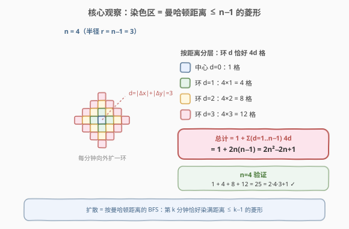
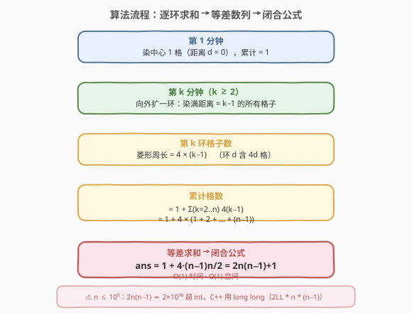
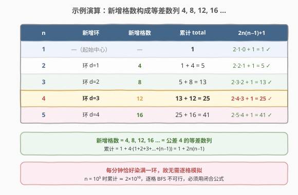

# 统计染色格子数

- **题目名称**：统计染色格子数
- **链接**：[2579. 统计染色格子数](https://leetcode.cn/problems/count-total-number-of-colored-cells/)
- **难度**：中等
- **标签**：数学、广度优先搜索

## 1. 题目概述

有一个无穷大的二维网格图，一开始所有格子都未染色。给你一个正整数 `n`，表示执行以下步骤 `n` 分钟：

- **第一分钟**，将**任一**格子染成蓝色；
- **之后的每一分钟**，将与蓝色格子相邻的**所有**未染色格子染成蓝色。

> 💡 「相邻」指四连通（上 / 下 / 左 / 右），不包含对角。这一条决定了扩散的「度量」是**曼哈顿距离**，从而染色区天然长成菱形。

**示例 1**：

```text
输入：n = 1
输出：1
解释：1 分钟后，只有 1 个蓝色格子，返回 1。
```

**示例 2**：

```text
输入：n = 2
输出：5
解释：2 分钟后，4 个边缘格子 + 1 个中心格子 = 5。
```

**示例 3**：

```text
输入：n = 3
输出：13
```

**约束条件**：

- $1 \le n \le 10^5$

> ⚠️ $n$ 可达 $10^5$，最终格子数 $2n(n-1)+1 \approx 2\times 10^{10}$。任何「逐格记录」的模拟（开哈希集 / 二维数组）都会在内存与时间上同时爆炸——必须从**几何结构**切入，直接闭合计数。

---

## 2. 解题思路

### 2.1 暴力思路：逐分钟 BFS 模拟

最直白的做法：用一个集合维护「已染色格子」，第 1 分钟放入起点；之后每分钟取出当前所有蓝格，把其 4 个未染色邻居加入集合，重复 $n$ 轮，返回集合大小。

```text
seen = {(0,0)}
for minute in 2..n:
    frontier = 所有 seen 中格子
    for cell in frontier:
        for nb in cell 的 4 邻居:
            seen.add(nb)
return len(seen)
```

问题：

1. **空间爆炸**：$n=10^5$ 时 `seen` 需存约 $2\times 10^{10}$ 个坐标，远超任何内存限制；
2. **时间爆炸**：每轮都要遍历当前全部蓝格，累计工作量 $O(2n^2) \approx 2\times 10^{10}$ 次，必超时；
3. **重复劳动**：同一格子的邻居被反复扫描，但「该不该染」其实由它离起点的距离唯一决定。

> 💡 暴力法的浪费在于：它关心「**哪些**格子被染」，而题目只要「**多少**格子被染」。染色的形状是确定且高度对称的——只要认清形状，就不必逐格模拟。

### 2.2 核心观察：染色区是曼哈顿距离 ≤ n−1 的菱形



**扩散 = 按曼哈顿距离的 BFS。** 因为「相邻」是四连通，走一步曼哈顿距离恰好变化 $1$。所以：

> 第 $k$ 分钟结束时，**恰被染满**曼哈顿距离 $\le k-1$ 的所有格子，且只染这些。

用归纳证一句：第 1 分钟染满距离 $\le 0$ 的格子（即中心）；若第 $k$ 分钟染满距离 $\le k-1$，则第 $k+1$ 分钟会把这些格子所有未染色的四邻居染色，而每个距离 $=k$ 的格子都存在一个距离 $=k-1$ 的邻居（朝中心走一步），于是恰好染满距离 $\le k$ 的菱形。

**菱形 = 同心环叠加。** 到第 $n$ 分钟，染色区是半径 $r = n-1$ 的菱形。按到中心的曼哈顿距离 $d$ 分环：

| 环 $d$ | 该环格子数 | 说明 |
|--------|-----------|------|
| $0$（中心） | $1$ | 单个起点 |
| $1$ | $4\times1 = 4$ | 上下左右四格 |
| $2$ | $4\times2 = 8$ | 再外一圈 |
| $d$ | $4d$ | 菱形周界：四条边各 $d$ 格、去重四个顶点后 $4d$ |

于是总数为

$$\text{ans} = 1 + \sum_{d=1}^{n-1} 4d = 1 + 4 \cdot \frac{(n-1)n}{2} = 1 + 2n(n-1) = 2n^2 - 2n + 1.$$

> 💡 **为什么环 $d$ 恰好 $4d$ 格？** 把曼哈顿距离 $=d$ 的格点排开，恰是菱形的周界。从中心向上走 $d$ 步到「上顶点」，顺时针绕一周：右上边 $d$ 格、右下边 $d$ 格、左下边 $d$ 格、左上边 $d$ 格，四段各 $d$ 共 $4d$，四顶点不重复计入相邻两段交点（每顶点只算一次），合计 $4d$。

> ⚠️ **每分钟染满「一整环」而非零散几格**，是本题能闭合求和的命门。这正是因为「相邻 = 四连通」让扩散严格按曼哈顿距离分层；若改成八连通，度量会变成切比雪夫距离，形状变正方形、环的格数公式也随之改变。

### 2.3 算法流程图



流程把「逐分钟扩一环」折叠成「等差数列求和」，一步到位：

1. **第 1 分钟**：染中心 $1$ 格，累计 $= 1$；
2. **第 $k$ 分钟（$k\ge2$）**：向外扩一环，染距离 $= k-1$ 的格子，该环 $= 4(k-1)$ 格；
3. **累计** $= 1 + \sum_{k=2}^{n} 4(k-1) = 1 + 4\cdot(1+2+\cdots+(n-1))$；
4. **等差求和** $= 1 + 4\cdot\dfrac{(n-1)n}{2} = 2n(n-1)+1$。

> 💡 中间那步把「$\sum 4(k-1)$」认成「公差为 $4$ 的等差数列」是关键跳跃：环 $d=1,2,3,\ldots$ 的格数 $4,8,12,\ldots$ 正是首项 $4$、公差 $4$ 的等差数列，套等差求和公式即得闭合形式，省去 $O(n)$ 的循环累加。

### 2.4 示例演算



| $n$ | 新增环 | 新增格数 | 累计 total | $2n(n-1)+1$ 验证 |
|-----|--------|----------|-----------|------------------|
| $1$ | —（起始中心） | — | $1$ | $2\cdot1\cdot0+1=1$ ✓ |
| $2$ | 环 $d=1$ | $4$ | $1+4=5$ | $2\cdot2\cdot1+1=5$ ✓ |
| $3$ | 环 $d=2$ | $8$ | $5+8=13$ | $2\cdot3\cdot2+1=13$ ✓ |
| $4$ | 环 $d=3$ | $12$ | $13+12=25$ | $2\cdot4\cdot3+1=25$ ✓ |
| $5$ | 环 $d=4$ | $16$ | $25+16=41$ | $2\cdot5\cdot4+1=41$ ✓ |

- **$n=4$**：与 2.2 节概念图一致，菱形含 4 个色环（中心 $1$ + 环 $1,2,3$ 各 $4,8,12$），$1+4+8+12=25$。
- **观察新增列**：$4,8,12,16,\ldots$ 是首项 $4$、公差 $4$ 的等差数列，前 $n-1$ 项和 $=4\cdot\dfrac{(n-1)n}{2}=2n(n-1)$，加中心 $1$ 即答案。

> 💡 也可从「累计列」反推递推式：$T_n = T_{n-1} + 4(n-1)$，$T_1=1$。这正是等差数列前缀和的递推形式，闭合后即 $2n(n-1)+1$。

---

## 3. 参考代码

### C++（闭合公式，$O(1)$ / $O(1)$）

```cpp
class Solution {
public:
    long long coloredCells(int n) {
        return 2LL * n * (n - 1) + 1;
    }
};
```

> 💡 **必须用 `long long`**：$n \le 10^5$ 时 $2n(n-1) \approx 2\times 10^{10}$，超过 `int` 上界 $2^{31}-1 \approx 2.15\times 10^9$。写 `2LL * n * (n - 1)` 让字面量 `2LL` 把整个表达式提升为 64 位运算；若写成 `2 * n * (n - 1)`，前两个 `int` 相乘即溢出。返回类型题目也定为 `long long`。

### Python（闭合公式，$O(1)$ / $O(1)$）

```python
class Solution:
    def coloredCells(self, n: int) -> int:
        return 2 * n * (n - 1) + 1
```

> 💡 Python 整数任意精度，无溢出之忧。公式即「环和等差求和 + 中心 1」，$O(1)$ 一步出解。

---

## 4. 复杂度分析

| 维度 | 复杂度 | 说明 |
|------|--------|------|
| 时间复杂度 | $O(1)$ | 一次乘法 + 一次加法，与 $n$ 无关；摒弃逐格 / 逐环模拟的 $O(n)$ 或 $O(n^2)$ |
| 空间复杂度 | $O(1)$ | 仅一个返回值，不开集合 / 网格 |

> 💡 **降维路径**：逐格 BFS 是 $O(n^2)$（染满 $2n^2$ 级格子）→ 逐环累加是 $O(n)$（$n$ 个环求和）→ 等差求和闭合是 $O(1)$。每一步都靠「认清结构、放弃细节」省一个量级：先放弃「哪些格」只留「多少格」（$O(n^2)\to O(n)$），再放弃「逐环」改用「等差前 $n-1$ 项和」（$O(n)\to O(1)$）。

---

## 5. 扩展：逐环累加的 $O(n)$ 写法与度量推广

### 5.1 逐环累加：闭合公式的「中间形态」

若一时没看出等差求和，也可保留「逐环」循环，先稳 AC 再优化：

```python
def coloredCells(n: int) -> int:
    ans = 1                       # 第 1 分钟的中心 1 格
    for k in range(2, n + 1):     # 第 k 分钟扩环 d = k - 1
        ans += 4 * (k - 1)
    return ans
```

- 时间 $O(n)$、空间 $O(1)$。$n=10^5$ 时约 $10^5$ 次加法，可轻松 AC；
- 但它只是「等差数列前缀和」的展开写法，认出公差 $4$ 后即可折叠成 $O(1)$ 公式。面试时先用 $O(n)$ 跑通、再指出可闭合优化，是一条稳妥的讲解路径。

### 5.2 度量推广：切比雪夫距离与正方形

本题的形状由「相邻 = 四连通」决定，度量是曼哈顿距离 $L_1$，染色区是菱形。若把规则改成**八连通相邻**（含对角），度量就换成**切比雪夫距离** $L_\infty$，等距等值线变成**正方形**周界，环 $d$ 的格数为 $8d$（外圈方框边长 $2d+1$，格数 $(2d+1)^2-(2d-1)^2=8d$）。对应总数变为

$$1 + \sum_{d=1}^{n-1} 8d = 1 + 4n(n-1) = 4n^2 - 4n + 1 = (2n-1)^2.$$

这恰好是边长 $2n-1$ 的正方形面积——与「八连通扩散 $n$ 分钟后染满切比雪夫距离 $\le n-1$ 的正方形」完全自洽。同一题换连通规则即换度量换形状，是理解「相邻关系 → 距离度量 → 等距结构」这条链路的好例子。

> 💡 这一推广也解释了 2.2 节的 ⚠️：环格数公式 $4d$（菱形）与 $8d$（正方形）都来自「等距等值线的长度」，本质是 $L_1$/$L_\infty$ 两种度量下周界的格点数。

---

## 6. 面试要点

1. **为什么染色区是菱形、半径为何是 $n-1$？**

   > 「相邻」是四连通，走一步曼哈顿距离变化 $1$，扩散严格按曼哈顿距离分层 BFS。归纳可知：第 $k$ 分钟染满距离 $\le k-1$ 的格子。故第 $n$ 分钟染满半径 $r=n-1$ 的曼哈顿球（即菱形）。

2. **环 $d$ 为什么恰好 $4d$ 格？**

   > 距离 $=d$ 的格点构成菱形周界。从上顶点顺时针绕一周分四段、每段 $d$ 格，四顶点只计入一次，合计 $4d$。也可用差分：$L_1$ 球半径 $d$ 的格点数 $2d(d+1)+1$，半径 $d-1$ 的是 $2(d-1)d+1$，相减得 $4d$。

3. **公式怎么从求和推到 $2n(n-1)+1$？**

   > $\text{ans}=1+\sum_{d=1}^{n-1}4d$，求和项是首项 $4$、公差 $4$ 的等差数列，前 $n-1$ 项和 $=4\cdot\frac{(n-1)n}{2}=2n(n-1)$，再加中心 $1$ 即 $2n(n-1)+1$。等价递推 $T_n=T_{n-1}+4(n-1)$、$T_1=1$ 也推得同式。

4. **为什么 C++ 要用 `long long`？写法上有何坑？**

   > $n\le10^5$ 时 $2n(n-1)\approx2\times10^{10}$，溢出 `int`。必须写 `2LL * n * (n - 1)`：让 `2LL`（`long long` 字面量）把表达式整体提升为 64 位运算。若写成 `2 * n * (n - 1)`，`2 * n` 先按 `int` 算、$n=10^5$ 时即 $2\times10^5$ 不溢，但乘以 `(n-1)` 后到 $2\times10^{10}$ 才溢——关键在于中间结果类型取决于参与运算的字面量/变量类型，须从第一步就让类型够宽。

5. **能否不模拟逐格、也不写循环，直接 $O(1)$？**

   > 可以。认出「逐环求和 = 等差数列前 $n-1$ 项和」后，套公式 $1+2n(n-1)$ 一步出解。降维链条是：逐格 BFS $O(n^2)$ → 逐环累加 $O(n)$ → 等差闭合 $O(1)$，每步靠「放弃细节、保留结构」省一个量级。

6. **把相邻改成八连通会怎样？**

   > 度量从曼哈顿 $L_1$ 换成切比雪夫 $L_\infty$，等距线由菱形变正方形，环 $d$ 格数从 $4d$ 变 $8d$，总数变为 $1+4n(n-1)=(2n-1)^2$，即边长 $2n-1$ 正方形面积。同一框架换连通规则即换度量换形状，是「相邻关系→距离度量→等距结构」的典型体现。

> 💡 **一句话总结**：2579 是「认形状 + 数环 + 等差求和」的招牌题——四连通扩散按曼哈顿距离分层，$n$ 分钟染满半径 $n-1$ 的菱形；环 $d$ 含 $4d$ 格，求和 $\sum 4d$ 套等差公式得 $2n(n-1)+1$，$O(1)$ 一步出解，C++ 注意 `long long`。核心洞察是「每分钟染满一整环」让逐格模拟可折叠为闭合计数。

---

## 7. 同类练习题

- [172. 阶乘后的零](https://leetcode.cn/problems/factorial-trailing-zeroes/)（[题解](../0101-0200/172_阶乘后的零.md)）：不模拟阶乘、直接数因子闭合求和，同为「放弃构造过程、按结构闭合计数」的数学降维题
- [400. 第 N 位数字](https://leetcode.cn/problems/nth-digit/)（[题解](../0301-0400/400_第N位数字.md)）：按位数分层剥离累加层贡献、闭合定位，与本题「按距离分环求和」同属分层计数一族
- [258. 各位相加](https://leetcode.cn/problems/add-digits/)（[题解](../0201-0300/258_各位相加.md)）：从反复数位求和的 $O(\log n)$ 模拟折叠成数字根 $O(1)$ 公式，同为「模拟→闭合公式降维」
- [509. 斐波那契数](https://leetcode.cn/problems/fibonacci-number/)（[题解](../0501-0600/509_斐波那契数.md)）：数列前缀和 / 递推求值的母题，承接本题「等差数列前 $n-1$ 项和」的数列家族
- [994. 腐烂的橘子](https://leetcode.cn/problems/rotting-oranges/)（[题解](../0901-1000/994_腐烂的橘子.md)）：多源 BFS 逐分钟扩散，正是本题「按距离分层染色」的工程化模拟版，可对照「闭合计数」与「真实 BFS」两套打法
