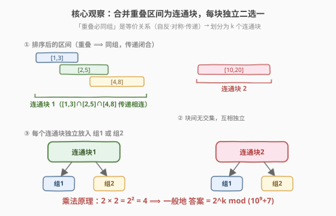
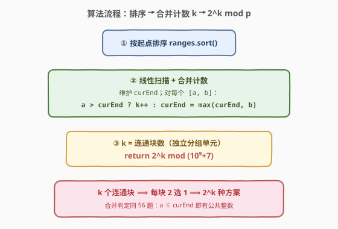
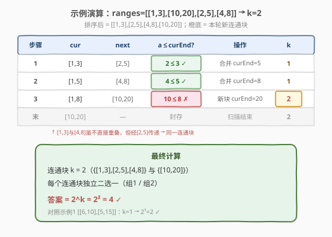

# LeetCode 统计将重叠区间合并成组的方案数 题解

## 1. 题目概述

- **标题 / 题号**：统计将重叠区间合并成组的方案数（#2580，medium）
- **链接**：https://leetcode.cn/problems/count-ways-to-group-overlapping-ranges/
- **难度**：中等
- **标签**：数组、排序、贪心、并查集、数学

**题意**：给定一个二维整数数组 `ranges`，其中 `ranges[i] = [start_i, end_i]` 表示第 `i` 个区间包含 `start_i` 到 `end_i`（含两端）的所有整数。需要将 `ranges` 划分成**两个**组（可以为空），满足：

- 每个区间恰好属于一个组；
- 两个**有交集**的区间必须在**同一个**组内。

「有交集」指两个区间至少有一个公共整数（如 `[1,3]` 与 `[2,5]` 共有 `2,3`，有交集）。返回总方案数，对 $10^9+7$ 取余。

**示例 1**：

```text
输入：ranges = [[6,10],[5,15]]
输出：2
解释：两区间有交集，必须同组；可同放组1 或 同放组2，共 2 种。
```

**示例 2**：

```text
输入：ranges = [[1,3],[10,20],[2,5],[4,8]]
输出：4
解释：[1,3]、[2,5]、[4,8] 经交集传递必同组（连通块1）；[10,20] 独立（连通块2）。
k=2 个连通块，每个二选一 → 2²=4 种。
```

**约束**：

- $1 \le \text{ranges.length} \le 10^5$
- $\text{ranges}[i].\text{length} == 2$
- $0 \le \text{start}_i \le \text{end}_i \le 10^9$

> 💡 **关键语义**：两个组**有序**（组 1、组 2 可区分）。一个连通块整体放入组 1 或组 2 是**两种**不同方案，无需除以 2。这与 [2518. 好分区的数目](../2501-2600/2518_好分区的数目.md) 的「有序分组」语义一致。

## 2. 解题思路

### 2.1 暴力思路：枚举每个区间归属

对每个区间二选一放组 1 / 组 2，共 $2^n$ 种划分，再逐一检查「任意有交集的区间对都在同组」。$n = 10^5$ 时 $2^{10^5}$ 是天文数字，且成对校验还需 $O(n^2)$，完全不可行。

### 2.2 核心观察：「重叠必同组」是等价关系 → 连通块 + 乘法原理



约束「有交集 ⟹ 同组」是一个**等价关系**：

- **自反**：每个区间和自己有交集；
- **对称**：A 与 B 有交集则 B 与 A 也有；
- **传递**：A 与 B 有交集、B 与 C 有交集 ⟹ A、C 必须同组（即便 A、C 不直接重叠）。

等价关系把所有区间划分为若干**等价类**（即「连通块」）。同一个连通块内所有区间被绑定成一个整体，只能整体放入组 1 或组 2；不同连通块之间**互不相交**，选择**相互独立**。

> 💡 **这正是图连通分量视角**：把每个区间当节点、有交集的区间连边，等价类 = 连通分量。直接建图判连通需 $O(n^2)$ 条边，但区间有**一维结构**——按起点排序后，重叠的区间必然相邻连续，于是可用「合并区间」（[56. 合并区间](../0001-0100/56_合并区间.md)）的线性扫描在 $O(n \log n)$ 内求出所有连通块。

设连通块数为 $k$，每个连通块有 2 种放法（组 1 / 组 2），由**乘法原理**：

$$
\text{答案} = 2^k \bmod (10^9+7)
$$

### 2.3 算法流程



1. 按**起点升序**排序 `ranges`（起点相同则按终点，默认字典序即可）。
2. 线性扫描，维护当前连通块的右端 `curEnd`（初始 $-1$），并计数 `k`：
   - 对每个区间 $[a, b]$：若 $a > \text{curEnd}$ → 与当前块**无交集**，开启新连通块，`k += 1`；否则并入当前块。
   - 无论哪种，都更新 $\text{curEnd} = \max(\text{curEnd}, b)$。
3. 返回 $2^k \bmod (10^9+7)$。

**合并判定**与 56 题完全一致：排序后下一个区间起点 $a$ 与当前块右端 `curEnd` 比较，$a \le \text{curEnd}$ 即有公共整数（含端点接触，如 `[1,3]` 与 `[3,5]` 共享 `3`）。

### 2.4 示例演算



以示例 2 `ranges = [[1,3],[10,20],[2,5],[4,8]]` 演算。排序后为 `[[1,3],[2,5],[4,8],[10,20]]`，`curEnd = -1`：

| 步骤 | cur | next | $a \le \text{curEnd}$? | 操作 | 连通块 k |
|------|-----|------|------------------------|------|----------|
| 1 | [1,3] | [2,5] | $2 \le 3$ ✓ | 合并 curEnd=5 | 1 |
| 2 | [1,5] | [4,8] | $4 \le 5$ ✓ | 合并 curEnd=8 | 1 |
| 3 | [1,8] | [10,20] | $10 \le 8$ ✗ | 新块 curEnd=20 | **2** |
| 末 | [10,20] | — | 封存 | 扫描结束 | 2 |

- 步骤 1 时 `[1,3]` 是首个区间，开启连通块 1（`k=1`）。
- 步骤 3 时 `[10,20]` 起点 $10 > 8$，与连通块 1 无公共整数，开启连通块 2。
- 注意 `[1,3]` 与 `[4,8]` **不直接重叠**（$3 < 4$），但经 `[2,5]` 传递绑定到同一连通块——这正是等价关系「传递性」的体现。
- $k=2$，答案 $= 2^2 = 4$ ✓。

> ⚠️ 示例 1 `[[6,10],[5,15]]` 排序为 `[[5,15],[6,10]]`：`[6,10]` 起点 $6 \le 15$ → 合并，$k=1$，答案 $2^1=2$ ✓。

## 3. 参考代码

### C++

```cpp
class Solution {
  public:
    int countWays(vector<vector<int>>& ranges) {
        const long long MOD = 1e9 + 7;
        sort(ranges.begin(), ranges.end());              // 按起点排序
        int k = 0;                                        // 连通块数
        long long curEnd = -1;
        for (auto& r : ranges) {
            if (r[0] > curEnd) {                          // 与当前块无交集 → 新连通块
                k++;
            }
            curEnd = max(curEnd, (long long)r[1]);        // 扩展当前块右端
        }
        long long ans = 1;
        for (int i = 0; i < k; ++i)                       // 2^k mod MOD
            ans = ans * 2 % MOD;
        return (int)ans;
    }
};
```

> ⚠️ **易错点**：(1) `curEnd` 用 `long long`，端点可达 $10^9$，与 `r[1]` 比较/取 max 时避免 `int` 隐式转换风险（`r[0]` 是 `int`，`r[0] > curEnd` 中 `curEnd` 为 `long long` 会提升右侧，安全）。(2) 新块的判定是严格 `>`：$a > \text{curEnd}$ 才无交集；端点接触（$a = \text{curEnd}$）仍有公共整数，必须并入同块。

### Python

```python
class Solution:
    def countWays(self, ranges: List[List[int]]) -> int:
        MOD = 10**9 + 7
        ranges.sort()                       # 按起点排序
        k = 0
        cur_end = -1
        for a, b in ranges:
            if a > cur_end:                 # 与当前块无交集 → 新连通块
                k += 1
            cur_end = max(cur_end, b)
        return pow(2, k, MOD)               # 2^k mod MOD（内置快速幂）
```

> 💡 Python `pow(2, k, MOD)` 内置快速幂，$O(\log k)$；逻辑与 C++ 镜像，无需手动处理取余负数。

## 4. 复杂度分析

| 维度 | 复杂度 | 说明 |
|------|--------|------|
| 时间复杂度 | $O(n \log n)$ | 排序主导；线性扫描 $O(n)$；$2^k$ 用快速幂 $O(\log k)$ 或循环 $O(k)$，均被排序覆盖 |
| 空间复杂度 | $O(\log n)$ | 排序递归栈（原地排序，不计输出） |
| 对照：暴力枚举 | $O(2^n \cdot n^2)$ | 逐划分枚举 + 成对交集校验，$n=10^5$ 指数爆炸 |

> 💡 本题能在线性扫描内求出等价类，关键在于区间有**一维顺序结构**：排序让「有交集」的区间相邻连续，把图连通分量的 $O(n^2)$ 建边降为 $O(n)$ 扫描——这与 [56. 合并区间](../0001-0100/56_合并区间.md) 的降复杂度原理同源。

## 5. 扩展：等价类 = 图连通分量

把每个区间视作节点、有交集的两区间连边，则「重叠必同组」对应的等价类恰是图的**连通分量**。理论上可用并查集求解，但建边需 $O(n^2)$。

本题的优化在于利用区间一维结构避免显式建图：

- **排序**使重叠区间相邻化（若 $i$ 与 $j$ 重叠且 $i < j$，则 $i$ 与 $i+1, \dots, j$ 都可能连续重叠）；
- **线性扫描 + 维护 `curEnd`** 一次遍历即合并出所有等价类，等价于「区间版 BFS/并查集」；
- 连通块数 $k$ 直接给出，再做 $2^k$ 计数。

> 💡 这是「**把图问题降维到序列问题**」的典型范例：当图的边由一维区间重叠定义时，排序 + 扫描取代显式建图，复杂度从 $O(n^2)$ 降到 $O(n \log n)$。同类思想见 [56. 合并区间](../0001-0100/56_合并区间.md)（求合并结果）、[435. 无重叠区间](../0401-0500/435_无重叠区间.md)（贪心去重）。

## 6. 面试要点

1. **为什么「有交集必同组」是等价关系？传递性如何体现？**

   > 自反（区间与自己有交集）、对称（交集对称）、传递：若 A∩B、B∩C，则 A、B、C 必同组——即便 A 与 C 不直接相交，也因都和 B 相交而被绑定。故所有区间被划分为若干等价类（连通块），块内整体行动、块间独立。

2. **为什么答案是 $2^k$ 而非 $2^k / 2$？**

   > 题目规定两个组**有序**（组 1、组 2 可区分），同一连通块放组 1 与放组 2 是两种不同方案。故 $k$ 个独立连通块各 2 选 1，由乘法原理得 $2^k$，无需除以 2。这与 [2518](../2501-2600/2518_好分区的数目.md)「有序分组」语义一致。

3. **排序后为什么只需看相邻区间？合并条件怎么定？**

   > 排序后左端点单调递增，若下一个区间起点 $a \le \text{curEnd}$ 则与当前块有公共整数（含端点接触），并入并扩展 `curEnd`；若 $a > \text{curEnd}$ 则无交集，后续区间起点更大更不可能相交，可安全开启新块。一次扫描即可，无需回头——与 56 题同源。

4. **端点接触算有交集吗？`[1,3]` 和 `[3,5]` 怎么处理？**

   > 算有交集——二者共享整数 `3`。故判定用严格 `a > curEnd` 表示「无交集」，$a = \text{curEnd}$（如 $a=3, \text{curEnd}=3$）仍并入同块。这与 56 题用 `<=` 判重叠一致，面试时需与面试官确认「接触是否算交集」。

5. **能用并查集吗？复杂度如何？为什么这里更优？**

   > 能：区间为点、有交集连边，并查集求连通分量数。但显式建边需对每对区间判交集，$O(n^2)$，$n=10^5$ 不可行。利用区间一维结构——排序后重叠区间相邻连续，线性扫描合并即得等价类，把建图 $O(n^2)$ 降为 $O(n \log n)$，是本题降复杂度的关键。

> 💡 **一句话总结**：「重叠必同组」是等价关系，区间被划分为 $k$ 个连通块；利用区间一维结构，排序 + 线性扫描（同 56 题合并逻辑）在 $O(n \log n)$ 内求出 $k$，每个连通块独立二选一，答案 $= 2^k \bmod (10^9+7)$。

## 同类练习题

| # | 题目 | 与本题的关联 |
|---|------|-------------|
| 56 | [合并区间](https://leetcode.cn/problems/merge-intervals/)（[题解](../0001-0100/56_合并区间.md)） | 本题合并逻辑的直接母题，排序后线性扫描合并重叠区间；本题只额外多一步「数连通块 + $2^k$」 |
| 435 | [无重叠区间](https://leetcode.cn/problems/non-overlapping-intervals/)（[题解](../0401-0500/435_无重叠区间.md)） | 区间贪心调度变体，对照本题「合并重叠」与「移除重叠」两种视角 |
| 57 | [插入区间](https://leetcode.cn/problems/insert-interval/)（[题解](../0001-0100/57_插入区间.md)） | 已排序区间插入并合并，56 的变体，同源线性扫描 |
| 2518 | [好分区的数目](https://leetcode.cn/problems/number-of-great-partitions/)（[题解](2518_好分区的数目.md)） | 同为「有序分组 + $2$ 的幂次计数 + 取模」范式，对照计数思路与边界处理 |
