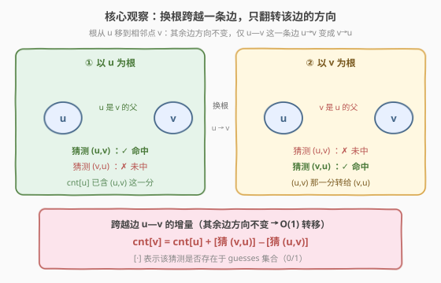
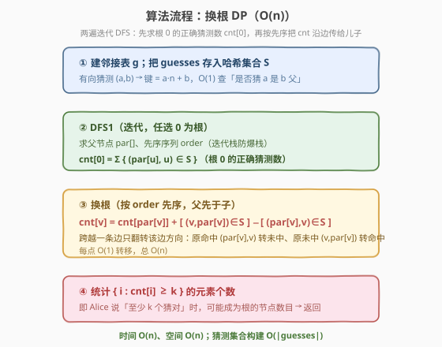
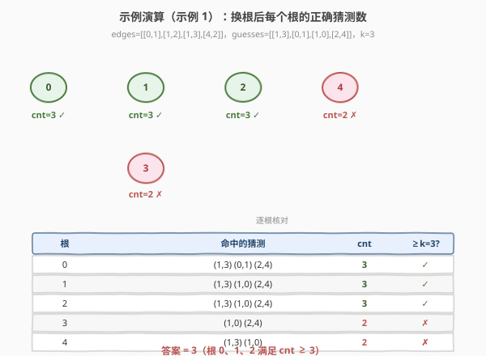

# LeetCode 统计可能的树根数目 题解

## 1. 题目概述

- **标题 / 题号**：统计可能的树根数目（#2581，hard）
- **链接**：https://leetcode.cn/problems/count-number-of-possible-root-nodes/
- **难度**：困难
- **标签**：树、深度优先搜索、动态规划、换根 DP、哈希表

**题意**：Alice 有一棵 $n$ 个节点的**无向树**，节点编号 $0$ 到 $n-1$，边由 `edges` 给出。Bob 对树做若干次**猜测**：每次猜 `guesses[j] = [u_j, v_j]` 表示「$u_j$ 是 $v_j$ 的父节点」。

树**任选一个节点作为根**后，每条无向边就有了方向（父→子）。一个猜测 $(u,v)$ 在该根下**命中**当且仅当 $u$ 恰是 $v$ 的父节点（即有向边 $u\to v$ 出现在以该根定向后的树中）。Alice 告诉 Bob：**至少**有 $k$ 个猜测命中。返回可能成为树根的**节点数目**。

**示例 1**：

```text
输入：edges = [[0,1],[1,2],[1,3],[4,2]],
     guesses = [[1,3],[0,1],[1,0],[2,4]], k = 3
输出：3
```

以 $0$ 为根命中 $[1,3],[0,1],[2,4]$；以 $1$ 为根命中 $[1,3],[1,0],[2,4]$；以 $2$ 为根命中 $[1,3],[1,0],[2,4]$，均 $\ge 3$。以 $3,4$ 为根只命中 2 个。故答案为 $3$。

**示例 2**：

```text
输入：edges = [[0,1],[1,2],[2,3],[3,4]],
     guesses = [[1,0],[3,4],[2,1],[3,2]], k = 1
输出：5
```

任一节点为根都至少命中 1 个，答案为 $5$。

**约束**：

- $2 \le n \le 10^5$
- `edges.length == n - 1`，`edges` 表示一棵合法的树
- $1 \le \text{guesses.length} \le 10^5$
- $0 \le a_i, b_i, u_j, v_j \le n-1$，`guesses[j]` 是树中的一条边，且 `guesses` 元素唯一
- $0 \le k \le \text{guesses.length}$

> 💡 **关键语义**：猜测是**有向**对 $(u,v)$，命中条件是「$u$ 恰为 $v$ 的父」。换一个根，整棵树所有边的方向会重新确定，因而同一个猜测在不同根下命中与否可能不同。我们要数的是「命中数 $\ge k$」的根的个数。

## 2. 解题思路

### 2.1 暴力思路：枚举每个根 + 每次 DFS

最直观：对每个节点 $r$ 以其为根做一次 DFS，把树定向，再遍历 `guesses` 数命中数，统计 $\ge k$ 的根。单根 $O(n + g)$（$g=|\text{guesses}|$），枚举 $n$ 个根共 $O(n\cdot(n+g))$，$n,g$ 均 $10^5$ 时约 $10^{10}$，必超时。

### 2.2 核心观察：换根 DP——跨越一条边只翻转该边方向



设根从 $u$ 移到其相邻点 $v$。**树中除 $u\!-\!v$ 外的所有边方向都不变**——因为换根只改变从根出发的路径「分叉点」，而对不在 $u\!-\!v$ 路径上的边，其父子关系相对各自子树仍保持原方向。唯一变化的是边 $u\!-\!v$：原方向 $u\to v$（$u$ 为父），换成 $v\to u$（$v$ 为父）。

于是正确猜测数 $\text{cnt}$ 的增量只由两个猜测决定：

- 猜测 $(u,v)$：原命中（$u$ 是 $v$ 父），换根后未中 → $\text{cnt}\!-\!-1$；
- 猜测 $(v,u)$：原未中（$v$ 不是 $u$ 父），换根后命中 → $\text{cnt}\!+\!1$。

$$\text{cnt}[v] = \text{cnt}[u] + \mathbb{1}[(v,u)\in S] - \mathbb{1}[(u,v)\in S]$$

其中 $S$ 是 `guesses` 集合，$\mathbb{1}[\cdot]$ 为指示函数。**每个儿子 $O(1)$ 转移**，从任一已知根的 $\text{cnt}$ 出发，沿树一次遍历即可推出所有节点的 $\text{cnt}$——这正是**换根 DP**。

> 💡 **为什么只有 $u\!-\!v$ 这一条边翻转？** 设根在 $u$ 时某条边 $x\!-\!y$ 方向为 $x\to y$。把根移到 $u$ 的邻居 $v$ 后：若 $x\!-\!y$ 在 $v$ 的「远离 $u$」一侧的子树里，其相对于根的父子关系完全不变；若 $x\!-\!y$ 在 $u$ 的「远离 $v$」一侧的子树里也同理不变；只有连接这两块的桥 $u\!-\!v$ 翻转。这是换根 DP 一切 $O(1)$ 转移的根基。

### 2.3 算法流程



1. **建图 + 猜测集合**：由 `edges` 建邻接表 $g$；把每个有向猜测 $(a,b)$ 存入哈希集合 $S$，键编码为 $a\cdot n+b$（C++ 用 `long long`，避免自定义 pair 哈希），查询 $O(1)$。
2. **DFS1（迭代，任选 $0$ 为根）**：用显式栈求出父节点数组 $\text{par}[\,]$ 与先序序列 $\text{order}$（迭代而非递归，规避 $n=10^5$ 爆栈）。根 $0$ 的命中数为
   $$\text{cnt}[0] = \sum_{u\ne 0} \mathbb{1}[(\text{par}[u],\,u)\in S]$$
   （以 $0$ 为根时，每条有向树边恰是 $(\text{par}[u],u)$，命中即该猜测在 $S$ 中。）
3. **换根（按 `order` 先序）**：先序保证父先于子，处理 $v$ 时 $\text{cnt}[\text{par}[v]]$ 已就绪。令 $p=\text{par}[v]$：
   $$\text{cnt}[v] = \text{cnt}[p] + \mathbb{1}[(v,p)\in S] - \mathbb{1}[(p,v)\in S]$$
4. **统计**：答案 $=\big|\{\,i : \text{cnt}[i]\ge k\,\}\big|$。

### 2.4 示例演算



以示例 1 为例。以 $0$ 为根做 DFS 得 $\text{par}=[-1,0,1,1,2]$（节点 $1$ 父为 $0$，$2$ 父为 $1$，$3$ 父为 $1$，$4$ 父为 $2$）。

**求 $\text{cnt}[0]$**：检查每条有向树边是否在 $S=\{(1,3),(0,1),(1,0),(2,4)\}$ 中：

| 树边 $(\text{par}[u],u)$ | 在 $S$？ | 贡献 |
|--------------------------|----------|------|
| $(0,1)$ | ✓ | $+1$ |
| $(1,2)$ | ✗ | $0$ |
| $(1,3)$ | ✓ | $+1$ |
| $(2,4)$ | ✓ | $+1$ |

$\text{cnt}[0]=3$。

**换根（按先序 $0,1,2,4,3$ 逐节点转移）**：

| $v$ | $p=\text{par}[v]$ | $\text{cnt}[p]$ | $+\mathbb{1}[(v,p)]$ | $-\mathbb{1}[(p,v)]$ | $\text{cnt}[v]$ | $\ge 3$? |
|-----|-------------------|------------------|----------------------|----------------------|-----------------|----------|
| 1 | 0 | 3 | $(1,0)\in S\Rightarrow+1$ | $(0,1)\in S\Rightarrow-1$ | 3 | ✓ |
| 2 | 1 | 3 | $(2,1)\notin S$ | $(1,2)\notin S$ | 3 | ✓ |
| 4 | 2 | 3 | $(4,2)\notin S$ | $(2,4)\in S\Rightarrow-1$ | 2 | ✗ |
| 3 | 1 | 3 | $(3,1)\notin S$ | $(1,3)\in S\Rightarrow-1$ | 2 | ✗ |

$\text{cnt}=[3,3,3,2,2]$，$\ge 3$ 的根为 $0,1,2$，答案 $=3$ ✓。

> ⚠️ **易错点**：换根的「先序」必须保证父在子之前被处理——用 DFS 的 `order`（根最先、递归儿子紧随）天然满足。若用后序则会读到尚未算好的 $\text{cnt}[p]$。另外增量两项的**符号**别写反：原命中 $(p,v)$ 要 $-1$（变未中），原未中 $(v,p)$ 要 $+1$（变命中）。

## 3. 参考代码

### C++

```cpp
class Solution {
public:
    int rootCount(int n, vector<vector<int>>& edges,
                  vector<vector<int>>& guesses, int k) {
        vector<vector<int>> g(n);
        for (auto& e : edges) { g[e[0]].push_back(e[1]); g[e[1]].push_back(e[0]); }

        // 有向猜测 (a,b) → 键 a*n+b，O(1) 查询
        unordered_set<long long> S;
        S.reserve(guesses.size() * 2);
        for (auto& gd : guesses)
            S.insert((long long)gd[0] * n + gd[1]);

        // DFS1（迭代，以 0 为根）：求 par[] 与先序 order
        vector<int> par(n, -1), order;
        order.reserve(n);
        vector<char> vis(n, 0);
        vector<int> stk = {0};
        vis[0] = 1;
        while (!stk.empty()) {
            int u = stk.back(); stk.pop_back();
            order.push_back(u);
            for (int v : g[u]) if (!vis[v]) { vis[v] = 1; par[v] = u; stk.push_back(v); }
        }

        // cnt[0]：根 0 的命中数 = 每条树边 (par[u],u) 是否在 S
        vector<int> cnt(n, 0);
        for (int u : order) {
            if (par[u] == -1) continue;
            if (S.count((long long)par[u] * n + u)) cnt[0]++;
        }

        // 换根（按 order 先序，父先于子）
        for (int v : order) {
            int p = par[v];
            if (p == -1) continue;                 // 根 0 跳过
            int c = cnt[p];
            if (S.count((long long)v * n + p)) c++;   // (v,p) 由未中变命中
            if (S.count((long long)p * n + v)) c--;   // (p,v) 由命中变未中
            cnt[v] = c;
        }

        int ans = 0;
        for (int v = 0; v < n; ++v) if (cnt[v] >= k) ans++;
        return ans;
    }
};
```

> ⚠️ **实现要点**：① 用显式栈迭代 DFS 防 $n=10^5$ 递归爆栈；`order` 的正序即先序，逆序即后序，一遍遍历服务换根的「父先于子」需求（与 [2538](2538_最大价值和与最小价值和的差值.md) 同法）。② 猜测键编码 $a\cdot n+b$：$a,b<n\le 10^5$，最大约 $10^{10}$，必须用 `long long`（`int` 会溢出）。③ `unordered_set` 预留 `reserve` 降低 rehash；`vis` 用 `vector<char>` 比 `vector<bool>` 略快且无代理引用坑。④ 增量两行**顺序无关**，但符号不能反：命中的 $(p,v)$ 减、未中的 $(v,p)$ 加。

### Python

```python
class Solution:
    def rootCount(self, n: int, edges: List[List[int]],
                  guesses: List[List[int]], k: int) -> int:
        g = [[] for _ in range(n)]
        for a, b in edges:
            g[a].append(b); g[b].append(a)

        S = {(u, v) for u, v in guesses}     # 有向猜测集合，元组作键

        # DFS1（迭代，以 0 为根）：求 par[] 与先序 order
        par = [-1] * n
        order = []
        vis = [False] * n
        stk = [0]; vis[0] = True
        while stk:
            u = stk.pop()
            order.append(u)
            for v in g[u]:
                if not vis[v]:
                    vis[v] = True
                    par[v] = u
                    stk.append(v)

        cnt = [0] * n
        for u in order:                      # cnt[0]：每条树边 (par[u],u) 命中数
            if par[u] != -1 and (par[u], u) in S:
                cnt[0] += 1

        for v in order:                      # 换根：先序，父先于子
            p = par[v]
            if p == -1:
                continue
            c = cnt[p]
            if (v, p) in S:                  # (v,p) 由未中变命中
                c += 1
            if (p, v) in S:                  # (p,v) 由命中变未中
                c -= 1
            cnt[v] = c

        return sum(1 for c in cnt if c >= k)
```

> 💡 Python 用元组 `(u, v)` 作集合键更可读，$10^5$ 条猜测哈希性能足够；若追求极致可改 `u * n + v` 整数键与 C++ 对齐。迭代 DFS 同样规避默认递归上限（链状树深度 $10^5$ 会触发 `RecursionError`）。

## 4. 复杂度分析

| 维度 | 复杂度 | 说明 |
|------|--------|------|
| 时间复杂度 | $O(n + g)$ | 建图 $O(n)$；建猜测集合 $O(g)$；两遍迭代 DFS 各 $O(n)$；查集合均摊 $O(1)$ |
| 空间复杂度 | $O(n + g)$ | 邻接表 $O(n)$、`par`/`order`/`cnt` 各 $O(n)$、猜测集合 $O(g)$ |
| 对照：暴力枚举根 | $O(n(n+g))$ | 每个根重跑一遍 DFS + 重数命中，$n,g\sim 10^5$ 时 $\sim 10^{10}$ 必超时 |

> 💡 换根 DP 把「$n$ 个根各算一遍」的 $O(n^2)$ 压成 $O(n)$：利用「换根只翻转跨越的那条边」这一结构，把全局重算降为沿树传递的 $O(1)$ 增量。这是树上「枚举每个点为根」类问题的通用降阶套路。

## 5. 扩展：为什么换根 DP 行得通——树边的局部性

换根 DP 的核心是**树边的局部性**：移动根时，只有「连接根的旧位置与新位置的那条路径上的边」方向会变；更精确地，从根 $u$ 移到**相邻**点 $v$ 时，只有 $u\!-\!v$ 一条边翻转。

由此可推：从根 $0$ 出发沿任一路径到节点 $r$，途中跨越的每条边都各自翻转一次，$\text{cnt}[r]$ 就是 $\text{cnt}[0]$ 累加这些「单边增量」。把这条路径拆成「$0\to\text{par}^{-1}(r)$ 的一串父子边」，逐段套用增量公式，就得到本节的递推——而 `order` 先序恰好就是「根到各点」的拓扑序，使得父的 $\text{cnt}$ 总先就绪。

> 💡 这套「增量沿树传递」的范式适用于一切「以每个点为根求某量」的树上统计：[834. 树中距离之和](../0801-0900/834_树中距离之和.md) 把增量换成子树大小、[2538. 最大价值和与最小价值和的差值](2538_最大价值和与最小价值和的差值.md) 换成最长路径和。识别「换根只改变跨越边的局部量」即可套用。

## 6. 面试要点

1. **为什么换根只翻转跨越的那一条边？**

   > 根从 $u$ 移到相邻 $v$，只改变了「$u$、$v$ 谁是谁的父」这一对关系。$v$ 子树内部各边相对 $v$ 的父子关系不变；$u$ 远离 $v$ 一侧各边相对 $u$ 也不变；连接两部分的桥 $u\!-\!v$ 是唯一翻转的边。故只 $(u,v)$、$(v,u)$ 两个猜测的命中状态互换，其余不变。

2. **怎么 $O(1)$ 判断一个猜测在当前根下是否命中？**

   > 不直接判断，而是维护「当前根的命中数 $\text{cnt}$」并随换根增量更新：跨越 $u\!-\!v$ 时 $\text{cnt}\mathrel{+}=\mathbb{1}[(v,u)\in S]-\mathbb{1}[(u,v)\in S]$。猜测集合 $S$ 用哈希表存，单次查询 $O(1)$，故转移 $O(1)$。

3. **DFS 的两遍各是什么顺序？为什么必须先序换根？**

   > DFS1 任意序即可（只需 `par[]` 与一个根的 $\text{cnt}$）；DFS2 换根必须按**先序**（父先于子），因为 $\text{cnt}[v]$ 要用到 $\text{cnt}[\text{par}[v]]$，父必须先算好。用后序会读到未初始化的 $\text{cnt}[p]$。迭代 DFS 的 `order` 天然是先序。

4. **$n=10^5$ 时递归 DFS 会怎样？怎么处理？**

   > 链状树递归深度可达 $10^5$，Python 触发 `RecursionError`，C++ 也可能爆栈。用显式栈迭代 DFS：压栈遍历得 `order`，`par` 在压儿子时同步记录。`order` 正序即先序、逆序即后序，两遍 DP 都能复用，与 [2538](2538_最大价值和与最小价值和的差值.md) 一致。

5. **猜测键为什么编码成 $a\cdot n+b$？能用 `pair` 吗？**

   > C++ `unordered_set<pair<int,int>>` 需自定义哈希（标准库未给 `pair` 特化），麻烦；编码成 `long long` 的 $a\cdot n+b$（$a,b<n$，最大约 $10^{10}$ 不溢出）即可天然哈希。Python 直接用元组 `(a,b)` 作键，最自然。

> 💡 **一句话总结**：以 $0$ 为根一遍迭代 DFS 求出 $\text{cnt}[0]$ 与父节点数组；按先序换根，跨越每条边只翻转该边方向，故 $\text{cnt}[v]=\text{cnt}[\text{par}[v]]+\mathbb{1}[(v,\text{par}[v])]-\mathbb{1}[(\text{par}[v],v)]$，$O(1)$ 转移，总 $O(n+g)$；最后数 $\text{cnt}\ge k$ 的节点。

## 同类练习题

| # | 题目 | 与本题的关联 |
|---|------|-------------|
| 2538 | [最大价值和与最小价值和的差值](https://leetcode.cn/problems/difference-between-maximum-and-minimum-price-sum/)（[题解](2538_最大价值和与最小价值和的差值.md)） | 换根 DP 母题之一，同样两遍迭代 DFS（先序/后序），对照「单点路径」退化与「最大/次大」兄弟处理 |
| 834 | [树中距离之和](https://leetcode.cn/problems/sum-of-distances-in-tree/)（[题解](../0801-0900/834_树中距离之和.md)） | 经典换根 DP，增量换为子树大小，对照「跨越边只改变局部量」的核心思想 |
| 310 | [最小高度树](https://leetcode.cn/problems/minimum-height-trees/)（[题解](../0301-0400/310_最小高度树.md)） | 同为「哪个节点作根最优」，但用剥叶子找树的重心，对照换根 DP 与拓扑剥叶两种视角 |
| 2477 | [到达首都的最少油耗](https://leetcode.cn/problems/minimum-fuel-cost-to-report-to-the-capital/)（[题解](../2401-2500/2477_到达首都的最少油耗.md)） | 树形 DFS + 子树聚合，对照换根 DP 的「自底向上聚合」一半 |
