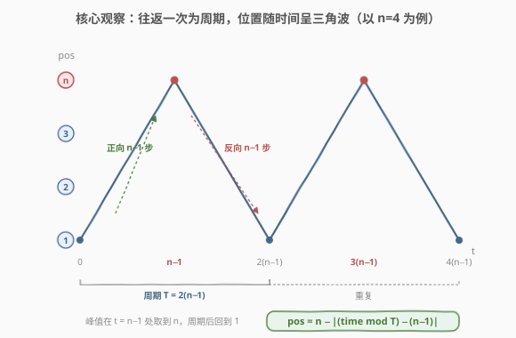
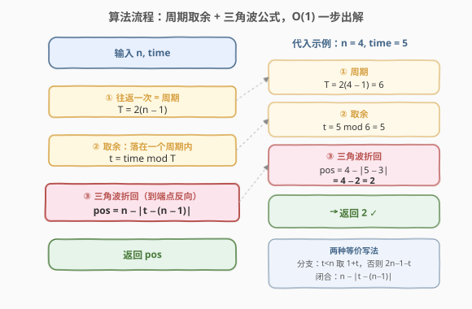
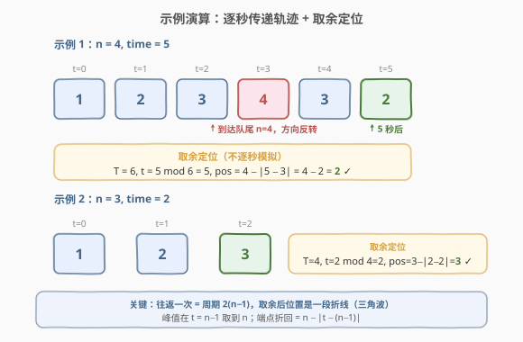

# 递枕头

- **题目名称**：递枕头
- **链接**：[2582. 递枕头](https://leetcode.cn/problems/pass-the-pillow/)
- **难度**：简单
- **标签**：数学、模拟

## 1. 题目概述

$n$ 个人站成一排，按从 $1$ 到 $n$ 编号。最初，排在队首的第一个人拿着一个枕头。每秒钟，拿着枕头的人会将枕头传递给队伍中的下一个人。一旦枕头到达队首或队尾，传递方向就会改变，队伍会继续沿相反方向传递枕头。

- 例如，当枕头到达第 $n$ 个人时，TA 会将枕头传递给第 $n - 1$ 个人，然后传递给第 $n - 2$ 个人，依此类推。

给你两个正整数 $n$ 和 $\text{time}$，返回 $\text{time}$ 秒后拿着枕头的人的编号。

**示例 1**：

```text
输入：n = 4, time = 5
输出：2
解释：队伍中枕头的传递情况为：1 -> 2 -> 3 -> 4 -> 3 -> 2 。
5 秒后，枕头传递到第 2 个人手中。
```

**示例 2**：

```text
输入：n = 3, time = 2
输出：3
解释：队伍中枕头的传递情况为：1 -> 2 -> 3 。
2 秒后，枕头传递到第 3 个人手中。
```

**约束条件**：

- $2 \le n \le 1000$
- $1 \le \text{time} \le 1000$

> 💡 本题与 [3178. 找出 K 秒后拿着球的孩子](https://leetcode.cn/problems/find-the-child-who-has-the-ball-after-k-seconds/) 完全一致，仅题面包装不同（枕头 ↔ 球），解法通用。

---

## 2. 解题思路

### 2.1 暴力思路：逐秒模拟传递

最直白的做法：维护当前位置 `pos`（初始为 $1$）与方向 `dir`（初始 $+1$ 表示向右），每秒执行 `pos += dir`；一旦 `pos == n` 就把方向翻为 $-1$，一旦 `pos == 1` 就翻回 $+1$。重复 $\text{time}$ 次后返回 `pos`。

```text
pos, dir = 1, +1
for t in 1..time:
    pos += dir
    if pos == n: dir = -1
    elif pos == 1: dir = +1
return pos
```

由于 $\text{time} \le 1000$，$O(\text{time})$ 完全能 AC。但它没有利用运动的**周期性**——同一位置在第 $\text{time}$ 秒与第 $\text{time} + 2(n-1)$ 秒必然相同，逐秒推进是「重复劳动」。

> 💡 暴力法的浪费在于：它关心「**怎么走**到那里」，而题目只要「**在哪**」。往返是高度规则的周期运动，只要认清周期，就能把 $O(\text{time})$ 折叠成 $O(1)$。

### 2.2 核心观察：往返一次为周期，位置呈三角波



枕头的运动是 **$1 \to 2 \to \cdots \to n \to n-1 \to \cdots \to 2 \to 1 \to 2 \to \cdots$** 的往返。一次完整的「去程 + 回程」：

- **去程**：从 $1$ 到 $n$，走 $n-1$ 步；
- **回程**：从 $n$ 回到 $1$，再走 $n-1$ 步。

合计 $2(n-1)$ 步，且回到起点 $1$、方向恢复向右——状态完全复原。因此这是一个**周期**：

$$
T = 2(n-1)
$$

> 💡 **周期性的本质**：状态由「位置 + 方向」共同决定。仅有位置回到 $1$ 不足以保证周期（如方向仍是向左则不复原），必须位置回到 $1$ **且**方向回到向右才是一个完整周期。一次往返恰好同时满足这两点。

于是任意 $\text{time}$ 秒后的位置，等于把 $\text{time}$ 对周期取余后、落在一个周期内的位置：

$$
t = \text{time} \bmod 2(n-1)
$$

其中 $t \in [0,\, 2(n-1))$ 表示「从 $1$ 出发向右走 $t$ 秒」。

**位置随 $t$ 是一段折线（三角波）**：

- $t \in [0,\, n-1]$：向右走，位置 $= 1 + t$（$t=n-1$ 时到达 $n$）；
- $t \in [n,\, 2(n-1))$：从 $n$ 折返向左，位置 $= n - (t-(n-1)) = 2n-1-t$。

把这两段统一成一个闭合表达式。观察峰值：$t=n-1$ 时位置取到最大值 $n$，两侧对称下降，这正是以 $n-1$ 为对称轴的「绝对值折回」——

$$
\boxed{\,\text{pos} = n - \left|\, t - (n-1)\,\right|\,,\quad t = \text{time} \bmod 2(n-1)\,}
$$

> ⚠️ **为什么是 $n - |t-(n-1)|$ 而不是 $1+|t-(n-1)|$？** 三角波在 $t=n-1$ 处取**峰**（最大值 $n$），故用 $n$ 减去「偏离对称轴的距离」。若误写成加法会得到「谷」形（在 $t=n-1$ 取最小值），方向相反。记住：去程到 $n$ 是顶点，做减法。

> 💡 **两种等价写法**：分段判断更直观（$t < n$ 时 $1+t$，否则 $2n-1-t$）；闭合公式更简洁（$n-|t-(n-1)|$）。面试时先讲分段、再合并成绝对值，是一条稳妥的推导路径。

### 2.3 算法流程图



三步走，每步 $O(1)$：

1. **算周期**：$T = 2(n-1)$（一次往返的步数）；
2. **取余**：$t = \text{time} \bmod T$，把问题压缩到一个周期内；
3. **折回**：$\text{pos} = n - |t-(n-1)|$（或分段判断），返回 $\text{pos}$。

> 💡 取余是「折叠时间」的关键一步：它把任意大的 $\text{time}$（虽本题 $\le 1000$，但若放宽到 $10^{18}$ 仍成立）压缩到 $[0, 2(n-1))$ 内，使逐秒模拟退化为一次算术运算。

### 2.4 示例演算



**示例 1**：$n=4,\ \text{time}=5$。逐秒轨迹为 $1 \to 2 \to 3 \to 4 \to 3 \to 2$（$t=3$ 到达队尾 $4$ 后折返）。

| 步骤 | 计算 | 结果 |
|------|------|------|
| 周期 | $T = 2(4-1) = 6$ | $T=6$ |
| 取余 | $t = 5 \bmod 6$ | $t=5$ |
| 折回 | $\text{pos} = 4 - \|5-3\| = 4 - 2$ | $\text{pos}=2$ ✓ |

- $t=5 > n-1=3$，落在折返段，故 $4$ 减去偏离量 $2$ 得 $2$，与逐秒轨迹终点一致。

**示例 2**：$n=3,\ \text{time}=2$。逐秒轨迹为 $1 \to 2 \to 3$。

| 步骤 | 计算 | 结果 |
|------|------|------|
| 周期 | $T = 2(3-1) = 4$ | $T=4$ |
| 取余 | $t = 2 \bmod 4$ | $t=2$ |
| 折回 | $\text{pos} = 3 - \|2-2\| = 3 - 0$ | $\text{pos}=3$ ✓ |

- $t=2 = n-1=2$ 恰在峰值点，位置取到 $n=3$，与「$2$ 秒后到达队尾 $3$」一致。

> 💡 **边界自检**：$t=0$ 时 $\text{pos}=n-|0-(n-1)|=n-(n-1)=1$ ✓；$t=n-1$ 时 $\text{pos}=n-0=n$ ✓；$t=2(n-1)$ 取余后归零回到 $1$，周期闭合。两端与中点都对得上，公式无误。

---

## 3. 参考代码

### C++（闭合公式，$O(1)$ / $O(1)$）

```cpp
class Solution {
public:
    int passThePillow(int n, int time) {
        int T = 2 * (n - 1);                       // 往返一次的周期
        int t = time % T;                           // 压缩到一个周期内
        return n - abs(t - (n - 1));               // 三角波折回
    }
};
```

> ⚠️ **数据范围无忧**：$n, \text{time} \le 1000$，$T \le 1998$，所有中间量远在 `int` 范围内，无需 `long long`。`abs` 对 `int` 取绝对值即可。若题目把 $\text{time}$ 放宽到 $10^{18}$，则需把 `T`、`t` 改为 `long long` 并用 `%`（C++11 起 `%` 对带符号整数结果可正可负，但这里 `time`、`T` 均正，余数必非负）。

### Python（闭合公式，$O(1)$ / $O(1)$）

```python
class Solution:
    def passThePillow(self, n: int, time: int) -> int:
        T = 2 * (n - 1)                  # 往返一次的周期
        t = time % T                     # 压缩到一个周期内
        return n - abs(t - (n - 1))     # 三角波折回
```

> 💡 Python `%` 对正数取余恒非负，`abs` 作用于整数，无类型之忧。逻辑与 C++ 镜像。

### 逐秒模拟（对照版，$O(\text{time})$ / $O(1)$）

```python
class Solution:
    def passThePillow(self, n: int, time: int) -> int:
        pos, dir = 1, 1
        for _ in range(time):
            pos += dir
            if pos == n:
                dir = -1
            elif pos == 1:
                dir = 1
        return pos
```

> 💡 本题 $\text{time} \le 1000$，模拟同样 AC。但它无法处理 $\text{time}$ 极大的情形，且没有体现对周期性的洞察——面试中先讲模拟「保底」，再升级到 $O(1)$ 公式，能展示从「会做」到「看透」的递进。

---

## 4. 复杂度分析

| 维度 | 复杂度 | 说明 |
|------|--------|------|
| 时间复杂度 | $O(1)$ | 一次取余 + 一次绝对值 + 一次减法，与 $n$、$\text{time}$ 无关 |
| 空间复杂度 | $O(1)$ | 仅常数个变量 |
| 对照：逐秒模拟 | $O(\text{time})$ | 每秒推进一步，$\text{time}=1000$ 可 AC，但 $\text{time}$ 极大时退化 |

> 💡 **降维路径**：逐秒模拟 $O(\text{time})$ → 识别周期取余 $O(1)$。关键洞察是「往返一次 = 周期 $2(n-1)$」，让任意长时间被折叠到一个周期内，把循环退化为一次算术运算。

---

## 5. 扩展：周期运动与三角波的一般化

### 5.1 为什么是「位置 + 方向」共同决定周期

仅看位置回到 $1$ 不够：若此时方向仍向左，下一秒会走到 $0$（越界），并非复原。状态必须包含「位置」与「方向」两维。一次往返恰好让位置回到 $1$ **且**方向恢复向右，故状态完全复原，周期成立。这与有限状态机「状态数 = 状态空间大小」的视角一致：状态空间共 $2(n-1)$ 个（$n-1$ 个位置 × $2$ 个方向，去掉两个端点处方向唯一确定的重复），周期上界恰为 $2(n-1)$。

### 5.2 三角波与「镜像折叠」

闭合公式 $\text{pos}=n-|t-(n-1)|$ 本质是把「折返」视作**镜像对称**：以 $t=n-1$（到达队尾的时刻）为镜面，把折返段「折叠」回去与去程重叠。这种「绝对值折回」是处理一切「到端点反弹」类周期运动的通用手法——从一维弹球、台球反射，到信号处理里的三角波/锯齿波生成，都用到同一技巧。把 $t$ 换成「模周期后的相位」，$|t-(n-1)|$ 即相位偏离中心的有向距离，再平移到坐标 $n$ 上即得位置。

> 💡 推广到「$k$ 个端点反弹」或「不等距折返」时，只需调整镜面位置与周期长度；本题 $n$ 人单段往返是其中最简形态：单镜面、等步长、周期 $2(n-1)$。

---

## 6. 面试要点

1. **周期为什么是 $2(n-1)$？**

   > 一次完整往返 = 去程 $n-1$ 步（$1\to n$）+ 回程 $n-1$ 步（$n\to1$）= $2(n-1)$ 步，且位置回到 $1$、方向恢复向右，状态完全复原，故周期 $T=2(n-1)$。

2. **为什么状态要包含「方向」而不只看位置？**

   > 仅有位置回到 $1$ 不能保证复原：若方向仍向左，下一秒会越界。状态由「位置 + 方向」共同决定，必须两者都复原才算一个周期。这也解释了状态空间大小恰为 $2(n-1)$，周期上界与之相等。

3. **闭合公式 $n-|t-(n-1)|$ 怎么推出来？**

   > 取余后 $t\in[0,2(n-1))$。去程 $t\in[0,n-1]$ 位置 $=1+t$，回程 $t\in[n,2(n-1))$ 位置 $=2n-1-t$。观察两段关于 $t=n-1$ 对称：以 $n-1$ 为镜面，位置 $=n-\text{偏离量}=n-|t-(n-1)|$，把分段合并为绝对值折回。

4. **边界怎么自检？**

   > $t=0$：$n-|0-(n-1)|=n-(n-1)=1$ ✓；$t=n-1$：$n-0=n$（峰值/队尾）✓；$t=2(n-1)$ 取余归零回 $1$，周期闭合。两端加中点都对，公式无误。

5. **模拟和公式各有什么取舍？**

   > 模拟直观、不易写错，$\text{time}\le1000$ 时能 AC，适合「保底」；但无法处理 $\text{time}$ 极大（如 $10^{18}$）的情形，且未体现周期洞察。公式 $O(1)$ 一步出解、可应对任意大 $\text{time}$，是「看透周期性」后的最优解。面试先讲模拟再升级公式，能展示递进。

6. **取余为什么能把任意 $\text{time}$ 压缩？余数会是负数吗？**

   > 因为运动是严格周期的：第 $\text{time}$ 秒与第 $\text{time}\bmod T$ 秒状态完全相同，故取余不丢信息。本题 $\text{time}>0$、$T>0$，余数必在 $[0,T)$ 非负；C++/Python 对正数取余结果一致，无负数坑。

> 💡 **一句话总结**：2582 是「识别周期 + 三角波折回」的招牌题——往返一次为周期 $T=2(n-1)$，取余 $t=\text{time}\bmod T$ 后位置是关于 $t=n-1$ 对称的折线，闭合为 $\text{pos}=n-|t-(n-1)|$，$O(1)$ 一步出解。核心洞察是「状态 = 位置 + 方向，往返一次完全复原」让逐秒模拟可折叠为一次算术。

---

## 7. 同类练习题

- [3178. 找出 K 秒后拿着球的孩子](https://leetcode.cn/problems/find-the-child-who-has-the-ball-after-k-seconds/)：与本题题面不同、解法完全一致（球 ↔ 枕头），直接套用 $n-|t-(n-1)|$ 公式
- [258. 各位相加](https://leetcode.cn/problems/add-digits/)（[题解](../0201-0300/258_各位相加.md)）：同为「重复操作 → 识别周期/结构 → $O(1)$ 公式折叠」的数学降维题，对照「模拟→闭合」的递进思路
- [2579. 统计染色格子数](https://leetcode.cn/problems/count-total-number-of-colored-cells/)（[题解](2579_统计染色格子数.md)）：BFS 扩散按距离分层有规则结构，从逐格模拟折叠为等差求和闭合公式，同为「认清结构省一个量级」
- [292. Nim 游戏](https://leetcode.cn/problems/nim-game/)：周期性博弈判定（$4$ 的倍数必败），对照「周期取余决定胜负/位置」的周期运动家族
- [365. 水壶问题](https://leetcode.cn/problems/water-and-jug-problem/)：倒水操作的状态在有限空间内往返，本质是周期/可达性问题，对照「状态空间 + 周期」视角
