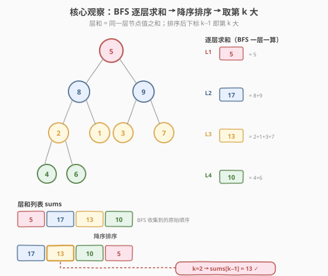
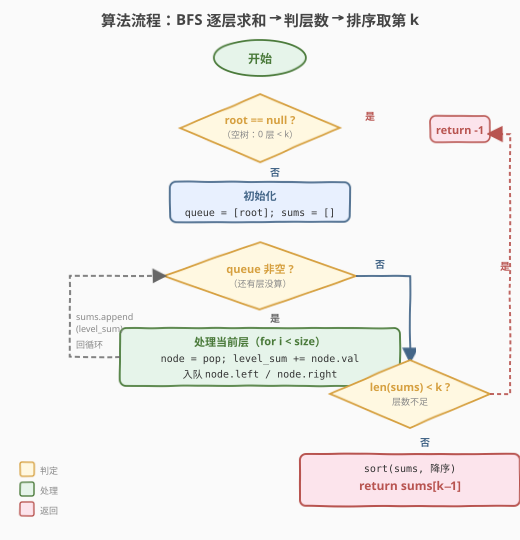

# 二叉树中的第K大层和

- **题目名称**：二叉树中的第K大层和
- **链接**：[2583. 二叉树中的第 K 大层和](https://leetcode.cn/problems/kth-largest-sum-in-a-binary-tree/)
- **难度**：中等
- **标签**：树、二叉树、广度优先搜索（BFS）、排序、堆

## 1. 题目概述

给你一棵二叉树的根节点 `root` 和一个正整数 `k`。树中的**层和**是指**同一层**上节点值的总和。返回树中第 `k` 大的层和（不一定不同）。如果树少于 `k` 层，则返回 `-1`。两个节点与根节点距离相同即认为它们在同一层。

**示例 1**：

```text
输入：root = [5,8,9,2,1,3,7,4,6], k = 2
        5
      /   \
     8     9
    / \   / \
   2   1 3   7
  / \
 4   6
输出：13
解释：各层层和为 L1=5, L2=17, L3=13, L4=10；降序 [17,13,10,5]，第 2 大 = 13。
```

**示例 2**：

```text
输入：root = [1,2,null,3], k = 1
    1
   /
  2
 /
3
输出：3
解释：各层层和为 L1=1, L2=2, L3=3；降序 [3,2,1]，第 1 大 = 3。
```

**约束条件**：

- 树中节点数 $n$ 满足 $2 \le n \le 10^5$
- $1 \le \text{Node.val} \le 10^6$
- $1 \le k \le n$

> 💡 **关键语义**：①「层」由**到根的距离**定义，与 BFS 的「同一批入队节点」完全对应——空节点不入队、不计层数。② 第 $k$ 大是**降序**排名，第 1 大即最大层和。③ 若层数 $L < k$（宽而浅的树遇大 $k$）必须返回 `-1`，这是高频漏判点。

---

## 2. 解题思路

### 2.1 暴力思路：DFS 收集层和 + 重复线性选最大

用 DFS（带 `depth`）或 BFS 把每层节点值累加进数组 `sums`，再求第 $k$ 大：朴素做法是重复 $k$ 轮，每轮线性扫描 `sums` 找当前最大并标记删除（置哨兵值）。

```text
for round in 1..k:
    maxIdx = argmax(sums)     // 每轮 O(L) 线性扫描
    ans = sums[maxIdx]
    sums[maxIdx] = -∞         // 标记已取走
return ans
```

问题：$k$ 轮扫描合计 $O(k \cdot L)$，$L$ 为层数。当树退化为链时 $L = n = 10^5$，$k$ 也可达 $n$，最坏 $O(n^2) = 10^{10}$，超时。需要把「选第 $k$ 大」从 $O(k \cdot L)$ 降到 $O(L \log L)$。

### 2.2 核心观察：BFS 逐层求和 + 降序排序取第 k



两步即可：

1. **逐层求和**：BFS 的 `while + for(size)` 模板天然「一层一批」处理节点。每轮用 `size = queue.size()` 快照当前层节点数，把这一层所有节点出队、累加 `levelSum`，子节点入队；轮末把 `levelSum` 追加进 `sums`。每个节点进队出队各一次，求和总计 $O(n)$。
2. **排序取第 k**：把长度为 $L$ 的 `sums` **降序**排序，第 $k$ 大即下标 $k-1$（$L < k$ 则返回 `-1`）。排序 $O(L \log L)$。

> 💡 **为什么用 BFS 而非 DFS？** 「层和」是**按层聚合**的量，BFS 天然一层一批地处理，`levelSum` 直接在本层 `for` 循环里累加即可，无需预分配「层 → 累加器」的索引数组。DFS 也能做（传 `depth`，`result[depth] += val`），但要管理动态扩展的层数组，对「层」概念不如 BFS 直观；本题两者皆可，BFS 更契合题意、也更易迁移到「最短步数 / 最浅层」类问题。BFS 骨架直接复用 [102. 二叉树的层序遍历](../0101-0200/102_二叉树的层序遍历.md)。

> ⚠️ **溢出陷阱**：单层节点数可达 $\lceil n/2 \rceil \approx 5 \times 10^4$，每个值 $\le 10^6$，单层和最大约 $5 \times 10^{10}$，**超出 32 位 `int`**（$\approx 2.1 \times 10^9$）。`levelSum` 与 `sums` 必须 用 `long long` / Python 整数（Python 自动大整数无需操心，C++ 务必 `long long`）。

### 2.3 算法流程图



1. **特判**：`root == null` → 层数为 0 $< k$，返回 `-1`（约束保证 $n \ge 2$，一般不会触发，但防御性处理）。
2. **初始化**：`queue = [root]`，`sums = []`。
3. **while 队列非空**：取 `size = queue.size()`，`levelSum = 0`；`for i < size` 逐个出队累加，并把非空子节点入队；轮末 `sums.append(levelSum)`。
4. **判层数**：若 `len(sums) < k` 返回 `-1`。
5. **排序返回**：降序排序 `sums`，返回 `sums[k-1]`。

### 2.4 示例演算

![示例演算：4 轮 BFS，sums=[5,17,13,10] → 降序取第 2 大 = 13](../images/kth_level_sum_walkthrough.svg)

以示例 1 `root = [5,8,9,2,1,3,7,4,6], k = 2` 演算，`sums = []`：

| 轮次 | 队列初始 | size | 本层出队收集 | levelSum | sums（追加后） |
|------|----------|------|--------------|----------|----------------|
| L1 | [5] | 1 | 5 | 5 | [5] |
| L2 | [8, 9] | 2 | 8, 9 | 17 | [5, 17] |
| L3 | [2, 1, 3, 7] | 4 | 2,1,3,7 | 13 | [5, 17, 13] |
| L4 | [4, 6] | 2 | 4, 6 | 10 | [5, 17, 13, 10] |
| 末 | []（空，结束） | — | — | — | len = 4 ≥ k=2 ✓ |

BFS 结束后 `sums = [5, 17, 13, 10]`，`len = 4 ≥ k = 2`。降序排序得 `[17, 13, 10, 5]`，第 2 大 = `sums[1] = 13` ✓。

> 💡 注意 L1 出队时把 8、9 入队；L2 出队 8 时把 2、1 入队、出队 9 时把 3、7 入队——下一轮队列正好是 `[2,1,3,7]`，这就是 `size` 快照「按层切批」的效果。`levelSum` 在本层 `for` 循环内累加，不与下一层混淆。

---

## 3. 参考代码

### C++

```cpp
class Solution {
  public:
    long long kthLargestLevelSum(TreeNode* root, int k) {
        vector<long long> sums;                 // 层和列表（务必 long long）
        queue<TreeNode*> q;
        q.push(root);
        while (!q.empty()) {
            int size = q.size();                // ① 当前层节点数快照
            long long levelSum = 0;
            for (int i = 0; i < size; ++i) {     // ② 只处理本层 size 个
                TreeNode* node = q.front();
                q.pop();
                levelSum += node->val;          // ③ 本层累加
                if (node->left)  q.push(node->left);
                if (node->right) q.push(node->right);
            }
            sums.push_back(levelSum);           // ④ 一层一个和
        }
        if ((int)sums.size() < k) return -1;     // ⑤ 层数不足 k
        sort(sums.begin(), sums.end(), greater<long long>());  // ⑥ 降序
        return sums[k - 1];                     // ⑦ 第 k 大 = 下标 k-1
    }
};
```

> ⚠️ **易错点**：(1) `levelSum`、`sums` 用 `long long`，单层和可达 $\approx 5\times10^{10}$，`int` 必溢出；注意 `node->val` 是 `int`，`levelSum += node->val` 时右侧自动提升到 `long long`，安全。(2) `for` 循环上限用**进入循环前快照的 `size`**，不能写 `i < (int)q.size()`——循环内会入队子节点使 `q.size()` 不断变大，导致越界处理到下一层。(3) 判层数 `len(sums) < k` 要在排序前：先把所有层和收集完再比较，避免「少算一层」的误判。

### Python

```python
from collections import deque
from typing import Optional


class Solution:
    def kthLargestLevelSum(self, root: Optional[TreeNode], k: int) -> int:
        sums = []
        q = deque([root])
        while q:
            size = len(q)               # 当前层节点数快照
            level_sum = 0
            for _ in range(size):       # 只处理本层 size 个
                node = q.popleft()
                level_sum += node.val
                if node.left:
                    q.append(node.left)
                if node.right:
                    q.append(node.right)
            sums.append(level_sum)
        if len(sums) < k:               # 层数不足 k
            return -1
        sums.sort(reverse=True)         # 降序
        return sums[k - 1]             # 第 k 大 = 下标 k-1
```

> 💡 Python 整数无上限，无需担心溢出；`sums.sort(reverse=True)` 原地降序。也可写 `return heapq.nlargest(k, sums)[-1]`（内部建小顶堆，等价于第 5 节扩展），但显式 `sort` 更直观。

---

## 4. 复杂度分析

| 维度 | 复杂度 | 说明 |
|------|--------|------|
| 时间复杂度 | $O(n + L \log L)$ | BFS 每节点入队出队各 1 次共 $O(n)$；排序 $L$ 个层和 $O(L \log L)$。$L$ 为层数，$1 \le L \le n$，整体上界 $O(n \log n)$ |
| 空间复杂度 | $O(n)$ | 队列最多存一层节点（满二叉树最宽层约 $n/2$）；`sums` 存 $L$ 个层和 $\le n$ |
| 对照：暴力选最大 | $O(k \cdot L)$ | 重复 $k$ 轮线性扫描，链状树 $L = n$ 时退化为 $O(n^2)$ |

> 💡 排序开销取决于**层数 $L$ 而非节点数 $n$**：宽而浅的树 $L \approx \log n$，排序仅 $O(\log n \log \log n)$ 近乎免费；链状树 $L = n$，排序 $O(n \log n)$。两种极端下 $L \log L \le n \log n$，整体被 BFS 的 $O(n)$ 与排序的 $O(n \log n)$ 共同约束，绝不会超 $O(n \log n)$。

---

## 5. 扩展：小顶堆维护 Top-K（流式求第 k 大）

排序法最直观，但当 $k \ll L$ 时排序「全排为取一个」略显浪费。借鉴 [215. 数组中的第K个最大元素](../0201-0300/215_数组中的第K个最大元素.md) 的 **Top-K 小顶堆**套路：维护一个大小为 $k$ 的**小顶堆**，堆顶始终是当前见过的「第 $k$ 大」。每算出一个层和就入堆，堆内元素超过 $k$ 即弹掉最小者；最终堆顶就是全局第 $k$ 大（若堆内不足 $k$ 说明层数 $< k$，返回 `-1`）。

```cpp
class Solution {
  public:
    long long kthLargestLevelSum(TreeNode* root, int k) {
        priority_queue<long long, vector<long long>, greater<long long>> heap; // 小顶堆
        queue<TreeNode*> q;
        q.push(root);
        while (!q.empty()) {
            int size = q.size();
            long long levelSum = 0;
            for (int i = 0; i < size; ++i) {
                TreeNode* node = q.front(); q.pop();
                levelSum += node->val;
                if (node->left)  q.push(node->left);
                if (node->right) q.push(node->right);
            }
            heap.push(levelSum);
            if ((int)heap.size() > k) heap.pop();   // 只留最大的 k 个
        }
        if ((int)heap.size() < k) return -1;        // 层数 < k
        return heap.top();                          // 堆顶 = 第 k 大
    }
};
```

```python
import heapq
from collections import deque
from typing import Optional


class Solution:
    def kthLargestLevelSum(self, root: Optional[TreeNode], k: int) -> int:
        heap = []                                   # 小顶堆，维护最大的 k 个
        q = deque([root])
        while q:
            size = len(q)
            level_sum = 0
            for _ in range(size):
                node = q.popleft()
                level_sum += node.val
                if node.left:
                    q.append(node.left)
                if node.right:
                    q.append(node.right)
            heapq.heappush(heap, level_sum)
            if len(heap) > k:                        # 超过 k 个弹走最小的
                heapq.heappop(heap)
        if len(heap) < k:                            # 层数 < k
            return -1
        return heap[0]                               # 堆顶 = 第 k 大
```

| 维度 | 排序法 | 小顶堆 Top-K |
|------|--------|--------------|
| 时间 | $O(n + L \log L)$ | $O(n + L \log k)$ |
| 空间 | $O(n)$（存全部层和） | $O(k)$（只留 k 个） |

> ⚠️ **何时选堆？** $k \ll L$ 且层和**流式到达、不能全存**时堆更优（空间 $O(k)$）。本题 $L \le n$、层和总量不大，排序法 $O(n \log n)$ 足够通过，且代码更短更不易错——面试中先给排序法，再口头给出堆的优化即可。注意小顶堆求「第 $k$ 大」、大顶堆求「第 $k$ 小」，方向别搞反。

---

## 6. 面试要点

1. **为什么 `levelSum` 和 `sums` 必须用 `long long`？最大层和是多少？**

   > 单层节点数最多约 $\lceil n/2 \rceil \le 5 \times 10^4$（满二叉树最宽层），每个值 $\le 10^6$，故单层和上界约 $5 \times 10^{10}$，远超 32 位 `int`（$\approx 2.1 \times 10^9$）。用 `long long`（$\approx 9.2 \times 10^{18}$）才安全。Python 整数任意精度，无需操心。这是本题最高频的 WA 点。

2. **第 k 大的排序方向和下标怎么定？**

   > 「第 $k$ 大」是**降序**排名：第 1 大即最大。降序排序后第 $k$ 大位于下标 $k-1$。等价地，升序排序后第 $k$ 大位于下标 $L-k$（$L$ 为层数）。两种写法等价，面试时说清方向即可，别把「第 $k$ 大」和「第 $k$ 小」搞反。

3. **什么情况下返回 -1？为什么约束 $k \le n$ 仍可能层数不足？**

   > $k \le n$ 但**层数 $L$ 可以远小于 $n$**：宽而浅的树（如完全二叉树）$L \approx \log_2 n$，当 $k > L$ 时层数不足，返回 `-1`。例如 $n = 10^5$ 的满二叉树只有 17 层，$k = 18$ 就得返回 `-1`。链状树 $L = n$ 则不会触发。判层数必须在**收集完所有层和之后**做，否则会漏判最后一层。

4. **BFS 的 for 循环上限为什么必须用进入循环前的 size 快照？**

   > `for` 循环内会向队尾入队子节点，`q.size()` 会动态增大。若上限写成 `i < q.size()`，循环会越界处理到刚入队的下一层节点，层和与层数都会错乱。`size = q.size()` 在进入 `for` 前快照当前层节点数，确保「一圈只处理本层」，这是层序遍历家族（102/103/107/199）的通用心法。

5. **不排序、不全存层和，能在线求第 k 大吗？**

   > 能——用大小为 $k$ 的**小顶堆**做 Top-K：每个层和到来即入堆，堆超 $k$ 弹最小者。最终堆顶即第 $k$ 大，时间 $O(L \log k)$、空间 $O(k)$。当 $k \ll L$ 或层和流式到达时优于排序法。但本题 $L \le n$、层和可全存，排序法 $O(n \log n)$ 足够且更直观，是首选解法。堆法是 [215](../0201-0300/215_数组中的第K个最大元素.md)/[703](../0701-0800/703_数据流中的第K大元素.md) Top-K 套路在本题的复用。

> 💡 **一句话总结**：层和是「按层聚合」的量，BFS 的 `while + for(size)` 模板一层一批地累加出全部层和 $O(n)$，降序排序后取 `sums[k-1]` 即第 $k$ 大，层数不足 $k$ 返回 `-1`。务必用 `long long` 防溢出，`size` 快照防越层。

---

## 7. 同类练习题

- [102. 二叉树的层序遍历](https://leetcode.cn/problems/binary-tree-level-order-traversal/)（[题解](../0101-0200/102_二叉树的层序遍历.md)）：本题 BFS 母模板，`while + for(size)` 一层一批的骨架来源
- [103. 二叉树的锯齿形层序遍历](https://leetcode.cn/problems/binary-tree-zigzag-level-order-traversal/)（[题解](../0101-0200/103_二叉树的锯齿形层序遍历.md)）：同 BFS 骨架加方向翻转，对照「逐层聚合」的最小增量变体
- [199. 二叉树的右视图](https://leetcode.cn/problems/binary-tree-right-side-view/)（[题解](../0101-0200/199_二叉树的右视图.md)）：每层只取最右节点，复用同一 BFS 骨架
- [215. 数组中的第K个最大元素](https://leetcode.cn/problems/kth-largest-element-in-an-array/)（[题解](../0201-0300/215_数组中的第K个最大元素.md)）：Top-K 母题，第 5 节小顶堆解法直接复用其套路
- [703. 数据流中的第K大元素](https://leetcode.cn/problems/kth-largest-element-in-a-stream/)（[题解](../0701-0800/703_数据流中的第K大元素.md)）：小顶堆 Top-K 的流式版，对照本题「层和流式入堆」的优化思路
