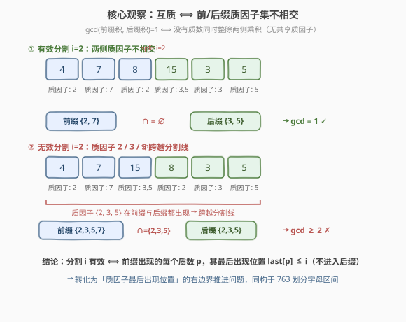
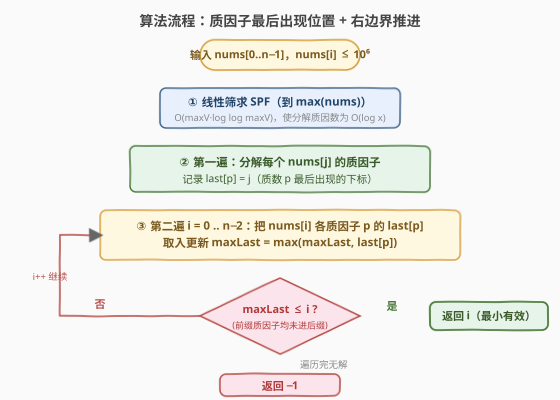
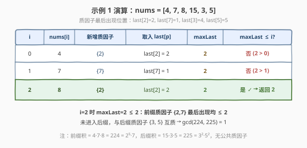

# 分割数组使乘积互质

- **题目名称**：分割数组使乘积互质
- **链接**：[2584. 分割数组使乘积互质](https://leetcode.cn/problems/split-the-array-to-make-coprime-products/)
- **难度**：困难
- **标签**：数组、数学、数论、贪心、双指针、哈希

## 1. 题目概述

给定长度为 $n$、下标从 0 开始的整数数组 `nums`。在下标 $i$（$0 \le i \le n-2$）处**分割**数组，前 $i+1$ 个元素的乘积与剩余元素的乘积若**互质**（即 $\gcd = 1$），则该分割有效。返回**最小**的有效分割下标 $i$；若不存在，返回 $-1$。

> 💡 「互质」即两数无任何公共质因子。例：`gcd(2, 9) = 1` 互质，`gcd(6, 3) = 3` 不互质。

**示例 1**：

```text
输入：nums = [4,7,8,15,3,5]
输出：2
```

各分割点的「前缀积 | 后缀积 | gcd」：

| $i$ | 前缀积 | 后缀积 | gcd | 有效? |
|-----|--------|--------|-----|-------|
| 0 | 4 | 12600 | 4 | ✗ |
| 1 | 28 | 1800 | 4 | ✗ |
| 2 | 224 | 225 | 1 | ✓ ← 最小 |
| 3 | 3360 | 15 | 15 | ✗ |
| 4 | 10080 | 5 | 5 | ✗ |

**示例 2**：

```text
输入：nums = [4,7,15,8,3,5]
输出：-1
```

任何分割点的两侧乘积都至少共享质因子 $2$、$3$ 或 $5$，无有效分割。

**约束条件**：

- $n = \text{nums.length},\ 1 \le n \le 10^4$
- $1 \le \text{nums}[i] \le 10^6$

> ⚠️ **乘积溢出**：$n=10^4$、每个元素至 $10^6$，乘积可达 $10^{24000}$，远超 `long long` / `int128`。**不能**直接算乘积再求 gcd，必须降维到**质因子**层面。

---

## 2. 解题思路

### 2.1 暴力思路：枚举分割 + 大数 gcd

对每个 $i \in [0, n-2]$，算前缀积与后缀积再调 `gcd`。问题：

1. **溢出**：乘积天文数字，C++ 无法存（Python 虽有大整数，但每个数 $10^{24000}$ 位、$O(n)$ 次大数 gcd，超时）；
2. **复杂度**：$O(n)$ 次大数运算，单次 gcd 与位数线性相关，总计不可接受。

必须跳出「算乘积」的思路——**互质只与质因子是否共享有关，与具体数值无关**。

### 2.2 核心观察：互质 ⟺ 质因子集不相交



**关键定理**：

$$
\gcd(\text{前缀积},\ \text{后缀积}) = 1 \iff \text{前缀质因子集} \cap \text{后缀质因子集} = \varnothing
$$

- 若两侧质因子集**不相交**：没有质数同时整除两个乘积，故 gcd 无质因子 → $\gcd = 1$；
- 若**有交集**：存在质数 $p$ 整除两侧乘积 → $p \mid \gcd$ → $\gcd \ge p > 1$。

（质因子只需关心**是否出现**，**重数无关**——$4=2^2$ 与 $8=2^3$ 都只贡献「质数 2 出现」。）

于是分割 $i$ **无效** ⟺ 某质数 $p$ **同时**出现在前缀 $[0..i]$ 与后缀 $[i+1..n-1]$——即 $p$ 的**首次出现 $\le i$** 且**末次出现 $\ge i+1$**，称 $p$ **跨越**分割线 $i$。

> 💡 **转化为「最后出现位置」**：分割 $i$ 有效 ⟺ 前缀出现的每个质数 $p$，其**最后出现位置** $\text{last}[p] \le i$（不进入后缀）。维护「前缀已见质数的 $\max\ \text{last}[p]$」即 $\text{maxLast}$，则 **有效 ⟺ $\text{maxLast} \le i$**。

这与 [763. 划分字母区间](https://leetcode.cn/problems/partition-labels/) 同构：那里对每个字母维护最后出现位置、`end = max(end, last[c])`，首个 $i = \text{end}$ 即闭合一段「自包含」片段。本题只需**第一段**闭合点（且 $\le n-2$）即为答案。

### 2.3 算法流程



1. **线性筛求 SPF**（最小质因子，筛到 $\max(\text{nums})$）：使分解每个 $\text{nums}[j]$ 为 $O(\log \text{nums}[j])$。
2. **第一遍扫描**：对每个 $j$，分解 $\text{nums}[j]$ 的不同质因子 $p$，记录 $\text{last}[p] = j$（不断覆盖，最终值为该质数最后出现的下标）。
3. **第二遍扫描** $i = 0 \dots n-2$：把 $\text{nums}[i]$ 的各质因子 $p$ 的 $\text{last}[p]$ 取入更新 $\text{maxLast} = \max(\text{maxLast}, \text{last}[p])$；若 $\text{maxLast} \le i$，**返回 $i$**（首个有效分割，即最小）。
4. 遍历完仍无 → 返回 $-1$。

> ⚠️ **判定用 $\le$ 而非 $==$**：当 $\text{nums}[i] = 1$（无质因子）时 $\text{maxLast}$ 不增，可能严格小于 $i$，此时分割仍有效（如 `nums = [1, 2]`，$i=0$：前缀积 1、后缀积 2，$\gcd=1$，应用 $\le$ 才能正确返回 0）。一般情形 $\text{maxLast} \ge i$（$\text{nums}[i]$ 自身质因子 $\text{last}[p] \ge i$），退化为 $==$。

### 2.4 示例演算



以示例 1 `nums = [4,7,8,15,3,5]` 演算。质因子分解（不同质因子）：

| $j$ | $\text{nums}[j]$ | 质因子 |
|-----|------------------|--------|
| 0 | 4 | {2} |
| 1 | 7 | {7} |
| 2 | 8 | {2} |
| 3 | 15 | {3,5} |
| 4 | 3 | {3} |
| 5 | 5 | {5} |

故 $\text{last}[2]=2$、$\text{last}[7]=1$、$\text{last}[3]=4$、$\text{last}[5]=5$。第二遍扫描（$\text{maxLast}$ 初值 $-1$）：

| 步骤 | $i$ | $\text{nums}[i]$ | 取入 $\text{last}[p]$ | $\text{maxLast}$ | $\text{maxLast} \le i$? |
|------|-----|------------------|------------------------|-------------------|------------------------|
| 1 | 0 | 4 | $\text{last}[2]=2$ | 2 | $2 \le 0$ ✗ |
| 2 | 1 | 7 | $\text{last}[7]=1$ | 2 | $2 \le 1$ ✗ |
| 3 | 2 | 8 | $\text{last}[2]=2$ | 2 | $2 \le 2$ ✓ → **返回 2** |

- 步骤 1：质数 2 最后出现在下标 2，远超当前 $i=0$ → 还会进入后缀，无效。
- 步骤 3：$i=2$ 时 $\text{maxLast}=2$，前缀质因子 $\{2,7\}$ 的最后出现均 $\le 2$，无一进入后缀；后缀质因子 $\{3,5\}$ 与之不相交 → $\gcd(224,225)=1$，有效。返回 $2$。

> ⚠️ 示例 2 `nums=[4,7,15,8,3,5]`：$\text{last}[2]=3$、$\text{last}[3]=4$、$\text{last}[5]=5$。扫至 $i=4$（$n-2$）时 $\text{maxLast}=5 > 4$，全程不闭合，返回 $-1$。

---

## 3. 参考代码

### C++

```cpp
class Solution {
  public:
    int findValidSplit(vector<int>& nums) {
        int n = nums.size();
        int maxV = *max_element(nums.begin(), nums.end());
        // ① 线性筛（埃氏变体）求最小质因子 SPF
        vector<int> spf(maxV + 1);
        iota(spf.begin(), spf.end(), 0);
        for (int i = 2; (long long)i * i <= maxV; ++i)
            if (spf[i] == i)
                for (int j = i * i; j <= maxV; j += i)
                    if (spf[j] == j) spf[j] = i;
        // ② 第一遍：记录每个质数最后出现的下标
        unordered_map<int,int> last;
        for (int j = 0; j < n; ++j) {
            int x = nums[j];
            while (x > 1) {
                int p = spf[x];
                last[p] = j;
                while (x % p == 0) x /= p;
            }
        }
        // ③ 第二遍：右边界推进，首个 maxLast <= i 即答案
        int maxLast = -1;
        for (int i = 0; i < n - 1; ++i) {
            int x = nums[i];
            while (x > 1) {
                int p = spf[x];
                maxLast = max(maxLast, last[p]);
                while (x % p == 0) x /= p;
            }
            if (maxLast <= i) return i;
        }
        return -1;
    }
};
```

> ⚠️ **易错点**：(1) 筛上界取 $\max(\text{nums})$ 而非定值，避免 $\text{nums}$ 全小数时浪费；`i*i` 用 `long long` 防 `i` 接近 $\sqrt{10^6}$ 时溢出。(2) 判定用 `maxLast <= i`（非 `==`）以正确处理 $\text{nums}[i]=1$。(3) `x>1` 内层 `while` 去掉重数，只保留不同质因子，避免同一质数重复更新。(4) 循环上界 `n-1`（即 $n-2$ 含），保证后缀非空。

### Python

```python
class Solution:
    def findValidSplit(self, nums: List[int]) -> int:
        n = len(nums)
        maxV = max(nums)
        # ① 最小质因子 SPF（埃氏变体）
        spf = list(range(maxV + 1))
        i = 2
        while i * i <= maxV:
            if spf[i] == i:
                for j in range(i * i, maxV + 1, i):
                    if spf[j] == j:
                        spf[j] = i
            i += 1
        # ② 每个质数最后出现的下标
        last = {}
        for j, x in enumerate(nums):
            while x > 1:
                p = spf[x]
                last[p] = j
                while x % p == 0:
                    x //= p
        # ③ 右边界推进，首个 maxLast <= i 即答案
        max_last = -1
        for i in range(n - 1):
            x = nums[i]
            while x > 1:
                p = spf[x]
                if last[p] > max_last:
                    max_last = last[p]
                while x % p == 0:
                    x //= p
            if max_last <= i:
                return i
        return -1
```

> 💡 Python 无内置 SPF，但筛法写法与 C++ 镜像；`maxV` 可达 $10^6$，筛 $O(10^6)$ 在时限内可接受。`last` 用 `dict`，质因子总数 $\le 10^6/\ln 10^6 \approx 7.2\times 10^4$，哈希开销小。

---

## 4. 复杂度分析

| 维度 | 复杂度 | 说明 |
|------|--------|------|
| 时间复杂度 | $O(M \log \log M + n \cdot \omega)$ | $M=\max(\text{nums})\le 10^6$ 为筛上界；$\omega \le 7$ 为单元素不同质因子个数，分解与扫描合计 $O(n)$ 级 |
| 空间复杂度 | $O(M)$ | SPF 数组 $O(M)$；`last` 至多存不同质数个数 $O(M/\ln M)$，被 SPF 覆盖 |
| 对照：暴力大数 | $O(n \cdot \text{位数})$ | 乘积达 $10^{24000}$ 位，大数 gcd 与位数线性，超时且 C++ 无法存 |

> 💡 降复杂度关键：把「巨大乘积的 gcd」转化为「质因子集合是否相交」——用**数论结构**（唯一分解定理）把指数级的大数运算压缩到 $O(n\omega)$ 的质因子操作，这是数论题的常见范式。

---

## 5. 扩展：与 763 划分字母区间同构

[763. 划分字母区间](https://leetcode.cn/problems/partition-labels/) 要求把字符串分成尽量多的段，使同一字母只出现在一段内。其解法：

1. 预处理每个字母的**最后出现位置** $\text{last}[c]$；
2. 扫描时 `end = max(end, last[c])`，当 $i = \text{end}$ 闭合一段。

本题是其**前缀单段版**：把「字母」换成「质因子」、「字符串」换成「数组」，求的不再是所有段，而是**首个闭合点**（且要求 $\le n-2$，留出非空后缀）。两者同源于一个抽象模型：

> **元素有「最后出现位置」，分割有效 ⟺ 当前片段右端 $\ge$ 片段内所有元素的最后出现位置。**

这一模型还见诸 [45. 跳跃游戏 II](https://leetcode.cn/problems/jump-game-ii/)（区间端点推进）、[55. 跳跃游戏](https://leetcode.cn/problems/jump-game/)（能否覆盖到末尾）等「贪心右边界」类问题。

> 💡 **质因子分解替代大数运算**是处理「乘积级问题」的通用降维手段：当题目涉及乘积的整除性、gcd、互质时，几乎都应转到质因子域。同类见 [172. 阶乘后的零](../0001-0100/172_阶乘后的零.md)（数 $n!$ 中质因子 5 的幂次）、[204. 计数质数](../0001-0100/204_计数质数.md)（埃氏筛模板）。

---

## 6. 面试要点

1. **为什么不能直接算乘积再 gcd？**

   > $n \le 10^4$、$\text{nums}[i] \le 10^6$，乘积可达 $10^{24000}$，远超任何定宽整数（C++ `long long` 仅约 $10^{19}$）。即便 Python 大整数可表示，$O(n)$ 次大数 gcd 的复杂度与位数线性，必然超时。必须利用「互质只关心质因子是否共享」降维。

2. **「互质 ⟺ 质因子集不相交」如何证明？**

   > 由唯一分解定理，$\gcd(a,b)=1$ 等价于 $a,b$ 无公共质因子。若两侧质因子集不相交，则没有任何质数同时整除两乘积，gcd 无质因子故为 1；反之若有交集质数 $p$，则 $p \mid \gcd$，$\gcd \ge p > 1$。重数不影响判定，故只存不同质因子。

3. **为什么要两遍扫描？一遍不行吗？**

   > 第一遍建立全局 $\text{last}[p]$（每个质数在整个数组中最后出现的位置），需先分解所有 $\text{nums}[j]$。第二遍从左到右维护「前缀已见质数的 $\max\ \text{last}$」，判定 $\text{maxLast} \le i$。一遍无法在前缀内即时知道某质数是否还会在后缀出现——必须先全局预算 $\text{last}$，再前缀推进判定。

4. **判定条件为何是 $\text{maxLast} \le i$ 而非 $==$？边界情形？**

   > 有效 ⟺ 前缀所有质数最后出现 $\le i$，即 $\max\ \text{last} \le i$。一般 $\text{nums}[i]>1$ 时其自身质因子 $\text{last} \ge i$ 使 $\text{maxLast} \ge i$，退化为 $==$；但 $\text{nums}[i]=1$（无质因子）时 $\text{maxLast}$ 不增，可能严格 $< i$，此时仍有效（如 $[1,2]$ 在 $i=0$），必须用 $\le$。面试时需主动指出这一边界，体现严谨。

5. **复杂度能否更优？质因子分解能否避免筛？**

   > 筛 $O(M \log \log M)$、$M\le 10^6$ 已是本题主导。也可对每个 $\text{nums}[i]$ 试除到 $\sqrt{x}$ 分解，$O(n\sqrt{M}) = 10^4 \times 10^3 = 10^7$，省去 $O(M)$ 空间但时间略高。筛法空间换时间、且与 [204 埃氏筛](../0001-0100/204_计数质数.md) 同源，更贴合数论题范式。

> 💡 **一句话总结**：互质 ⟺ 质因子集不相交；分解各元素质因子、记录每质数最后出现位置 $\text{last}[p]$，从左推进右边界 $\text{maxLast}=\max\ \text{last}[p]$，首个 $\text{maxLast} \le i$ 即最小有效分割——同构于 763 划分字母区间的前缀单段版。

---

## 7. 同类练习题

- [763. 划分字母区间](https://leetcode.cn/problems/partition-labels/)：本题直接同构母题——「最后出现位置 + 右边界推进」贪心闭合分段，字母↔质因子、求所有段↔求首段
- [172. 阶乘后的零](https://leetcode.cn/problems/factorial-trailing-zeroes/)（[题解](../0001-0100/172_阶乘后的零.md)）：同为「乘积级问题降维到质因子」范式，勒让德公式数 5 的幂次
- [204. 计数质数](https://leetcode.cn/problems/count-primes/)（[题解](../0001-0100/204_计数质数.md)）：本题 SPF 筛的埃氏筛母题，数论筛法基础模板
- [55. 跳跃游戏](https://leetcode.cn/problems/jump-game/)：贪心右边界 `max(end, i+nums[i])` 覆盖判定，与本题右边界推进同源
- [2521. 数组乘积中的不同质因数数目](https://leetcode.cn/problems/distinct-prime-factors-of-product-of-an-array/)（[题解](2521_数组乘积中的不同质因数数目.md)）：质因子分解 + 去重计数的姊妹题，共享 SPF 分解框架
