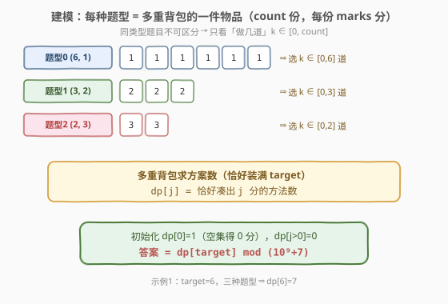
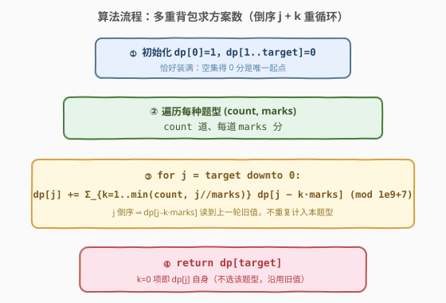

# LeetCode 获得分数的方法数 题解

## 1. 题目概述

- **标题 / 题号**：获得分数的方法数（#2585，hard）
- **链接**：https://leetcode.cn/problems/number-of-ways-to-earn-points/
- **难度**：困难
- **标签**：动态规划、背包、多重背包

**题意**：考试中有 `n` 种类型的题目。给定整数 `target` 和二维数组 `types`，其中 `types[i] = [count_i, marks_i]` 表示第 `i` 种类型有 `count_i` 道、每道值 `marks_i` 分。返回**恰好**得到 `target` 分的方法数，对 $10^9+7$ 取余。

> ⚠️ **同类型题目不可区分**：若某类型有 3 道，则「做第 1、2 道」与「做第 1、3 道」「第 2、3 道」视为**同一种**方法。因此对每种类型，真正有意义的选择只有「做几道」$k \in [0, \text{count}_i]$，而非「做哪几道」。

**示例 1**：

```text
输入：target = 6, types = [[6,1],[3,2],[2,3]]
输出：7
解释：凑出 6 分的 7 种方法——
- 6 道类型0：1×6 = 6
- 4 道类型0 + 1 道类型1：1×4 + 2×1 = 6
- 2 道类型0 + 2 道类型1：1×2 + 2×2 = 6
- 3 道类型0 + 1 道类型2：1×3 + 3×1 = 6
- 1 道类型0 + 1 道类型1 + 1 道类型2：1 + 2 + 3 = 6
- 3 道类型1：2×3 = 6
- 2 道类型2：3×2 = 6
```

**示例 2**：

```text
输入：target = 5, types = [[50,1],[50,2],[50,5]]
输出：4
```

**示例 3**：

```text
输入：target = 18, types = [[6,1],[3,2],[2,3]]
输出：1
解释：只有做完全部题目（6×1 + 3×2 + 2×3 = 18）才能凑 18 分。
```

**约束**：

- $1 \le \text{target} \le 1000$
- $1 \le n = \text{types.length} \le 50$
- $1 \le \text{count}_i, \text{marks}_i \le 50$

## 2. 解题思路

### 2.1 暴力思路

对每种类型独立决定做 $k_i$ 道（$0 \le k_i \le \text{count}_i$），枚举所有组合共 $\prod_i (\text{count}_i+1)$ 种，逐一检查 $\sum k_i \cdot \text{marks}_i = \text{target}$。最坏 $\prod_i 51 \approx 51^{50}$ 种组合，指数级爆炸。关键在于把「按类型凑到指定总和」识别为**背包计数**问题。

### 2.2 核心观察：多重背包求方案数



把每种题型看作**多重背包（bounded knapsack）的一件物品**：

- **物品**：第 $i$ 种题型；**重量 = 价值 = 分值** $\text{marks}_i$；
- **件数上限**：$\text{count}_i$ 道（可取 $0 \dots \text{count}_i$ 件，同类型不可区分故只看数量）；
- **容量**：$\text{target}$ 分；
- **目标**：**恰好**装满容量（凑出恰好 $\text{target}$ 分）的**方案数**。

> 💡 **与背包家族的对照**：$\text{count}_i = 1$ 退化为 [0-1 背包](../0401-0500/416_分割等和子集.md)（如 [494. 目标和](../0401-0500/494_目标和.md)）；$\text{count}_i = \infty$ 是 [完全背包](../0301-0400/322_零钱兑换.md)（[322. 零钱兑换](https://leetcode.cn/problems/coin-change/)）；本题 $\text{count}_i$ 有限，正是介于二者之间的**多重背包**。

**状态定义**：

$$
dp[j] = \text{处理过若干题型后，恰好凑出 } j \text{ 分的方法数}
$$

**恰好装满**语义 ⇒ 初始化 $dp[0] = 1$（空集得 0 分，唯一起点）、$dp[j>0]=0$；最终答案 $dp[\text{target}]$。

> ⚠️ 注意「恰好」与「至多」的初始化差异（对照 [474. 一和零](../0401-0500/474_一和零.md) 的「至多」全 0 初始化）：求方案数/能否装满属「恰好」，必须以 $dp[0]=1$ 起算、其余不可达，否则会把「不装满」的方案误算入答案。

**状态转移**（每处理一种题型 $(c, m)$，在原数组上**倒序**更新）：

$$
dp[j] \;\longleftarrow\; \sum_{k=0}^{\min(c,\;\lfloor j/m \rfloor)} dp_{\text{prev}}[j - k\cdot m]
$$

其中 $k$ 为「该题型做几道」，$k=0$ 项即 $dp[j]$ 自身（不选该题型、沿用旧值）。

### 2.3 算法流程图



> ⚠️ **为什么 $j$ 必须倒序**：$dp[j]$ 的转移依赖更小下标 $dp[j - k\cdot m]$（$k\ge1$）。若 $j$ 升序，这些更小下标在本轮已被当前题型更新过，相当于「同一题型被反复计入」，超出 $\text{count}_i$ 件。倒序保证读到的 $dp[j-k\cdot m]$ 始终是**上一轮**旧值——这是 0-1/多重背包「每件物品只用一轮」的同一套机制（对照 [474](../0401-0500/474_一和零.md) 两维倒序）。

### 2.4 示例演算

以示例 1 `target=6, types=[[6,1],[3,2],[2,3]]` 为例，观察 $dp[0..6]$ 的演化：

![示例演算：dp[6] 经三种题型逐步 0→1→4→7](../images/ways_points_walkthrough.svg)

| 处理题型 | dp[0] | dp[1] | dp[2] | dp[3] | dp[4] | dp[5] | dp[6] | 说明 |
|----------|-------|-------|-------|-------|-------|-------|-------|------|
| 初始 | 1 | 0 | 0 | 0 | 0 | 0 | 0 | 仅空集 |
| (6, 1) | 1 | 1 | 1 | 1 | 1 | 1 | 1 | 1 分题有 6 道，凑 0..6 分各 1 法 |
| (3, 2) | 1 | 1 | 1 | 2 | 3 | 3 | 4 | 叠加「选 1..3 道 2 分题」 |
| (2, 3) | 1 | 1 | 1 | 3 | 4 | 4 | **7** | 叠加「选 1..2 道 3 分题」 |

- 处理 $(3,2)$ 时 $dp[6]$ 从 $1 \to 4$：$dp[6] = 1(\text{不选}) + dp[4] + dp[2] + dp[0] = 1+1+1+1 = 4$（选 0/1/2/3 道 2 分题后，剩余分由 1 分题凑）。
- 处理 $(2,3)$ 时 $dp[6]$ 从 $4 \to 7$：$dp[6] = 4(\text{不选}) + dp[3] + dp[0] = 4 + 2 + 1 = 7$（选 0/1/2 道 3 分题）。✓

> 💡 **关键直觉**：$dp[j]$ 每轮累加的是「为该题型预留 $k\cdot m$ 分后，剩余 $j-k\cdot m$ 分用**已处理题型**凑的旧方案数」。倒序 + 读旧值，天然保证「同类型只在本轮内累加 $k=0..c$」而不串味。

## 3. 参考代码

### C++

```cpp
class Solution {
  public:
    int waysToReachTarget(int target, vector<vector<int>>& types) {
        const int MOD = 1000000007;
        vector<int> dp(target + 1, 0);
        dp[0] = 1;                                  // 恰好装满：空集得 0 分
        for (const auto& t : types) {
            int cnt = t[0], m = t[1];
            for (int j = target; j >= 0; --j) {     // 倒序：保证读到上一轮旧值
                for (int k = 1; k <= cnt && k * m <= j; ++k) {
                    dp[j] = (dp[j] + dp[j - k * m]) % MOD;
                }
            }
        }
        return dp[target];
    }
};
```

> 💡 内层 $k$ 从 1 起（$k=0$ 即 `dp[j]` 自身，已天然包含）。条件 `k * m <= j` 等价于 `j - k*m >= 0`，避免越界。

### Python

```python
class Solution:
    def waysToReachTarget(self, target: int, types: List[List[int]]) -> int:
        MOD = 10**9 + 7
        dp = [0] * (target + 1)
        dp[0] = 1                                  # 恰好装满：空集得 0 分
        for cnt, m in types:
            for j in range(target, -1, -1):        # 倒序：保证读到上一轮旧值
                for k in range(1, min(cnt, j // m) + 1):
                    dp[j] = (dp[j] + dp[j - k * m]) % MOD
        return dp[target]
```

## 4. 复杂度分析

| 维度 | 复杂度 | 说明 |
|------|--------|------|
| 时间复杂度 | $O(n \cdot \text{target} \cdot \overline{c})$ | 每种题型对每个容量 $j$ 枚举 $k=1..\min(c,\lfloor j/m \rfloor)$；$\overline c \le 50$，最坏 $50 \times 1000 \times 50 \approx 2.5\times10^6$ |
| 空间复杂度 | $O(\text{target})$ | 一维滚动 `dp`，大小 $\text{target}+1$ |
| 对照：暴力 | $O(\prod(\text{count}_i+1))$ | 枚举各题型做几道的全组合，指数级 |

> 💡 本题数据范围下朴素多重背包已足够。若 $\text{count}_i$ 与 $\text{target}$ 同阶增大，可用第 5 节的二进制拆分 / 单调队列把单轮 $O(\text{target}\cdot c)$ 降到 $O(\text{target}\log c)$ 或 $O(\text{target})$。

## 5. 扩展：多重背包的优化与语义对照

### 5.1 二进制拆分 → 0-1 背包求方案数

多重背包的通用优化：把第 $i$ 种的 $\text{count}_i$ 件按**二进制**拆成 $\{1,2,4,\dots,2^p, r\}$（$r$ 为余数，$r < 2^{p+1}$）共 $O(\log \text{count}_i)$ 个「打包物品」，每个打包物品「整包选或不选」。由于任意 $k \in [0, \text{count}_i]$ 恰可用这些打包物品的子集和**唯一表示**，转成 0-1 背包求方案数后结果不变：

```cpp
// 二进制拆分版：把每种题型拆成 log 个 0-1 物品
for (const auto& t : types) {
    int c = t[0], m = t[1];
    for (int p = 1; c > 0; p <<= 1) {
        int take = min(p, c);      // 这一打包有几道
        c -= take;
        for (int j = target; j >= take * m; --j)   // 0-1 背包倒序
            dp[j] = (dp[j] + dp[j - take * m]) % MOD;
    }
}
```

> ⚠️ 二进制拆分对**最值**背包恒成立；对**计数**同样成立，因为子集和与 $k$ 一一对应，每个 $k$ 恰被一组打包选取表示，方案不重不漏。

时间 $O(n \cdot \log(\max c) \cdot \text{target}) \approx 50 \times 6 \times 1000 = 3\times10^5$，常数更优。进一步可用**单调队列**把每种题型的转移降到 $O(\text{target})$（按 $j \bmod m$ 分组，维护长度 $c$ 的滑窗和），总复杂度 $O(n\cdot\text{target})$。

### 5.2 「恰好」vs「至多」语义速查

| 语义 | 含义 | 初始化 | 代表题 |
|------|------|--------|--------|
| 恰好装满 | 总和**等于**容量 | `dp[0]=1`，其余 `0`（计数）/ `-∞`（最值） | **本题 2585**、[494. 目标和](https://leetcode.cn/problems/target-sum/) |
| 至多装满 | 总和**不超过**容量 | `dp` 全 `0` | [474. 一和零](../0401-0500/474_一和零.md)、[322. 零钱兑换](../0301-0400/322_零钱兑换.md) |

## 6. 面试要点

1. **为什么是多重背包，而不是 0-1 / 完全背包？**

   > 每种题型有 $\text{count}_i$ 道、同类型不可区分，于是对它只能选「做几道」$k\in[0,\text{count}_i]$——这正是「每件物品有有限件数上限」的多重背包。$\text{count}_i=1$ 退化为 0-1，$\text{count}_i=\infty$ 则是完全背包，本题居于其间。

2. **为什么 $j$ 要倒序？**

   > 转移读 $dp[j-k\cdot m]$（$k\ge1$，更小下标）。$j$ 倒序保证这些更小下标尚未被本轮更新，读到的仍是上一轮旧值，等价于「用新数组重算」而不重复计入当前题型。升序会让当前题型在数组里「滚雪球」，超出 $\text{count}_i$ 件。

3. **为什么初始化 $dp[0]=1$、其余 $0$？**

   > 「恰好凑出 $j$ 分」是**恰好装满**语义：$dp[0]=1$ 表示空集凑 0 分有 1 法（唯一合法起点）；$j>0$ 初始不可达故为 0。若误用「至多」的全 0 初始化，会把「不装满」的方案算进答案，错。

4. **内层 $k$ 循环能否省掉？**

   > 能。二进制拆分把 $\text{count}_i$ 拆成 $O(\log c)$ 个 0-1 物品后，内层只剩「倒序 + 选/不选」两层循环，复杂度从 $O(\text{target}\cdot c)$ 降到 $O(\text{target}\log c)$；更进一步用单调队列维护同余组滑窗和可降到 $O(\text{target})$。本题数据范围下朴素即可，但面试官常追问优化。

5. **「同类型不可区分」如何体现在 DP 中？**

   > $k$ 枚举的是**数量**而非「选哪些下标」，因此同类型选任意 $k$ 道都合并为一种，天然去重。若题目改为「同类型各题可区分」，则变成排列计数（每种题型选 $k$ 道有 $\binom{\text{count}_i}{k}$ 种），需在转移里乘上组合数，不再是朴素多重背包。

> 💡 **一句话总结**：题型=有限件数物品、分值=重量、target=恰好容量 ⇒ 多重背包求方案数；倒序 $j$ + $k$ 重循环累加「预留 $k\cdot m$ 后剩余的旧方案数」，$O(n\cdot\text{target}\cdot\overline c)$ 解决。

## 同类练习题

| # | 题目 | 与本题的关联 |
|---|------|-------------|
| 494 | [目标和](https://leetcode.cn/problems/target-sum/)（[题解](../0401-0500/494_目标和.md)） | 0-1 背包求方案数、恰好装满——对照 $\text{count}_i=1$ 的退化版与初始化 |
| 322 | [零钱兑换](https://leetcode.cn/problems/coin-change/)（[题解](../0301-0400/322_零钱兑换.md)） | 完全背包（件数无上限），对照「至多装满求最值」与本题「恰好装满求方案数」 |
| 474 | [一和零](https://leetcode.cn/problems/ones-and-zeroes/)（[题解](../0401-0500/474_一和零.md)） | 二维费用 0-1 背包，对照「至多」全 0 初始化与两维倒序 |
| 879 | [盈利计划](https://leetcode.cn/problems/profitable-schemes/) | 多维费用背包求方案数（成员数 + 最低利润），本题向更多维度的推广 |
| 416 | [分割等和子集](https://leetcode.cn/problems/partition-equal-subset-sum/)（[题解](../0401-0500/416_分割等和子集.md)） | 0-1 背包恰好装满判定，本题的多重背包前置模板 |
