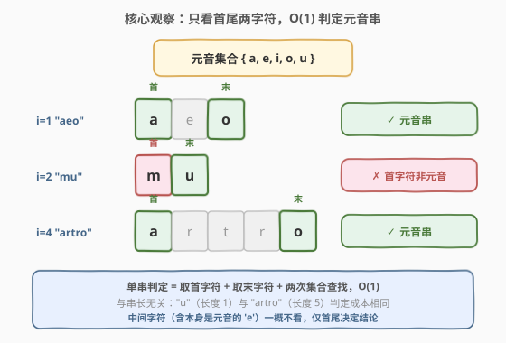
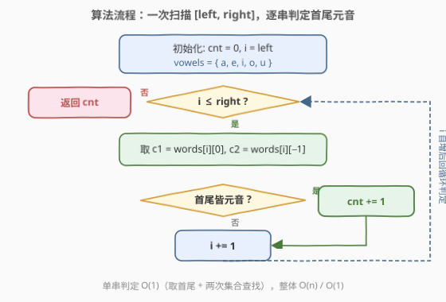

# 统计范围内的元音字符串数

- **题目名称**：统计范围内的元音字符串数
- **链接**：[2586. 统计范围内的元音字符串数](https://leetcode.cn/problems/count-the-number-of-vowel-strings-in-range/)
- **难度**：简单
- **标签**：数组、字符串、一次遍历

## 1. 题目概述

给你一个下标从 $0$ 开始的字符串数组 `words` 以及两个整数 `left` 和 `right`。若一个字符串**以元音字母开头并以元音字母结尾**，则称其为**元音字符串**；元音字母为 `'a'、'e'、'i'、'o'、'u'`。返回 `words[left..right]`（**闭区间**）中元音字符串的数目。

**示例 1**：

```text
输入：words = ["are","amy","u"], left = 0, right = 2
输出：2
解释：
  "are"：以 'a' 开头、'e' 结尾 → 元音串 ✓
  "amy"：以 'a' 开头、'y' 结尾 → 'y' 非元音 ✗
  "u"  ：以 'u' 开头、'u' 结尾 → 元音串 ✓
范围内共 2 个。
```

**示例 2**：

```text
输入：words = ["hey","aeo","mu","ooo","artro"], left = 1, right = 4
输出：3
解释（仅看下标 1..4，"hey" 不在范围内）：
  "aeo"  ：a..o → ✓
  "mu"   ：m..u → 首字符非元音 ✗
  "ooo"  ：o..o → ✓
  "artro"：a..o → ✓
范围内共 3 个。
```

**约束条件**：

- $1 \le \text{words.length} \le 1000$
- $1 \le \text{words}[i].\text{length} \le 10$
- `words[i]` 仅由小写英文字母组成
- $0 \le \text{left} \le \text{right} < \text{words.length}$

> 💡 **读题要点**：「元音串」是单个字符串的属性——只取决于**首字符**与**末字符**，与中间字符、与串长均无关。题目只给**一个**区间 $[\text{left}, \text{right}]$，故只需对该区间做一次线性扫描即可，$n \le 1000$ 规模下毫无压力。

---

## 2. 解题思路

### 2.1 暴力思路：范围内逐串筛选

最直白的做法：令计数器 $\text{cnt}=0$，遍历 $i$ 从 $\text{left}$ 到 $\text{right}$，对每个 `words[i]` 取首字符 `words[i][0]` 与末字符 `words[i][-1]`，若两者**皆**在元音集合 $\{'a','e','i','o','u'\}$ 内，则 $\text{cnt} \mathrel{+}= 1$。遍历结束返回 $\text{cnt}$。

```text
vowels = {'a','e','i','o','u'}
cnt = 0
for i in left..right:
    if words[i][0] ∈ vowels and words[i][-1] ∈ vowels:
        cnt += 1
return cnt
```

时间 $O(\text{right}-\text{left}+1) = O(n)$，空间 $O(1)$。对单次查询而言，**这已是最优**——至少要把范围内的每个字符串"看一眼"，下界 $\Omega(n)$ 不可破。

> ⚠️ 常见误区有二：① 误把 `words[i]` 整串扫一遍找"首个元音/末个元音"——其实首字符就是 `words[i][0]`、末字符就是 `words[i][-1]`，$O(1)$ 直取，无需扫描；② 漏判单字符串：如 `"u"` 首末同为 `'u'`，仍是元音串，判一次即可，不必特判长度。

### 2.2 核心观察：单串 $O(1)$ 判定 + 为何不套前缀和



**关键洞察**：元音串的判定**只取决于首尾两字符**，与中间字符、与串长无关。于是每个 `words[i]` 的判定是 $O(1)$——取两个字符、各查一次元音集合（哈希集合或 `"aeiou"` 成员判断，均为 $O(1)$）。长度为 $1$ 的 `"u"` 与长度为 $10$ 的串判定成本完全相同。

由此，单次扫描 $[\text{left},\text{right}]$ 的总成本是 $O(\text{right}-\text{left}+1)$、空间 $O(1)$，已触下界。

> 💡 **为什么不用前缀和？** 本题的"中等版"是 [2559. 统计范围内的元音字符串数](../2501-2600/2559_统计范围内的元音字符串数.md)：同样的元音首尾判定，但给出 $q$ 个查询 $[l_j, r_j]$。2559 中若对每个查询各扫一遍是 $O(nq)$，$n,q$ 均达 $10^5$ 时 $\sim 10^{10}$ 必超时，故需把判定压成 $0/1$ 标记、建一维前缀和，每次查询 $O(1)$ 差分，总体 $O(n+q)$。**而 2586 只有 $q=1$ 个查询**：前缀和方案需 $O(n)$ 预处理 $+\ O(1)$ 查询 $= O(n)$，与直接扫描的 $O(n)$ 同阶，却多花 $O(n)$ 空间与一次全量预处理——**不划算**。这正是「数据结构的选择取决于操作次数」的典型例证：当查询数 $q=1$，$O(n)$ 预处理换不来任何加速，直接扫描即是最简最优解。

### 2.3 算法流程图



流程分三阶段：

1. **初始化**：`cnt = 0`，`vowels = {'a','e','i','o','u'}`，`i = left`；
2. **循环扫描**：当 $i \le \text{right}$：
   - 取 $c_1 = \text{words}[i][0]$、$c_2 = \text{words}[i][-1]$；
   - 若 $c_1 \in \text{vowels}$ **且** $c_2 \in \text{vowels}$，则 $\text{cnt} \mathrel{+}= 1$；
   - $i \mathrel{+}= 1$；
3. **返回** `cnt`。

> 💡 「且」是关键：首尾**都**得是元音才计数，缺一不可。这也是 `"mu"`（首 `m` 非元音）被排除、`"amy"`（末 `y` 非元音）被排除的原因——`'y'` 在本题定义里**不是**元音。

### 2.4 示例演算

![示例演算：words 在 [left=1, right=4] 范围内逐串判定首尾元音，cnt 依次 1→1→2→3](../images/cntvowel2586_walkthrough.svg)

以示例 2 `words = ["hey","aeo","mu","ooo","artro"]`，$\text{left}=1,\ \text{right}=4$ 为例。下标 $0$（`"hey"`）不在范围内，跳过；对范围内 $i=1..4$ 逐串判定：

| $i$ | `words[i]` | 首字符 | 末字符 | 首 $\in$ 元音? | 末 $\in$ 元音? | 元音串? | 更新后 `cnt` |
|-----|------------|--------|--------|----------------|----------------|---------|--------------|
| 1 | "aeo"   | a | o | ✓ | ✓ | ✓ | 1 |
| 2 | "mu"    | m | u | ✗ | ✓ | ✗ | 1 |
| 3 | "ooo"   | o | o | ✓ | ✓ | ✓ | 2 |
| 4 | "artro" | a | o | ✓ | ✓ | ✓ | 3 |

返回 `3`，与示例一致 ✓。

> 💡 **"mu" 为何被排除**：末字符 `'u'` 是元音，但首字符 `'m'` 不是——首尾须**皆**元音，故 ✗，`cnt` 不增。**"ooo" 为何入选**：首 `'o'`、末 `'o'` 皆是元音，中间的 `'o'` 看都不看（即便它也是元音），判定仍为 ✓。

> 💡 **例 1 自检**：`words = ["are","amy","u"]`，$\text{left}=0,\text{right}=2$：`"are"`(a..e ✓)→1、`"amy"`(a..y，`y` 非元音 ✗)→1、`"u"`(u..u ✓)→2，返回 `2` ✓。

---

## 3. 参考代码

### C++（一次扫描，$O(n)$ / $O(1)$）

```cpp
class Solution {
public:
    int vowelStrings(vector<string>& words, int left, int right) {
        auto isVowel = [](char c) {
            return c=='a'||c=='e'||c=='i'||c=='o'||c=='u';
        };
        int cnt = 0;
        for (int i = left; i <= right; ++i) {
            const string& w = words[i];
            if (isVowel(w.front()) && isVowel(w.back())) {
                ++cnt;
            }
        }
        return cnt;
    }
};
```

> 💡 `isVowel` 写成 lambda，编译期内联为 5 次比较，比 `set.count` / `string::find` 更快。`w.front()`/`w.back()` 直接取首末字符，$O(1)$，且对长度为 $1$ 的串两者指向同一字符，结论不变。`const string& w` 避免逐元素拷贝。

### Python（一次扫描，$O(n)$ / $O(1)$）

```python
class Solution:
    def vowelStrings(self, words: List[str], left: int, right: int) -> int:
        vowels = set("aeiou")
        cnt = 0
        for i in range(left, right + 1):
            w = words[i]
            if w[0] in vowels and w[-1] in vowels:
                cnt += 1
        return cnt
```

> 💡 `vowels = set("aeiou")` 集合查找 $O(1)$；`w[0]` / `w[-1]` 取首末，长度为 $1$ 时二者相同。更紧凑的写法：`return sum(w[0] in vowels and w[-1] in vowels for w in words[left:right+1])`——切片 + 生成器一行搞定，但切片 $O(k)$ 复制子列表；显式循环用下标 `range(left, right+1)` 避免复制，常数更优。

---

## 4. 复杂度分析

| 维度 | 复杂度 | 说明 |
|------|--------|------|
| **时间复杂度** | $O(\text{right}-\text{left}+1) \subseteq O(n)$ | 范围内每个字符串取首尾各查一次元音集合，单串 $O(1)$ |
| **空间复杂度** | $O(1)$ | 仅 `cnt` 与元音集合（固定 5 个元素，常数） |
| 对照：前缀和方案 | $O(n)$ 时间 / $O(n)$ 空间 | 预处理整条前缀和再差分，单查询下与直接扫描同阶但多 $O(n)$ 空间 |

> 💡 $O(n)$ 已是最优：单次查询需把范围内每个字符串至少"看一眼"，$\Omega(\text{right}-\text{left}+1)$ 不可破。元音集合虽也可写成有序判定，但 $|V|=5$ 是常数，任何写法都是 $O(1)$。

---

## 5. 扩展：单查询退化——前缀和何时才划算

本题与 [2559. 统计范围内的元音字符串数](../2501-2600/2559_统计范围内的元音字符串数.md) 共享同一道「元音首尾判定」，区别只在**查询次数** $q$：

| 题号 | 查询数 $q$ | $n$ 规模 | 最优策略 | 总复杂度 |
|------|-----------|----------|----------|----------|
| **2586（本题）** | $1$ | $\le 10^3$ | 直接扫描 $[\text{left},\text{right}]$ | $O(n)$ 时间 / $O(1)$ 空间 |
| 2559 | $\le 10^5$ | $\le 10^5$ | $0/1$ 标记 + 前缀和，每次查询差分 | $O(n+q)$ 时间 / $O(n)$ 空间 |

**临界点分析**：设直接扫描单查询 $O(n)$、前缀和方案 $O(n)$ 预处理 $+\ O(1)$ 单查询。

- $q=1$：直接扫描 $O(n)$，前缀和 $O(n)+O(1)=O(n)$——**同阶**，但前缀和多花 $O(n)$ 空间，**直接扫描胜**；
- $q>1$（常数级）：两者仍同阶 $O(n)$，但前缀和只需一次预处理，$q$ 次查询共 $O(n)+O(q)$，常数上开始占优；
- $q$ 与 $n$ 同阶或更大（如 2559 的 $q \sim n \sim 10^5$）：直接扫描 $O(nq)$，前缀和 $O(n+q)$，**前缀和完胜**。

> 💡 **选型口诀**：**查询次数决定数据结构**。单次查询 $\to$ 直接扫描（无预处理开销）；多次区间查询 $\to$ 前缀和（$O(n)$ 预处理摊薄到 $O(1)$ 单查询）。本题 $q=1$ 正是前缀和"不划算"的退化情形，直接扫描即是最简最优。这与 [303. 区域和检索](../0301-0400/303_区域和检索 - 数组不可变.md)「静态数组多次查询 $\to$ 前缀和」、[1352. 最后 K 个数的乘积](../1301-1400/1352_最后K个数的乘积.md)「流式多次查询 $\to$ 前缀积」一脉相承——都是「查询次数 $q$ 与单次扫描成本 $O(n)$ 的乘积 $O(nq)$ 是否值得用 $O(n)$ 预处理换 $O(1)$ 单查询」的权衡。

---

## 6. 面试要点

1. **元音串的判定为什么是 $O(1)$？**

   > 判定只取首字符 `words[i][0]` 与末字符 `words[i][-1]`，与串长无关；各查一次元音集合（$|V|=5$ 常数）即 $O(1)$。即便串长为 $10^6$，判定成本不变——因为"首尾"由下标直接给出，无需扫描。

2. **单字符串（如 `"u"`）如何处理？需要特判长度吗？**

   > 不需要。长度为 $1$ 时 `words[i][0]` 与 `words[i][-1]` 指向同一字符，判定逻辑不变——该字符是元音则为元音串。`"u"` $\to$ 首 `'u'`、末 `'u'`，皆元音 $\to$ ✓。代码无需任何长度分支。

3. **为什么本题不用前缀和，而 2559 要用？**

   > 关键在查询次数 $q$。2586 只有 $q=1$ 个区间，直接扫描该区间 $O(n)$ 已触下界；前缀和需 $O(n)$ 预处理 $+\ O(1)$ 查询，总复杂度同为 $O(n)$ 却多花 $O(n)$ 空间——预处理开销换不来加速，不划算。2559 有 $q \sim 10^5$ 个查询，直接扫描 $O(nq) \sim 10^{10}$ 超时，前缀和把每次查询压到 $O(1)$ 差分，总体 $O(n+q)$ 才能过。**查询次数决定数据结构选型**。

4. **`'y'` 算不算元音？**

   > 本题明确定义元音为 $\{'a','e','i','o','u'\}$ 五个，`'y'` **不算**。故 `"amy"`（末 `'y'`）被排除。这是题意的硬性约定，与英语中"y 有时是元音"的语言学规则无关——做题以题目给定的集合为准。

5. **能否用位运算优化元音判定？**

   > 可以但非必需。5 个元音可压成掩码：`mask = (1<<0)|(1<<4)|(1<<8)|(1<<14)|(1<<20)`（对应 `a,e,i,o,u` 的 `c-'a'` 位移），判定 `(mask >> (c-'a')) & 1`。对 $n \le 10^3$ 无意义，但当字符集更大、判定更密集时，位掩码比分支比较更紧凑、更易向量化。本质仍是 $O(1)$，仅常数差异。

> 💡 **一句话总结**：单查询 $q=1$ 下，直接扫描 $[\text{left},\text{right}]$、对每个字符串 $O(1)$ 取首尾判元音，总 $O(n)$ 时间 / $O(1)$ 空间即最优；前缀和是 2559 多查询场景的武器，对单查询是"杀鸡用牛刀"。

---

## 7. 同类练习题

- [2559. 统计范围内的元音字符串数](https://leetcode.cn/problems/count-vowel-strings-in-ranges/)（[题解](../2501-2600/2559_统计范围内的元音字符串数.md)）：本题的"多查询"中等版，把单次扫描升级为 $0/1$ 标记 + 前缀和差分，对照「单查询退化 vs 多查询前缀和」的选型
- [2455. 可被三整除的偶数的平均值](https://leetcode.cn/problems/average-value-of-even-numbers-that-are-divisible-by-three/)（[题解](../2401-2500/2455_可被三整除的偶数的平均值.md)）：同属「单趟遍历 + 谓词筛选计数」骨架，对照「整除 6」与「首尾皆元音」两种 $O(1)$ 谓词
- [303. 区域和检索 - 数组不可变](https://leetcode.cn/problems/range-sum-query-immutable/)（[题解](../0301-0400/303_区域和检索 - 数组不可变.md)）：前缀和区间查询母题，把本题的「单次扫描」对照「多次查询 $\to$ 前缀和」的经典权衡
- [345. 反转字符串中的元音字母](https://leetcode.cn/problems/reverse-vowels-of-a-string/)（[题解](../0301-0400/345_反转字符串中的元音字母.md)）：同一元音集合 $\{'a,e,i,o,u\}$ 的判定，换用左右双指针反转场景，巩固"元音集合查找"基本功
- [1119. 删去字符串中的元音](https://leetcode.cn/problems/remove-vowels-from-a-string/)（[题解](../1101-1200/1119_删去字符串中的元音.md)）：同一元音集合的过滤收集，对照「判定后计数」与「判定后删除」两种用法
