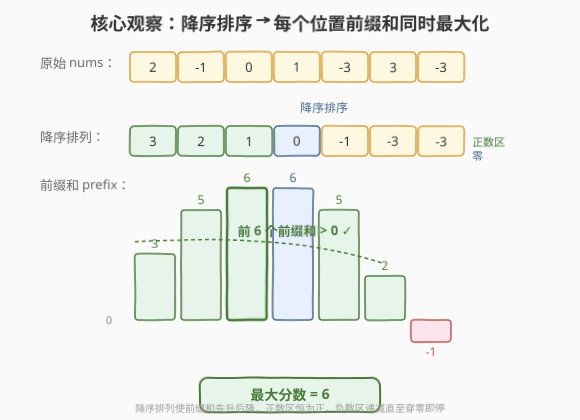
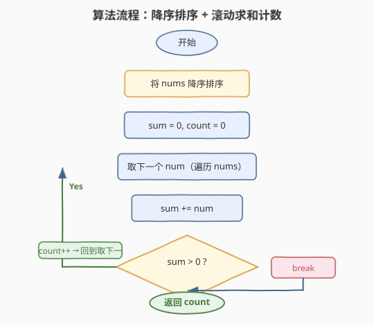

# LeetCode 重排数组以得到最大前缀分数 题解

## 1. 题目概述

- **标题 / 题号**：重排数组以得到最大前缀分数（#2587，medium）
- **链接**：https://leetcode.cn/problems/rearrange-array-to-maximize-prefix-score/
- **难度**：中等
- **标签**：贪心、排序、前缀和

**题意**：给定一个下标从 $0$ 开始的整数数组 `nums`。你可以将 `nums` 中的元素按**任意顺序**重排（包括给定顺序）。

令 `prefix` 为重排后的**前缀和数组**：$\text{prefix}[i]=\sum_{k=0}^{i}\text{nums}[k]$（重排后）。`nums` 的**分数**是 `prefix` 数组中**正整数**（$>0$）的个数。返回能得到的**最大分数**。

**示例 1**：

```text
输入：nums = [2,-1,0,1,-3,3,-3]
输出：6
解释：重排为 [2,3,1,-1,-3,0,-3]，prefix = [2,5,6,5,2,2,-1]，分数为 6。
```

**示例 2**：

```text
输入：nums = [-2,-3,0]
输出：0
解释：无论怎样重排，前缀和都不可能为正，分数恒为 0。
```

**约束**：

- $1 \le \text{nums.length} \le 10^5$
- $-10^6 \le \text{nums}[i] \le 10^6$

> 💡 关键观察：分数只关心「有多少个前缀和为正」。要让前缀和**尽早变正、尽量晚地穿零**，就应让**大的数尽量靠前**——降序排列天然在每个位置把前 $i+1$ 个元素之和顶到最大。一旦某处前缀和跌到 $\le 0$，后续全是更小的数，只会继续下探，直接停手即可。

## 2. 解题思路

### 2.1 暴力思路：枚举所有排列

最朴素的想法定是：枚举 `nums` 的每一种排列，对每种排列算一遍前缀和并统计正数个数，取最大。

```python
from itertools import permutations
ans = 0
for perm in permutations(nums):          # n! 种排列
    s, cnt = 0, 0
    for x in perm:
        s += x
        if s > 0:
            cnt += 1
        else:
            break
    ans = max(ans, cnt)
return ans
```

时间 $O(n! \cdot n)$（$n$ 个元素有 $n!$ 种排列，每种再 $O(n)$ 算前缀），空间 $O(n)$。$n=10^5$ 时排列数天文数字，**完全不可行**。它盲搜了全部顺序，却没利用「大数在前对每个前缀位置都更优」的结构。

### 2.2 核心观察：降序排序使每个前缀位置同时最优



**关键直觉**：前缀和 $\text{prefix}[i]$ 是排在最前的 $i+1$ 个元素之和。要让它**最大化**，最前面的 $i+1$ 个就该是数组里**最大的 $i+1$ 个**。而「降序排列」恰好让前 $i+1$ 个就是最大的 $i+1$ 个——对**所有** $i$ 同时成立。于是降序排列在每个位置都给出了**该位置前缀和的全局上界**：

$$
\text{prefix}_{\text{降序}}[i] \;=\; \max_{\text{任意重排}}\;\text{prefix}[i].
$$

既已是上界，若降序排列下某位置的前缀和仍 $\le 0$，则任何重排下该位置都不可能为正。而降序排列还有一个**单调结构**：数组呈「正数区 $\to$ 零区 $\to$ 负数区」三段——

- **正数区**：每加一个正数，前缀和**单调增**，只要起步为正便一路为正；
- **零区**：加 $0$ 不改变前缀和，**持平**；
- **负数区**：剩下全是负数，前缀和**单调减**。

因此前缀和呈「上升 $\to$ 平台 $\to$ 下降」的单峰形。一旦在下降段穿零（$\le 0$），后续尽是更小的负数，只会**继续下探、永不回升**。于是计数可在「首次 $\le 0$」处提前终止。

> 💡 **为何降序是最优，而非「正数降序、负数降序」分开排？」** 降序排序已自动把正数、零、负数各归其位且内部有序。负数区内部降序（$-1$ 先于 $-3$）让前缀和**下降得最慢**，能在穿零前多撑几步——这正是把分数顶到上界的细节。

> ⚠️ 注意「正整数」是严格 $>0$，零不算正。示例 1 中第 4 步加 $0$ 后 $\text{prefix}=6$ 仍为正而计入；若前缀和恰好为 $0$ 则不计。判据用 `sum > 0` 而非 `>=`。

### 2.3 算法流程图



流程分四阶段：

1. **降序排序**：`nums` 按从大到小排序（正数在前、零居中、负数在后）；
2. **初始化**：滚动和 `sum = 0`、计数 `count = 0`；
3. **遍历计数**：对每个 `num`：
   - `sum += num`；
   - 若 `sum > 0`：`count += 1`，继续；
   - 若 `sum <= 0`：`break`（后续只会更小，提前终止）；
4. **返回** `count`。

> 💡 也可不 `break`、遍历到底只统计 `sum > 0` 的位置，结果相同——因为穿零后前缀和恒 $\le 0$ 不会再贡献计数。但 `break` 能省掉无意义的后续累加，常数更优。

### 2.4 示例演算

![示例演算表：降序后 [3,2,1,0,-1,-3,-3]，逐行 sum 为 3,5,6,6,5,2,-1，前 6 个为正](../images/2587_prefix_score_walkthrough.svg)

以示例 1 `nums=[2,-1,0,1,-3,3,-3]` 为例，降序排列后为 `[3,2,1,0,-1,-3,-3]`：

| 步 | num | sum | sum>0? | count | 说明 |
|----|-----|-----|--------|-------|------|
| 0 | 3  | 3  | ✓ | 1 | 最大正数先入，sum 起步即正 |
| 1 | 2  | 5  | ✓ | 2 | 正数区持续累加，sum 单调增 |
| 2 | 1  | 6  | ✓ | 3 | 最后一个正数，sum 达峰 |
| 3 | 0  | 6  | ✓ | 4 | 加 0 不变 sum，仍为正 |
| 4 | -1 | 5  | ✓ | 5 | 进入负数区，最小负先来 |
| 5 | -3 | 2  | ✓ | 6 | sum 递减但仍为正 |
| 6 | -3 | -1 | ✗ break | 6 | sum 穿零，后续全负必更小，停 |

最终 `count = 6`。可见前 6 个前缀和为正（正数区 3 步 + 零区 1 步 + 负数区前段 2 步），第 7 步穿零即止。

示例 2 `nums=[-2,-3,0]`：降序后 `[0,-2,-3]`，第 0 步 `sum=0`（非正）即 `break`，`count=0`，输出 `0`。

## 3. 参考代码

### C++（降序排序 + 滚动求和，$O(n\log n)$ / $O(\log n)$）

```cpp
class Solution {
public:
    int maxScore(vector<int>& nums) {
        sort(nums.begin(), nums.end(), greater<int>());
        long long sum = 0;                 // 前缀和可能累加到 1e5 * 1e6 = 1e11，需 long long
        int count = 0;
        for (int x : nums) {
            sum += x;
            if (sum > 0) ++count;
            else break;                   // 穿零，后续只会更小
        }
        return count;
    }
};
```

> 💡 **溢出要点**：$n \le 10^5$、$|\text{nums}[i]| \le 10^6$，前缀和上限 $\approx 10^{11}$，超出 `int`（约 $2.1\times10^9$），故 `sum` 用 `long long`。`greater<int>()` 降序排序是 STL 惯用法。

### Python（降序排序 + 滚动求和，$O(n\log n)$ / $O(\log n)$）

```python
class Solution:
    def maxScore(self, nums: List[int]) -> int:
        nums.sort(reverse=True)
        s = 0
        count = 0
        for x in nums:
            s += x
            if s <= 0:        # 穿零，后续只会更小
                break
            count += 1
        return count
```

> 💡 Python 的 `int` 无溢出之虞。`nums.sort(reverse=True)` 原地降序，不占额外大数组。判据用 `s <= 0` 触发 `break`、否则计数，与 C++ 版逻辑等价（`s > 0` 计数 vs `s <= 0` 终止互为逆条件）。

## 4. 复杂度分析

| 维度 | 复杂度 | 说明 |
|------|--------|------|
| **时间复杂度** | $O(n\log n)$ | 降序排序主导；一趟遍历至多 $O(n)$，被排序掩盖 |
| **空间复杂度** | $O(\log n)$ | 排序的递归栈（`sort` 内部，不计返回值）；额外变量仅 `sum`/`count` 为 $O(1)$ |
| 对照：暴力排列 | $O(n!\cdot n)$ 时间 / $O(n)$ 空间 | 盲搜全部顺序 |
| 对照：遍历到底不 break | $O(n\log n)$ 时间 / $O(\log n)$ 空间 | 省下后续累加，常数更优但同阶 |

> 💡 排序 $O(n\log n)$ 已是本题的合理上界。能否 $O(n)$？需把负数也按降序处理才能正确计数，等价于对负数排序，最坏仍是 $O(n\log n)$。若利用值域 $[-10^6,10^6]$ 做桶排序可压到 $O(n+\text{值域})$，但常数与实现复杂度未必划算，$O(n\log n)$ 已轻松通过 $n=10^5$。

## 5. 扩展：为何「正数全用、负数贪心」能等价于排序？

从另一视角理解降序排序的最优性。把数组按符号分三类：

- **正数**：无论顺序，把它们全放在最前面时，每个正数位置的前缀和都为正（前缀和只增不减，且起步为正）。故正数**全部计入**分数，与内部顺序无关。
- **零**：放在正数之后，不改变前缀和（平台），若此时 sum 仍 $>0$，则零位置也计入。
- **负数**：放在最后。要让前缀和尽量晚地穿零，应让**绝对值小的负数先来**（即降序，$-1$ 先于 $-3$），使 sum 下降最慢、多撑几步。

「正数（任意序）$\to$ 零 $\to$ 负数（降序）」恰好就是全局降序排列。这说明降序排序是该贪心策略的统一表达，而非两套独立规则。

```python
class Solution:
    def maxScore(self, nums: List[int]) -> int:
        pos = sorted((x for x in nums if x > 0), reverse=True)
        zer = [x for x in nums if x == 0]
        neg = sorted((x for x in nums if x < 0), reverse=True)
        s = count = 0
        for x in pos + zer + neg:        # 正 → 零 → 负（降序）
            s += x
            if s <= 0:
                break
            count += 1
        return count
```

此写法把「分段」意图写明，便于面试时口头解释，但分段与拼接引入额外 $O(n)$ 空间与多趟扫描，效率不如一次性 `sort(reverse=True)`，仅作理解用。

## 6. 面试要点

1. **为什么降序排列能使每个位置的前缀和同时最大化？**

   > 前缀和 $\text{prefix}[i]$ 是最前 $i+1$ 个元素之和。要最大化它，最前的 $i+1$ 个就应是数组中最大的 $i+1$ 个——这正是降序排列做到的。且降序对**所有** $i$ 同时成立，故每个位置的前缀和都达到全局上界。

2. **穿零后为什么可以直接 `break`，不会漏掉后面重新变正的位置？**

   > 降序排列呈「正数区 $\to$ 零区 $\to$ 负数区」三段，前缀和单峰。一旦在负数区跌到 $\le 0$，后续尽是更小的负数，前缀和只会继续下探、不会回升。故穿零后再算无意义，`break` 不丢分。

3. **不 `break`、遍历到底只统计 `sum > 0`，结果一样吗？**

   > 一样。穿零后前缀和恒 $\le 0$，不会再贡献计数，故遍历到底与提前 `break` 结果相同。`break` 仅省去后续累加、常数更优，结果不变。面试两种写法皆可，`break` 更显对单调性的把握。

4. **`sum` 用 `int` 还是 `long long`？溢出风险在哪？**

   > $n\le10^5$、$|\text{nums}[i]|\le10^6$，全正时前缀和可达 $10^{11}$，远超 32 位 `int`（约 $2.1\times10^9$）。C++ 必须用 `long long`；Python 整数任意精度无此问题。

5. **若题目改为「前缀和非负（$\ge 0$）才算分」，策略有何变化？**

   > 仍降序排列，只是判据由 `sum > 0` 改为 `sum >= 0`。降序的最优性（每位置顶到上界）与单调穿零结构不变，穿零阈值从「严格 $>0$」放宽到「$\ge 0$」。零区持平段会被计入，分数通常 $+1$（零的个数，视前缀是否已穿零而定）。

> 💡 **一句话总结**：降序排序让每个前缀位置之和顶到全局上界，配合「正数增、零持平、负数减」的单峰结构在穿零处提前收手；$O(n\log n)$ 时间、$O(\log n)$ 空间一次过，是「排序 + 贪心 + 前缀和」三件套联用的招牌模板。

## 同类练习题

| # | 题目 | 与本题的关联 |
|---|------|-------------|
| 561 | [数组拆分](https://leetcode.cn/problems/array-partition/)（[题解](../0501-0600/561_数组拆分.md)） | 排序后两两配对取较小者求和最大化，同属「排序揭示最优顺序/配对」的贪心模板 |
| 1005 | [K 次取反后最大化的数组和](https://leetcode.cn/problems/maximize-sum-of-array-after-k-negations/)（[题解](../1001-1100/1005_K次取反后最大化的数组和.md)） | 排序 + 贪心调整符号使总和最大，对照本题用排序支配前缀和方向 |
| 871 | [最低加油次数](https://leetcode.cn/problems/minimum-number-of-refueling-stops/) | 贪心 + 大根堆在最优时机累加资源，对照本题「大数优先让和尽快变大」的资源调度思维 |
| 2530 | [执行 K 次操作后的最大分数](https://leetcode.cn/problems/maximal-score-after-applying-k-operations/)（[题解](../2501-2600/2530_执行K次操作后的最大分数.md)） | 每次取最大元素并整除，大根堆/排序贪心让分数尽早变大，与本题「大数优先」同源 |
