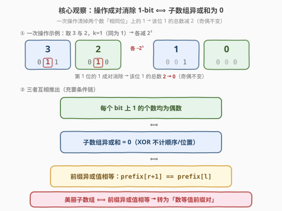
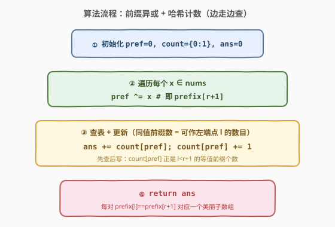

# LeetCode 统计美丽子数组数目 题解

## 1. 题目概述

- **标题 / 题号**：统计美丽子数组数目（#2588，medium）
- **链接**：https://leetcode.cn/problems/count-the-number-of-beautiful-subarrays/
- **难度**：中等
- **标签**：位运算、数组、哈希表、前缀异或

**题意**：给定下标从 0 开始的整数数组 `nums`。每次操作可以：

- 选择两个**不同**下标 $i, j$（$0 \le i, j < \text{nums.length}$，$i \ne j$）；
- 选择一个非负整数 $k$，满足 `nums[i]` 与 `nums[j]` 在二进制下的第 $k$ 位（编号从 0 起）都是 $1$；
- 将 `nums[i]` 和 `nums[j]` 都减去 $2^k$。

若一个子数组经过**若干次（含 0 次）**操作后能变成全 $0$ 数组，则称其为**美丽子数组**。返回 `nums` 中美丽子数组的数目。子数组为连续非空元素序列。

> 💡 题目特别说明：本身全为 $0$ 的子数组也是美丽的（0 次操作即可）。这其实是下面规律的特例。

**示例 1**：

```text
输入：nums = [4,3,1,2,4]
输出：2
解释：有 2 个美丽子数组 [3,1,2] 和 [4,3,1,2,4]。
- [3,1,2]：选 3 与 2、k=1 → [1,1,0]；再选两个 1、k=0 → [0,0,0]
- [4,3,1,2,4]：选两个 4、k=2 → [0,3,1,2,0]；选两个 1、k=0 → [0,2,0,2,0]；选两个 2、k=1 → [0,0,0,0,0]
```

**示例 2**：

```text
输入：nums = [1,10,4]
输出：0
解释：没有任何美丽子数组。
```

**约束**：

- $1 \le \text{nums.length} \le 10^5$
- $0 \le \text{nums}[i] \le 10^6$

## 2. 解题思路

### 2.1 暴力思路

枚举所有子数组 $[l, r]$（$O(n^2)$ 个），对每个子数组模拟「能否经操作变为全 0」。但「能否变全 0」本身没有高效的判定手段，模拟需要逐位配对消除，最坏 $O(n)$ 每个子数组，总计 $O(n^3)$，$n = 10^5$ 完全不可行。关键在于把「可消成全 0」转化为一个可 $O(1)$ 判定的代数条件。

### 2.2 核心观察：操作即「成对消除 1-bit」⟺ 子数组异或和为 0



一次操作的本质是：选两个数 + 一个**两者都为 1 的 bit** $k$，把两个数第 $k$ 位的 $1$ **同时清零**（减 $2^k$ 时该位原为 $1$，无借位，仅清这一位，其余位不变）。因此每次操作让「第 $k$ 位上 1 的总数」**恰好减 2**，**奇偶性不变**。

要最终变为全 0，意味着每个 bit 位的 1 总数都得降到 0；而操作只能成对（减 2）地降，故必须满足：

$$
\text{每个 bit 上 1 的个数为偶数}
$$

**反过来**也成立：只要某 bit 上 1 的个数 $\ge 2$（偶数且非零），就一定能挑出两个含该位的数、做一次操作把它减 2；每次操作使「全数组 1-bit 总数」减 2，必能终止于全 0。于是：

$$
\text{子数组美丽} \iff \text{每个 bit 上 1 的个数为偶数}
$$

而「某 bit 上 1 的个数模 2」恰是该 bit 在**异或和**中的取值，故上式等价于：

$$
\text{子数组美丽} \iff \text{子数组异或和} = 0
$$

> 💡 **异或的天然意义**：异或和在不计顺序、不计位置地统计「每位 1 的奇偶」。操作「成对消除同位 1」保奇偶、且能成对削到 0，于是「可消成全 0」与「异或和为 0」完全等价。这把位运算操作问题翻译成了一个**前缀异或**计数问题。

### 2.3 转化：前缀异或 + 哈希计数

记前缀异或 $\text{pref}[i] = \text{nums}[0] \oplus \cdots \oplus \text{nums}[i-1]$，约定 $\text{pref}[0] = 0$。则子数组 $\text{nums}[l..r]$ 的异或和为：

$$
\text{xor}(l, r) = \text{pref}[r+1] \oplus \text{pref}[l]
$$

子数组美丽 $\iff \text{xor}(l, r) = 0 \iff \text{pref}[r+1] = \text{pref}[l]$。于是答案就是「有多少对 $(l, r+1)$，$0 \le l < r+1 \le n$，且 $\text{pref}[l] = \text{pref}[r+1]$」。

这正是 [560. 和为 K 的子数组](../0501-0600/560_和为K的子数组.md) / [974. 和可被 K 整除的子数组](../0901-1000/974_和可被K整除的子数组.md) 的同款模板：把「求和」换成「求异或」、把「差为 K / 同余」换成「相等」。**边走边查**即可：

1. 维护哈希表 `count`，记录到当前为止各前缀异或值的出现次数；
2. 初始 `count = {0: 1}`，对应「空前缀 $\text{pref}[0] = 0$」一次（用于匹配从下标 0 起的子数组）；
3. 每加入一个元素更新 `pref` 后，先把 `count[pref]` 累加到答案（这些是可作为左端点 $l$ 的等值前缀个数），再把 `count[pref]` 加 1。

> ⚠️ **先查后写**：必须**先**把 `count[pref]` 累加进答案、**再** `count[pref]++`，否则会把当前下标自己算进去（$l < r+1$ 不允许 $l = r+1$）。

### 2.4 算法流程图



### 2.5 示例演算

以 `nums = [4,3,1,2,4]` 为例（前缀异或序列 $\text{pref} = [0, 4, 7, 6, 4, 0]$）：

![示例演算：nums=[4,3,1,2,4]，两次命中对应 [3,1,2] 与 [4,3,1,2,4]](../images/cntbs_example_walkthrough.svg)

| 步骤 | x | pref | 命中 count[pref] | 累计 ans | count 更新 |
|------|---|------|------------------|----------|------------|
| 初始 | — | 0 | — | 0 | {0:1} |
| 1 | 4 | 4 | 0 | 0 | +{4:1} |
| 2 | 3 | 7 | 0 | 0 | +{7:1} |
| 3 | 1 | 6 | 0 | 0 | +{6:1} |
| 4 | 2 | 4 | 1 | **1** | 4→2 |
| 5 | 4 | 0 | 1 | **2** | 0→2 |

- 步骤 4：`pref=4` 命中此前第 1 步的 `pref=4` → 子数组 `nums[1..3]=[3,1,2]`（异或 $3\oplus1\oplus2=0$）✓
- 步骤 5：`pref=0` 命中初始 `pref=0` → 子数组 `nums[0..4]=[4,3,1,2,4]`（异或 $0$）✓
- 最终 `ans = 2`。对照示例 2 `[1,10,4]`：`pref=[0,1,11,15]` 全互异，无等值对 → `ans=0` ✓

## 3. 参考代码

### C++

```cpp
class Solution {
  public:
    long long beautifulSubarrays(vector<int>& nums) {
        unordered_map<int, int> cnt;        // 前缀异或值 -> 出现次数
        cnt[0] = 1;                         // 空前缀 pref[0]=0
        long long ans = 0;
        int pref = 0;
        for (int x : nums) {
            pref ^= x;                      // pref = pref[r+1]
            ans += cnt[pref];               // 同值前缀数 = 可作左端点 l 的个数
            cnt[pref]++;                    // 先查后写，避免把自己算入
        }
        return ans;
    }
};
```

> ⚠️ **返回类型**：题面返回 `long long`。$n \le 10^5$ 时空全 0 数组的答案可达 $\binom{n+1}{2} \approx 5 \times 10^9$，超出 `int`，必须用 `long long` 累加。`cnt` 内值域不超过 $n+1$，用 `int` 即可。

### Python

```python
class Solution:
    def beautifulSubarrays(self, nums: List[int]) -> int:
        cnt = {0: 1}                        # 空前缀 pref[0]=0
        ans = pref = 0
        for x in nums:
            pref ^= x                       # pref = pref[r+1]
            ans += cnt.get(pref, 0)         # 同值前缀数 = 可作左端点 l 的个数
            cnt[pref] = cnt.get(pref, 0) + 1
        return ans
```

> 💡 Python 整数任意精度，无需担心溢出；逻辑与 C++ 镜像。`cnt` 用 `defaultdict(int)` 可更简，这里显式 `get` 便于讲清「先查后写」。

## 4. 复杂度分析

| 维度 | 复杂度 | 说明 |
|------|--------|------|
| 时间复杂度 | $O(n)$ | 遍历数组一次，每次哈希表查询 / 写入均摊 $O(1)$ |
| 空间复杂度 | $O(\min(n, 2^B))$ | 哈希表存不同前缀异或值的个数；$\text{nums}[i] < 10^6 < 2^{20}$，故异或值 $< 2^{20}$，不同值个数 $\le \min(n+1, 2^{20})$ |
| 对照：暴力 | $O(n^3)$ | 枚举子数组 + 逐位模拟消除判定 |

> 💡 若追求常数更优，C++ 可用 `vector<int>`（大小 $2^{20}$）替代哈希表——异或值域确定且仅约 $10^6$，数组寻址比哈希快。哈希表写法更通用、对值域不敏感。

## 5. 扩展：前缀异或，前缀和家族的「换运算子」变体

前缀和系列的核心是：**用一个累计量把「区间性质」压成「两个前缀之差」**。改变累计运算子，便得到一族同构模板：

| 求和运算子 | 区间性质 | 计数/判定模板 | 代表题 |
|-----------|----------|--------------|--------|
| 加法 $+$ | 和 $=\text{pref}[r+1]-\text{pref}[l]$ | 查 $\text{pref}[l]=\text{pref}[r+1]-K$ | [560. 和为 K 的子数组](../0501-0600/560_和为K的子数组.md) |
| 加法 + 模 | 和 $\equiv 0\pmod K$ | 查同余前缀对 | [974. 和可被 K 整除的子数组](../0901-1000/974_和可被K整除的子数组.md) |
| **异或 $\oplus$** | **异或和 $=0$** | **查等值前缀对** | **本题 2588** |

> 💡 异或相比加法的优势：**自带「不计顺序/位置」的奇偶统计**，且不溢出、无需处理负数取模。凡遇「成对消除 / 配对抵消 / 能否归零」类操作题，优先想到「每位奇偶 → 异或和 → 前缀异或」这条翻译链。

## 6. 面试要点

1. **为什么「可经操作变为全 0」等价于「异或和为 0」？**

   > 操作只能把某 bit 位的 1 总数**成对**（减 2）消除，故该位奇偶不变；要降到 0，初始每位 1 的个数必须为偶数 ⟺ 异或和每位均为 0 ⟺ 异或和为 0。反之每位偶数时可贪心地逐位成对消除，必能归零，故充要。

2. **为什么哈希表要初始化 `{0: 1}`？**

   > 对应空前缀 $\text{pref}[0]=0$。当某个从下标 0 起、到 $r$ 结束的子数组异或恰为 0 时，$\text{pref}[r+1]=0$ 需要 `count[0]` 里的这个空前缀来匹配；不初始化会漏算这类「前缀从 0 开始」的美丽子数组（示例 1 的 `[4,3,1,2,4]` 正是靠它命中）。

3. **为什么必须「先查后写」？**

   > 子数组要求 $l < r+1$（非空）。若先 `count[pref]++` 再累加，会把当前下标自己算进去（$l=r+1$ 的空区间），多算。先查 `count[pref]` 得到的恰是「严格在当前之前」的等值前缀个数，正确。

4. **与 560 / 974 的关系？**

   > 三者同构：都是「前缀量 + 哈希 + 先查后写」计等值对。560 查 $\text{pref}[l] = \text{pref}[r+1]-K$，974 查 $\text{pref}[l] \equiv \text{pref}[r+1]\pmod K$，本题查 $\text{pref}[l] = \text{pref}[r+1]$。换运算子、换匹配条件，模板不变。

5. **答案会溢出 int 吗？怎么处理？**

   > 会。极端情况 $n=10^5$ 全 0 时，任意子数组都美丽，答案 $=\binom{n+1}{2}\approx 5\times10^9$，超 `INT_MAX`。C++ 用 `long long` 累加并按题意返回 `long long`；Python 整数无限大，无需特殊处理。哈希表内计数上界是 $n+1$，用 `int` 足够。

> 💡 **一句话总结**：操作「成对消除同位 1」⟺ 每位 1 偶数个 ⟺ 子数组异或和为 0 ⟺ 前缀异或值相等；套「前缀 + 哈希 + 先查后写」计等值前缀对，$O(n)$ 解决。

## 同类练习题

| # | 题目 | 与本题的关联 |
|---|------|-------------|
| 560 | [和为 K 的子数组](https://leetcode.cn/problems/subarray-sum-equals-k/)（[题解](../0501-0600/560_和为K的子数组.md)） | 前缀和 + 哈希的母题，把本题的「异或相等」换成「差为 K」 |
| 974 | [和可被 K 整除的子数组](https://leetcode.cn/problems/subarray-sums-divisible-by-k/)（[题解](../0901-1000/974_和可被K整除的子数组.md)） | 前缀 + 同余 + 哈希同模板，对照「求和同余」与「异或相等」两种匹配条件 |
| 1442 | [形成两个异或相等数组的三元组数目](https://leetcode.cn/problems/count-triples-that-can-form-two-arrays-of-equal-xor/) | 前缀异或相等的进阶计数——把「一个子数组」推广为「两个相邻子数组异或相等」，仍是等值前缀对思想 |
| 421 | [数组中两个数的最大异或值](https://leetcode.cn/problems/maximum-xor-of-two-numbers-in-an-array/)（[题解](../0401-0500/421_数组中两个数的最大异或值.md)） | 前缀异或的另一应用——把「计数」换成「求最值」，配套字典树加速 |
