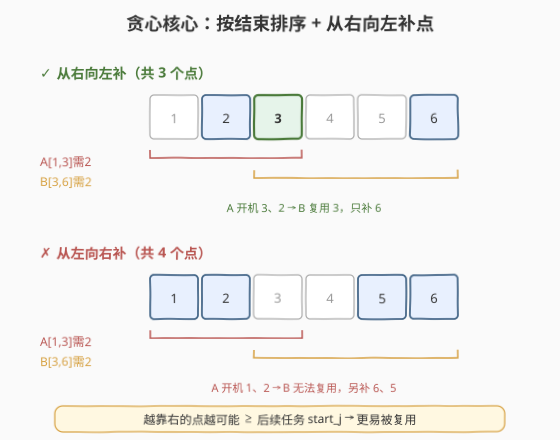
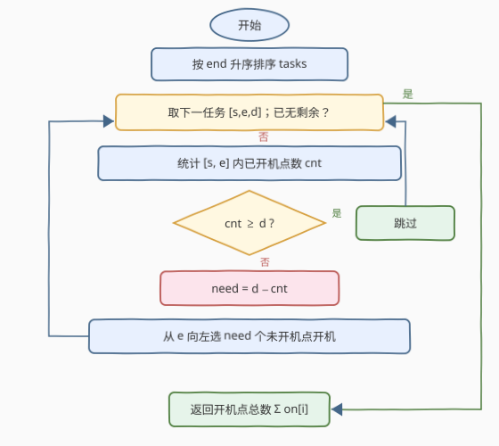
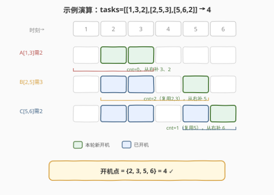

# LeetCode 完成所有任务的最少时间 题解

## 1. 题目概述

- **标题 / 题号**：完成所有任务的最少时间（#2589，hard）
- **链接**：https://leetcode.cn/problems/minimum-time-to-complete-all-tasks/
- **难度**：困难
- **标签**：贪心、数组、排序、区间调度

**题意**：有一台电脑可以**同时**运行无数个任务。给定二维整数数组 `tasks`，其中 `tasks[i] = [start_i, end_i, duration_i]` 表示第 $i$ 个任务需要在**闭区间** $[\text{start}_i, \text{end}_i]$ 内运行 $\text{duration}_i$ 个整数时间点（不要求连续）。电脑运行时所有任务共享开机的时间点。求完成所有任务时电脑最少需要开机多少个时间点。

> 💡 本质：电脑在一个时间点开机，可同时覆盖所有「该时刻在其区间内」的任务。我们要选一个**时间点集合**，使每个任务在其区间内至少被选中 $\text{duration}_i$ 个点，且集合大小最小。这是一个**带需求的最小点覆盖区间**问题。

**示例 1**：

```text
输入：tasks = [[2,3,1],[4,5,1],[1,5,2]]
输出：2
解释：
- 任务 0 在 [2,2] 运行；
- 任务 1 在 [5,5] 运行；
- 任务 2 在 [2,2] 和 [5,5] 运行。
共开机 2 个时间点 {2, 5}。
```

**示例 2**：

```text
输入：tasks = [[1,3,2],[2,5,3],[5,6,2]]
输出：4
解释：
- 任务 0 在 [2,3] 运行；
- 任务 1 在 [2,3] 和 [5,5] 运行；
- 任务 2 在 [5,6] 运行。
共开机 4 个时间点 {2, 3, 5, 6}。
```

**约束**：

- $1 \le \text{tasks.length} \le 2000$
- $\text{tasks}[i].\text{length} == 3$
- $1 \le \text{start}_i, \text{end}_i \le 2000$
- $1 \le \text{duration}_i \le \text{end}_i - \text{start}_i + 1$

## 2. 解题思路

### 2.1 暴力思路

枚举「开机时间点集合」不可行——时间点取值多达 $2000$，子集数 $2^{2000}$。退一步：对每个任务枚举其区间内的 $\text{duration}_i$ 个点（组合数 $C(\text{len}, \text{dur})$），再求并集最小，指数级爆炸。关键在于找到一个**贪心顺序**，使每步的局部最优能导向全局最优，从而把搜索压缩为一次扫描。

### 2.2 核心观察：按结束时间排序 + 从右向左补点



电脑能同时跑无限任务，意味着**同一时间点可被多个任务共用**。要让总开机点最少，就要让不同任务**尽量复用**已开机的时间点。于是策略变成两步决策：

1. **按什么顺序处理任务？** —— 按**结束时间** $\text{end}_i$ **升序**。结束早的任务先固定其开机点，这些点位置靠前，更可能落在后续（结束更晚）任务的区间 $[\text{start}_j, \text{end}_j]$ 内被复用。
2. **任务需要补点时补在哪？** —— 在区间内**从右端 $\text{end}_i$ 向左**补。因为后续任务满足 $\text{end}_j \ge \text{end}_i \ge$ 所补点 $p$，上界 $p \le \text{end}_j$ 恒成立；能否复用只取决于 $p \ge \text{start}_j$。**补的点越靠右（$p$ 越大），越可能 $\ge \text{start}_j$，越易被后续任务复用**。

> ⚠️ **为什么必须按 end 排序、而不是按 start？** 按结束排序保证了「先处理者的右端」≤「后处理者的右端」，从而从右补的点天然落在后续区间的右半侧。若按 start 排序则无此偏序保证，贪心失效。这与 [435. 无重叠区间](../0301-0400/435_无重叠区间.md) / [452. 用最少数量的箭引爆气球](../0401-0500/452_用最少数量的箭引爆气球.md) 一脉相承——区间贪心几乎总是「按 end 排序」。

**正确性（交换论证直觉）**：设最优解中某任务的开机点集为 $P$。若把 $P$ 中「能向右挪且不破坏其他任务」的点右移，不会让任何任务的需求减少（仍在其区间内），却可能让点落入更多后续区间、增加复用。反复右移到极限，恰是「从右端向左贪心选取」的结果。故从右补点不劣于最优。

### 2.3 算法流程图



具体步骤：

1. 对 `tasks` 按 $\text{end}_i$ 升序排序；
2. 维护布尔数组 `on[0..maxEnd]`，`on[t]=true` 表示时刻 $t$ 已开机；
3. 对每个任务 $[s, e, d]$：
   - 统计 $[s, e]$ 内已开机的点数 `cnt`；
   - 若 `cnt >= d`：本任务已被满足，跳过；
   - 否则还需补 $\text{need} = d - \text{cnt}$ 个点：从 $e$ 向左扫描，遇到未开机的点就开机，直到补满 $\text{need}$ 个；
4. 最终答案为 `on` 中 `true` 的总数。

> 💡 **先复用后补**：每个任务先「白嫖」前序任务已开机的点，缺口才补——这就是「最小覆盖」的贪心体现。从右补则保证补的点对后续最友好。

### 2.4 示例演算

以示例 2 `tasks = [[1,3,2],[2,5,3],[5,6,2]]` 为例（已按 end 升序）：



| 任务 | 区间 | 需求 d | [s,e] 已开机 cnt | 动作 | 本轮新增 | 累计开机集 |
|------|------|--------|------------------|------|----------|-----------|
| A | [1,3] | 2 | 0 | 从右补 2 个 | {3, 2} | {2, 3} |
| B | [2,5] | 3 | 2（复用 2,3） | 从右补 1 个 | {5} | {2, 3, 5} |
| C | [5,6] | 2 | 1（复用 5） | 从右补 1 个 | {6} | {2, 3, 5, 6} |

- 任务 A：区间内无开机点，从右端 3 向左补 3、2；
- 任务 B：区间 [2,5] 内已有 {2,3} 两个开机点，直接复用，只差 1 个，从右端 5 向左补 5；
- 任务 C：区间 [5,6] 内已有 {5}，复用，差 1 个，从右端 6 向左补 6；
- 最终开机集 $\{2,3,5,6\}$，大小 $= 4$ ✓

## 3. 参考代码

### C++

```cpp
class Solution {
  public:
    int findMinimumTime(vector<vector<int>>& tasks) {
        sort(tasks.begin(), tasks.end(),
             [](const auto& a, const auto& b) { return a[1] < b[1]; });
        int maxEnd = 0;
        for (auto& t : tasks) maxEnd = max(maxEnd, t[1]);
        vector<char> on(maxEnd + 1, 0);          // on[t]=1 表示时刻 t 已开机
        for (auto& t : tasks) {
            int s = t[0], e = t[1], d = t[2];
            int cnt = 0;
            for (int i = s; i <= e; ++i) cnt += on[i];   // 先统计可复用的点
            if (cnt >= d) continue;                      // 已满足，跳过
            int need = d - cnt;                          // 缺口
            for (int i = e; i >= s && need > 0; --i)     // 从右向左补
                if (!on[i]) { on[i] = 1; --need; }
        }
        return accumulate(on.begin(), on.end(), 0);
    }
};
```

> ⚠️ **为什么用 `vector<char>` 而非 `vector<bool>`**：`vector<bool>` 是位压缩特化，`cnt += on[i]` 需隐式转换、且取址不合法；`char` 直接做整数累加更快更直观。规模 $\le 2001$，内存忽略不计。

### Python

```python
class Solution:
    def findMinimumTime(self, tasks: List[List[int]]) -> int:
        tasks.sort(key=lambda t: t[1])                 # 按结束时间升序
        max_end = max(t[1] for t in tasks)
        on = [False] * (max_end + 1)                    # on[t]=是否已开机
        for s, e, d in tasks:
            cnt = sum(on[s:e + 1])                     # 复用已开机的点数
            if cnt >= d:
                continue
            need = d - cnt                              # 缺口
            i = e
            while need > 0:                             # 从右向左补
                if not on[i]:
                    on[i] = True
                    need -= 1
                i -= 1
        return sum(on)
```

> 💡 `sum(on[s:e+1])` 直接对布尔切片求和等价于统计 `True` 个数，Python 写法天然简洁。

## 4. 复杂度分析

| 维度 | 复杂度 | 说明 |
|------|--------|------|
| 时间复杂度 | $O(n \log n + n \cdot L)$ | 排序 $O(n\log n)$；每个任务扫描区间 $[s,e]$ 统计+补点，单任务 $O(L)$，$L \le 2000$ |
| 空间复杂度 | $O(\max\text{End})$ | 布尔数组 `on`，大小为最大结束时间 $+1 \le 2001$ |
| 对照：暴力 | 指数级 | 枚举时间点子集或任务内组合，不可行 |

> 💡 约束中 $n \le 2000$、$\text{end}_i \le 2000$，故 $n \cdot L \le 4 \times 10^6$，常数小、秒过。若将「统计区间内已开机点数」用**树状数组**维护，可降到 $O((n+L)\log L)$，但常数收益在本数据规模下并不必要。

## 5. 扩展：树状数组加速区间求和

当区间端点值域 $L$ 很大（如 $10^9$）时，逐点扫描的 $O(nL)$ 会超时。可做两处优化：

1. **离散化**：把所有 $s_i, e_i$ 压缩到 $O(n)$ 个秩，布尔数组改为按秩索引；
2. **树状数组**：`on[t]` 作为权值，区间统计 $[s,e]$ 已开机数变成树状数组 `query(e)-query(s-1)` 的 $O(\log L)$ 前缀和查询；补点时单点更新 `+1`。

```cpp
// 树状数组版（离散化后）
BIT bit(m);            // m = 离散化后的点数
for (auto& rk : sortedTasks) {
    int s = rk[0], e = rk[1], d = rk[2];
    int cnt = bit.query(e) - bit.query(s - 1);     // O(log m)
    if (cnt >= d) continue;
    int need = d - cnt;
    for (int i = e; i >= s && need > 0; --i)        // 仍需逐点补，但仅补未开的
        if (!bit.point(i)) { bit.add(i, 1); --need; }
}
return bit.query(m);
```

> ⚠️ 补点阶段即便有树状数组也仍要逐个找未开机的点（最多补 $d$ 个），最坏仍 $O(L)$。若要彻底 $O(\log)$ 补点，需用 `set` 维护「未开机点的有序集合」，每次 `lower_bound(e)` 往左取——本题 $L \le 2000$ 无需此等手段，留作思路拓展。

## 6. 面试要点

1. **为什么按结束时间排序，而不是按开始时间或时长？**

   > 贪心需要「先决策的点尽量能被后续复用」。按 end 升序后，当前任务补的点 $p \le \text{end}_i \le \text{end}_j$（后续上界恒满足），只差 $p \ge \text{start}_j$；把点放到区间最右端使 $p$ 最大，复用概率最高。按 start 排序破坏了 $\text{end}_i \le \text{end}_j$ 的偏序，无法保证从右补的优越性；按时长排序与复用无关。

2. **为什么补点要从右端向左，而不是从左端向右？**

   > 后续任务 $\text{end}_j \ge \text{end}_i$，上界 $p \le \text{end}_j$ 总成立，复用与否只看 $p \ge \text{start}_j$。$p$ 越大越可能满足此式，故选区间内尽量靠右的点。从右向左恰好优先选大 $p$，最大化后续复用。

3. **先统计可复用点数、再补缺口，会不会破坏已满足的任务？**

   > 不会。补点只把 `on[t]` 从 $0$ 改成 $1$，**只会增加**区间内的开机点数，不会减少。任何已被满足的任务其需求 $\le$ 当时区间内开机数，补点后开机数只增不减，依旧满足。这是「只增不减」的单调性保证了贪心安全。

4. **这个贪心的正确性怎么证明？**

   > 交换论证：对任意最优解，若某任务的开机点不在其区间最右端，可把这些点在不违反其他任务需求的前提下向右平移到最右端——平移后该任务仍满足（点仍在区间内），而右移让点更可能落入后续任务区间、复用只增不减。反复右移到极限即得「从右向左补」的解，故该解不劣于最优，即为最优。

5. **如果区间端点值域很大（如 $10^9$）怎么办？**

   > 离散化 + 树状数组/有序集合。统计复用点用树状数组前缀和 $O(\log n)$；补点用 `set` 维护未开机点，每次 `lower_bound(e)` 取右most 未开机点，$O(d \log n)$ 补满。整体 $O(n \log n)$，与值域无关。本题 $L \le 2000$ 直接数组即可。

> 💡 **一句话总结**：电脑能同时跑无限任务 → 时间点可被多任务复用 → 按 end 排序保证偏序、从右向左补点最大化后续复用 → $O(nL)$ 一次扫描搞定最小开机点数。

## 同类练习题

| # | 题目 | 与本题的关联 |
|---|------|-------------|
| 435 | [无重叠区间](https://leetcode.cn/problems/non-overlapping-intervals/)（[题解](../0301-0400/435_无重叠区间.md)） | 区间贪心母题，按 end 排序求最多不重叠区间，与本题同属「按结束排序」家族 |
| 452 | [用最少数量的箭引爆气球](https://leetcode.cn/problems/minimum-number-of-arrows-to-burst-balloons/)（[题解](../0401-0500/452_用最少数量的箭引爆气球.md)） | 按 end 排序贪心取点覆盖所有区间，对照「单点覆盖多区间」与本题「多点满足需求」 |
| 1024 | [视频拼接](https://leetcode.cn/problems/video-stitching/)（[题解](../1001-1100/1024_视频拼接.md)） | 按 start 排序、贪心拓展右端覆盖 $[0,T]$，对照「选最少区间覆盖」与本题「选最少点满足区间需求」的对偶 |
| 1326 | [灌溉花园的最少水龙头数目](https://leetcode.cn/problems/minimum-number-of-taps-to-open-to-water-a-garden/)（[题解](../1301-1400/1326_灌溉花园的最少水龙头数目.md)） | 与 1024 同构的区间覆盖贪心，进一步巩固区间贪心套路 |
