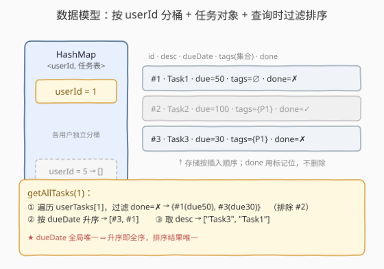
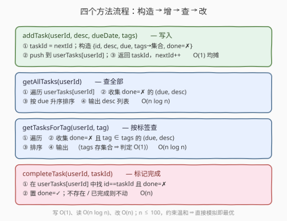
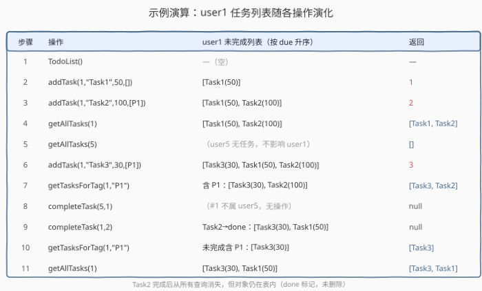

# 设计一个待办事项清单

- **题目名称**：设计一个待办事项清单
- **链接**：[2590. 设计一个待办事项清单](https://leetcode.cn/problems/design-a-todo-list/)
- **难度**：中等
- **标签**：设计、数组、哈希表、字符串、排序

## 1. 题目概述

设计一个待办事项清单，用户可以添加**任务**、标记任务为**完成**、获取未完成任务列表，还能为任务打**标签**并按标签筛选。实现 `TodoList` 类：

- `TodoList()`：初始化对象。
- `int addTask(int userId, string taskDescription, int dueDate, vector<string> tags)`：为 `userId` 用户添加一个任务，到期日为 `dueDate`，附带标签列表 `tags`。返回任务 ID，ID **从 1 开始依次递增**（第一个任务 ID 为 1，第二个为 2，依此类推）。
- `vector<string> getAllTasks(int userId)`：返回 `userId` 用户**未完成**的所有任务描述，**按到期日升序**排列；若无，返回空列表。
- `vector<string> getTasksForTag(int userId, string tag)`：返回 `userId` 用户未完成且标签集合包含 `tag` 的所有任务描述，按到期日升序排列；若无，返回空列表。
- `void completeTask(int userId, int taskId)`：**仅当**任务存在、属于 `userId` 用户、且当前未完成时，把它标记为已完成；否则不做任何操作。

**示例 1**：

```text
输入
["TodoList","addTask","addTask","getAllTasks","getAllTasks","addTask","getTasksForTag","completeTask","completeTask","getTasksForTag","getAllTasks"]
[[],[1,"Task1",50,[]],[1,"Task2",100,["P1"]],[1],[5],[1,"Task3",30,["P1"]],[1,"P1"],[5,1],[1,2],[1,"P1"],[1]]
输出
[null,1,2,["Task1","Task2"],[],3,["Task3","Task2"],null,null,["Task3"],["Task3","Task1"]]

解释
addTask(1,"Task1",50,[])      -> 1   用户1新增 Task1（due=50，无标签）
addTask(1,"Task2",100,["P1"]) -> 2   用户1新增 Task2（due=100，标签 P1）
getAllTasks(1)                -> ["Task1","Task2"]
getAllTasks(5)                -> []   用户5没有任何任务
addTask(1,"Task3",30,["P1"])  -> 3   新增 Task3（due=30，标签 P1）
getTasksForTag(1,"P1")        -> ["Task3","Task2"]   按 due 升序：30 在 100 前
completeTask(5,1)             -> null  任务1不属用户5，无操作
completeTask(1,2)             -> null  把 Task2 标记为已完成
getTasksForTag(1,"P1")        -> ["Task3"]           Task2 已完成，不再出现
getAllTasks(1)                -> ["Task3","Task1"]    按 due 升序：30 在 50 前
```

**约束条件**：

- $1 \le \text{userId},\ \text{taskId},\ \text{dueDate} \le 100$
- $0 \le \text{tags.length} \le 100$
- $1 \le \text{taskDescription.length} \le 50$
- $1 \le \text{tags[i].length},\ \text{tag.length} \le 20$
- 所有 `dueDate` 值**唯一**。
- 字符串仅由大小写英文字母与数字组成。
- 每个方法最多被调用 $100$ 次。

> 💡 **关键约束读法**：所有 `dueDate` 全局唯一 ⇒ 「按 dueDate 排序」是**全序**，结果唯一、无需第二关键字；每方法调用 $\le 100$、$\text{dueDate} \le 100$ ⇒ 单用户任务数 $n \le 100$，一次「查询即过滤 + 排序」的 $O(n \log n)$ 完全跑得动，不必一上来就维护有序结构。下文先给最直接的「哈希分桶 + 查询时排序」解，再把「放大 $n$」时的有序集合维护作为进阶。

---

## 2. 解题思路

### 2.1 暴力思路：全局单表 + 全量扫描

最朴素的做法是把**所有用户**的任务塞进一个全局数组 `all`，每个元素存 `{userId, taskId, desc, due, tags, done}`。每次调用：

- `addTask`：往 `all` 末尾追加，$O(1)$；
- `getAllTasks(uid)` / `getTasksForTag(uid, tag)`：遍历**整个 `all`**，筛出 `userId == uid` 且 `!done`（且 `tag ∈ tags`）的项，排序后返回；
- `completeTask(uid, tid)`：遍历 `all` 找 `userId==uid && taskId==tid && !done`，置 `done=true`。

正确性无误，但查询/完成都是 $O(N)$，$N$ 为**全部用户**的任务总数——把不同用户的任务混在一起，每次都要扫过无关用户的数据。本题主解的第一步优化正是「按用户隔离」。

> ⚠️ 暴力的浪费在「**没有按 userId 分桶**」：查询用户 $u$ 时却要遍历用户 $v\ne u$ 的任务。把任务按 `userId` 哈希分桶后，每次只触及目标用户自己的任务表，无关用户的数据不再拖累查询。

### 2.2 核心观察：按 userId 哈希分桶 + 任务对象 + 查询时过滤排序



把设计拆成三条决策，每条都对应一个关键收益：

1. **按 `userId` 哈希分桶**：`unordered_map<int, vector<Task>>`，键为用户、值是该用户的任务表。`addTask` 时 `userTasks[userId].push_back(...)` 把任务挂到对应用户；查询/完成时先 `find(userId)` 路由到该桶，**只遍历该用户自己的任务**。无关用户的数据从不被触碰，查询成本从 $O(N)$ 降到 $O(n_u)$（$n_u$ 为该用户任务数）。

2. **任务对象 + 三类字段**：每个 `Task` 存 `{id, desc, due, tags, done}`：
   - `tags` 用**哈希集合**（`unordered_set<string>` / Python `set`）而非数组，使 `getTasksForTag` 的「该任务是否含某标签」判定为 $O(1)$；
   - `done` 用**布尔标记位**而非删除元素。删除会破坏顺序、丢失历史，且「已完成不再出现」靠查询时 `if (!t.done)` 过滤即可实现；标记位还天然支持「重复完成是 no-op」的题意（见 `completeTask` 的 `&& !t.done` 守卫）。

3. **输出排序在「查询时」做**：每次查询把命中的任务收集成 `(due, desc)` 对，再 `sort` 后输出 `desc`。因 `dueDate` 全局唯一，`pair` 排序天然按 `due` 升序、无歧义。**不在写入时维护有序**，是因为约束温和（$n\le 100$），「写入 $O(1)$ + 查询 $O(n\log n)$」比「写入 $O(\log n)$ + 查询 $O(n)$」更简单且常数更小——这与 [2502. 设计内存分配器](../2501-2600/2502_设计内存分配器.md)「约束温和时直接模拟即最优」的取舍一脉相承。

> 💡 **任务 ID 全局递增**：`nextId` 跨用户共享、自增后返回。即使用户 1 的任务在先、用户 2 的任务在后，ID 依然 1、2、3 连续——这保证 `taskId` 全局唯一，`completeTask(uid, tid)` 在用户 $u$ 的桶里按 `taskId` 查找不会与别的用户混淆（本来分桶已隔离，全局唯一 ID 又多一道正确性保障）。

### 2.3 算法流程图



四个方法都极短，核心是「查询 = 过滤 + 排序」与「完成 = 标记位」：

```text
addTask(userId, desc, due, tags):
    taskId = nextId
    构造 Task{id, desc, due, tags→集合, done=false}
    userTasks[userId].push(task)
    nextId += 1
    return taskId                      # 全局递增

getAllTasks(userId):                    # 查全部
    collect(userId, pred = !done)      # 过滤 + 排序 + 取 desc

getTasksForTag(userId, tag):            # 按标签查
    collect(userId, pred = !done && tag ∈ tags)

completeTask(userId, taskId):           # 标记完成
    在 userTasks[userId] 里找 id==taskId 且 !done -> 置 done=true
    找不到 / 已完成则不动
```

其中 `collect` 是 `getAllTasks` 与 `getTasksForTag` 共用的模板：遍历该用户任务表，按谓词筛 `(due, desc)`，`sort` 后输出 `desc` 列表——抽取这层公共逻辑避免两份几乎一样的过滤+排序代码。

### 2.4 示例演算



以示例 1 为例，重点看三处：

- **第 6 步 `addTask(1,"Task3",30,[P1])`**：任务表存的是**插入顺序** `[Task1(50), Task2(100), Task3(30)]`，但 `getAllTasks` 输出按 `due` 升序 `[Task3, Task1, Task2]`——存储顺序与输出顺序**解耦**，排序只发生在查询时。
- **第 8、9 步 `completeTask`**：第 8 步 `completeTask(5,1)` 因任务 1 不属于用户 5（分桶后直接在用户 5 的空桶里找不到）而 no-op；第 9 步 `completeTask(1,2)` 把 Task2 的 `done` 置为 `true`，**对象仍在表内**，只是从此被 `!done` 过滤掉。
- **第 10、11 步**：Task2 完成后，`getTasksForTag(1,"P1")` 与 `getAllTasks(1)` 的返回都不再包含 Task2，但 Task3、Task1 照常出现——印证「完成 = 标记位 + 查询时过滤」，从未真正删除任务对象。

> 💡 **对照第 4 步与第 11 步**：同为 `getAllTasks(1)`，第 4 步返回 `["Task1","Task2"]`（按 due 升序：50 < 100），第 11 步返回 `["Task3","Task1"]`（30 < 50，Task2 已完成被过滤）。同样的调用因任务集状态变化而返回不同结果——这正是「查询时过滤」的体现。

---

## 3. 参考代码

### C++

```cpp
class TodoList {
    struct Task {
        int id;
        string desc;
        int due;
        unordered_set<string> tags;
        bool done = false;
    };
    int nextId = 1;
    unordered_map<int, vector<Task>> userTasks;   // userId -> 任务表

    // 遍历 userId 的任务表，按谓词 pred 筛 (due, desc)，排序后输出 desc 列表
    template <class Pred>
    vector<string> collect(int userId, Pred pred) {
        auto it = userTasks.find(userId);
        if (it == userTasks.end()) return {};
        vector<pair<int, string>> sel;
        for (const auto& t : it->second)
            if (pred(t)) sel.emplace_back(t.due, t.desc);
        sort(sel.begin(), sel.end());              // dueDate 唯一 -> 按 due 升序，无歧义
        vector<string> res;
        for (auto& p : sel) res.push_back(move(p.second));
        return res;
    }
public:
    TodoList() = default;

    int addTask(int userId, string taskDescription, int dueDate, vector<string>& tags) {
        Task t{nextId, move(taskDescription), dueDate, {tags.begin(), tags.end()}, false};
        userTasks[userId].push_back(move(t));
        return nextId++;
    }

    vector<string> getAllTasks(int userId) {
        return collect(userId, [](const Task& t) { return !t.done; });
    }

    vector<string> getTasksForTag(int userId, string tag) {
        return collect(userId, [&](const Task& t) { return !t.done && t.tags.count(tag); });
    }

    void completeTask(int userId, int taskId) {
        auto it = userTasks.find(userId);
        if (it == userTasks.end()) return;
        for (auto& t : it->second)
            if (t.id == taskId && !t.done) { t.done = true; break; }
    }
};
```

> 💡 **实现细节**：① `collect` 用模板而非 `std::function`，避免类型擦除的运行期开销，两个查询各自传入不同类型的 lambda 都能正确推导。② `sort` 对 `vector<pair<int,string>>` 默认按第一项 `due` 升序；`dueDate` 全局唯一保证不会进入第二项 `desc` 比较，结果确定。③ `addTask` 用 `move` 转移 `taskDescription`、`tags` 用迭代器范围构造 `unordered_set`，避免多余拷贝。④ `completeTask` 的 `&& !t.done` 守卫实现「仅未完成时才标记」，使对已完成任务的重复调用为 no-op，符合题意。

### Python

```python
class TodoList:
    def __init__(self):
        self.next_id = 1
        self.user_tasks = {}                      # userId -> list[dict]

    def addTask(self, userId: int, taskDescription: str, dueDate: int, tags: List[str]) -> int:
        self.user_tasks.setdefault(userId, []).append({
            "id": self.next_id,
            "desc": taskDescription,
            "due": dueDate,
            "tags": set(tags),                    # 集合，标签判定 O(1)
            "done": False,
        })
        self.next_id += 1
        return self.next_id - 1

    def getAllTasks(self, userId: int) -> List[str]:
        return [t["desc"] for t in sorted(
            (t for t in self.user_tasks.get(userId, []) if not t["done"]),
            key=lambda t: t["due"],
        )]

    def getTasksForTag(self, userId: int, tag: str) -> List[str]:
        return [t["desc"] for t in sorted(
            (t for t in self.user_tasks.get(userId, [])
             if not t["done"] and tag in t["tags"]),
            key=lambda t: t["due"],
        )]

    def completeTask(self, userId: int, taskId: int) -> None:
        for t in self.user_tasks.get(userId, []):
            if t["id"] == taskId and not t["done"]:
                t["done"] = True
                break
```

> 💡 **对照 C++**：Python 把 `collect` 内联到两个查询里（生成器表达式 + `sorted` + 列表推导三合一），更贴合 Python 习惯写法；逻辑与 C++ 版完全一致——都是「过滤 `!done`（+标签）→ 按 `due` 排序 → 取 `desc`」。`setdefault` / `get(..., [])` 对「用户不存在」优雅降级为空表，无需显式 `find` 判空。

---

## 4. 复杂度分析

| 维度 | 复杂度 | 说明 |
|------|--------|------|
| `addTask` 时间 | $O(1)$ 均摊 | 哈希定位 + 尾插；`tags` 范围构造集合为 $O(\lvert\text{tags}\rvert)$，$\le 100$ |
| `getAllTasks` / `getTasksForTag` 时间 | $O(n \log n)$ | 过滤 $O(n)$ + 排序 $O(n\log n)$，$n$ 为该用户任务数 |
| `completeTask` 时间 | $O(n)$ | 单用户桶内线性扫描找 `taskId` |
| 空间 | $O(N)$ | 存全部任务对象，$N$ 为所有用户任务总数 |
| 对照：暴力全局单表 | $O(N)$ / 次 | 查询/完成都扫**全部用户**任务，与目标用户无关的部分徒增成本 |

> 💡 **总量估算**：每方法最多调用 $100$ 次、单用户 $n \le 100$，故全程 $\sum n\log n \approx 100 \times 100 \log 100 \approx 6.6 \times 10^4$，远低于时限。这是「约束温和时，最直接的哈希分桶 + 排序模拟即最优」的典型——无需维护有序结构徒增代码与常数。

---

## 5. 扩展：维护有序结构，把查询压到 $O(n)$、完成压到 $O(\log n)$

若把单用户任务数 $n$ 放大到百万、调用百万次，每次「过滤 + 排序」的 $O(n\log n)$ 会超时。此时应**在写入时维护有序**，使查询免去 `sort`：

- **每桶用有序集合**（Python `SortedList` / C++ `std::set` 按 `due` 排序）。`addTask` 插入 $O(\log n)$，`getAllTasks` 只需按序遍历 + 过滤 `done`，$O(n)$ **无需再排序**；`getTasksForTag` 同理。

- **`completeTask` 加 taskId 索引**：线性扫描 $O(n)$ 在大数据下偏慢。给每个用户再维护 `unordered_map<int, list<Task>::iterator> idx`，`addTask` 时记录任务在表中的迭代器，`completeTask` 由 `idx[taskId]` 直接定位再标记，降到 $O(1)$；若用 `std::set` 则需用可变 `done` 成员（`mutable`，且比较器不依赖 `done`）以保证不破坏集合不变式。

| 表示 | `addTask` | `getAllTasks` | `getTasksForTag` | `completeTask` | 适用 |
|------|-----------|--------------|------------------|----------------|------|
| **数组 + 查询时排序**（本题主解） | $O(1)$ | $O(n\log n)$ | $O(n\log n)$ | $O(n)$ | $n \le 100$，简单直接 |
| **有序集合 + taskId 索引** | $O(\log n)$ | $O(n)$ | $O(n)$ | $O(1)$ | $n$ 大，写入略贵换查询/完成快 |

Python 有序集合版的核心（用 `SortedList` 按 `due` 排序）：

```python
from sortedcontainers import SortedList

class TodoList:
    def __init__(self):
        self.next_id = 1
        self.user_tasks = defaultdict(SortedList)        # 按 due 升序
        self.idx = defaultdict(dict)                     # userId -> {taskId: 任务引用}

    def addTask(self, userId, taskDescription, dueDate, tags):
        task = [dueDate, taskDescription, set(tags), self.next_id, False]
        self.user_tasks[userId].add(task)               # O(log n)
        self.idx[userId][self.next_id] = task           # 记录引用，供完成时定位
        self.next_id += 1
        return self.next_id - 1

    def getAllTasks(self, userId):
        return [t[1] for t in self.user_tasks[userId] if not t[4]]   # 已有序，无需 sort

    def getTasksForTag(self, userId, tag):
        return [t[1] for t in self.user_tasks[userId] if not t[4] and tag in t[2]]

    def completeTask(self, userId, taskId):
        task = self.idx[userId].get(taskId)
        if task and not task[4]:
            task[4] = True                               # O(1) 定位
```

> ⚠️ 上面的 `SortedList` 存的是可变 list 引用，`completeTask` 改 `task[4]` 不改 `due`（`t[0]`），故不影响集合的有序不变式；若要改 `due` 则必须先删后插。C++ 用 `std::set` 时，把 `done` 声明为 `mutable` 才能在常迭代器上修改，且比较器只比 `due`、绝不读 `done`，否则会破坏 set 的序关系。

> 💡 **「查询时排序」vs「写入时维护序」的取舍**：前者写入最简、查询带一次 `sort`；后者查询免 `sort` 但写入要 $O(\log n)$ 插入。约束温和（$n\le 100$）时前者更优——常数小、代码短；$n$ 放大时后者胜。这种「按数据规模在『写入 vs 查询』之间挪移成本」的权衡，与 [981. 基于时间的键值存储](../0901-1000/981_基于时间的键值存储.md)「写入追加 + 查询时二分」一脉相承。

---

## 6. 面试要点

1. **为什么按 `userId` 哈希分桶，而不是全局单表？**

   > 查询/完成都只关心某一个用户的任务。全局单表每次都要扫过所有用户的数据，无关部分徒增成本；分桶后 `find(userId)` $O(1)$ 路由到该桶，只遍历目标用户自己的任务，成本从 $O(N)$（总任务数）降到 $O(n_u)$（该用户任务数）。这是「**把不相关的数据物理隔离，使每次操作只触及必要部分**」的设计范式，与 [355. 设计推特](../0301-0400/355_设计推特.md) 按 userId 分桶存推文同构。

2. **为什么用布尔 `done` 标记，而不是完成后直接删除任务？**

   > 三个理由：①「已完成不再出现」靠查询时 `if (!t.done)` 过滤即可，无需删除；②删除会破坏容器的迭代/顺序，且 `vector` 删除是 $O(n)$、`SortedList` 删除是 $O(\log n)$，不如改一个布尔位 $O(1)$；③保留对象便于后续「复活」或审计（如撤销完成）。题目还要求「仅未完成时才标记」，`done` 位天然支持 `&& !t.done` 守卫，使重复完成为 no-op。

3. **`getTasksForTag` 的标签判定为什么用集合而不是数组？**

   > `tags` 用 `unordered_set` / `set` 存，使「该任务是否含某标签」的 `count(tag)` / `in` 判定为 $O(1)$；若用数组则每次判定 $O(\lvert\text{tags}\rvert)$。本题 $\lvert\text{tags}\rvert \le 100$ 差异不大，但「集合判属」是处理「属性多值 + 按属性筛选」的标准手段，规模放大时收益显著。

4. **「按 `dueDate` 排序」会不会有歧义？为什么可以不设第二关键字？**

   > 不会。约束明确「所有 `dueDate` 值唯一」，故排序是**全序**，任意两项必有大小区分，无需 `desc` 等第二关键字兜底。`sort(pair<int,string>)` 默认按第一项 `due` 升序，因无相等 `due`，第二项 `desc` 永不参与比较，结果唯一确定。这是读约束时容易被忽略的「隐藏礼物」——一旦 `dueDate` 可重，就必须加 `taskId` 之类作稳定第二关键字。

5. **若把任务数放大到 $10^5$、查询密集，瓶颈在哪？如何优化？**

   > 瓶颈在「查询时 $O(n\log n)$ 排序」与「完成时 $O(n)$ 扫描」。优化双管：① 每桶用 `SortedList`/`std::set` 按 `due` 维护序，写入 $O(\log n)$、查询 $O(n)$ 免 `sort`；② 加 `taskId → 任务引用/迭代器` 索引，`completeTask` 由索引 $O(1)$ 定位再标记。整体 $O(\log n)$ 写、$O(n)$ 查、$O(1)$ 改。注意改 `done` 不触有序不变式（比较器只读 `due`），若要改 `due` 必须先删后插。

> 💡 **一句话总结**：按 `userId` 哈希分桶隔离用户、每任务存 `{id,desc,due,tags(集合),done(标记位)}`；查询时过滤 `!done`（+标签）后按唯一 `due` 升序输出，写入 $O(1)$、查询 $O(n\log n)$、改 $O(n)$——约束温和下即最优。$n$ 放大时换成有序集合 + taskId 索引，把查询的 `sort` 与完成的扫描都压平。

---

## 7. 同类练习题

- [355. 设计推特](https://leetcode.cn/problems/design-twitter/)（[题解](../0301-0400/355_设计推特.md)）：同样「按 userId 分桶 + 附属结构 + 按需查询」的设计题，对照用户隔离与时间线归并的实现差异
- [2353. 设计食物评分系统](https://leetcode.cn/problems/design-a-food-rating-system/)（[题解](../2301-2400/2353_设计食物评分系统.md)）：按 key 分桶 + 有序结构 + 修改/查询，是「写入维护序 vs 查询时排序」取舍的最近镜像
- [981. 基于时间的键值存储](https://leetcode.cn/problems/time-based-key-value-store/)（[题解](../0901-1000/981_基于时间的键值存储.md)）：HashMap + 有序数组 + 查询时二分，对照「写入追加 + 查询时检索」与本题「写入追加 + 查询时过滤排序」的成本挪移
- [146. LRU 缓存](https://leetcode.cn/problems/lru-cache/)（[题解](../0101-0200/146_LRU缓存.md)）：哈希表 + 附属结构（双向链表）的经典设计范式，承接「哈希定位 + 容器维护」的工程套路
