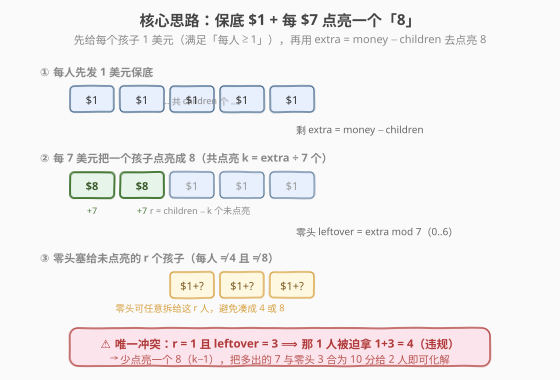
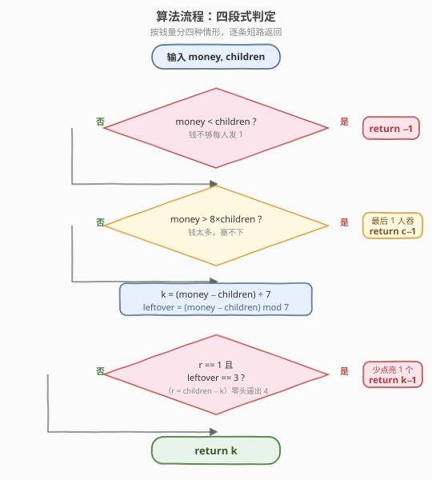
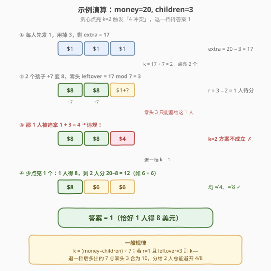

# LeetCode 将钱分给最多的儿童 题解

## 1. 题目概述

- **标题 / 题号**：将钱分给最多的儿童（#2591，easy）
- **链接**：https://leetcode.cn/problems/distribute-money-to-maximum-children/
- **难度**：简单
- **标签**：贪心、数学

**题意**：给定整数 `money`（总钱数）和 `children`（儿童数），按如下规则分配：

- 所有的钱**必须全部分完**；
- 每个儿童至少获得 $1$ 美元；
- **没有人获得恰好 $4$ 美元**。

返回**最多**有多少个儿童获得恰好 $8$ 美元；若不存在任何合法分配方案，返回 $-1$。

**示例 1**：

```text
输入：money = 20, children = 3
输出：1
解释：最多 1 个儿童得 8 美元。如 [8, 9, 3]。
```

**示例 2**：

```text
输入：money = 16, children = 2
输出：2
解释：每个儿童都得 8 美元，即 [8, 8]。
```

**约束**：

- $1 \le \text{money} \le 200$
- $2 \le \text{children} \le 30$

> 💡 **关键约束**：$4$ 是唯一被禁的数额；$8$ 既是「目标值」又是合法值（非 $4$）。题目小数据量（money ≤ 200）允许 $O(1)$ 数学分析，但核心是处理「凑 $8$」与「避开 $4$」之间的一处冲突。

## 2. 解题思路

### 2.1 暴力思路

枚举恰好 $k$ 个儿童拿 $8$（$k$ 从 $\min(\text{children}, \lfloor\text{money}/8\rfloor)$ 往下试），再判断能否把余钱 $\text{money} - 8k$ 分给其余 $\text{children}-k$ 人，每人 $\ge 1$、$\ne 4$、$\ne 8$。单次判定可写，但每个 $k$ 都要论证可行性，容易漏边界。下面用一次「保底 + 点亮」建模直接算出 $k$。

### 2.2 核心观察：保底 $1$ + 每 $7$ 点亮一个 $8$



把分配拆成两步：

1. **保底**：先给每个儿童发 $1$ 美元，保证「每人 $\ge 1$」。此时用掉 $\text{children}$ 美元，剩
   $$
   \text{extra} = \text{money} - \text{children}
   $$
   若 $\text{extra} < 0$（即 $\text{money} < \text{children}$），连保底都做不到 → 无解，返回 $-1$。

2. **点亮**：一个儿童从 $1$ 变成 $8$ 需要再补 $7$ 美元。所以最多能「点亮」
   $$
   k = \left\lfloor \frac{\text{extra}}{7} \right\rfloor
   $$
   个 $8$ 美元儿童，零头
   $$
   \text{leftover} = \text{extra} \bmod 7 \in \{0,1,\dots,6\}
   $$
   必须塞给那 $r = \text{children} - k$ 个**未被点亮**的儿童（否则会改坏已点亮的 $8$）。

> 💡 **为什么零头给「未点亮」的人？** 已点亮的儿童已是 $8$，再加分一文就变 $>8$、不再是「恰好 $8$」，反而减少计数。所以零头只能往那 $r$ 个目前为 $1$ 的人头上加。他们最终值 $= 1 + \text{分到的零头}$，需满足 $\ne 4$（不能凑成 $4$）且 $\ne 8$（不能被动凑出第 $k{+}1$ 个 $8$，那样在更大 $k$ 时已被计入）。

### 2.3 唯一冲突点：$r=1$ 且 $\text{leftover}=3$

零头要分给 $r$ 个人，每人至少分到 $0$、合计 $\text{leftover}$，且 $1+\text{份额} \notin\{4,8\}$，即每人份额 $\notin\{3,7\}$。

- **$r \ge 2$**：总能规避。只需把零头集中塞给一人、其余人拿 $0$；若恰好塞成 $3$ 或 $7$，就从这人挪 $1$ 给另一人（$3\to 2+1$、$7\to 6+1$），两人都安全。故 $r\ge 2$ 永远可行。
- **$r = 1$**：那唯一一人被迫独吞 $\text{leftover}$，最终值 $= 1+\text{leftover}$。它落在 $\{1,\dots,7\}$，其中唯一违规的是 $\text{leftover}=3$（凑成 $4$）。其余 $6$ 种零头都安全（$1+0=1,\,1+1=2,\,1+2=3,\,1+4=5,\,1+5=6,\,1+6=7$，均 $\ne 4,8$）。

> ⚠️ 所以**全局唯一的冲突**就是：$r=1$ 且 $\text{leftover}=3$。此时贪心算出的 $k$ 不成立，需**少点亮一个** $8$：退到 $k-1$，多出的 $7$ 美元与零头 $3$ 合为 $10$，分给 $r'=2$ 人（如 $6+4$→每人 $1{+}6{=}7,\,1{+}4{=}5$，或 $5+5$→$6,6$），总可避开 $4/8$。于是答案为 $k-1$。

还有一处「钱太多」的边界：若 $\text{money} > 8 \times \text{children}$，即便所有儿童都拿 $8$ 也用不光钱，多出的部分无 $r$ 人可吸收（此时 $r=0$），不可能全部恰为 $8$；只能让 $\text{children}-1$ 人拿 $8$、最后 $1$ 人独吞余款 $\ge 9$（$\ne 4,8$），故直接返回 $\text{children}-1$。

### 2.4 算法流程图



汇总为四段短路判定：

1. $\text{money} < \text{children} \Rightarrow -1$；
2. $\text{money} > 8\,\text{children} \Rightarrow \text{children}-1$；
3. 否则 $k = \lfloor(\text{money}-\text{children})/7\rfloor$，$\text{leftover}=(\text{money}-\text{children}) \bmod 7$；
4. 若 $r=\text{children}-k=1$ 且 $\text{leftover}=3 \Rightarrow k-1$，否则 $k$。

### 2.5 示例演算

以 $\text{money}=20,\,\text{children}=3$ 为例：



| 步骤 | 操作 | 状态 | 说明 |
|------|------|------|------|
| ① | 每人发 $1$ | 用 $3$，剩 $\text{extra}=17$ | 保底完成 |
| ② | $k=17\div7=2$，点亮 $2$ 个 $8$ | $[8,8,1]$，$\text{leftover}=3$ | $r=1$ 人待分 |
| ③ | 零头 $3$ 塞给最后 $1$ 人 | $[8,8,\mathbf{4}]$ | 凑出 $4$ 违规 ✗ |
| ④ | 退一档 $k=1$ | $[8,6,6]$ 等 | 余 $12$ 分给 $2$ 人，均 $\ne4,8$ ✓ |

最终答案 $= 1$，与示例一致。对照示例 2：$\text{money}=16=\;8\times2$，走第 3 段 $k=(16-2)/7=2$，$\text{leftover}=0$、$r=0$ 不触发冲突 → 返回 $2$ ✓。

## 3. 参考代码

### C++

```cpp
class Solution {
  public:
    int distMoney(int money, int children) {
        if (money < children) return -1;                 // 连保底都不够
        if (money > 8 * children) return children - 1;   // 钱太多，最后一人吞余款
        int extra = money - children;
        int k = extra / 7;                                // 最多点亮 k 个 8
        int leftover = extra % 7;
        // r = children - k == 1 且零头为 3 -> 那 1 人被迫拿 4，违规，少点亮 1 个
        if (children - k == 1 && leftover == 3) k -= 1;
        return k;
    }
};
```

### Python

```python
class Solution:
    def distMoney(self, money: int, children: int) -> int:
        if money < children:
            return -1                          # 连保底都不够
        if money > 8 * children:
            return children - 1                # 钱太多，最后一人吞余款
        extra = money - children
        k, leftover = divmod(extra, 7)         # 最多点亮 k 个 8
        if children - k == 1 and leftover == 3:  # 那 1 人被迫拿 4，违规
            k -= 1
        return k
```

> 💡 `money == 8 * children` 时既不 $< $ 也不 $> $，落到第 3 段：$\text{extra}=7\,\text{children}$，$k=\text{children}$、$\text{leftover}=0$、$r=0$，不触发冲突 → 返回 $\text{children}$，即全体都恰为 $8$，正确。

## 4. 复杂度分析

| 维度 | 复杂度 | 说明 |
|------|--------|------|
| 时间复杂度 | $O(1)$ | 仅几次算术比较与取整 |
| 空间复杂度 | $O(1)$ | 只用常数变量 |
| 对照：枚举 $k$ | $O(\text{children})$ | 从高到低试每个 $k$ 并判定，本题数据下也可过，但需逐档验证 |

## 5. 扩展：为什么只可能冲突一次？（$k-1$ 一定安全）

直觉上有人担心「退到 $k-1$ 后会不会又触发新的冲突」。结论是**不会**：$k-1$ 时未被点亮的人数 $r' = r+1 = 2$。前面已证 $r\ge 2$ 时零头（此时为 $\text{leftover}+7\in\{10,\dots,16\}$）总能分配开（集中塞一人、必要时挪 $1$ 给另一人即可避开 $\{3,7\}$）。所以**最多退一档**，无需循环回退。这也解释了为何答案是 $k$ 或 $k-1$ 二选一，不存在更低值。

> ⚠️ 另一容易漏的边界：$\text{money} > 8\,\text{children}$ 时返回 $\text{children}-1$，需确认最后那人的余款 $\ge 9$（$\text{money}-8(\text{children}-1) = \text{money}-8\,\text{children}+8 \ge 9$），既非 $4$ 也非 $8$，合法。题面约束 $\text{children}\ge 2$，故 $\text{children}-1\ge 1$。

## 6. 面试要点

1. **为什么先发保底 $1$？这一步有何作用？**

   > 把「每人 $\ge 1$」这一硬约束一次性消化掉，后续只关心「从 $1$ 凑到 $8$」的增量 $7$。于是「能否点亮 $k$ 个 $8$」变成纯除法 $k=\lfloor\text{extra}/7\rfloor$，把分配问题降维成「零头怎么塞」。

2. **唯一的冲突为什么是 $r=1$ 且 $\text{leftover}=3$？**

   > 零头只能塞给未点亮的 $r$ 人。$r\ge 2$ 时把零头集中给一人、必要时挪 $1$ 给另一人即可避开份额 $\{3,7\}$（即终值 $\{4,8\}$）。只剩 $r=1$ 时该人独吞零头，终值 $=1+\text{leftover}\in\{1,\dots,7\}$，仅 $\text{leftover}=3$ 凑成禁值 $4$。

3. **退一档 $k-1$ 会不会还要再退？**

   > 不会。退一档后 $r'=2$，零头变为 $\text{leftover}+7\in\{10,\dots,16\}$，由 $r\ge2$ 的安全性可直接吸收，必存在合法分配。故答案非 $k$ 即 $k-1$。

4. **$\text{money} > 8\,\text{children}$ 为什么是 $\text{children}-1$？**

   > 全员 $8$ 需 $\text{money}=8\,\text{children}$；钱更多时多出部分无人可吸收（$r=0$），故最多 $\text{children}-1$ 个 $8$。让这 $\text{children}-1$ 人各拿 $8$、最后 $1$ 人吞余款 $\ge 9$（$\ne4,8$）即合法，恰好取到上界。

5. **数据范围这么小，能不能直接枚举/搜索？**

   > 能，$O(\text{children})$ 逐档枚举 $k$ 并判定也可 AC。但「保底+点亮」把问题压成 $O(1)$ 几行算术，且思路可迁移到「给定下界/禁值/目标值」一类分配题。面试中先讲清建模，再提暴力兜底，更显严谨。

> 💡 **一句话总结**：先保底每人 $1$，再用 $\text{extra}=\text{money}-\text{children}$ 按「每 $7$ 点亮一个 $8$」算出 $k=\lfloor\text{extra}/7\rfloor$；唯有「剩 $1$ 人且零头为 $3$」会凑出禁值 $4$，此时退一档 $k-1$；钱太多（$>8\,\text{children}$）则全员拿 $8$ 放不下，直接 $\text{children}-1$。

## 同类练习题

| # | 题目 | 与本题的关联 |
|---|------|-------------|
| 292 | [Nim 游戏](https://leetcode.cn/problems/nim-game/) | 同为「按固定批量取数 + 取模判断余量」的 $O(1)$ 数学判定，对照「整除分组 + 余数决定胜负」的建模直觉 |
| — | [LCP 62. 拆分链表使相邻差值为 0](https://leetcode.cn/problems/2-inst3J/)（含「凑目标值、规避特定值」意味的分配/拆分问题） | 练习在带约束的分发里做 $O(1)$ 算术判定 |
| 875 | [爱吃香蕉的珂珂](https://leetcode.cn/problems/koko-eating-bananas/)（[题解](../0801-0900/875_爱吃香蕉的珂珂.md)） | 另一类「凑定值 + 校验余量」问题，用二分答案替代手算，对照「能否成立」的可行性判定思路 |
| 29 | [两数相除](https://leetcode.cn/problems/divide-two-numbers/)（[题解](../0001-0100/29_两数相除.md)） | 把「商 + 余数」的整数除法拆解用到极致，承接本题 `divmod` 的建模基础 |
