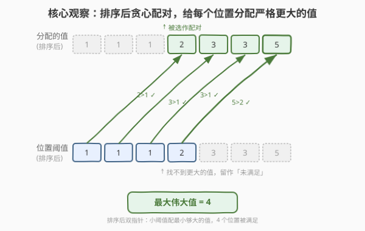
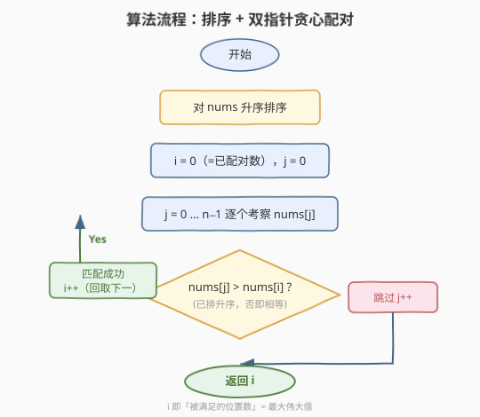
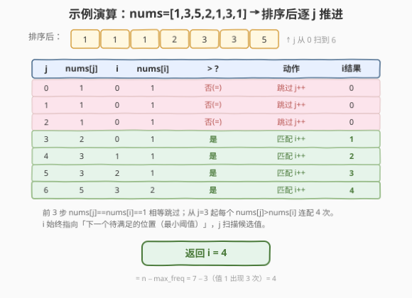

# LeetCode 最大化数组的伟大值 题解

## 1. 题目概述

- **标题 / 题号**：最大化数组的伟大值（#2592，medium）
- **链接**：https://leetcode.cn/problems/maximize-greatness-of-an-array/
- **难度**：中等
- **标签**：贪心、数组、双指针、排序

**题意**：给定下标从 $0$ 开始的整数数组 `nums`，把它重新排列成新数组 `perm`。定义 `nums` 的**伟大值**为满足 $0 \le i < \text{nums.length}$ 且 $\text{perm}[i] > \text{nums}[i]$ 的下标数目。返回重新排列后的**最大**伟大值。

**示例 1**：

```text
输入：nums = [1,3,5,2,1,3,1]
输出：4
解释：一种最优排列为 perm = [2,5,1,3,3,1,1]，在下标 0,1,3,4 处 perm[i] > nums[i]，共 4 个。
```

**示例 2**：

```text
输入：nums = [1,2,3,4]
输出：3
解释：最优排列为 [2,3,4,1]，下标 0,1,2 处 perm[i] > nums[i]，共 3 个。
```

**约束**：

- $1 \le \text{nums.length} \le 10^5$
- $0 \le \text{nums}[i] \le 10^9$

> 💡 **关键观察**：`perm` 与 `nums` 是**同一个多重集**的两个副本——一个作为「分配的值」，一个作为「位置阈值」。伟大值就是「给每个位置找一个严格大于其阈值的值」的**二分匹配数**。值与阈值同源，使得「排序 + 双指针」即可贪心求出最大匹配。

## 2. 解题思路

### 2.1 暴力思路：枚举全排列

最朴素的想法是枚举 `nums` 的每一种排列，逐个比较统计 $\text{perm}[i] > \text{nums}[i]$ 的下标数取最大。$n$ 个元素有 $n!$ 种排列，每种再 $O(n)$ 比较，时间 $O(n!\cdot n)$，$n=10^5$ 下完全不可行。它盲搜了所有顺序，却没看到「值与阈值同源」这一结构——其实只要关心「能把多少个值配到比它小的阈值上」。

### 2.2 核心观察：排序后贪心配对



把问题改写成**二分匹配**：左排是 $n$ 个「待分配的值」，右排是 $n$ 个「位置阈值」，两侧都是 `nums` 这一多重集。一条边连「值 $v$」与「阈值 $t$」当且仅当 $v > t$。伟大值 = 最大匹配数（剩余值与剩余位置随意配，不贡献伟大值）。

两侧同源带来一个漂亮的贪心：**把两侧各自升序排序**（其实是同一份排序数组），用双指针让「最小的阈值」去配「能严格超过它的最小值」。直觉是：小阈值最容易满足，该先满足；而用「刚好够大的值」去满足它，把更大的值留给后面更难的阈值，避免浪费。

具体地，升序排序后令 `i` 指向当前待满足的阈值（也即「已配对数」），`j` 扫描候选值：

- 若 $\text{nums}[j] > \text{nums}[i]$：配对成功，`i++`、`j++`；
- 否则（升序保证 $\text{nums}[j] \ge \text{nums}[i]$，不等即相等）：这个值连最小阈值都顶不过，更顶不过后面的更大阈值，**作废**，`j++` 跳过。

最终 `i` 就是最大匹配数。

> 💡 **为何相等时直接作废是对的？** 升序后 $\text{nums}[j] \ge \text{nums}[i]$ 恒成立。$\text{nums}[j] = \text{nums}[i]$ 时，这个值 $v$ 要配一个严格小于 $v$ 的阈值；可当前最小的阈值都已等于 $v$，后续阈值只更大，再无严格小于 $v$ 的阈值可配——所以 $v$ 注定无法贡献伟大值，作废正确。它最终会落入「剩余值」池，随便填到某个不满足的位置。

### 2.3 算法流程图



流程分四阶段：

1. **升序排序**：`nums` 升序排好（同一份数组同时充当「值池」与「阈值池」）；
2. **初始化**：`i = 0`（待满足的阈值指针，也即已配对数）、`j = 0`（候选值指针）；
3. **双指针扫描**：对 $j = 0, \dots, n-1$：
   - 若 $\text{nums}[j] > \text{nums}[i]$：配对成功，`i++`；
   - 否则（相等）：跳过；
   - 每步 `j++`；
4. **返回** `i`（即被满足的位置数 = 最大伟大值）。

> 💡 注意 `i` 与 `j` 都从 $0$ 起、且 `j` 总不落后于 `i`。匹配发生时二者同步前进；相等时只 `j` 前进，把作废值甩到「剩余池」。

### 2.4 示例演算



以示例 1 `nums = [1,3,5,2,1,3,1]` 为例，升序排序后为 $[1,1,1,2,3,3,5]$：

| 步 $j$ | $\text{nums}[j]$ | $i$ | $\text{nums}[i]$ | $>$ ? | 动作 | $i$ 结果 |
|--------|------------------|-----|------------------|-------|------|---------|
| 0 | 1 | 0 | 1 | 否(=) | 跳过 | 0 |
| 1 | 1 | 0 | 1 | 否(=) | 跳过 | 0 |
| 2 | 1 | 0 | 1 | 否(=) | 跳过 | 0 |
| 3 | 2 | 0 | 1 | 是 | 匹配 `i++` | 1 |
| 4 | 3 | 1 | 1 | 是 | 匹配 `i++` | 2 |
| 5 | 3 | 2 | 1 | 是 | 匹配 `i++` | 3 |
| 6 | 5 | 3 | 2 | 是 | 匹配 `i++` | 4 |

最终 $i = 4$，即最大伟大值 $= 4$，与示例一致。前 3 步三个 $1$ 互相相等只能作废；从 $j=3$ 的 $2$ 起，每个候选值都严格大于当前最小阈值，连配 4 次，用尽 $\{2,3,3,5\}$ 去满足 $\{1,1,1,2\}$ 这 4 个位置。

示例 2 `nums=[1,2,3,4]` 升序不变：$j=0$ 时 $1=1$ 跳过；$j=1,2,3$ 时 $2>1,3>2,4>3$ 连配 3 次，返回 $3$ ✓。

## 3. 参考代码

### C++（排序 + 双指针，$O(n\log n)$ / $O(\log n)$）

```cpp
class Solution {
public:
    int maximizeGreatness(vector<int>& nums) {
        sort(nums.begin(), nums.end());            // 升序排序
        int i = 0;                                 // i = 已配对数 = 待满足阈值指针
        for (int j = 0; j < (int)nums.size(); ++j) {
            if (nums[j] > nums[i]) ++i;            // 配对成功，推进 i；否则作废该值
        }
        return i;
    }
};
```

> 💡 **为什么不写 `else`？** 配对失败时（相等）只 `j` 自增（由 `for` 循环完成），`i` 原地不动——把作废值甩进「剩余值」池。`i` 始终等于「已配对数」，循环结束即为答案，无需额外计数变量。

### Python（排序 + 双指针，$O(n\log n)$ / $O(\log n)$）

```python
class Solution:
    def maximizeGreatness(self, nums: List[int]) -> int:
        nums.sort()                               # 升序排序
        i = 0                                     # i = 已配对数 = 待满足阈值指针
        for x in nums:                            # x 即 nums[j]
            if x > nums[i]:
                i += 1                            # 配对成功，推进 i；否则作废
        return i
```

> 💡 Python 的 `for x in nums` 直接遍历候选值，省去显式 `j`。`i` 既是「已配对数」又是「下一个待满足阈值」的下标，一变量两用是这题最简写法。$n \le 10^5$、$\text{nums}[i] \le 10^9$，全程无累加、无溢出风险。

## 4. 复杂度分析

| 维度 | 复杂度 | 说明 |
|------|--------|------|
| **时间复杂度** | $O(n\log n)$ | 排序主导；一趟双指针扫描 $O(n)$，被排序掩盖 |
| **空间复杂度** | $O(\log n)$ | 排序的递归栈（`sort` 内部）；额外变量仅 `i` 为 $O(1)$ |
| 对照：枚举全排列 | $O(n!\cdot n)$ 时间 / $O(n)$ 空间 | 盲搜所有顺序，未利用「值与阈值同源」 |
| 对照：频率公式（见 §5） | $O(n)$ 时间 / $O(n)$ 空间 | 哈希计数最大频率，一步出答案 |

> 💡 排序 $O(n\log n)$ 在 $n=10^5$ 下约 $1.7\times10^6$ 次比较，轻松通过。若利用值域做桶排序可压到 $O(n+\text{值域})$，但实现复杂度未必划算，$O(n\log n)$ 已足够。

## 5. 扩展：$O(n)$ 频率公式 —— 答案恰为 $n - \max\_freq$

观察示例 1：$n=7$，值 $1$ 出现 $3$ 次（众数），$7-3=4$ 正是答案。示例 2：$n=4$，每个值各出现 $1$ 次，$4-1=3$。**最大伟大值 $= n - \max\_freq$**，其中 $\max\_freq$ 是任意值在 `nums` 中出现的最大次数。这给出了一个 $O(n)$ 的哈希计数解法：

```python
class Solution:
    def maximizeGreatness(self, nums: List[int]) -> int:
        freq = Counter(nums)
        return len(nums) - max(freq.values())
```

下面证明这个公式。设众数 $v^*$ 出现 $f$ 次，令 $s$ 为严格小于 $v^*$ 的元素个数，则严格大于 $v^*$ 的元素有 $n - s - f$ 个。

**下界（$\ge n-f$，构造）**：把数组升序排序为 $a[0],\dots,a[n-1]$，做「错位 $f$」配对：把 $a[i]$ 配 $a[i+f]$，$i=0,\dots,n-f-1$。若某处 $a[i]=a[i+f]$，则 $a[i]=a[i+1]=\cdots=a[i+f]$ 共 $f+1$ 个相同值，与「最大频率 $=f$」矛盾；故 $a[i+f]>a[i]$ 恒成立，得到 $n-f$ 个合法配对。所以最大伟大值 $\ge n-f$。

**上界（$\le n-f$，计数）**：对任意配对方案，把被满足的位置（阈值）按是否 $< v^*$ 分两组：
- 阈值 $< v^*$ 的被满足位置：至多 $s$ 个（这种阈值总共 $s$ 个）；
- 阈值 $\ge v^*$ 的被满足位置：需配一个严格更大的值，即值 $> v^*$；而值 $> v^*$ 的元素只有 $n-s-f$ 个，故此类至多 $n-s-f$ 个。

两类相加 $\le s + (n-s-f) = n-f$，故最大伟大值 $\le n-f$。

综上，最大伟大值 $= n-f = n - \max\_freq$，双指针贪心恰好取到这个上界。

> ⚠️ 两个解法等价但侧重不同：双指针直观演示「怎么配」，频率公式直接回答「配多少」。面试先讲双指针说清贪心，再用频率公式点睛，更显功底。注意 $f$ 是**任意值的最大频次**，未必是「最小值/最大值的频次」。

## 6. 面试要点

1. **为什么伟大值可以化归成二分匹配？**

   > `perm` 是 `nums` 的重排，故「分配的值」与「位置阈值」是同一多重集的两个副本。伟大值 $=|\{i:\text{perm}[i]>\text{nums}[i]\}|$ 就是「值 $>$ 阈值」的匹配边数；剩余值与剩余位置随便配都不贡献，所以最大伟大值 = 该二分图的最大匹配。

2. **双指针贪心为什么是最优？相等时作废会不会漏掉机会？**

   > 用交换论证：若最优解没把「最小阈值」配给「能超过它的最小值」，则该阈值配了更大的值、那个最小可用值配给了更大阈值；把它们对调仍合法，匹配数不降。故贪心最优。相等作废是因为升序后 $\text{nums}[j]\ge\text{nums}[i]$，相等时该值 $v$ 需要阈值 $<v$，而当前最小阈值已 $=v$、后续更大，再无可配阈值——作废正确。

3. **$i$ 既当指针又当计数，怎么理解？**

   > `i` 指向下一个待满足的阈值（下标 $0,1,\dots$），匹配成功才前进，所以 `i` 的值就是「已成功配对数」。循环结束 `i` 落在最后一个被满足阈值的下一个位置，恰好等于总匹配数，直接返回即可，省一个计数变量。

4. **为什么答案是 $n-\max\_freq$？**

   > 众数 $v^*$ 出现 $f=\max\_freq$ 次。被满足位置中：阈值 $<v^*$ 的至多 $s$ 个（这种阈值共 $s$ 个），阈值 $\ge v^*$ 的需配值 $>v^*$、至多 $n-s-f$ 个（这种值共 $n-s-f$ 个）；总和 $\le n-f$。构造上「错位 $f$」配对 $a[i]$ 与 $a[i+f]$ 可取到 $n-f$（若相等则 $f+1$ 同值，矛盾）。故恰为 $n-f$。

5. **若题目改为「$\ge$」而非「$>$」，答案会变吗？**

   > 会变为 $n-1$（只要 $n\ge 2$）：把任一元素配到另一个不更小的位置即可，值与阈值同源时几乎总能配出 $n-1$ 个非严格更大位置（留一个最大值配最小阈值）。这反映「严格」与「非严格」在匹配图上只差等值边，结果差异显著。

> 💡 **一句话总结**：值与阈值同源 → 排序后双指针贪心配对；小阈值配「刚够大」的值，相等作废；最终匹配数恰为 $n-\max\_freq$。$O(n\log n)$ 时间、$O(\log n)$ 空间，是「排序 + 贪心 + 双指针」三件套在二分匹配上的招牌应用。

## 同类练习题

| # | 题目 | 与本题的关联 |
|---|------|-------------|
| 455 | [分发饼干](https://leetcode.cn/problems/assign-cookies/)（[题解](../0401-0500/455_分发饼干.md)） | 双指针把「最小够大的饼干」分给「最不贪心的孩子」，与本题贪心模板几乎同构 |
| 881 | [救生艇](https://leetcode.cn/problems/boats-to-save-people/)（[题解](../0801-0900/881_救生艇.md)） | 排序后双指针配对（最轻+最重同船），同属「排序揭示最优配对」的贪心招牌 |
| 561 | [数组拆分](https://leetcode.cn/problems/array-partition/)（[题解](../0501-0600/561_数组拆分.md)） | 排序后两两配对取较小者求和最大化，对照本题用排序支配配对方向 |
| 976 | [三角形的最大周长](https://leetcode.cn/problems/largest-perimeter-triangle/)（[题解](../0901-1000/976_三角形的最大周长.md)） | 排序后贪心选三元组判定 $a+b>c$，承接本题「排序 + 相邻贪心」思维 |
| 2587 | [重排数组以得到最大前缀分数](https://leetcode.cn/problems/rearrange-array-to-maximize-prefix-score/)（[题解](../2501-2600/2587_重排数组以得到最大前缀分数.md)） | 同区间的「重排数组求最值」姐妹题，降序排序让每个前缀位置同时最优，与本题贪心重排对照 |
