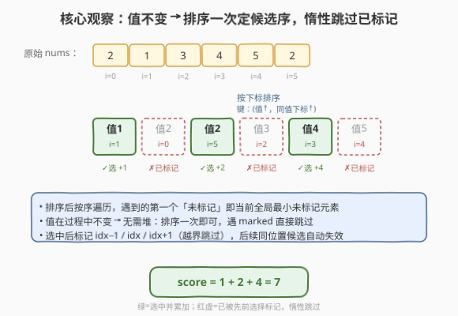
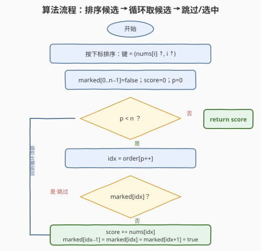
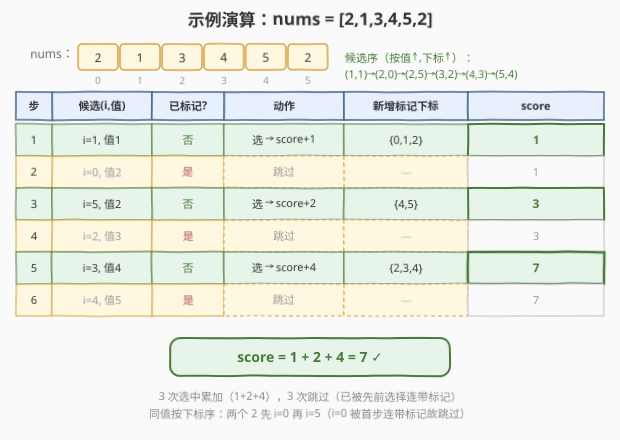

# 标记所有元素后数组的分数

- **题目名称**：标记所有元素后数组的分数
- **链接**：[2593. 标记所有元素后数组的分数](https://leetcode.cn/problems/find-score-of-an-array-after-marking-all-elements/)
- **难度**：中等
- **标签**：数组、排序、模拟、贪心

## 1. 题目概述

给你一个下标从 $0$ 开始、包含若干正整数的数组 `nums`。一开始分数 `score = 0`，按如下算法求最终分数：

- 从数组中选择**最小且没有被标记**的整数；若有相等元素，选择**下标最小**的一个；
- 将选中的整数加到 `score` 中；
- 标记**被选中的元素**，若它有相邻元素，则同时标记**与它相邻的两个元素**；
- 重复直到所有元素都被标记。

返回最终分数。

**示例 1**：

```text
输入：nums = [2,1,3,4,5,2]
输出：7
解释：
- 1 最小未标记 → 标记它与相邻：[2,1,3,4,5,2] 中下标 0,1,2 被标记
- 2 最小未标记（下标 5）→ 标记它与相邻：下标 4,5 被标记
- 4 仅剩未标记 → 标记它：下标 3 被标记
总得分 1 + 2 + 4 = 7
```

**示例 2**：

```text
输入：nums = [2,3,5,1,3,2]
输出：5
解释：
- 1 最小未标记（下标 3）→ 标记下标 2,3,4
- 2 最小未标记；有两个 2，取下标最小的 0 → 标记下标 0,1
- 2 仅剩未标记（下标 5）→ 标记下标 4,5
总得分 1 + 2 + 2 = 5
```

**约束条件**：

- $1 \le \text{nums.length} \le 10^5$
- $1 \le \text{nums}[i] \le 10^6$

> 💡 **关键性质**：算法每一步「选最小未标记」是**确定性**的——选谁完全由当前数组状态决定，不容我们做任何选择。因此问题不是「如何选使分数最大」，而是「如何**高效模拟**这个被规定好的过程」。模拟的难点在于「每轮找最小未标记」若朴素扫描会退化到 $O(n^2)$。

---

## 2. 解题思路

### 2.1 暴力思路：每轮线性扫最小

最直接的模拟：维护一个 `marked` 布尔数组，每轮在未标记元素里线性扫一遍找最小（值相同取下标最小），加到分数并标记自身与左右邻居，直到全部标记。

```python
n = len(nums)
marked = [False] * n
score = 0
while True:
    j = -1
    for i in range(n):
        if not marked[i] and (j == -1 or nums[i] < nums[j]):
            j = i
    if j == -1:
        break
    score += nums[j]
    for k in (j-1, j, j+1):
        if 0 <= k < n:
            marked[k] = True
```

时间 $O(n^2)$（每轮扫 $O(n)$，最坏 $n$ 轮），$n=10^5$ 时约 $10^{10}$ 次比较，**超时**。它每轮重复扫整段，把「找最小」当成在线查询，却没利用到一个事实：**选谁其实是预先可排定的**。

### 2.2 核心观察：排序一次定候选序 + 惰性跳过



把「每轮找最小未标记」换个视角：算法本质是**按 (值升序, 下标升序) 依次取出候选**，只是有些候选在轮到它时已被先前选择连带标记而作废。这给了两个关键观察：

**观察一：元素的值在过程中不变**。被「标记」只是把它排除出候选集，并不改变它的值（区别于 [2558. 从数量最多的堆取走礼物](../2501-2600/2558_从数量最多的堆取走礼物.md) 那种「取走后剩余量会变」的题）。既然值不变，「最小未标记」就恒等于「按值排序后第一个还没被作废的候选」——**排序一次就能把所有轮的选取顺序提前确定**，无需每轮重新找最小。

**观察二：被作废的候选天然惰性可跳**。按排序后的候选序顺序遍历即可：遇到尚未标记的就选（它一定是当前全局最小未标记），选中后标记自身与左右邻居；遇到已被标记的直接跳过。因为候选序本身按值升序，遍历中**第一个未标记者就是当前最小未标记**——这正是算法每一步要选的那个。

> 💡 **为什么排序的二级键是下标？** 题目规定「同值取下标最小」。把下标作为次键升序，等值候选便天然按下标从小到大排好，轮到它们时自然先取下标小者（见示例 2 的两个 `2`：下标 0 先于下标 5）。

> ⚠️ **为什么这等价于原算法？** 原算法每轮在「当前未标记集合」中取最小。排序后顺序遍历、跳过已标记者，遍历到的首个未标记候选——由于更靠前的候选要么更小、要么同值下标更小——恰好就是当前未标记集合的最小值（含下标 tie-break）。故每取一个未标记候选，等价于原算法的一轮操作，选中后连带标记邻居也完全一致。两者状态演化完全同步，结果必然相同。

### 2.3 算法流程图



流程分四阶段：

1. **排序候选**：构造下标数组 `order = [0,1,…,n−1]`，按 `(nums[i], i)` 升序排序；
2. **初始化**：`marked[0..n−1]=false`、`score=0`、指针 `p=0`；
3. **顺序遍历候选**：对 `p` 从 $0$ 到 $n−1$：
   - `idx = order[p]`；
   - 若 `marked[idx]` 为真：跳过（已作废）；
   - 否则：`score += nums[idx]`，并标记 `idx−1`、`idx`、`idx+1`（越界跳过）；
4. **返回** `score`。

> 💡 **不需要「循环到全部标记」的外层 while**：排序后的 $n$ 个候选逐个处理完毕时，由于每次选中必连带标记若干元素、且自身计入，遍历完即等价于所有元素都已标记。最坏遍历 $n$ 个候选、$O(n)$ 次标记操作，是单趟扫描。

### 2.4 示例演算

以示例 1 `nums=[2,1,3,4,5,2]` 为例，按 `(值, 下标)` 升序得到的候选序为 `(1,i=1)→(2,i=0)→(2,i=5)→(3,i=2)→(4,i=3)→(5,i=4)`：



| 步 | 候选(i,值) | 已标记? | 动作 | 新增标记 | score |
|----|-----------|---------|------|----------|-------|
| 1 | i=1, 值1 | 否 | 选 → +1 | {0,1,2} | 1 |
| 2 | i=0, 值2 | 是 | 跳过 | — | 1 |
| 3 | i=5, 值2 | 否 | 选 → +2 | {4,5} | 3 |
| 4 | i=2, 值3 | 是 | 跳过 | — | 3 |
| 5 | i=3, 值4 | 否 | 选 → +4 | {2,3,4} | 7 |
| 6 | i=4, 值5 | 是 | 跳过 | — | 7 |

最终 `score = 1 + 2 + 4 = 7` ✓。注意第 2 步候选 `i=0` 虽值也是 2 且下标最小，但已在第 1 步被连带标记（首步标记了 `idx−1=0`），故惰性跳过；同值的另一个 2（`i=5`）在第 3 步才被选中——这正是「同值取下标最小」在连带标记下的自然结果。

示例 2 `nums=[2,3,5,1,3,2]`：候选序 `(1,3)→(2,0)→(2,5)→(3,1)→(3,4)→(5,2)`，第 1 步选 `i=3` 标记 `{2,3,4}`、第 2 步选 `i=0` 标记 `{0,1}`、第 3 步选 `i=5` 标记 `{4,5}`，其余跳过，`score=1+2+2=5` ✓。

---

## 3. 参考代码

### C++（排序下标 + 布尔数组模拟，$O(n\log n)$ / $O(n)$）

```cpp
// 标记所有元素后数组的分数.cpp —— 排序候选序 + 惰性跳过已标记
// 编译: g++ -O2 -std=c++17 标记所有元素后数组的分数.cpp -o find_score
#include <vector>
#include <numeric>
#include <algorithm>
using namespace std;

class Solution {
public:
    long long findScore(vector<int>& nums) {
        int n = nums.size();
        vector<int> order(n);
        iota(order.begin(), order.end(), 0);                 // order = [0,1,...,n-1]
        sort(order.begin(), order.end(), [&](int a, int b) {
            if (nums[a] != nums[b]) return nums[a] < nums[b]; // 主键：值升序
            return a < b;                                    // 次键：下标升序（同值取小）
        });

        vector<char> marked(n, 0);                           // 标记数组（char 省内存）
        long long score = 0;
        for (int idx : order) {
            if (marked[idx]) continue;                      // 已被先前选择连带标记，跳过
            score += nums[idx];
            for (int k = idx - 1; k <= idx + 1; ++k)         // 标记自身与左右邻居
                if (k >= 0 && k < n) marked[k] = 1;
        }
        return score;
    }
};
```

> 💡 **细节**：`iota` 生成下标序列，`sort` 用自定义比较器按 `(值, 下标)` 排序——次键 `a < b` 保证了同值按下标升序，与题目 tie-break 一致。`marked` 用 `vector<char>` 比 `vector<bool>` 在并发安全与可读性上更稳妥（`vector<bool>` 是 bit 压缩特化）。`score` 用 `long long`：最坏和约 $n \cdot \max = 10^5 \times 10^6 = 10^{11}$，超出 32 位 `int`。

### Python（排序下标 + 布尔数组模拟，$O(n\log n)$ / $O(n)$）

```python
class Solution:
    def findScore(self, nums: List[int]) -> int:
        n = len(nums)
        order = sorted(range(n), key=lambda i: (nums[i], i))  # 主键值、次键下标
        marked = [False] * n
        score = 0
        for idx in order:
            if marked[idx]:
                continue                                    # 已被连带标记，跳过
            score += nums[idx]
            for k in (idx - 1, idx, idx + 1):               # 标记自身与左右邻居
                if 0 <= k < n:
                    marked[k] = True
        return score
```

> 💡 Python 的 `sorted(range(n), key=lambda i: (nums[i], i))` 一行搞定「按 (值, 下标) 升序」——元组比较天然按字典序，先比值再比下标，与 C++ 比较器等价。`int` 无溢出之忧。整段是「排序 + 单趟扫描」，无嵌套循环。

---

## 4. 复杂度分析

| 维度 | 复杂度 | 说明 |
|------|--------|------|
| **时间复杂度** | $O(n\log n)$ | 排序下标 $O(n\log n)$ 主导；遍历候选至多 $n$ 次，每次标记 $O(1)$（最多 3 个位置），合计 $O(n)$ |
| **空间复杂度** | $O(n)$ | `order` 下标数组与 `marked` 布尔数组各 $O(n)$；若不计输出/排序内部，仍需 $O(n)$ 辅助 |

> 💡 排序是时间主导项。能否 $O(n)$？必须建立「值的大小序」，最坏需 $O(n\log n)$（比较型下界）。若利用 $\text{nums}[i]\le 10^6$ 的值域做**计数排序/桶排**可压到 $O(n + V)$（$V=10^6$），但常数与空间未必划算，$O(n\log n)$ 已稳过 $n=10^5$。空间上 `marked` 是必须的（要支持 $O(1)$ 查/改），$O(n)$ 已是最优。

---

## 5. 扩展：最小堆 + 惰性删除 / 链表模拟

「排序候选序 + 惰性跳过」并非唯一写法，另两种等价实现有助于理解不同载体下的同一套路：

**写法一：最小堆 + 惰性删除**。把 `(nums[i], i)` 全部入小顶堆，每次弹出堆顶 `idx`，若 `marked[idx]` 为真就丢弃继续弹（惰性删除已作废候选），否则选中并标记邻居。堆版与排序版的区别仅在于「候选序」由堆动态给出而非预排序——但本题值不变，预排序一次足矣，故堆版多出 $O(n)$ 空间且常数更大，仅在与「值会变」的题（如 [2558](../2501-2600/2558_从数量最多的堆取走礼物.md)、[2530](../2501-2600/2530_执行K次操作后的最大分数.md)）统一模板时才显价值。

```python
import heapq
class Solution:
    def findScore(self, nums: List[int]) -> int:
        n = len(nums)
        heap = [(nums[i], i) for i in range(n)]
        heapq.heapify(heap)
        marked = [False] * n
        score = 0
        while heap:
            val, idx = heapq.heappop(heap)
            if marked[idx]:
                continue                       # 惰性跳过已作废候选
            score += val
            for k in (idx - 1, idx, idx + 1):
                if 0 <= k < n:
                    marked[k] = True
        return score
```

**写法二：双向链表 + 删除**。用双向链表维护「未标记元素」，选中某下标后把自身与左右邻居从链表摘除。配合最小堆按值取候选，弹出时若节点已不在链表中则跳过。它把「标记」具象为「物理删除」，省去 `marked` 数组，但实现复杂、常数不优，主要适合「删除后还需在剩余结构上做区间查询」的变体。

| 解法 | 时间 | 空间 | 适用场景 |
|------|------|------|----------|
| 暴力每轮扫最小 | $O(n^2)$ | $O(n)$ | 仅作思路对照，超时 |
| **排序下标 + 惰性跳过** | $O(n\log n)$ | $O(n)$ | 值不变的本题最优 |
| 最小堆 + 惰性删除 | $O(n\log n)$ | $O(n)$ | 与「值会变」题统一模板 |
| 双向链表 + 删除 | $O(n\log n)$ | $O(n)$ | 需在剩余结构上做区间查询的变体 |

> 💡 **面试建议**：渐进讲法是加分项——先讲暴力 $O(n^2)$ 模拟（容易想到），点出「值不变 → 候选序可预排序」这一关键性质，引出「排序 + 惰性跳过」$O(n\log n)$；若被追问「值若会变怎么办」，自然过渡到「最小堆 + 惰性删除」模板。

---

## 6. 面试要点

1. **本题是「模拟」还是「贪心/DP 最优化」？**

   > 是**确定性模拟**，非最优化。每一步选谁是算法规定死的（当前最小未标记，同值取下标最小），我们无任何决策自由。所以目标不是「设计策略使分数最大」，而是「高效还原这个被规定的过程」。这与 [740. 删除并获得点数](../0701-0800/740_删除并获得点数.md) 形成鲜明对照——740 是「自己决定选哪些使和最大」（需 DP），本题是「按既定顺序选」（只需模拟）。

2. **为什么按 `(值, 下标)` 排序后顺序遍历、跳过已标记，等价于原算法？**

   > 排序后候选序按值升序、同值按下标升序。遍历中遇到的第一个「未标记」候选，其值不大于任何更靠后的未标记候选（靠前者要么更小、要么同值下标更小），故它恰是当前未标记集合的最小值（含下标 tie-break）。选中后连带标记左右邻居的操作与原算法一致，状态演化同步，结果必然相同。

3. **同值元素的下标 tie-break 是怎么保证的？**

   > 把下标作为排序次键升序。等值候选便天然按下标从小到大排列，轮到它们时先处理下标小者。但「先处理」不等于「一定选中」——若它已被先前某次选择连带标记（如示例 1 的 `i=0` 被首步标记 `idx−1=0`），则惰性跳过，转而处理同值的下一个。这正是「同值取下标最小」在连带标记语境下的正确语义。

4. **为什么用排序而非最小堆？**

   > 关键在于**元素的值在过程中不变**。值不变意味着「最小未标记」永远是排序后第一个未作废者，候选序可一次性预排定，无需动态维护。最小堆的优势在于「值会动态变化」时仍能取最小（如 [2558](../2501-2600/2558_从数量最多的堆取走礼物.md) 取走后堆要变小再放回）；本题无此需求，预排序更省空间、常数更小。堆的「惰性删除」与排序的「惰性跳过」是同一思想在不同载体上的体现。

5. **`score` 用什么类型？哪里有溢出风险？**

   > 最坏情况下每次选中都累加，和约 $n \cdot \max(\text{nums}[i]) = 10^5 \times 10^6 = 10^{11}$，远超 32 位有符号 `int`（约 $2.1\times10^9$）。C++ 必须用 `long long`；Python 整数任意精度无此问题。`marked` 数组虽占 $O(n)$，但 $n=10^5$ 的 `char`/`bool` 仅约 100KB，可忽略。

> 💡 **一句话总结**：值不变让「每轮找最小未标记」退化为「按 (值, 下标) 排序后顺序取候选」；遍历中遇已标记即惰性跳过，选中即连带标记左右邻居。$O(n\log n)$ 时间、$O(n)$ 空间一趟模拟，是「排序预排候选序 + 惰性跳过」模板在「值不变」条件下的最优形态。

---

## 7. 同类练习题

- [2558. 从数量最多的堆取走礼物](https://leetcode.cn/problems/take-gifts-from-the-richest-pile/)（[题解](../2501-2600/2558_从数量最多的堆取走礼物.md)）：反复取最大并变形放回——「值会变」时改用最小堆 + 惰性删除，对照本题「值不变」用预排序的取舍
- [2530. 执行 K 次操作后的最大分数](https://leetcode.cn/problems/maximal-score-after-applying-k-operations/)（[题解](../2501-2600/2530_执行K次操作后的最大分数.md)）：反复取最大并变形放回，与 2558 同属「值会变」家族，凸显本题无需堆的原因
- [740. 删除并获得点数](https://leetcode.cn/problems/delete-and-earn/)（[题解](../0701-0800/740_删除并获得点数.md)）：选某值即排除相邻值——同是「选 + 排除邻居」，但属最优化需 DP，对照本题确定性模拟的根本差异
- [1005. K 次取反后最大化的数组和](https://leetcode.cn/problems/maximize-sum-of-array-after-k-negations/)（[题解](../1001-1100/1005_K次取反后最大化的数组和.md)）：排序支配操作顺序的贪心模板，对照本题用排序预排候选序
- [1338. 数组大小减半](https://leetcode.cn/problems/reduce-array-size-to-the-half/)（[题解](../1301-1400/1338_数组大小减半.md)）：按频率贪心删除元素使数组减半，同属「排序/计数支配删除顺序」的贪心家族
