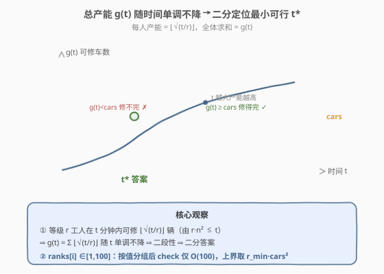

# LeetCode 修车的最少时间 题解

## 1. 题目概述

- **标题 / 题号**：修车的最少时间（#2594，medium）
- **链接**：https://leetcode.cn/problems/repair-cars/
- **难度**：中等
- **标签**：数组、二分查找、二分答案、数学

**题意**：有若干名修理工，每名有一个**技术等级** `ranks[i]`。一名等级为 $r$ 的修理工修理 $n$ 辆车需要 $r \cdot n^2$ 分钟。所有修理工**同时并行**工作，每人修的车数之和要等于 `cars`。返回修完所有车的**最少时间**。

**示例 1**：

```text
输入：ranks = [4,2,3,1], cars = 10
输出：16
解释：等级 1 修 4 辆 → 1·4² = 16；等级 2 修 2 辆 → 2·2² = 8；
     等级 3 修 2 辆 → 3·2² = 12；等级 4 修 2 辆 → 4·2² = 16。
     共 4+2+2+2 = 10 辆，最大用时 = 16 分钟。
```

**示例 2**：

```text
输入：ranks = [5,1,8], cars = 6
输出：16
解释：等级 1 修 4 辆 → 16；等级 5 修 1 辆 → 5；等级 8 修 1 辆 → 8。
     共 4+1+1 = 6 辆，最大用时 = 16 分钟。
```

**约束**：

- $1 \le \text{ranks.length} \le 10^5$
- $1 \le \text{ranks}[i] \le 100$
- $1 \le \text{cars} \le 10^6$

> 💡 两处约束暗示解法：① 时间是「能/不能修完」的**单调布尔序列**——典型二分答案信号；② `ranks[i]` 仅在 $[1,100]$，可**按值分组**让每次 `check` 从 $O(n)$ 降到 $O(100)$。

## 2. 解题思路

### 2.1 暴力思路：线性枚举时间

最直白的做法是**从 $t=1$ 起逐分钟试探**：对每个 $t$，算出所有修理工在 $t$ 分钟内总共能修多少辆，第一个达到 `cars` 的 $t$ 即答案。

- 单次试探：每人最多修 $\lfloor\sqrt{t/r}\rfloor$ 辆（由 $r\cdot n^2 \le t$），求和 $O(n)$。
- 总复杂度 $O(\text{ans}\cdot n)$。而 $\text{ans}$ 最高 $\approx 100\cdot(10^6)^2 = 10^{14}$（单人独干的最坏情形），天文级，**完全不可行**。

> ⚠️ 暴力暴露的关键事实：「总产能随 $t$ 单调不降」——$t$ 越大每人能修的越多。这一单调性正是把「线性扫描」升级为「二分」的依据：存在分界点 $t^*$，$t < t^*$ 修不完、$t \ge t^*$ 能修完，$t^*$ 即答案。

### 2.2 核心观察：二分答案



三个观察层层递进：

1. **单人产能可解析求出**：给定时间 $t$，等级 $r$ 的工人能修的最大车数 $n$ 满足 $r\cdot n^2 \le t$，即 $n \le \sqrt{t/r}$，故 $n = \lfloor\sqrt{t/r}\rfloor$。无需模拟「修几辆」的过程，直接由公式算出每个工人在 $t$ 分钟内的上限——这正是二分 `check` 能 $O(n)$（甚至 $O(100)$）完成的基础。

2. **二段性（单调）**：设 $g(t)=$ 在 $t$ 分钟内全体可修车数之和。显然 $g(t)$ 随 $t$ 单调不降（$t$ 增大 → 每人 $\lfloor\sqrt{t/r}\rfloor$ 不减）。于是存在分界 $t^*$：$t < t^*$ 时 $g(t) < \text{cars}$（修不完），$t \ge t^*$ 时 $g(t) \ge \text{cars}$（修得完）。**最小可行 $t^*$ 即答案**——二分 $t$ 即可定位。

3. **上界取「最快一人独干」**：把全部 `cars` 辆交给等级最小 $r_{\min}$ 的工人，时间 $r_{\min}\cdot\text{cars}^2$ 必然可行（其他人修 0 辆），故答案 $\le r_{\min}\cdot\text{cars}^2$。以此为 `hi`，既紧又合法。注意此值可达 $100\cdot(10^6)^2=10^{14}$，**必须用 64 位整数**。

> 💡 **识别信号**：题目求「最小可行值」+ 能 $O(n)$ 验证候选答案 $\Rightarrow$ 二分答案。本题属「最小化」家族（求最小可行上限 $t^*$），可行时 `ans=mid; hi=mid-1` 向左收缩，与 [875](../0801-0900/875_爱吃香蕉的珂珂.md)/[1011](../1001-1100/1011_在D天内送达包裹的能力.md) 同向；与 [2517. 礼盒的最大甜蜜度](../2501-2600/2517_礼盒的最大甜蜜度.md) 的「最大化最小值」方向相反（那题可行时向右扩张）。

### 2.3 算法流程图

![算法流程：按值分组 + 二分答案，check(t)=Σ freq[r]·⌊√(t/r)⌋ ≥ cars](../images/repair_cars_flow.svg)

流程五步：

1. **按值分组**：`freq[r]` 统计每个等级的人数（$r\in[1,100]$），并求 $r_{\min}$；
2. **定界**：`lo=1`，`hi=r_min·cars²`（最快一人独干，必可行），`ans=0`；
3. **二分**：`mid=(lo+hi)/2`，计算 `cnt = Σ freq[r]·⌊√(mid/r)⌋`（`mid/r` 为整数除法）；
4. **判定收缩**：`cnt ≥ cars` $\Rightarrow$ 可行，`ans=mid; hi=mid-1`（向左找更短）；否则 `lo=mid+1`（加大时间）；
5. `lo > hi` 结束，返回 `ans`。

> ⚠️ **整数平方根的精度**：`⌊√(t/r)⌋` 用浮点 `sqrt` 可能因大数（$t/r$ 可达 $10^{14}$）末位误差差 1。正确做法见第 5 节：**先证** $\lfloor\sqrt{t/r_{\text{实}}}\rfloor = \lfloor\sqrt{\lfloor t/r\rfloor}\rfloor$（故用整数除法安全），再用整数 `isqrt` 或 `sqrtl` + 修正循环兜底。

### 2.4 示例演算

![示例演算：ranks=[4,2,3,1], cars=10 二分过程](../images/repair_cars_walkthrough.svg)

以示例 1 `ranks = [4,2,3,1]`、`cars = 10` 为例。分组后 `freq={1:1,2:1,3:1,4:1}`，$r_{\min}=1$，`hi = 1·10² = 100`。各轮 `cnt(t) = ⌊√(t/1)⌋ + ⌊√(t/2)⌋ + ⌊√(t/3)⌋ + ⌊√(t/4)⌋`：

| 轮 | $[lo,hi]$ | mid | $g(\text{mid})$ | 结果 | ans |
|----|-----------|-----|------------------|------|-----|
| 1 | $[1,100]$ | 50 | $7+5+4+3=19$ | ✓ | 50 |
| 2 | $[1,49]$ | 25 | $5+3+2+2=12$ | ✓ | 25 |
| 3 | $[1,24]$ | 12 | $3+2+2+1=8$ | ✗ | 25 |
| 4 | $[13,24]$ | 18 | $4+3+2+2=11$ | ✓ | 18 |
| 5 | $[13,17]$ | 15 | $3+2+2+1=8$ | ✗ | 18 |
| 6 | $[16,17]$ | 16 | $4+2+2+2=10$ | ✓ | 16 |

第 6 轮 `cnt(16)=10 ≥ cars`，可行 $\Rightarrow$ `ans=16; hi=15`；随后 `lo=16 > hi=15` 结束，返回 **16**。验证 $g(15)=3+2+2+1=8<10$（修不完），$g(16)=10\ge10$（恰好修完），故 16 确为最小可行时间。

## 3. 参考代码

### C++

```cpp
class Solution {
public:
    long long repairCars(vector<int>& ranks, int cars) {
        int freq[101] = {};
        int rmin = 100;
        for (int r : ranks) {            // 按值分组：ranks[i] ∈ [1,100]
            ++freq[r];
            rmin = min(rmin, r);
        }
        auto isqrt = [](long long q) -> long long {   // ⌊√q⌋，修正浮点末位误差
            long long n = sqrtl((long double)q);
            while (n * n > q) --n;
            while ((n + 1) * (n + 1) <= q) ++n;
            return n;
        };
        long long lo = 1, hi = (long long)rmin * cars * cars, ans = 0;  // 上界=最快一人独干
        while (lo <= hi) {
            long long mid = lo + (hi - lo) / 2;
            long long cnt = 0;
            for (int r = 1; r <= 100 && cnt < cars; ++r)          // 提前终止
                if (freq[r]) cnt += (long long)freq[r] * isqrt(mid / r);
            if (cnt >= cars) { ans = mid; hi = mid - 1; }          // 够，向左找更短
            else             { lo = mid + 1; }                     // 不够，加大时间
        }
        return ans;
    }
};
```

> 💡 三处细节：① `freq` 分组把每次 `check` 从 $O(n)$ 降到 $O(100)$，二分仅约 $\log_2(10^{14})\approx 47$ 轮；② `(long long)freq[r] * isqrt(...)`：$\text{freq}$ 最高 $10^5$、`isqrt` 可达 $10^7$，乘积 $10^{12}$ 超 32 位 `int`，先转 64 位；③ `isqrt` 的两条 `while` 是精度兜底——`sqrtl` 对 $10^{14}$ 量级可能差 1，修正后保证 $\lfloor\sqrt q\rfloor$ 精确。

### Python

```python
class Solution:
    def repairCars(self, ranks: List[int], cars: int) -> int:
        freq = collections.Counter(ranks)
        rmin = min(ranks)
        lo, hi, ans = 1, rmin * cars * cars, 0      # 上界=最快一人独干
        while lo <= hi:
            mid = (lo + hi) // 2
            cnt = sum(c * math.isqrt(mid // r) for r, c in freq.items())  # ⌊√(mid/r)⌋
            if cnt >= cars:        # 时间够，向左找更短
                ans = mid
                hi = mid - 1
            else:                  # 不够，加大时间
                lo = mid + 1
        return ans
```

> 💡 Python 的 `math.isqrt` 返回**精确**整数平方根（无浮点），`mid // r` 是整数除法。两者天然配合，无需精度兜底循环——比 C++ 版更省心。`rmin * cars * cars` 最高 $10^{14}$，Python `int` 任意精度无溢出之忧。两版逻辑等价，均 $O(n + 100\log M)$ 时间、$O(100)$ 额外空间（不计输入）。

## 4. 复杂度分析

| 维度 | 复杂度 | 说明 |
|------|--------|------|
| **时间** | $O(n + 100\log M)$ | 分组 $O(n)$；二分 $\log M$ 轮（$M=r_{\min}\cdot\text{cars}^2 \le 10^{14}$，约 $47$ 轮），每轮 `check` 仅遍历 $100$ 个等级 |
| **空间** | $O(100)=O(1)$ | `freq[101]` 固定大小，不计输入数组 |
| 对照：线性枚举时间 | $O(\text{ans}\cdot n)$ | $\text{ans}\le 10^{14}$，天文级不可行 |
| 对照：不分组二分 | $O(n\log M)$ | 每次 `check` 遍历全体 $n$，$n=10^5$ 时约 $4.7\times10^6$ 次比较——也能过，但分组版常数更优且更贴合约束设计 |

> 💡 本题 $n=10^5$、$\log M\approx 47$：不分组 $O(n\log M)\approx 4.7\times10^6$ 已够快；分组版 $100\cdot 47=4700$ 仅 `check` 开销，瓶颈完全消除。约束把 `ranks[i]` 卡在 $[1,100]$ 正是为分组优化「留门」。

## 5. 扩展：整数平方根的正确性与上界紧度

### 5.1 为什么 $\lfloor\sqrt{t/r}\rfloor = \lfloor\sqrt{\lfloor t/r\rfloor}\rfloor$

代码用 `mid / r`（整数除法，即 $\lfloor t/r\rfloor$）再做 `isqrt`，但工时上界是 $r\cdot n^2 \le t$（实数除法 $t/r$）。两者是否相等？

**结论：相等。** 记 $q=\lfloor t/r\rfloor$，则 $q \le t/r < q+1$（小数部分 $<1$）。反证：若 $\lfloor\sqrt{t/r}\rfloor = k+1$ 而 $\lfloor\sqrt q\rfloor = k$，则 $t/r \ge (k+1)^2 > q$。但 $(k+1)^2$ 是整数且严格大于整数 $q$，故 $(k+1)^2 \ge q+1$；而 $t/r < q+1 \le (k+1)^2$，矛盾。因此用整数除法 $q=\lfloor t/r\rfloor$ 后再开方，结果与实数版完全一致——**无需浮点即可精确**。

由此 $n_{\max} = \lfloor\sqrt{q}\rfloor = \texttt{isqrt}(\lfloor t/r\rfloor)$，Python `math.isqrt` 直接精确；C++ 用 `sqrtl`+修正循环兜底（应对 $10^{14}$ 量级末位误差）。

### 5.2 上界 $r_{\min}\cdot\text{cars}^2$ 的合法性与紧度

**合法性**：把全部 `cars` 辆交给等级最小（最快）的工人，其他人修 0 辆（$r\cdot0^2=0$）。该工人用时 $r_{\min}\cdot\text{cars}^2$，是一组合法分配，故此时间可行 $\Rightarrow$ 答案 $\le r_{\min}\cdot\text{cars}^2$，可作 `hi`。

**紧度**：当只有 1 名 $r_{\min}$ 等级工人时，上界即等于答案（无他人分担），达到最紧。多人时可取更小，但仅省常数次二分，不改变复杂度；用 $r_{\min}\cdot\text{cars}^2$ 朴素直观、易证合法。也可用更松的 $100\cdot\text{cars}^2$（最大等级独干），同样合法、仅多几轮二分。

### 5.3 与「最大化最小值」的方向对照

| 维度 | 2594（最小化时间） | 2517（最大化甜蜜度） |
|------|------|------|
| 求解 | 最小可行上限 $t^*$ | 最大可行下限 $d^*$ |
| 单调性 | $g(t)$ 随 $t$ 递增（越大越易修完） | $f(d)$ 随 $d$ 递减（越大越难选够） |
| 可行分支 | `ans=mid; hi=mid-1`（向左缩） | `ans=mid; lo=mid+1`（向右扩） |
| check 结构 | 求和判 $\ge$ 目标（产能型） | 贪心计数判 $\ge$ 目标（选取型） |

> 💡 二者骨架同形（二分 + 单调 `check`），仅「可行时往哪边走」相反。识别题面「最小化…/最大化最小…」即可瞬间定方向。

## 6. 面试要点

1. **为什么能二分？二段性来自哪？**

   > $g(t)=$「$t$ 分钟内全体可修车数」随 $t$ 单调不降：$t$ 越大，每人 $\lfloor\sqrt{t/r}\rfloor$ 只增不减。故存在分界 $t^*$，$t<t^*$ 修不完、$t\ge t^*$ 修得完，$t^*$ 即最小可行时间，二分定位即可。

2. **单个工人在时间 $t$ 内能修几辆？怎么算？**

   > 由工时公式 $r\cdot n^2 \le t$ 得 $n \le \sqrt{t/r}$，故上限 $n=\lfloor\sqrt{t/r}\rfloor$。关键是用整数除法：$\lfloor\sqrt{t/r}\rfloor=\lfloor\sqrt{\lfloor t/r\rfloor}\rfloor$（见 5.1 证明），所以 `isqrt(t // r)` 精确无误，无需浮点。

3. **为什么按等级分组？分组后复杂度如何？**

   > `ranks[i]` 仅 $\in[1,100]$，最多 100 个不同值。用 `freq[r]` 计数后，`check` 从遍历 $n$ 人降到遍历 $100$ 个等级，每次 $O(100)$。总时间 $O(n + 100\log M)$，$M\le10^{14}$ 约 $47$ 轮，`check` 仅 $4700$ 次操作，几乎瞬完。约束卡小值域正是为分组「留门」。

4. **上界为什么取 $r_{\min}\cdot\text{cars}^2$？会不会溢出？**

   > 把全部车交给最快的（$r_{\min}$）一人独干是合法分配（他人修 0 辆），故此时间必可行 $\Rightarrow$ 答案 $\le r_{\min}\cdot\text{cars}^2$。该值最高 $100\cdot(10^6)^2=10^{14}$，超 32 位 `int`，C++ 必须用 `long long` 累加与存 `hi`/`mid`；Python `int` 任意精度无忧。

5. **不分组直接 $O(n)$ 的 `check` 能过吗？与分组版的取舍？**

   > 能。$n=10^5$、$\log M\approx47$，$O(n\log M)\approx4.7\times10^6$ 次比较，毫秒级通过。分组版把 `check` 压到 $O(100)$，常数更优且贴合约束设计意图；但代码多两行（建 `freq`）。面试中先写不分组版保证正确，再口述分组优化即可。

> 💡 **一句话总结**：工时可解析求 $\lfloor\sqrt{t/r}\rfloor$ + 总产能随 $t$ 单调 $\Rightarrow$ 二分最小可行时间；按等级分组（$r\le100$）让 `check` $O(100)$，上界取最快一人独干 $r_{\min}\cdot\text{cars}^2$，全程 64 位整数。

## 同类练习题

| # | 题目 | 与本题的关联 |
|---|------|-------------|
| 875 | [爱吃香蕉的珂珂](https://leetcode.cn/problems/koko-eating-bananas/)（[题解](../0801-0900/875_爱吃香蕉的珂珂.md)） | 二分答案母题，「最小化速度」与本题「最小化时间」**同向**收缩，对照 `check` 形态 |
| 1011 | [在 D 天内送达包裹的能力](https://leetcode.cn/problems/capacity-to-ship-packages-within-d-days/)（[题解](../1001-1100/1011_在D天内送达包裹的能力.md)） | 「最小化最大载重」二分答案，可行时向左收缩，与本题同属最小化家族 |
| 2560 | [打家劫舍 IV](https://leetcode.cn/problems/house-robber-iv/)（[题解](../2501-2600/2560_打家劫舍IV.md)） | 二分答案 + 贪心验证「能力值」是否满足，与本区间相邻，便于对照二分写法 |
| 2517 | [礼盒的最大甜蜜度](https://leetcode.cn/problems/maximum-tastiness-of-candy-basket/)（[题解](../2501-2600/2517_礼盒的最大甜蜜度.md)） | 「最大化最小值」二分答案，方向与本题**相反**（可行时向右扩），互为镜像 |
| 410 | [分割数组的最大值](https://leetcode.cn/problems/split-array-largest-sum/) | 二分答案 + 贪心 `check`（划分子数组不超过 m 段），与 1011 同构，巩固「最小化」收缩写法 |
