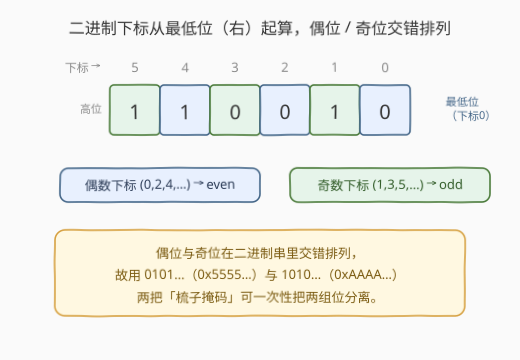
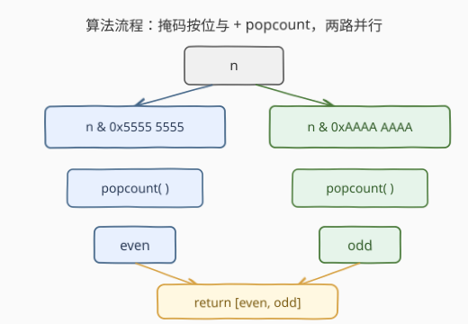
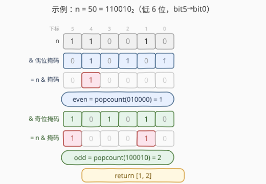

# LeetCode 奇偶位数 题解

## 1. 题目概述

- **标题 / 题号**：奇偶位数（#2595，easy）
- **链接**：https://leetcode.cn/problems/number-of-even-and-odd-bits/
- **难度**：简单
- **标签**：位运算

**题意**：给定正整数 $n$。在 $n$ 的二进制表示中，下标**从 $0$ 开始**，且**从最低有效位（最右位）起向左递增**。统计：

- **偶数下标**（$0,2,4,\ldots$）上值为 $1$ 的位数记为 `even`；
- **奇数下标**（$1,3,5,\ldots$）上值为 $1$ 的位数记为 `odd`。

返回数组 `answer = [even, odd]`。

**示例 1**：

```text
输入：n = 50
输出：[1,2]
解释：50 的二进制表示是 110010。下标 1、4、5 处的值为 1。
      even（下标 4）= 1，odd（下标 1、5）= 2。
```

**示例 2**：

```text
输入：n = 2
输出：[0,1]
解释：2 的二进制表示是 10。只有下标 1 处的值为 1。
      even = 0，odd = 1。
```

**约束**：

- $1 \le n \le 10^9$（即 $n$ 至多 30 位二进制）

> 💡 **关键点**：位的下标**从右（最低位）起算**——第 $i$ 位即 $2^i$ 那一位。偶数下标位与奇数下标位在二进制串里**交错排列**（一位偶、一位奇、一位偶……），正是这层交错让我们能用一把「梳子掩码」把它们一次性分开。

## 2. 解题思路

### 2.1 直觉法：逐位扫描，按下标奇偶分别计数

最直接的写法：从最低位起，每轮取 `n & 1` 看该位是否为 $1$，按下标 `i` 的奇偶累加进 `even` 或 `odd`，然后 `n >>= 1`、`i += 1`，直到 `n == 0`。

```python
def evenOddBit(n):
    even = odd = 0
    i = 0
    while n:
        if n & 1:
            if i % 2 == 0:
                even += 1
            else:
                odd += 1
        n >>= 1
        i += 1
    return [even, odd]
```

时间 $O(B)$、空间 $O(1)$（$B$ 为二进制位数，$B \le 30$）。逻辑清晰，但每轮只处理一位，完全没有利用「偶位/奇位交错」这一结构——$n$ 里多达 30 位就要循环 30 次。

### 2.2 核心观察：交错位掩码 + popcount



**关键直觉**：偶数下标位（$0,2,4,\ldots$）与奇数下标位（$1,3,5,\ldots$）在二进制中是**交错排列**的——偶位在偶位、奇位在奇位。于是只需两把「梳子掩码」就能**一次性把两组位分离**：

| 掩码 | 十六进制 | 二进制（周期） | 选中的位 |
|------|----------|----------------|----------|
| 偶位掩码 $M_{\text{even}}$ | `0x55555555` | $\ldots 0101\,0101$ | bit $0,2,4,\ldots$ |
| 奇位掩码 $M_{\text{odd}}$  | `0xAAAAAAAA` | $\ldots 1010\,1010$ | bit $1,3,5,\ldots$ |

与 $n$ 做按位与后，分别统计 $1$ 的个数（**popcount**，population count）即得答案：

$$
\text{even} = \operatorname{popcount}(n\ \&\ M_{\text{even}}),\qquad
\text{odd}\; = \operatorname{popcount}(n\ \&\ M_{\text{odd}}).
$$

现代 CPU 有单条 popcount 指令，C++ 用 `__builtin_popcount`、Python 用 `int.bit_count()`。

> 💡 **为什么是 `0x5555...` 和 `0xAAAA...`？** 十六进制一位对应 4 个二进制位：$5 = 0101_2$、$\text{A} = 1010_2$。重复 8 次填满 32 位即得交错掩码。$5$ 取偶位、$\text{A}$ 取奇位，正好对偶——记一个、另一个取反即可。

> 💡 **变体（只记一个掩码）**：奇位先**右移一位**就落到偶位上，故 $\text{odd} = \operatorname{popcount}\big((n \gg 1)\ \&\ \text{0x55555555}\big)$ 也可，只需一把 `0x5555...` 掩码——适合不想引第二个常量的场合。

### 2.3 算法流程图



两路并行（互不依赖）：

1. $n\ \&\ \text{0x55555555} \xrightarrow{\text{popcount}} \text{even}$；
2. $n\ \&\ \text{0xAAAAAAAA} \xrightarrow{\text{popcount}} \text{odd}$；
3. 组装 $[\text{even}, \text{odd}]$ 返回。

> 💡 两条支路互不依赖，硬件层面可并行；即便串行执行也只是「两次 AND + 两次 popcount」，常数级。

### 2.4 示例演算



以 $n = 50 = 110010_2$ 为例（下标从右起：bit5 bit4 bit3 bit2 bit1 bit0 $= 1\,1\,0\,0\,1\,0$），只看低 6 位：

| 操作 | 二进制（低 6 位，bit5→bit0） | 1 的个数 | 含义 |
|------|------------------------------|----------|------|
| $n$ | $110010$ | — | 原数 |
| $n\ \&\ 010101$（偶位掩码低 6 位，`0x15`） | $010000$ | $1$ | even = 1（bit4） |
| $n\ \&\ 101010$（奇位掩码低 6 位，`0x2A`） | $100010$ | $2$ | odd = 2（bit5、bit1） |

返回 $[1, 2]$，与示例 1 一致 ✓。

对照示例 2：$n = 2 = 10_2$，$n\ \&\ 01 = 00 \Rightarrow \text{even}=0$；$n\ \&\ 10 = 10 \Rightarrow \text{odd}=1$；返回 $[0,1]$ ✓。

## 3. 参考代码

### C++（掩码 + `__builtin_popcount`，$O(1)$）

```cpp
class Solution {
public:
    vector<int> evenOddBit(int n) {
        int even = __builtin_popcount(n & 0x55555555);   // 偶位 0101...
        int odd  = __builtin_popcount(n & 0xAAAAAAAA);   // 奇位 1010...
        return {even, odd};
    }
};
```

> 💡 C++20 起可用 `std::popcount<unsigned>(...)`（`<bit>` 头），更规范、跨平台。`0xAAAAAAAA` 超出 `int` 范围、按 `unsigned` 处理，与非负 $n$ 做按位与无歧义；返回值用初始化列表构造 `vector<int>`。

### Python（掩码 + `int.bit_count()`，$O(1)$）

```python
class Solution:
    def evenOddBit(self, n: int) -> list[int]:
        return [(n & 0x55555555).bit_count(),
                (n & 0xAAAAAAAA).bit_count()]
```

> 💡 `int.bit_count()` 为 Python 3.10+ 内置（$O(1)$ 级 C 实现）；3.10 以下用 `bin(x).count('1')` 替换。Python 大整数天然支持，掩码 `0xAAAAAAAA` 即普通正整数，无需考虑位宽。

### Python（直觉法：逐位扫描，作对照）

```python
class Solution:
    def evenOddBit(self, n: int) -> list[int]:
        even = odd = 0
        i = 0
        while n:
            if n & 1:
                if i & 1 == 0:
                    even += 1
                else:
                    odd += 1
            n >>= 1
            i += 1
        return [even, odd]
```

> ⚠️ 直觉法里 `i & 1` 比 `i % 2` 更贴合位运算语境；注意 $n=0$ 时循环不进入、直接返回 $[0,0]$，与题面 $n \ge 1$ 不冲突且语义自洽。

## 4. 复杂度分析

| 维度 | 复杂度 | 说明 |
|------|--------|------|
| **时间复杂度** | $O(1)$ | 两次按位与 + 两次 popcount，硬件 popcount 为常数级；$n \le 10^9$ 即至多 30 位 |
| **空间复杂度** | $O(1)$ | 仅几个整型变量 |
| 对照：逐位扫描 | $O(B)$ 时间 / $O(1)$ 空间 | 每轮处理一位，$B = \lfloor \log_2 n \rfloor + 1 \le 30$；同为常数级，但未利用交错结构 |

> 💡 严格说 popcount 复杂度为 $O(\log W)$（$W$ 为字长），对 32 位而言即常数。两种写法在本题数据下实测无差别；掩码法把「按下标分组」压缩进一次位运算，迁移性更强。

## 5. 扩展：把交错掩码推广到「k 位一组」

`0x5555...` / `0xAAAA...` 的本质是「按 1 位为一组、组内按位置（偶/奇）分桶」。若把分组粒度推广到 $k$ 位一组，掩码即相应周期化：

- 取每组低 $k$ 位：$\ldots\underbrace{00\ldots0}_{k}\underbrace{11\ldots1}_{k}$ 形的周期掩码；
- 取每组高 $k$ 位：取反即可。

这套「**周期掩码 + popcount**」是位计数题的通用工具：汉明重量、位翻转、按位前缀和都源自同一思想。经典如 [190. 颠倒二进制位](https://leetcode.cn/problems/reverse-bits/) 的分治解法，用的就是 `0x55555555` / `0xAAAAAAAA` / `0x33333333` / `0x0F0F0F0F` 一整套交错/分组掩码——先两两交换、再四四交换、再八八交换……与本题「按奇偶下标分离」是同一种「周期性掩码按位置分组」的范式。

> ⚠️ 掩码宽度要覆盖 $n$ 的有效位数：本题 $n \le 10^9 < 2^{30}$，32 位掩码足够；若处理 64 位整数，需换用 `0x5555555555555555` / `0xAAAAAAAAAAAAAAAA`。

## 6. 面试要点

1. **下标为什么从右（最低位）起算？**

   > 二进制表示中最低有效位（LSB）是第 $0$ 位，向高位递增。这是位运算的通用约定，使 $2^i$ 的位恰好是第 $i$ 位。本题「偶位」即偶次幂位，与 `n & (1 << i)` 的语义一致。

2. **`0x55555555` 和 `0xAAAAAAAA` 怎么记？**

   > $5 = 0101_2$、$\text{A} = 1010_2$。`0x5555...` 把偶数下标（$0,2,4,\ldots$）置 $1$，`0xAAAA...` 把奇数下标置 $1$。两位一组看：低位偶、高位奇，正好对偶——记一个、另一个取反即得。

3. **掩码法相比逐位扫描「更好」在哪？**

   > 两者在本题数据下都 $O(1)$，无实测差别。掩码法的价值在**迁移性**：把「按位置分组」压进一次位运算，是位计数题（popcount、位翻转、分治前缀和）的通用范式；逐位扫描则适合「每位处理逻辑不同」的场合。

4. **只用一个掩码能算出 odd 吗？**

   > 能：$\text{odd} = \operatorname{popcount}\big((n \gg 1)\ \&\ \text{0x55555555}\big)$。右移一位把奇位挪到偶位上，再套同一把 `0x5555...` 掩码即可——少记一个常量，代价是一次移位。

5. **$n = 0$ 会怎样？**

   > 题面保证 $n \ge 1$，但掩码法对 $n = 0$ 也成立：两路按位与全 $0$、popcount 各 $0$，返回 $[0, 0]$，语义自洽，无需特判。

> 💡 **一句话总结**：偶位、奇位在二进制中交错排列，用 `0x5555...` / `0xAAAA...` 两把梳子掩码按位与后各做一次 popcount，$O(1)$ 一次到位。

## 同类练习题

| # | 题目 | 与本题的关联 |
|---|------|-------------|
| 191 | [位 1 的个数](https://leetcode.cn/problems/number-of-1-bits/)（[题解](../0001-0100/191_位1的个数.md)） | popcount 母题，本题直接调用其核心原语 |
| 693 | [交替位二进制数](https://leetcode.cn/problems/binary-number-with-alternating-bits/)（[题解](../0601-0700/693_交替位二进制数.md)） | 判断相邻位是否交替 0/1，与本题「偶/奇下标交错」互为对偶的位模式题 |
| 231 | [2 的幂](https://leetcode.cn/problems/power-of-two/)（[题解](../0201-0300/231_2的幂.md)） | `n & (n-1)` 消最低位 1，承接 191 的位计数工具箱 |
| 476 | [数字的补数](https://leetcode.cn/problems/number-complement/)（[题解](../0401-0500/476_数字的补数.md)） | 构造与位宽匹配的掩码做按位取反，练习「按位置构造掩码」 |
| 461 | [汉明距离](https://leetcode.cn/problems/hamming-distance/)（[题解](../0401-0500/461_汉明距离.md)） | 异或后 popcount，位计数在「差异度量」上的经典应用 |
