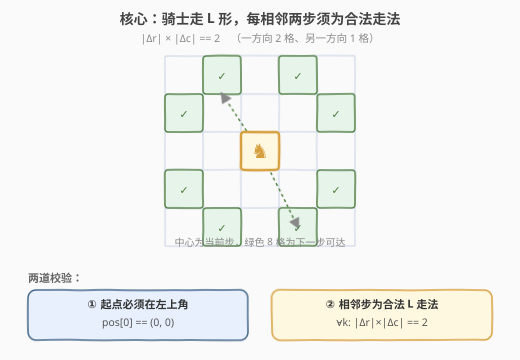
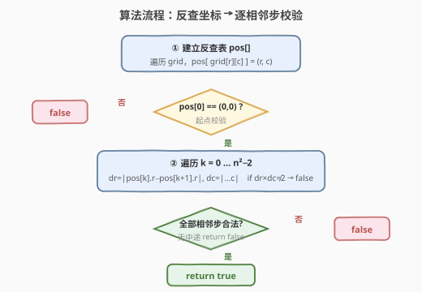
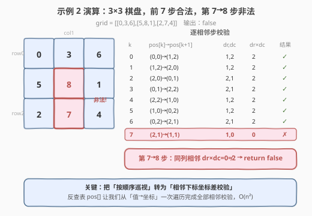

# LeetCode 检查骑士巡视方案 题解

## 1. 题目概述

- **标题 / 题号**：检查骑士巡视方案（#2596，medium）
- **链接**：https://leetcode.cn/problems/check-knight-tour-configuration/
- **难度**：中等
- **标签**：数组、矩阵、模拟

**题意**：骑士在一张 `n x n` 的棋盘上巡视。在**有效**的巡视方案中，骑士会从棋盘的 **左上角** 出发，并访问棋盘上的每个格子**恰好一次**。

给定一个 `n x n` 的整数矩阵 `grid`，由范围 `[0, n * n - 1]` 内的不同整数组成，其中 `grid[row][col]` 表示单元格 `(row, col)` 是骑士访问的第 `grid[row][col]` 个单元格（下标从 0 开始）。

如果 `grid` 表示了骑士的有效巡视方案，返回 `true`；否则返回 `false`。

骑士的走法：垂直移动 2 格 + 水平移动 1 格，或水平移动 2 格 + 垂直移动 1 格（即 8 种「日」字形 L 走法）。

**示例 1**：

```text
输入：grid = [[0,11,16,5,20],[17,4,19,10,15],[12,1,8,21,6],[3,18,23,14,9],[24,13,2,7,22]]
输出：true
解释：grid 如题图所示，是一个有效的巡视方案。
```

**示例 2**：

```text
输入：grid = [[0,3,6],[5,8,1],[2,7,4]]
输出：false
解释：第 8 次行动（第 7→8 步）是无效的，不是骑士走法。
```

**约束**：

- `n == grid.length == grid[i].length`
- `3 <= n <= 7`
- `0 <= grid[row][col] < n * n`
- `grid` 中的所有整数**互不相同**

## 2. 解题思路

### 2.1 暴力思路

对每个巡视序号 `k`（从 `0` 到 `n²-1`），在整张 `grid` 中扫描找到 `grid[r][c] == k` 的格子，再与 `k-1` 对应的格子比较坐标差，判断是否为骑士走法。每次定位需 `O(n²)`，共 `n²` 步，总复杂度 `O(n⁴)`。`n ≤ 7` 时虽然能过，但完全可以优化。

### 2.2 核心观察：反查坐标表 + 相邻步校验



关键转化：把「按值定位格子」做成 `O(1)` 查表。

1. **建反查表 `pos[]`**：遍历一次 `grid`，令 `pos[ grid[r][c] ] = (r, c)`。这样 `pos[k]` 直接给出第 `k` 步的坐标。
2. **校验起点**：题目要求从左上角出发，故 `pos[0]` 必须等于 `(0, 0)`。
3. **校验相邻步**：对 `k = 0 … n²-2`，检查 `pos[k]` 与 `pos[k+1]` 的坐标差是否构成合法骑士走法。

**骑士走法的判定式**：

骑士 8 种走法的坐标差绝对值为 `(1, 2)` 或 `(2, 1)`。由于 `2` 的正整数因子分解只有 `1 × 2` 与 `2 × 1` 两种，因此只需判断：

$$|dr| \times |dc| = 2$$

该式**充要**——任何非骑士走法的坐标差，其 `|dr| × |dc|` 都不会等于 `2`（例如同列相邻 `(1,0)` 乘积为 `0`，对角相邻 `(1,1)` 乘积为 `1`，`(0,3)` 乘积为 `0`，`(3,1)` 乘积为 `3`）。

> 💡 **为什么 `|dr| × |dc| == 2` 充要**：`dr, dc` 均为非负整数，乘积为 `2` 当且仅当 `{dr, dc} = {1, 2}`，恰好覆盖全部 8 个方向的「日」字走法。

### 2.3 算法流程图



### 2.4 示例演算



以示例 2 的 `3×3` 棋盘为例，前 7 步（`0→1` … `6→7`）的相邻坐标差均为 `(1,2)` 或 `(2,1)`，校验通过；但第 `7→8` 步从 `(2,1)` 到 `(1,1)`，`dr=1, dc=0`，`dr × dc = 0 ≠ 2`，故返回 `false`。

## 3. 参考代码

### C++

```cpp
class Solution {
  public:
    bool checkValidGrid(vector<vector<int>>& grid) {
        int n = grid.size();
        vector<pair<int, int>> pos(n * n);
        for (int i = 0; i < n; i++)
            for (int j = 0; j < n; j++)
                pos[grid[i][j]] = {i, j};

        if (pos[0] != make_pair(0, 0)) return false;

        for (int k = 0; k < n * n - 1; k++) {
            int dr = abs(pos[k].first - pos[k + 1].first);
            int dc = abs(pos[k].second - pos[k + 1].second);
            if (dr * dc != 2) return false;
        }
        return true;
    }
};
```

### Python

```python
class Solution:
    def checkValidGrid(self, grid: List[List[int]]) -> bool:
        n = len(grid)
        pos = [None] * (n * n)
        for i in range(n):
            for j in range(n):
                pos[grid[i][j]] = (i, j)

        if pos[0] != (0, 0):
            return False

        for k in range(n * n - 1):
            dr = abs(pos[k][0] - pos[k + 1][0])
            dc = abs(pos[k][1] - pos[k + 1][1])
            if dr * dc != 2:
                return False
        return True
```

## 4. 复杂度分析

| 维度 | 复杂度 | 说明 |
|------|--------|------|
| 时间复杂度 | $O(n^2)$ | 建反查表遍历 `n²` 格 + 校验 `n²-1` 个相邻步，各一次 |
| 空间复杂度 | $O(n^2)$ | 反查表 `pos[]` 存储 `n²` 个坐标 |

> ⚠️ 本题约束 `n ≤ 7`，`n² ≤ 49`，数据规模极小，`O(n²)` 的时空开销毫无压力。

## 5. 扩展：不保证元素合法时的预校验

本题约束保证 `grid` 元素互异且取值在 `[0, n²-1]`，可直接用 `grid[r][c]` 作下标。若放宽约束（元素可能重复或越界），需在反查前增加合法性校验：

- 用一个 `visited` 数组，填 `pos` 时标记；若遇到已标记或越界下标，直接返回 `false`；
- 填完后确认 `[0, n²-1]` 每个值各出现一次（无空洞），否则后续 `pos[k]` 会出现未赋值项。

这与 [41. 缺失的第一个正数](https://leetcode.cn/problems/first-missing-positive/) 的「下标当哈希键」原地校验思路一脉相承。

## 6. 面试要点

1. **为什么用反查表 `pos[]`，而不是对每个 `k` 扫一遍 `grid`？**
   - 反查表把「按值定位坐标」从 `O(n²)` 降到 `O(1)`，整体从 `O(n⁴)` 降到 `O(n²)`；一次遍历预处理即可。

2. **`|dr| × |dc| == 2` 为什么能唯一判定骑士走法？**
   - `dr, dc` 均为非负整数，乘积为 `2` 当且仅当 `{dr, dc} == {1, 2}`，正好覆盖全部 8 个「日」字方向；其它任何坐标差乘积都不为 `2`。

3. **为什么单独检查 `pos[0] == (0, 0)`？**
   - 相邻步校验只保证「每一步是骑士走法」，无法约束「起点在左上角」；起点位置必须独立校验。

4. **如果 `grid` 不保证元素互异 / 取值合法怎么办？**
   - 需先校验 `[0, n²-1]` 每个值恰好出现一次（见第 5 节），否则 `pos[]` 会出现空洞或覆盖，下标访问不安全。

5. **能否不存反查表、原地校验？**
   - 可以只存「上一步坐标」，按 `k` 递增在 `grid` 中找到对应格子再校验，空间 `O(1)`，但时间退回 `O(n⁴)`；`n ≤ 7` 下可接受，但反查表写法更清晰通用。

## 同类练习题

| # | 题目 | 与本题的关联 |
|---|------|-------------|
| 688 | [骑士在棋盘上的概率](https://leetcode.cn/problems/knight-probability-in-chessboard/) | 骑士 8 方向走法 + 概率 DP，同走法坐标差集合 |
| 1197 | [进击的骑士](https://leetcode.cn/problems/minimum-knight-moves/) | BFS 求骑士从原点到目标的最短步数，无限棋盘上的走法扩展 |
| 935 | [骑士拨号器](https://leetcode.cn/problems/knight-dialer/) | 骑士走法在电话键盘图上的计数 DP，转移表预处理的思路与反查表思想相通 |
