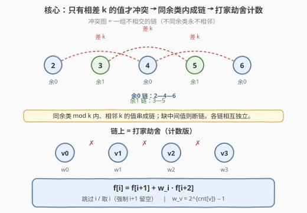
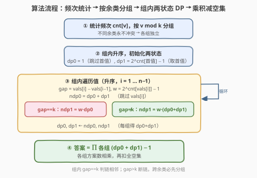
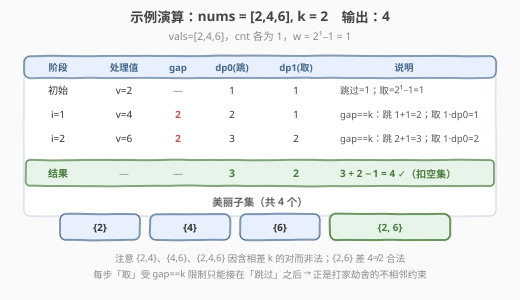

# LeetCode 美丽子集的数目 题解

## 1. 题目概述

- **标题 / 题号**：美丽子集的数目（#2597，medium）
- **链接**：https://leetcode.cn/problems/the-number-of-beautiful-subsets/
- **难度**：中等
- **标签**：数组、动态规划、排序、回溯

**题意**：给你一个正整数数组 `nums` 和一个正整数 `k`。如果 `nums` 的某个子集中，**任意两个**整数的绝对差都**不等于** `k`，则称该子集是**美丽子集**。返回 `nums` 中**非空**且美丽的子集数目。

- 子集由「删除某些元素（也可能不删）」得到；**只有选中下标不同**才视为不同子集（即使元素值完全相同）。

**示例 1**：

```text
输入：nums = [2,4,6], k = 2
输出：4
解释：美丽子集有 [2]、[4]、[6]、[2,6]。
      含相差 2 的对的子集（如 [2,4]、[4,6]、[2,4,6]）都非法。
```

**示例 2**：

```text
输入：nums = [1], k = 1
输出：1
解释：唯一非空子集 [1]，无任何对，合法。
```

**约束**：

- $1 \le \text{nums.length} \le 18$
- $1 \le \text{nums[i]}, k \le 1000$

> 💡 **两个信号**：① `n ≤ 18` 是回溯/位运算枚举的甜区，$2^n \le 2.6\times10^5$ 完全可爆；② 但冲突条件 $|a-b|=k$ 有强结构——**只有相差恰好 $k$ 的值才互斥**。利用结构可把指数解降到 $O(n\log n)$，本题主推这一最优解法。

## 2. 解题思路

### 2.1 暴力思路

枚举 `nums` 的全部 $2^n$ 个**下标子集**，对每个子集检查所有数对是否满足 $|a-b|\ne k$。

- **正确性**：穷举覆盖所有下标子集。
- **效率**：$O(2^n \cdot n^2)$。$n=18$ 时约 $8.5\times10^7$ 次操作，勉强可过但常数大、且完全没利用「冲突只在相差 $k$ 的值之间」这一结构。

> ⚠️ 暴力的浪费在于「按下标枚举 + 逐对校验」。冲突关系**只依赖值**而非下标：把同一值的若干份合并看待、按值排序后，冲突图会坍缩成一组不相交的链——这是降阶的关键。

### 2.2 核心观察：冲突链 + 打家劫舍计数



**观察一：冲突图 = 一组不相交的链。**

若 $|a-b|=k$，则 $a\equiv b\pmod{k}$，故**冲突只发生在同余类内**。在同余类内按值升序排列，相邻恰好差 $k$ 的值连边，便串成一条链 $v, v{+}k, v{+}2k,\dots$；若中间某个值缺失（相邻差 $>k$），链在此**断开**。不同余类（或断链两侧）之间永无冲突，**各链相互独立**，答案 = 各链方案数之积。

**观察二：同值 $cnt$ 份 → 乘性权重 $w_v = 2^{cnt[v]}-1$。**

同一值 $v$ 的若干份，它们与外部的冲突关系完全相同（只看值），但**不同下标算不同子集**。在值 $v$ 上选「至少一份」有 $2^{cnt[v]}-1$ 种（去掉「一份都不选」），恰好是一个乘性权重 $w_v$；「一份都不选」则贡献 $1$。

**观察三：链上「相邻不可同取」= 打家劫舍（计数版）。**

一条链上相邻两个值不能同时被取（否则相差 $k$）。设 $f[i]$ 为链上位置 $i$ 及之后的所有合法选法数（含本段全空），则

$$f[i] = f[i{+}1] + w_i \cdot f[i{+}2]$$

- $f[i{+}1]$：**跳过**位置 $i$（留空），位置 $i{+}1$ 自由；
- $w_i \cdot f[i{+}2]$：**取**位置 $i$（非空子集，权重 $w_i$），则位置 $i{+}1$ 被迫留空，从 $i{+}2$ 起自由。
- 边界 $f[L]=f[L{+}1]=1$（链尾之后只有空方案）。

> 💡 **这正是 [198. 打家劫舍](../0101-0200/198_打家劫舍.md) 的计数镜像**：把「相邻不可同取」从求最值换成求数目，递推结构完全一致；权重 $w_i$ 取代了原来的「抢到的金额」。

**实现：必须先按 $v\bmod k$ 分组。** 关键易错点：冲突 $|a-b|=k$ 虽只发生在同余类内，但**同余类的两个值在全局排序中未必相邻**——其它余类的值可能插在中间（如 $k=5$ 时 $2$ 与 $7$ 同余，但 $5$ 排在它们之间）。因此不能只看「全局前一个值」，必须**按 $v\bmod k$ 分组**，组内升序后，组内前一个值才是真正的「链前驱」（当且仅当 $gap=k$）。

- 组内 $gap=k$：当前值与前驱在同一条链上相邻 → 取当前值要求前驱未取，$ndp1=w\cdot dp0$；
- 组内 $gap\ne k$（断链，中间值缺失）：当前值与前驱不在同链 → 前驱状态无关，$ndp1=w\cdot(dp0+dp1)$，DP 在断口处自然把两条独立子链的方案数**相乘**；
- 各余类组互不冲突 → 答案 $=\prod_{\text{组}}(dp0+dp1)-1$（各组方案数相乘后扣全局空集）。

### 2.3 算法流程图



按 $v\bmod k$ 分组后，每组内做两状态滚动 DP（$dp0$=组内上一值跳过、$dp1$=组内上一值取了）：

1. 统计频次 `cnt[v]`，按 `v % k` 分组（组内须升序）；
2. 每组初始化 $dp0=1$（跳过首值）、$dp1=2^{cnt[\text{首值}]}-1$（取首值）；
3. 组内对 $i=1\dots m-1$：$w=2^{cnt[vals[i]]}-1$，$gap=vals[i]-vals[i-1]$，
   - 跳过 $vals[i]$：$ndp0 = dp0 + dp1$（上值取否皆可）；
   - 取 $vals[i]$：$gap=k$ 时 $ndp1=w\cdot dp0$（同链相邻，上值须未取）；$gap\ne k$ 时 $ndp1=w\cdot(dp0+dp1)$（断链，上值无关）；
   - $dp0,dp1 \gets ndp0,ndp1$；
4. 答案 $= \prod_{\text{各组}}(dp0+dp1) - 1$（各组方案数相乘，扣全空集）。

### 2.4 示例演算

以示例 1 `nums=[2,4,6], k=2` 为例。$2,4,6$ 都 $\equiv 0\pmod 2$，落在**同一个余类组** `vals=[2,4,6]`，各值频次 $1$、$w=2^1-1=1$：



| 阶段 | 处理值 | gap | $dp0$(跳) | $dp1$(取) | 说明 |
|------|--------|:---:|:---:|:---:|------|
| 初始 | $v=2$ | — | 1 | 1 | 跳过首值=1；取首值 $2^1-1=1$ |
| $i=1$ | $v=4$ | 2 | 2 | 1 | $gap=k$：跳 $1+1=2$；取 $1\cdot dp0=1$ |
| $i=2$ | $v=6$ | 2 | 3 | 2 | $gap=k$：跳 $2+1=3$；取 $1\cdot dp0=2$ |
| 结果 | — | — | **3** | **2** | 该组 $dp0+dp1=5$；仅一组 → $5-1=4$ ✓ |

四个美丽子集：$\{2\},\{4\},\{6\},\{2,6\}$（$\{2,6\}$ 差 $4\ne2$ 合法；含 $\{2,4\}$ 或 $\{4,6\}$ 者非法）。

> 💡 **多组相乘的例子**：`nums=[2,5,7], k=5`。$2,7\equiv2\pmod5$ 同组（链 $2$–$7$，相邻差 $5=k$），$5\equiv0$ 单独一组。组 $\{2,7\}$ 方案数 $3$（$\emptyset,\{2\},\{7\}$），组 $\{5\}$ 方案数 $2$（$\emptyset,\{5\}$），$3\times2-1=5$，正是 $\{2\},\{5\},\{7\},\{2,5\},\{5,7\}$。可见跨余类必须先分组、再相乘。

## 3. 参考代码

### Python（按余类分组 + 两状态滚动 DP，$O(n\log n)$ / $O(n)$）

```python
class Solution:
    def beautifulSubsets(self, nums: List[int], k: int) -> int:
        from collections import Counter, defaultdict
        cnt = Counter(nums)
        groups = defaultdict(list)
        for v in cnt:
            groups[v % k].append(v)          # 按 v mod k 分组
        ans = 1
        for vals in groups.values():
            vals.sort()                      # 组内升序
            # dp0/dp1：组内处理到当前值时，上一值「跳过 / 取了」的方案数
            dp0, dp1 = 1, (1 << cnt[vals[0]]) - 1
            for i in range(1, len(vals)):
                w = (1 << cnt[vals[i]]) - 1   # 选 vals[i] 的非空子集数
                gap = vals[i] - vals[i - 1]
                ndp0 = dp0 + dp1               # 跳过 vals[i]：上值取否皆可
                if gap == k:
                    ndp1 = w * dp0             # 同链相邻：上值须未取
                else:
                    ndp1 = w * (dp0 + dp1)     # 断链：上值无关
                dp0, dp1 = ndp0, ndp1
            ans *= dp0 + dp1                  # 各组方案数相乘
        return ans - 1                        # 扣除全空集
```

> 💡 `(1 << cnt[v]) - 1` 即 $2^{cnt[v]}-1$，是该值「选至少一份」的下标子集数。**分组是必须的**：同余类的两个值在全局排序中可能不相邻（被其它余类隔开），只看全局前驱会漏掉冲突；组内升序后，前驱当且仅当 $gap=k$ 时才是链相邻。组内 $gap\ne k$ 处 $dp0+dp1$ 整体作为「上值无关」的自由基数传给取分支，恰好实现独立子链方案数相乘。

### C++（`std::map` 按 key 升序，分组天然有序，$O(n\log n)$ / $O(n)$）

```cpp
class Solution {
public:
    int beautifulSubsets(vector<int>& nums, int k) {
        map<int, int> cnt;                        // 按值排序的去重计数
        for (int x : nums) ++cnt[x];
        unordered_map<int, vector<int>> groups;   // 按 v mod k 分组
        for (const auto& p : cnt) groups[p.first % k].push_back(p.first);
        long long ans = 1;
        for (auto& pr : groups) {
            const auto& vals = pr.second;         // 由 map 顺序保证已升序
            long long dp0 = 1, dp1 = (1LL << cnt.at(vals[0])) - 1;
            for (size_t i = 1; i < vals.size(); ++i) {
                long long w = (1LL << cnt.at(vals[i])) - 1;
                long long gap = 0LL + vals[i] - vals[i - 1];
                long long ndp0 = dp0 + dp1;
                long long ndp1 = (gap == k) ? w * dp0 : w * (dp0 + dp1);
                dp0 = ndp0; dp1 = ndp1;
            }
            ans *= (dp0 + dp1);                   // 各组方案数相乘
        }
        return int(ans - 1);
    }
};
```

> 💡 遍历 `std::map`（按 key 升序）并 `push_back` 进 `groups[残数]`，故每组 `vals` 天然升序，无需再排；`unordered_map` 的迭代顺序不影响乘积结果。`long long` 承接乘法以防极端溢出（本题答案 $\le 2^{18}-1$，`int` 其实足够，长整型仅为稳健）。单组单值时内层循环不执行，该组贡献 $1+(2^{cnt}-1)=2^{cnt}$。

## 4. 复杂度分析

| 维度 | 复杂度 | 说明 |
|------|--------|------|
| **时间复杂度** | $O(n\log n)$ | 频次统计 $O(n)$ + 组内排序 $O(n\log n)$ + DP 遍历 $O(n)$；$n\le18$ 时实际为常数级 |
| **空间复杂度** | $O(n)$ | `cnt` 与各组 `vals` 共存至多 $n$ 个去重值；DP 仅两标量 |
| 对照：按下标回溯 | $O(2^n)$ | $n=18$ 约 $2.6\times10^5$ 叶子，可过但未利用值结构 |
| 对照：逐对校验枚举 | $O(2^n\cdot n^2)$ | 暴力基线，常数大 |

> 💡 答案上界 $=2^n-1\le 262143$（$n\le18$），全程无需取模，`int` 可承载。

## 5. 扩展：回溯保底解（$n\le18$ 可直接爆搜）

若没看出「冲突链」结构，$n\le18$ 的规模允许直接回溯。下面这版**按值分组 + 去重**：对去重排序后的每个值决定「整个跳过 / 取（选其非空子集）」，用一个 `selected` 集合记录已取值，取之前查 $v-k$、$v+k$ 是否已在集合中。

```python
class Solution:
    def beautifulSubsets(self, nums: List[int], k: int) -> int:
        from collections import Counter
        cnt = Counter(nums)
        vals = sorted(cnt)
        selected = set()                       # 当前已取的值集合

        def dfs(i: int) -> int:
            if i == len(vals):
                return 1                      # 含「全跳过」的空方案
            v = vals[i]
            res = dfs(i + 1)                   # 整个跳过值 v
            # 取 v：要求 v-k 与 v+k 都尚未取（升序下 v+k 必未取，主要查 v-k）
            if (v - k) not in selected and (v + k) not in selected:
                selected.add(v)
                res += ((1 << cnt[v]) - 1) * dfs(i + 1)   # 选其非空子集
                selected.discard(v)
            return res

        return dfs(0) - 1                       # 扣空集
```

> ⚠️ 这里**不能**用频次表 `cnt[v]` 的增减来同时表示「是否被取」——`cnt[v]` 是值的频次（恒为正），并非「选中标志」。必须另开一个 `selected` 集合记录「当前子集中已取的值」，否则既会误判冲突、又会算错权重 $2^{cnt[v]}-1$。

> 💡 **更朴素的按下标回溯**：每个下标 skip/take，`selected` 改为按值计数，叶子恰为 $2^n\le2^{18}$。两者规模同阶、$n\le18$ 都轻松通过。回溯是「看不出结构时的保底解」；看出链结构后即升级为第 3 节的 $O(n\log n)$ DP——回溯的「跳过/取」二分支正是 DP 两状态的递归原型。

## 6. 面试要点

1. **为什么必须先按 $v\bmod k$ 分组，不能只看全局前一个值？**

   > 冲突 $|a-b|=k \Leftrightarrow a\equiv b\pmod{k}$，故冲突只在同余类内。但同余类的两个值在**全局排序中未必相邻**——其它余类的值可能插在中间（如 $k=5$ 时 $2$ 与 $7$ 同余，$5$ 排在它们之间），全局前驱是 $5$ 而非链前驱 $2$，会漏检冲突。按 $v\bmod k$ 分组后，组内升序的前驱**当且仅当 $gap=k$ 时**才是链前驱。

2. **组内 `gap≠k` 时为何把 $dp0+dp1$ 都传给「取」分支？**

   > 组内 $gap\ne k$ 意味当前值与组内前驱**不在同一条子链**（中间值缺失，断链），前驱的取/不取对当前值无约束。于是「取当前值」可从 $dp0$、$dp1$ 两路自由汇入，$ndp1=w\cdot(dp0+dp1)$；而 $ndp0=dp0+dp1$ 同样合并两路——两式都以 $(dp0+dp1)$ 为基数，正是「独立子链方案数相乘」的代数体现。跨余类则是各组方案数直接相乘。

3. **同值出现 $cnt$ 次为何权重是 $2^{cnt}-1$ 而非 $cnt$？**

   > 同值的多份与外部冲突关系相同，但下标不同算不同子集。在该值上选「至少一份」的非空下标子集有 $2^{cnt}-1$ 种（去掉全空），所以权重 $w_v=2^{cnt}-1$；「一份不选」则权重 $1$。若误用 $cnt$，会漏掉「同值多份共选」的情形（如两个 $2$ 可同选）。

4. **答案为何最后要减 1？空集何时被计入？**

   > 每组初值 $dp0=1$（首值跳过）含「本组全跳过」的那一种，故各组 $(dp0+dp1)$ 都包含本组的全空方案；它们的乘积自然包含**唯一的全局空集**方案（每组都选空）。题目要求非空子集，故末尾 $-1$ 扣除它。这与 [78. 子集](../0001-0100/78_子集.md) 枚举时「空集是否计入」的口径一致。

5. **$n\le18$ 时回溯与 DP 怎么选？**

   > 回溯（按下标或按值）叶子 $\le2^{18}\approx2.6\times10^5$，$n\le18$ 必过，是「看不出结构时的保底解」。DP 利用冲突图是链的结构，降到 $O(n\log n)$，且状态更少、更易讲清「为何这么转移」。面试中先说回溯保底，再点出「冲突只在相差 $k$ 的值→链→打家劫舍」升级为 DP，是完整的进阶路径。

> 💡 **一句话总结**：把冲突 $|a-b|=k$ 看成「只在相差 $k$ 的值间连边」→ 先按 $v\bmod k$ 分组（同余类才可能冲突），组内按值排序后相邻差 $k$ 的值串成链、差 $>k$ 处断链 → 每条链是「相邻不可同取」的打家劫舍计数版（$f[i]=f[i{+}1]+w_i\cdot f[i{+}2]$，$w_v=2^{cnt[v]}-1$）；组内两状态 DP、各组方案数相乘，答案 $=\prod(dp0+dp1)-1$。

## 同类练习题

| # | 题目 | 与本题的关联 |
|---|------|-------------|
| 198 | [打家劫舍](../0101-0200/198_打家劫舍.md) | 链上「相邻不可同取」的母题（最值版），本题递推 $f[i]=f[i{+}1]+w_i\cdot f[i{+}2]$ 正是其计数镜像 |
| 740 | [删除并获得点数](../0701-0800/740_删除并获得点数.md) | 值域建桶后转打家劫舍，与本题「按值分组→暴露链结构」同构，对照体会结构转换 |
| 213 | [打家劫舍 II](../0201-0300/213_打家劫舍II.md) | 拆环为线再打家劫舍，体会「冲突图是链 / 环」的结构化建模思路 |
| 1994 | [好子集的数目](../1901-2000/1994_好子集的数目.md) | 同样「按值分组 + 计数子集」，对照值域结构与权重 $2^{cnt}-1$ 的处理（孪生题 2572 的进阶版） |
| 78 | [子集](../0001-0100/78_子集.md) | 子集枚举回溯母题，对照本题「$n\le18$ 可暴力回溯」与「利用结构升级为 DP」两条路线 |
