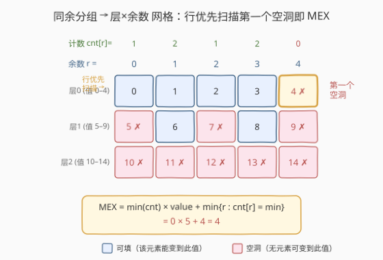
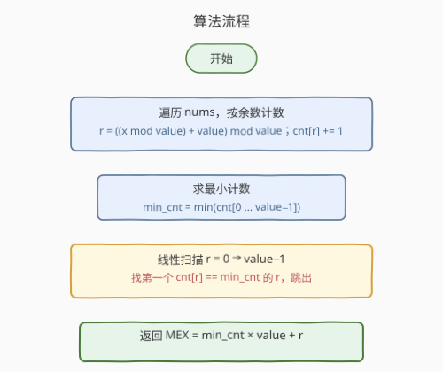
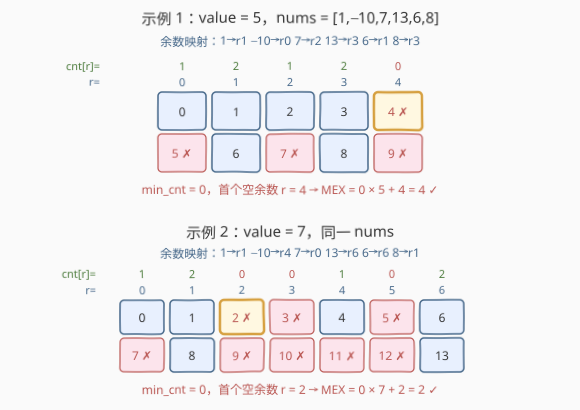

# LeetCode 执行操作后的最大 MEX 题解

## 1. 题目概述

- **标题 / 题号**：执行操作后的最大 MEX（#2598，medium）
- **链接**：https://leetcode.cn/problems/smallest-missing-non-negative-integer-after-operations/
- **难度**：中等
- **标签**：贪心、数组、哈希表、数论

**题意**：给定下标从 0 开始的整数数组 `nums` 和整数 `value`。每步操作可对 `nums` 中**任意一个**元素加上或减去 `value`，可执行**任意次**（每个元素可被反复操作，也可不动）。

数组的 **MEX**（minimum excluded）是数组中缺失的最小非负整数。例如 `[-1,2,3]` 的 MEX 是 `0`，`[1,0,3]` 的 MEX 是 `2`。

返回执行任意次操作后 `nums` 能达到的**最大 MEX**。

**示例 1**：

```text
输入：nums = [1,-10,7,13,6,8], value = 5
输出：4
解释：nums[1] 加 5 两次 → 0；nums[2] 减 5 一次 → 2；nums[3] 减 5 两次 → 3
     得到 [1,0,2,3,6,8]，MEX = 4。
```

**示例 2**：

```text
输入：nums = [1,-10,7,13,6,8], value = 7
输出：2
解释：nums[2] 减 7 一次 → 0，得到 [1,-10,0,13,6,8]，MEX = 2。
```

**约束**：

- $1 \le \text{nums.length}, \text{value} \le 10^5$
- $-10^9 \le \text{nums}[i] \le 10^9$

> 💡 操作的本质是「给元素加上 `value` 的任意整数倍」。于是元素 $x$ 能变成的所有值构成一条以 $x \bmod \text{value}$ 为首项、`value` 为公差的**等差数列**——这正是把「逐元素模拟」压缩为「按余数分组计数」的钥匙。

## 2. 解题思路

### 2.1 暴力思路：逐目标贪心匹配

为使 MEX 尽量大，我们希望依次凑出 $0,1,2,\dots$。最直白的做法：对每个目标 $t$ 从 $0$ 起递增，在剩余未用元素里找一个「能变成 $t$」的元素（即与 $t$ 同余）并占用之；找不到则返回 $t$。

- 单次匹配需 $O(n)$ 扫描，MEX 至多 $n$，总复杂度 $O(n^2)$，$n=10^5$ 不可接受。
- 暴力暴露的关键事实：一个元素能否变成 $t$，**只取决于 $x \bmod \text{value}$ 是否等于 $t \bmod \text{value}$**，与元素具体数值无关。因此可按余数**分组计数**，把逐元素匹配压缩为按组查询。

### 2.2 核心观察：同余分组 + 层×余数网格



三个观察层层递进：

1. **操作即平移同余类**：每次 $\pm\,\text{value}$ 不改变 $x \bmod \text{value}$。故元素 $x$ 能变到的值恰为 $\{x + k\cdot\text{value} : k \in \mathbb{Z}\}$ 中与 $x$ 同余的那些。取**非负**部分，余数为 $r$ 的元素可填 $r,\ r+\text{value},\ r+2\,\text{value},\ \dots$。

2. **同余元素可互换**：同余类内任一元素都能填该数列的任一项，但每个元素**只能用一次**。于是余数 $r$ 这一组若有 $c_r$ 个元素，就能**恰好填满**前 $c_r$ 项：$r,\ r+\text{value},\ \dots,\ r+(c_r-1)\,\text{value}$，第 $c_r$ 项及之后无法填。问题完全由计数向量 $c_r$ 决定。

3. **层×余数网格找第一个空洞**：把目标值 $t = j\cdot\text{value}+r$ 排成一张**行=层 $j$、列=余数 $r$** 的网格。格 $(j,r)$ 可填当且仅当 $c_r > j$（该组至少有 $j+1$ 个元素）。按值从小到大即**行优先**扫描这张网格，第一个不可填的空洞即 MEX。

由网格直接读出闭式：

- 第 $j$ 层全可填 $\Leftrightarrow$ 所有 $r$ 都满足 $c_r > j$，即 $j < \min_r c_r$。故**前 $\min_r c_r$ 层全部填满**，对应值 $0\,..\,(\min_r c_r)\cdot\text{value}-1$ 都在。
- 第 $j^*=\min_r c_r$ 层首次出现空洞：余数 $r^*$ 满足 $c_{r^*}=j^*$ 的列在第 $j^*$ 层断掉。行优先下**最左边**这样的列最先暴露空洞。

$$\boxed{\text{MEX} = \min_r c_r \cdot \text{value} \;+\; \min\{\,r : c_r = \min_r c_r\,\}}$$

> 💡 直觉：各列像高低不一的「柱子」从顶部向下填满；行优先扫描相当于自顶向下逐层从左到右找洞。最矮的柱子决定最早断在哪一层，而该层最左的断柱给出空洞的列号——行列即得 MEX。

### 2.3 算法流程图



### 2.4 示例演算



以示例 1（`value = 5`）为例：余数映射后 $c = [1,2,1,2,0]$（$r=0..4$）。$\min_r c_r = 0$，最小达到该最小值的列为 $r=4$（$c_4=0$），故 $\text{MEX}=0\times5+4=4$。网格中第 0 层 $r=4$（值 4）即为首个空洞。

示例 2（`value = 7`）：$c = [1,2,0,0,1,0,2]$，$\min_r c_r=0$，最左空列为 $r=2$，$\text{MEX}=0\times7+2=2$。

## 3. 参考代码

### C++

```cpp
class Solution {
  public:
    int findSmallestInteger(vector<int>& nums, int value) {
        vector<int> cnt(value, 0);
        for (int x : nums) {
            int r = ((x % value) + value) % value; // 规范化负数余数到 [0, value)
            cnt[r]++;
        }
        int minCnt = *min_element(cnt.begin(), cnt.end());
        for (int r = 0; r < value; r++) {
            if (cnt[r] == minCnt) {
                return minCnt * value + r;
            }
        }
        return -1; // 不可达：minCnt 必由某列取得
    }
};
```

### Python

```python
class Solution:
    def findSmallestInteger(self, nums: List[int], value: int) -> int:
        cnt = [0] * value
        for x in nums:
            cnt[x % value] += 1   # Python 的 % 对正模数已返回非负余数
        min_cnt = min(cnt)
        for r in range(value):
            if cnt[r] == min_cnt:
                return min_cnt * value + r
```

## 4. 复杂度分析

| 维度 | 复杂度 | 说明 |
|------|--------|------|
| 时间复杂度 | $O(n + \text{value})$ | 一次遍历计数 $O(n)$；求 `min` 与线性找首个 $r$ 各扫一遍 $[0,\text{value})$ |
| 空间复杂度 | $O(\text{value})$ | 计数数组 `cnt` 长度为 `value` |

> ⚠️ 约束保证 $\text{value} \le 10^5$，故 $O(\text{value})$ 时空均无压力。若 $\text{value} \gg n$，多数列为空，$\min_r c_r=0$，MEX 退化为「最小空余数」，仍在本算法内自然处理。

## 5. 扩展：贪心模拟写法

闭式依赖「对全部余数 $0..\text{value}-1$ 求 `min` 并找首个等于 `min` 的列」，需要 $O(\text{value})$ 数组。若想只用哈希表、回避对未出现余数的遍历，可用**逐目标贪心**等价写法：

```python
from collections import Counter
cnt = Counter(x % value for x in nums)
mex = 0
while cnt[mex % value] > mex // value:   # 该组还能供给第 mex//value 层
    mex += 1
return mex
```

- 条件 `cnt[t % value] > t // value` 正是「格 $(j,r)$ 可填」$c_r>j$ 的逐点版本，扫描到第一个不满足即停。
- 循环次数 = MEX $\le n$（至多凑出 $n$ 个值），故 $O(n)$，空间只用出现的余数。
- 两种写法等价：闭式一次性「跳」到最矮柱的断点；贪心逐步「走」到同一空洞。

## 6. 面试要点

1. **为什么操作只改变数值而不改变余数？**
   - 每步 $\pm\,\text{value}$ 是同余类内的平移，$x \bmod \text{value}$ 是操作下的**不变量**。这是把逐元素问题压缩为按余数分组的前提。

2. **MEX 上界为什么是 $n$？贪心/闭式会无限增长吗？**
   - $n$ 个元素至多凑出 $n$ 个不同非负值，故 $\text{MEX}\le n$。贪心循环至多 $n+1$ 步终止；闭式里 $\min_r c_r\le\lfloor n/\text{value}\rfloor$ 有界，不会发散。

3. **为什么取「最矮柱」的列号而非随便一列？**
   - 第 $j$ 层全可填等价于所有列 $c_r>j$；最早断的层由最矮柱 $j^*=\min_r c_r$ 决定。行优先下该层最先暴露空洞的列是**最左**的断柱，故 MEX 的「列」取 $\min\{r:c_r=j^*\}$，而非任意。

4. **负数元素如何处理余数？**
   - C++ 的 `%` 可能返回负值，需 `((x % value) + value) % value` 规范化到 $[0,\text{value})$；Python 对正模数直接返回非负余数，无需处理。

5. **`value = 1` 时退化成什么？**
   - 只有一个余数类 $r=0$，$c_0=n$，$\min=n$，MEX $=n\times1+0=n$：所有元素可变成任意整数，恰能凑出 $0..n-1$，与直觉一致。

## 同类练习题

| # | 题目 | 与本题的关联 |
|---|------|-------------|
| 41 | [缺失的第一个正数](https://leetcode.cn/problems/first-missing-positive/) | 原地「下标当哈希键」找最小缺失正数，MEX 概念的母题，对照本题「同余下标网格」找空洞 |
| 330 | [按要求补齐数组](https://leetcode.cn/problems/patching-array/) | 贪心凑出连续覆盖，思想内核一致——「前缀能凑到哪，缺哪个就补哪个」 |
| 1798 | [你能构造出连续值的最大数目](https://leetcode.cn/problems/maximum-number-of-consecutive-values-you-can-make/) | 排序 + 贪心扩展可凑连续值前缀，与本题「凑 $0,1,2,\dots$ 至断点」同构 |
| 2605 | [从两个数字数组里生成最小数字](https://leetcode.cn/problems/form-smallest-number-from-two-digit-arrays/) | 求两数组共有的最小值，类似的「找最小满足条件元素」思路 |
