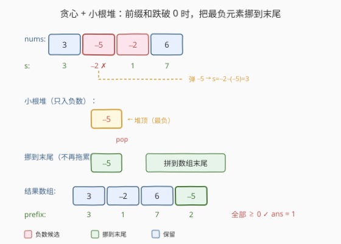
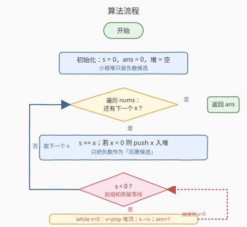
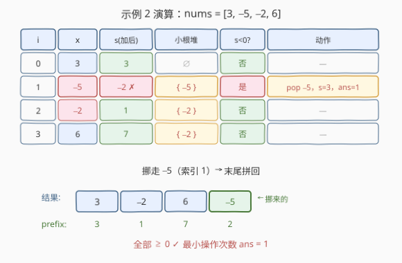

# LeetCode 使前缀和数组非负 题解

## 1. 题目概述

- **标题 / 题号**：使前缀和数组非负（#2599，medium）
- **链接**：https://leetcode.cn/problems/make-the-prefix-sum-non-negative/
- **难度**：中等
- **标签**：贪心、数组、堆（优先队列）

**题意**：给定一个 **下标从 0 开始** 的整数数组 `nums`。你可以任意多次执行以下操作：

- 从 `nums` 中选择任意一个元素，并将其放到 `nums` 的**末尾**。

`nums` 的前缀和数组是一个与 `nums` 长度相同的数组 `prefix`，其中 `prefix[i]` 是所有整数 `nums[j]`（其中 $j$ 在包括区间 $[0, i]$ 内）的总和。

返回使前缀和数组**不包含负整数**的**最小操作次数**。测试用例的生成方式保证始终可以使前缀和数组非负。

**示例 1**：

```text
输入：nums = [2,3,-5,4]
输出：0
解释：不需要执行任何操作。
      前缀和数组为 [2, 5, 0, 4]，已无非负问题。
```

**示例 2**：

```text
输入：nums = [3,-5,-2,6]
输出：1
解释：对索引 1 的元素执行一次操作，数组变为 [3, -2, 6, -5]，
      前缀和数组为 [3, 1, 7, 2]，全部非负。
```

**约束**：

- $1 \le \text{nums.length} \le 10^5$
- $-10^9 \le \text{nums}[i] \le 10^9$

> 💡 操作「把元素挪到末尾」的本质：该元素从此**不再拖累靠前的前缀和**——对前面的前缀和而言，它等价于被「移除」，只在最末尾累加一次。这就是把「重排」压缩为「选择哪些负数后置」的钥匙。

## 2. 解题思路

### 2.1 暴力思路：枚举挪动方案

最直白的做法：若某个前缀和变负，就尝试把目前为止的某个负数挪到末尾，再继续。但「挪哪个、挪几个」的组合爆炸，朴素回溯是指数级，$n=10^5$ 不可接受。

暴力暴露的关键事实：**只有负数才可能让前缀和变负，且把更负的数后置能「一口气」抬升更大的前缀和**。于是问题可压缩为「贪心地选择后置哪些负数」，而选择顺序由一个**小根堆**维护。

### 2.2 核心观察：贪心 + 小根堆



三个观察层层递进：

1. **挪到末尾 ≡ 移出前缀**：把元素 $x$ 挪到末尾后，对靠前的所有前缀和而言 $x$ 不再参与求和，只在最末一个前缀和中加回。因此对「靠前前缀和 $\ge 0$」这一约束，挪走一个负数等价于把它从累加和中**减去**（运行和 $s$ 增加 $|x|$）。

2. **只挪负数**：挪走非负数（$\ge 0$）只会让运行和变小或不变，毫无收益。故只需把负数压入小根堆作为「后置候选」，正数直接累加。

3. **变负即挪最负的那个**：当 $s < 0$ 时，**必须**挪走至少一个已见负数。挪走值为 $v$（$v<0$）的数让 $s$ 提升 $|v|$；要最小化挪动次数，每次应选 $|v|$ 最大的——即堆顶（最小值）的负数。弹出后 $s \leftarrow s - v$，挪动计数加一。若仍 $s<0$ 则继续弹（故用 `while` 而非 `if`）。

$$\boxed{\text{ans} = \text{弹堆次数},\quad s \leftarrow s - \text{heap.top()} \text{（每次 }s<0\text{ 时）}}$$

> 💡 直觉：前缀和像水位线，负数是压舱石。水位跌破零线时，最重的那块石头扔到船尾最划算——一块顶几块用，挪动次数自然最少。

### 2.3 算法流程图



### 2.4 示例演算



以示例 2（`nums = [3,-5,-2,6]`）为例：

| $i$ | $x$ | $s$（加 $x$ 后） | 小根堆 | $s<0$? | 动作 |
|-----|-----|------------------|--------|--------|------|
| 0 | 3 | 3 | $\emptyset$ | 否 | — |
| 1 | −5 | −2 | $\{-5\}$ | 是 | 弹 −5，$s=3$，ans=1 |
| 2 | −2 | 1 | $\{-2\}$ | 否 | — |
| 3 | 6 | 7 | $\{-2\}$ | 否 | — |

挪走 $-5$（索引 1），末尾拼回 → $[3,-2,6,-5]$，前缀和 $[3,1,7,2]$ 全非负，答案 $1$。

## 3. 参考代码

### C++

```cpp
class Solution {
  public:
    int makePrefSumNonNegative(vector<int>& nums) {
        priority_queue<int, vector<int>, greater<int>> pq; // 小根堆
        int ans = 0;
        long long s = 0;                                   // 前缀和可能溢出 int
        for (int x : nums) {
            s += x;
            if (x < 0) {
                pq.push(x);                                // 只入负数候选
            }
            while (s < 0) {                                // 可能需连续挪多个
                s -= pq.top();
                pq.pop();
                ++ans;
            }
        }
        return ans;
    }
};
```

### Python

```python
class Solution:
    def makePrefSumNonNegative(self, nums: List[int]) -> int:
        h = []                       # 小根堆（默认）
        ans = 0
        s = 0
        for x in nums:
            s += x
            if x < 0:
                heappush(h, x)       # 只入负数候选
            while s < 0:
                s -= heappop(h)      # 挪走最负的，s 抬升 |v|
                ans += 1
        return ans
```

## 4. 复杂度分析

| 维度 | 复杂度 | 说明 |
|------|--------|------|
| 时间复杂度 | $O(n \log n)$ | 每个元素至多入堆一次、出堆一次，堆操作 $O(\log n)$ |
| 空间复杂度 | $O(n)$ | 小根堆至多存 $n$ 个负数 |

> ⚠️ 前缀和 $s$ 可能达 $10^{14}$（$10^5 \times 10^9$），C++ 须用 `long long`；Python 整数无此问题。

## 5. 扩展：正确性证明

**前缀部分（交换论证）**：设某最优解在某次 $s<0$ 时挪走了 $a$（$a<0$）而未挪当前最负的 $b$（$b \le a$）。把「挪 $a$」换成「挪 $b$」：$b$ 挪走后运行和抬升 $|b| \ge |a|$，故所有原先靠 $a$ 维持非负的前缀和仍非负，后续挪动次数不增。由归纳，存在每步都挪最负数的最优解——即贪心解。

**末尾部分（后置元素不破坏后段）**：挪到末尾的元素按「最负先挪」顺序拼接。设被挪元素为 $v_1, v_2, \dots, v_k$（$|v_1| \ge |v_2| \ge \dots$），保留段前缀和为 $S_k$。后段第 $j$ 步累加和为：

$$S_k + \sum_{i=1}^{j} v_i = \underbrace{S_k + \sum_{i=1}^{j} v_i}_{\text{保留段}+\text{已挪前 }j\text{ 个}} = \text{total} + \sum_{i=j+1}^{k} |v_i| \ge 0$$

末步即 $\text{total} \ge 0$。而题目保证存在合法解 $\Rightarrow$ 末前缀和 $\text{total} \ge 0$，故后段全程非负。证毕。

## 6. 面试要点

1. **为什么挪到末尾等于「移出前缀」？**
   - 元素挪到末尾后，对靠前的所有前缀和不再参与求和，只在最末一个前缀和中加回。对「靠前前缀和 $\ge 0$」这一约束，等价于从运行和里减去该负数（$s$ 抬升 $|v|$）。

2. **为什么只把负数入堆？**
   - 挪走非负数只会让运行和变小或不变，无收益还可能凭空增加挪动次数。故堆只存负数作为后置候选。

3. **为什么用 `while` 而非 `if`？**
   - 弹出最负的数后 $s$ 仍可能 $<0$，需继续弹次负的，直到 $s \ge 0$。一次变负可能要挪多个负数。

4. **为什么挪最负的而非随便一个负数？**
   - 交换论证：挪最负的抬升最大，原最优解里挪的那个换成最负的后挪动次数不增，故存在「每步挪最负」的最优解。

5. **挪到末尾的元素会不会把末段前缀和搞成负的？**
   - 不会。按「最负先挪」顺序拼接，后段第 $j$ 步和 $= \text{total} + \sum_{i>j}|v_i| \ge \text{total} \ge 0$（题目保证合法解存在 $\Rightarrow \text{total}\ge 0$）。

## 同类练习题

| # | 题目 | 与本题的关联 |
|---|------|-------------|
| 1746 | [经过一次操作后的最大子数组和](https://leetcode.cn/problems/maximum-subarray-sum-after-one-operation/) | 单次操作翻倍元素的子数组和，与本题「选择哪些负数后置抬升前缀和」共享贪心 + 堆的思路 |
| 2813 | [子序列最大优雅度](https://leetcode.cn/problems/maximum-elegance-of-a-k-length-subsequence/) | 贪心 + 堆维护「可回退」的选择，交换论证选择最划算的替换，结构同构 |
| 871 | [最低加油次数](https://leetcode.cn/problems/minimum-number-of-refueling-stops/) | 油量跌破 0 时从已过加油站里贪心取最多油的大根堆，与本题「和跌破 0 时取最负的小根堆」是镜像问题 |
| 630 | [课程表 III](https://leetcode.cn/problems/course-schedule-iii/) | 按截止时间贪心 + 大根堆回退替换，交换论证与本题一脉相承 |
