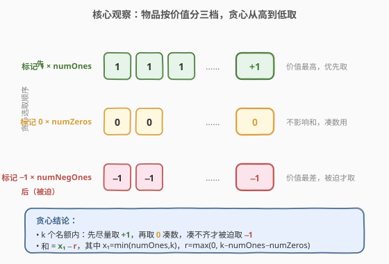
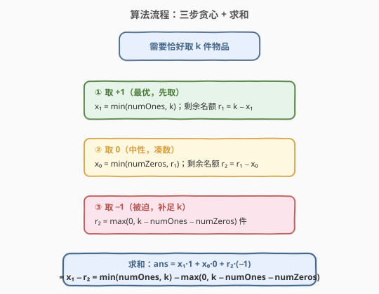
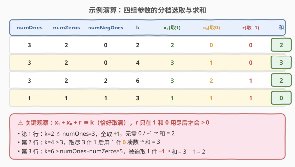

# K 件物品的最大和

- **题目名称**：K 件物品的最大和
- **链接**：[2600. K 件物品的最大和](https://leetcode.cn/problems/k-items-with-the-maximum-sum/)
- **难度**：简单
- **标签**：贪心、数学

## 1. 题目概述

袋中有三类物品，每件上标记一个数字：

- `numOnes` 件标记 `1`；
- `numZeros` 件标记 `0`；
- `numNegOnes` 件标记 `-1`。

给定非负整数 `numOnes`、`numZeros`、`numNegOnes` 和 `k`，要求**恰好取出 `k` 件**，使所取物品上数字之和最大。返回该最大和。

**示例 1**：

```text
输入：numOnes = 3, numZeros = 2, numNegOnes = 0, k = 2
输出：2
解释：取 2 件标记 1 的物品，和 = 1 + 1 = 2。
```

**示例 2**：

```text
输入：numOnes = 3, numZeros = 2, numNegOnes = 0, k = 4
输出：3
解释：取 3 件标记 1 的物品与 1 件标记 0 的物品，和 = 3 + 0 = 3。
```

**约束条件**：

- $0 \le \text{numOnes}, \text{numZeros}, \text{numNegOnes} \le 50$
- $0 \le k \le \text{numOnes} + \text{numZeros} + \text{numNegOnes}$

> 💡 **关键约束**：$k$ 不超过物品总数，所以「恰好取 $k$ 件」总可行（最差时全取 $-1$ 也凑得够）。题目本质是「在定额 $k$ 内挑价值最高的 $k$ 件」，物品只有三档价值 $\{+1, 0, -1\}$，贪心即可。

---

## 2. 解题思路

### 2.1 暴力思路

枚举取 $a$ 件 $1$、$b$ 件 $0$、$c$ 件 $-1$，满足 $a+b+c=k$、$0\le a\le\text{numOnes}$、$0\le b\le\text{numZeros}$、$0\le c\le\text{numNegOnes}$，最大化 $a\times 1+b\times 0+c\times(-1)=a-c$。三重循环 $O(50^3)$ 也能过。但价值只有三档且严格递减，同值物品无差别，按价值降序贪心取即可，无需搜索。

### 2.2 核心观察：按价值降序贪心取



物品按价值天然分三档，且每档内部无差别（同值任取哪件都一样）：

| 档位 | 价值 | 数量 | 选取优先级 |
|------|------|------|------------|
| 第 1 档 | $+1$ | $\text{numOnes}$ | 最优，先取 |
| 第 2 档 | $0$ | $\text{numZeros}$ | 中性，次取 |
| 第 3 档 | $-1$ | $\text{numNegOnes}$ | 最差，被迫才取 |

**贪心策略**：在 $k$ 个名额内，先尽可能多地拿 $+1$；名额有剩再拿 $0$（不影响和）；若还凑不够 $k$ 件，只能被迫拿 $-1$ 补足。设实际取出量为

$$
x_1 = \min(\text{numOnes},\, k),\qquad
x_0 = \min(\text{numZeros},\, k - x_1),\qquad
r = k - x_1 - x_0.
$$

其中 $r$ 即「名额用尽 $+1$ 和 $0$ 后仍缺的数量」，只能由 $-1$ 补，故 $r = \max(0,\, k - \text{numOnes} - \text{numZeros})$。所求和

$$
\text{ans} = x_1\cdot 1 + x_0\cdot 0 + r\cdot(-1) = x_1 - r = \min(\text{numOnes}, k) - \max(0,\, k - \text{numOnes} - \text{numZeros}).
$$

> 💡 **为什么贪心是对的？** 交换论证：若某最优解在还能取 $+1$ 时却取了 $0$ 或 $-1$，把那次取换成一未取的 $+1$，和只增不减（$0\to +1$ 或 $-1\to +1$），故存在「先取尽 $+1$」的最优解；同理 $0$ 优于 $-1$。三档价值严格递减，逐档取尽即最优。

### 2.3 算法流程图



三步串行：

1. **取 $+1$**：$x_1 = \min(\text{numOnes}, k)$，剩余名额 $r_1 = k - x_1$；
2. **取 $0$**：$x_0 = \min(\text{numZeros}, r_1)$，剩余名额 $r_2 = r_1 - x_0$；
3. **取 $-1$（被迫）**：$r_2$ 件，每件扣 $1$；
4. **求和**：$\text{ans} = x_1 - r_2$。

### 2.4 示例演算



| numOnes | numZeros | numNegOnes | k | $x_1$（取1） | $x_0$（取0） | $r$（取−1） | 和 |
|---|---|---|---|---|---|---|---|
| 3 | 2 | 0 | 2 | 2 | 0 | 0 | **2** |
| 3 | 2 | 0 | 4 | 3 | 1 | 0 | **3** |
| 3 | 2 | 2 | 6 | 3 | 2 | 1 | **2** |
| 1 | 1 | 1 | 3 | 1 | 1 | 1 | **0** |

- **第 1 行**（示例 1）：$k=2\le\text{numOnes}=3$，全取 $1$，$x_1=2$，无需 $0/-1$，和 $=2$。
- **第 2 行**（示例 2）：$k=4>\text{numOnes}=3$，取尽 $3$ 件 $1$，剩 $1$ 个名额由 $0$ 补，$x_0=1$，和 $=3$。
- **第 3 行**：$k=6>\text{numOnes}+\text{numZeros}=5$，$1$ 和 $0$ 全取尽仍差 $1$ 件，被迫取 $1$ 件 $-1$，和 $=3-1=2$。
- **第 4 行**：三档各 $1$ 件、$k=3$ 全取，和 $=1+0-1=0$，说明「凑齐 $k$ 件但和为 $0$」的边界。

> ⚠️ 注意 $k=0$ 时 $x_1=x_0=r=0$，和为 $0$；公式 $\min(\text{numOnes},0)-\max(0,\,0-\ldots)=0-0=0$，正确。

---

## 3. 参考代码

### C++

```cpp
class Solution {
public:
    int kItemsWithMaximumSum(int numOnes, int numZeros, int numNegOnes, int k) {
        int x1 = min(numOnes, k);                    // 取 +1 的件数
        int r  = max(0, k - numOnes - numZeros);     // 被迫取 -1 的件数
        return x1 - r;
    }
};
```

### Python

```python
class Solution:
    def kItemsWithMaximumSum(self, numOnes: int, numZeros: int, numNegOnes: int, k: int) -> int:
        x1 = min(numOnes, k)                  # 取 +1 的件数
        r  = max(0, k - numOnes - numZeros)   # 被迫取 -1 的件数
        return x1 - r
```

> 💡 也可一行写成 `return min(numOnes, k) - max(0, k - numOnes - numZeros)`。注意 `numNegOnes` 在公式中不显式出现——它只用于保证 $k$ 可行（题面已约束 $k\le$ 总数），真正决定「被迫取多少 $-1$」的是「$k$ 超出 $1$ 与 $0$ 总量多少」。

---

## 4. 复杂度分析

| 维度 | 复杂度 | 说明 |
|------|--------|------|
| 时间复杂度 | $O(1)$ | 两次 `min`/`max` 与一次减法，常数算术 |
| 空间复杂度 | $O(1)$ | 仅几个整型变量 |
| 对照：三重循环暴力 | $O(50^3)$ | 枚举 $a,b,c$ 组合求最大 $a-c$，本题数据下也能 AC，但属大材小用 |

> 💡 数据范围 $\le 50$ 是为了让「模拟逐件取」的朴素写法也能过；贪心把任意规模压成 $O(1)$，即便各数量到 $10^9$ 依然瞬间出解。

---

## 5. 扩展：若「取 $-1$」是可选而非被迫？

本题因「恰好取 $k$ 件」的硬约束，当 $k>\text{numOnes}+\text{numZeros}$ 时必须取 $-1$。若放宽为「至多取 $k$ 件」（凑不齐也行），最优解退化为「取 $\min(\text{numOnes}, k)$ 件 $1$、不取 $0$ 不取 $-1$」，和 $=\min(\text{numOnes}, k)$，永远不会主动取负值。这一对比说明：**「恰好」与「至多」一字之差，决定了负值物品是否被被迫纳入**——建模时务必看清约束是等式还是不等式。

---

## 6. 面试要点

1. **为什么先取 $1$、再取 $0$、最后才取 $-1$？**

   > 价值严格递减 $+1>0>-1$。在固定名额 $k$ 内，把高价值名额让给低价值物品必然不优：交换任一「该取 $+1$ 却取了 $\le 0$」的位，把它换回 $+1$，和只增不减。故贪心按价值降序取尽即最优。

2. **公式里为什么没有 `numNegOnes`？**

   > 被迫取 $-1$ 的件数 $r=\max(0,\,k-\text{numOnes}-\text{numZeros})$，只取决于「$k$ 比 $1$ 与 $0$ 的总量多多少」。`numNegOnes` 仅用于题面保证 $k$ 可行（$k\le$ 总数），不进入求和——$-1$ 永远是「凑不够才被迫拿」，数量只要 $\ge r$ 即可，多了用不到。

3. **「恰好取 $k$ 件」这个约束怎么体现？**

   > 体现为 $x_1+x_0+r\equiv k$ 必须严格成立。$r$ 不是「想取多少取多少」，而是 $k-x_1-x_0$ 被动确定。这正是公式中 $\max(0,\,\ldots)$ 的来源：当 $1$ 和 $0$ 够用时 $r=0$；不够时差额全由 $-1$ 填。

4. **$k=0$ 或某档数量为 $0$ 的边界？**

   > $k=0$：和为 $0$。某档数量为 $0$：对应 `min`/`max` 自然把它跳过。例如 $\text{numOnes}=0$ 时 $x_1=0$，全靠 $0$ 与 $-1$ 凑，和 $\le 0$。公式对全部边界一致，无需特判。

5. **能否不用贪心、直接数学拆解？**

   > 能。「取 $k$ 件的最大和」$=$「先尽量拿 $+1$，拿不动了拿 $0$，再拿不动了拿 $-1$」，本质就是分段 $\min$ 求和。代码一行 `min(numOnes,k) - max(0,k-numOnes-numZeros)` 即是这一分段逻辑的紧凑表达。

> 💡 **一句话总结**：物品价值三档 $+1>0>-1$，按价值降序贪心取尽；恰好取 $k$ 件时，被迫取的 $-1$ 数 $r=\max(0,\,k-\text{numOnes}-\text{numZeros})$，答案 $=\min(\text{numOnes},k)-r$，$O(1)$ 出解。

---

## 7. 同类练习题

- [2558. 从数量最多的堆取走礼物](https://leetcode.cn/problems/take-gifts-from-the-richest-pile/)（[题解](./2558_从数量最多的堆取走礼物.md)）：同为「在 $k$ 次操作内取走价值最高物品」的贪心选取，用大根堆模拟「每次取最大堆」，对照「定额内挑最大值」的贪心框架
- [1005. K 次取反后最大化的数组和](https://leetcode.cn/problems/maximize-sum-of-array-after-k-negations/)（[题解](../1001-1100/1005_K次取反后最大化的数组和.md)）：在 $k$ 次操作内按「最负优先翻号」贪心，与本题「按价值降序选取」同属贪心家族，对照「先消化最优动作」的直觉
- [455. 分发饼干](https://leetcode.cn/problems/assign-cookies/)（[题解](../0401-0500/455_分发饼干.md)）：经典「双排序 + 贪心匹配」母题，在定额名额内从优到次分配，对照贪心选取的排序基础
- [881. 救生艇](https://leetcode.cn/problems/boats-to-save-people/)（[题解](../0801-0900/881_救生艇.md)）：排序 + 双指针贪心在定额（每船限载）内挑人，对照「在限额约束下挑物品」的贪心建模
