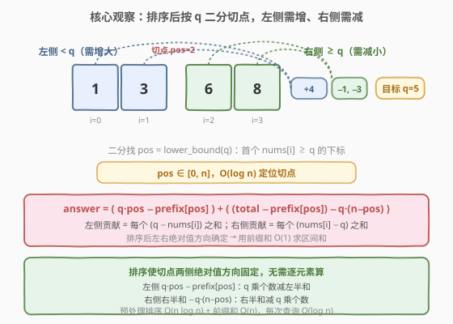
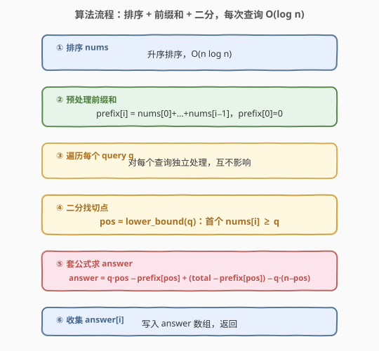

# 使数组元素全部相等的最少操作次数

- **题目名称**：使数组元素全部相等的最少操作次数
- **链接**：[2602. 使数组元素全部相等的最少操作次数](https://leetcode.cn/problems/minimum-operations-to-make-all-array-elements-equal/)
- **难度**：中等
- **标签**：数组、排序、前缀和、二分查找

## 1. 题目概述

给你一个正整数数组 `nums`，再给你一个长度为 $m$ 的查询数组 `queries`。对第 $i$ 个查询，你需要将 `nums` 中**所有**元素变成 `queries[i]`。每次操作可把某个元素 **增大或减小 1**，可执行**任意次**。返回一个长度为 $m$ 的数组 `answer`，`answer[i]` 为对应查询的最少操作次数。每次查询后数组变回最初的值。

**示例 1**：

```text
输入：nums = [3,1,6,8], queries = [1,5]
输出：[14,10]
解释：
q=1：3→1(2次)+1→1(0次)+6→1(5次)+8→1(7次) = 14
q=5：3→5(2次)+1→5(4次)+6→5(1次)+8→5(3次) = 10
```

**示例 2**：

```text
输入：nums = [2,9,6,3], queries = [10]
输出：[20]
解释：全部增大到 10：8+1+4+7 = 20。
```

**约束条件**：

- $n = \text{nums.length}$，$m = \text{queries.length}$
- $1 \le n, m \le 10^5$
- $1 \le \text{nums}[i], \text{queries}[i] \le 10^9$

> 💡 **关键观察**：把所有元素变成 $q$ 的代价是 $\sum_i |\text{nums}[i] - q|$，即「每个元素到 $q$ 的距离之和」。这正是一道**绝对值之和**问题——与 1685（有序数组中差绝对值之和）同构。无序时只能逐元素 $O(n)$；但若先把 `nums` **排序**，则 $q$ 把数组切成「左半 $< q$（需增）」和「右半 $\ge q$（需减）」两段，绝对值方向固定，可用**前缀和 + 二分**把每次查询降到 $O(\log n)$。

---

## 2. 解题思路

### 2.1 暴力思路：逐查询遍历

对每个查询 $q$，遍历 `nums` 累加 $|\text{nums}[i] - q|$：

```python
def minOperations(nums, queries):
    ans = []
    for q in queries:
        ans.append(sum(abs(x - q) for x in nums))
    return ans
```

单次查询 $O(n)$，$m$ 次查询合计 $O(n \cdot m)$。$n, m \le 10^5$ 时约 $10^{10}$ 次运算，**超时**。瓶颈在于「每个查询都重新遍历整个数组」。需要把「逐元素求和」升级为「按区间批量求和」，而批量求和的前提是**排序**暴露出的单调结构。

### 2.2 核心观察：排序 + 前缀和 + 二分



**关键直觉一：排序使绝对值方向固定。** 把 `nums` 升序排序后，对查询 $q$，设切点 $\text{pos}$ 为「首个 $\text{nums}[i] \ge q$ 的下标」（即 `lower_bound(q)`）：

- **左半**（$i < \text{pos}$）：$\text{nums}[i] < q$，故 $|\text{nums}[i] - q| = q - \text{nums}[i]$（需**增大**）
- **右半**（$i \ge \text{pos}$）：$\text{nums}[i] \ge q$，故 $|\text{nums}[i] - q| = \text{nums}[i] - q$（需**减小**）

绝对值符号被排序后消去，求和就能拆成「$q$ 的倍数项」+「区间和」两部分。

**关键直觉二：用前缀和 $O(1)$ 求区间和。** 预处理前缀和数组 $\text{prefix}[i] = \text{nums}[0] + \cdots + \text{nums}[i-1]$（$\text{prefix}[0] = 0$），记 $\text{total} = \text{prefix}[n]$。则：

- **左半贡献**：$\sum_{i<\text{pos}} (q - \text{nums}[i]) = q \cdot \text{pos} - \text{prefix}[\text{pos}]$
- **右半贡献**：$\sum_{i \ge \text{pos}} (\text{nums}[i] - q) = (\text{total} - \text{prefix}[\text{pos}]) - q \cdot (n - \text{pos})$

**关键直觉三：切点 $\text{pos}$ 用二分 $O(\log n)$ 定位。** 排序后数组单调，$\text{pos} = \text{lower\_bound}(q)$ 即首个 $\ge q$ 的位置，可用二分（C++ `lower_bound`，Python `bisect_left`）$O(\log n)$ 求得。若 $q$ 大于所有元素，$\text{pos} = n$，右半为空、贡献为 $0$。

> 💡 把三步合起来，单次查询 $O(\log n)$：二分找切点 + 两次前缀和查询（$O(1)$）。预处理排序 $O(n\log n)$ + 前缀和 $O(n)$，$m$ 次查询合计 $O(m\log n)$，总体 $O((n+m)\log n)$。

### 2.3 算法流程图



流程分六阶段：

1. **排序**：`nums` 升序排序，$O(n\log n)$；
2. **前缀和**：建 `prefix` 数组，`prefix[i] = prefix[i-1] + nums[i-1]`，$O(n)$；
3. **遍历查询**：对每个 $q \in \text{queries}$ 独立处理；
4. **二分找切点**：`pos = lower_bound(nums, q)`，首个 $\text{nums}[i] \ge q$ 的下标，$O(\log n)$；
5. **套公式**：`answer = q*pos - prefix[pos] + (total - prefix[pos]) - q*(n-pos)`，$O(1)$；
6. **收集**：写入 `answer[i]`，返回。

> ⚠️ **数据范围**：$n, m \le 10^5$，$\text{nums}[i], q \le 10^9$。单次代价上界 $n \times 10^9 = 10^{14}$，**超出 32 位 `int`**（$\approx 2.1 \times 10^9$）。C++ 必须用 `long long` 存代价与前缀和；Python 大整数无此顾虑。

### 2.4 示例演算

![示例演算：nums=[3,1,6,8] 排序后 [1,3,6,8]，queries=[1,5] 两次查询过程](../images/2602_example_walkthrough.svg)

以示例 1 `nums = [3,1,6,8]` 为例。排序后 $[1,3,6,8]$，$n=4$，$\text{total}=18$，前缀和 `prefix = [0, 1, 4, 10, 18]`。

**查询 $q=1$**：

| 量 | 计算 | 值 |
|----|------|----|
| $\text{pos}$ | `lower_bound(1)`，首个 $\ge 1$ 在 $i=0$ | $0$ |
| 左半贡献 | $1 \times 0 - \text{prefix}[0] = 0 - 0$ | $0$ |
| 右半贡献 | $(18 - 0) - 1 \times (4-0) = 18 - 4$ | $14$ |
| **answer** | $0 + 14$ | **14** ✓ |

**查询 $q=5$**：

| 量 | 计算 | 值 |
|----|------|----|
| $\text{pos}$ | `lower_bound(5)`，首个 $\ge 5$ 是 $\text{nums}[2]=6$ | $2$ |
| 左半贡献 | $5 \times 2 - \text{prefix}[2] = 10 - 4$ | $6$ |
| 右半贡献 | $(18 - 4) - 5 \times (4-2) = 14 - 10$ | $4$ |
| **answer** | $6 + 4$ | **10** ✓ |

验证 $q=5$：左 $(5-1)+(5-3)=4+2=6$，右 $(6-5)+(8-5)=1+3=4$，合计 $10$，与公式一致。

---

## 3. 参考代码

### C++（排序 + 前缀和 + 二分，$O((n+m)\log n)$ / $O(n)$ 额外空间）

```cpp
class Solution {
public:
    vector<long long> minOperations(vector<int>& nums, vector<int>& queries) {
        int n = nums.size();
        sort(nums.begin(), nums.end());
        // 前缀和：prefix[i] = nums[0]+...+nums[i-1]，prefix[0]=0
        vector<long long> prefix(n + 1, 0);
        for (int i = 0; i < n; ++i) {
            prefix[i + 1] = prefix[i] + nums[i];
        }
        long long total = prefix[n];
        vector<long long> ans;
        ans.reserve(queries.size());
        for (int q : queries) {
            // pos = 首个 nums[i] >= q 的下标（lower_bound）
            int pos = lower_bound(nums.begin(), nums.end(), q) - nums.begin();
            long long left  = 1LL * q * pos - prefix[pos];                 // 左半 q - nums[i]
            long long right = (total - prefix[pos]) - 1LL * q * (n - pos); // 右半 nums[i] - q
            ans.push_back(left + right);
        }
        return ans;
    }
};
```

> 💡 **实现细节**：① `prefix` 长度 $n+1$，`prefix[0]=0` 哨兵，省去空区间特判——`pos=0` 时左半为空，`pos=n` 时右半为空，公式天然成立。② `1LL * q * pos` 强制 64 位乘法，防 `q * pos` 在 `int` 上溢出（$q \le 10^9$，$\text{pos} \le 10^5$，积可达 $10^{14}$）。③ `lower_bound` 直接用库函数，闭区间二分的标准用法。

### Python（排序 + 前缀和 + 二分，$O((n+m)\log n)$ / $O(n)$ 额外空间）

```python
class Solution:
    def minOperations(self, nums: List[int], queries: List[int]) -> List[int]:
        nums.sort()
        n = len(nums)
        prefix = [0] * (n + 1)
        for i in range(n):
            prefix[i + 1] = prefix[i] + nums[i]
        total = prefix[n]
        ans = []
        for q in queries:
            pos = bisect_left(nums, q)             # 首个 nums[i] >= q
            left  = q * pos - prefix[pos]            # 左半 q - nums[i]
            right = (total - prefix[pos]) - q * (n - pos)  # 右半 nums[i] - q
            ans.append(left + right)
        return ans
```

> 💡 Python 中 `bisect_left` 即 `lower_bound`，返回首个 $\ge q$ 的下标（找不到时返回 $n$）。Python 大整数无溢出，但前缀和数组 $O(n)$ 空间无法省（需随机访问 `prefix[pos]`）。

---

## 4. 复杂度分析

| 维度 | 复杂度 | 说明 |
|------|--------|------|
| **时间复杂度** | $O((n+m)\log n)$ | 排序 $O(n\log n)$ + 前缀和 $O(n)$ + $m$ 次二分 $O(m\log n)$；通常 $m$ 与 $n$ 同阶，故 $O((n+m)\log n)$ |
| **空间复杂度** | $O(n)$ | 前缀和数组 `prefix`（$n+1$）；排序为原地，输出数组不计额外空间 |
| 对照：暴力 | $O(nm)$ 时间 | 每次查询遍历整个数组，$n=m=10^5$ 时 $10^{10}$ 必超时 |

> 💡 $O((n+m)\log n)$ 已是此题最优渐近：排序的 $O(n\log n)$ 一旦付出即摊薄到所有查询；每次查询至少需 $O(\log n)$ 在有序数组中定位切点（除非查询也排序则可双指针降到 $O(n+m)$，见第 5 节）。

---

## 5. 扩展：查询排序后双指针降到 $O(n+m)$

若允许把 `queries` 也排序，则可在 $O(n+m)$ 内完成全部查询——用**双指针**代替二分：

1. 把 `queries` 与其原始下标一起排序；
2. 随 $q$ 升序，切点 $\text{pos}$ 只增不减，用一个递增指针 $p$ 在排序后的 `nums` 上推进；
3. 每次查询仍套前缀和公式，但切点由指针给出而非二分，均摊 $O(1)$。

```python
class Solution:
    def minOperations(self, nums: List[int], queries: List[int]) -> List[int]:
        nums.sort()
        n = len(nums)
        prefix = [0] * (n + 1)
        for i in range(n):
            prefix[i + 1] = prefix[i] + nums[i]
        total = prefix[n]
        order = sorted(range(len(queries)), key=lambda i: queries[i])
        ans = [0] * len(queries)
        p = 0
        for i in order:
            q = queries[i]
            while p < n and nums[p] < q:   # 切点只增不减，均摊 O(1)
                p += 1
            left  = q * p - prefix[p]
            right = (total - prefix[p]) - q * (n - p)
            ans[i] = left + right
        return ans
```

> 💡 **取舍**：双指针版时间 $O(n\log n + m\log m)$（排序主导），但查询阶段是线性 $O(n+m)$，比 $m$ 次二分的 $O(m\log n)$ 更快（常数更小）。代价是改动了输出顺序、需用 `order` 数组还原。当 $m \gg n$ 时优势显著；当 $m$ 较小或查询需实时返回时，二分版更简单。两种均被接受。

---

## 6. 面试要点

1. **为什么把和写成 $\sum|\text{nums}[i]-q|$？最小操作次数为什么等于距离之和？**

   > 每次操作只能让一个元素增/减 $1$，所以把 $\text{nums}[i]$ 变成 $q$ 至少要 $|\text{nums}[i]-q|$ 次；而各元素互不影响，总次数即各距离之和。这是「$L_1$ 距离之和」的标准形式，与 1685（有序数组差绝对值之和）、1769（移动球到盒子）同构。

2. **为什么必须排序？无序能二分吗？**

   > 不能。二分切点的正确性依赖「左半 $< q$、右半 $\ge q$」的**单调划分**，只有有序数组才能保证切点两侧绝对值方向固定、从而去掉绝对值符号。无序时无法判定某元素应取 $q-\text{nums}[i]$ 还是 $\text{nums}[i]-q$，只能逐元素 $O(n)$ 累加。排序是「逐元素求和」升级为「区间批量求和」的前提。

3. **`lower_bound` 与 `upper_bound` 在此题里有区别吗？**

   > 此题用 `lower_bound`（首个 $\ge q$）。等于 $q$ 的元素距离为 $0$，放左半还是右半不影响结果（$q-q=0$、$\text{nums}[i]-q=0$ 相同）。故 `upper_bound`（首个 $>q$）也对，二者在此给出相同答案，但 `lower_bound` 语义更自然（左半严格小、右半大于等于）。务必保证「切点两侧元素与 $q$ 比较的方向一致」，避免漏算或多算。

4. **C++ 里 `1LL * q * pos` 不写 `1LL` 会怎样？**

   > `q` 是 `int`（$\le 10^9$）、`pos` 是 `int`（$\le 10^5$），`q * pos` 先按 `int` 乘再赋值，积可达 $10^{14}$ 远超 `INT_MAX`，发生有符号整数溢出（未定义行为）。用 `1LL *` 把首个操作数提为 `long long`，整个表达式按 64 位运算，安全。同理 `total`、`prefix` 须声明 `long long`。

5. **预处理代价能否摊薄到所有查询？**

   > 能。排序 $O(n\log n)$ 和前缀和 $O(n)$ 是**一次性**预处理，$m$ 次查询各 $O(\log n)$ 共享。这正是离线批量处理的精髓：把「逐元素求和」的 $O(n)$ 重复工作，借助预处理前缀和摊薄到 $O(1)$，再借二分定位切点。$m$ 越大，预处理的摊销收益越高；若只查一次，则预处理不划算、直接 $O(n)$ 遍历即可。

> 💡 **一句话总结**：把「全部变 $q$」的代价写成 $\sum|\text{nums}[i]-q|$，排序后用 `lower_bound` 找切点 $\text{pos}$，左半 $q\cdot\text{pos}-\text{prefix}[\text{pos}]$、右半 $(\text{total}-\text{prefix}[\text{pos}])-q\cdot(n-\text{pos})$，前缀和 $O(1)$ 求区间和，每次查询 $O(\log n)$，总体 $O((n+m)\log n)$。

---

## 7. 同类练习题

- [1685. 有序数组中差绝对值之和](https://leetcode.cn/problems/sum-of-absolute-differences-in-a-sorted-array/)（[题解](../1601-1700/1685_有序数组中差绝对值之和.md)）：同构题——数组有序、求每个位置到所有其他元素的距离之和，前缀和 $O(n)$；本题是其「任意查询值」版本，多了一层二分
- [1769. 移动所有球到每个盒子所需的最小操作数](https://leetcode.cn/problems/minimum-number-of-operations-to-move-all-balls-to-each-box/)（[题解](../1701-1800/1769_移动所有球到每个盒子所需的最小操作数.md)）：同为「绝对值距离之和」+ 前缀和，下标版；对照本题值域版用二分定位切点
- [2448. 使数组相等的最小开销](https://leetcode.cn/problems/minimum-cost-to-make-array-equal/)（[题解](../2401-2500/2448_使数组相等的最小开销.md)）：加权版绝对值距离之和，排序 + 前缀和套公式找中位数，对照本题查询任意目标值
- [528. 按权重随机选择](https://leetcode.cn/problems/random-pick-with-weight/)（[题解](../0501-0600/528_按权重随机选择.md)）：前缀和 + 二分的招牌应用，巩固 `lower_bound` 在前缀和数组上定位的写法
- [238. 除自身以外数组的乘积](https://leetcode.cn/problems/product-of-array-except-self/)（[题解](../0201-0300/238_除自身以外数组的乘积.md)）：同「除自身外聚合」+ 前缀/后缀思想把 $O(n^2)$ 降为 $O(n)$，加法版（本题）与乘积版（238）互为镜像
