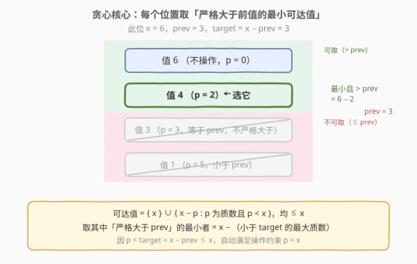
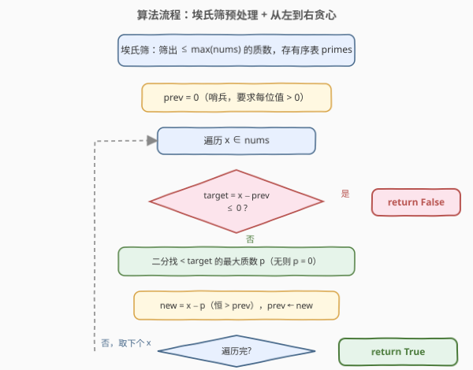

# LeetCode 质数减法运算 题解

## 1. 题目概述

- **标题 / 题号**：质数减法运算（#2601，medium）
- **链接**：https://leetcode.cn/problems/prime-subtraction-operation/
- **难度**：中等
- **标签**：贪心、数组、数学、数论、埃氏筛、二分查找

**题意**：给你一个下标从 `0` 开始、长度为 `n` 的整数数组 `nums`。可以执行**任意次**下述运算：

- 选择一个**之前未选过**的下标 `i`，并选择一个**严格小于** `nums[i]` 的质数 `p`，从 `nums[i]` 中减去 `p`。

若能通过运算使 `nums` 成为**严格递增数组**（每个元素严格大于其前面的元素），返回 `true`；否则返回 `false`。

> ⚠️ 每个下标**最多操作一次**（下标不可重复选）；但「不操作」永远允许，等价于该位减去 `p = 0`。

**示例 1**：

```text
输入：nums = [4,9,6,10]
输出：true
解释：i=0 选 p=3，nums[0]=4-3=1；i=1 选 p=7，nums[1]=9-7=2
      得到 [1,2,6,10]，严格递增，返回 true。
```

**示例 2**：

```text
输入：nums = [6,8,11,12]
输出：true
解释：数组本就严格递增，无需任何运算。
```

**示例 3**：

```text
输入：nums = [5,8,3]
输出：false
解释：无论怎么减，都无法使数组严格递增。
```

**约束**：

- `1 <= nums.length <= 1000`
- `1 <= nums[i] <= 1000`

> 💡 值域很小（`nums[i] <= 1000`）是本题的关键信号——可以放心用 $O(\max(\text{nums}))$ 的埃氏筛预处质数表，不必担心 $10^9$ 级的值域。

## 2. 解题思路

### 2.1 暴力思路：枚举每个位置减哪个质数

每个下标要么不操作，要么减去某个「严格小于 `nums[i]`」的质数。直接枚举每个位置的选法是指数级的。但注意到**各下标的操作互相独立**（一个位置减什么只改变它自己的值，不影响别位的可选质数集），我们可以**从左到右逐位确定**：只要左边前缀已严格递增，就只关心「当前位能否取一个比前一位更大的值」。

于是问题归约为：给定前一位的确定值 `prev`，当前位 `x` 能否取一个 $> \text{prev}$ 的值？能取哪些值？

### 2.2 核心观察：贪心——每位取「严格大于前值的最小可达值」



位置 `i` 的**可达值集合**为

$$
A_i = \{\,x\,\} \cup \{\,x - p : p \text{ 为质数且 } p < x\,\}
$$

（`p = 0` 对应「不操作」，值就是 `x`。）这些值都 $\le x$。要把 `x` 改成某个 $> \text{prev}$ 的值，就是要从 $A_i$ 中挑一个 $> \text{prev}$ 的。

**贪心策略**：从 $A_i$ 中挑**最小的那个** $> \text{prev}$ 的值。因为可达值越大，留给后续位的空间越小；把当前位置压到「刚好大于 `prev`」，能让 `prev` 尽量小，给后缀留出最大的余量。

怎样取到「最小且 $> \text{prev}$」的可达值？可达值 $= x - p$，随 $p$ 增大而减小，所以**最小的可达值**对应**最大的 $p$**。要保证 $x - p > \text{prev}$，即 $p < x - \text{prev}$。令

$$
\text{target} = x - \text{prev}
$$

则取**小于 `target` 的最大质数** `p`（若不存在则 `p = 0`，即不操作）。此时：

- $p < \text{target} = x - \text{prev} \le x$，所以 $p < x$ **自动满足**操作约束「`p` 严格小于原 `nums[i]`」；
- 新值 $x - p > \text{prev}$ 严格成立。

> ⚠️ **唯一的失败条件**：若 $\text{target} \le 0$（即 $x \le \text{prev}$），则连「不操作」得到的 $x$ 都 $\le \text{prev}$，减质数只会更小，必然失败，返回 `false`。

**贪心最优性的交换论证**：设最优解在第 `i` 位取值 $v_i$（$v_0 < v_1 < \cdots$），贪心取 $g_i$。归纳可证 $g_i \le v_i$：

- $g_0 = \min A_0 \le v_0$（$v_0 \in A_0$）；
- 若 $g_{i-1} \le v_{i-1}$，则 $v_i > v_{i-1} \ge g_{i-1}$，故 $v_i$ 是 $A_i$ 中一个 $> g_{i-1}$ 的值，而 $g_i$ 是其中**最小**的，$g_i \le v_i$。

因此贪心每步都 $\le$ 最优对应位，余量只增不减。若贪心在某步找不到 $> g_{i-1}$ 的可达值，即 $A_i \cap (g_{i-1}, +\infty) = \emptyset$；而 $(v_{i-1}, +\infty) \subseteq (g_{i-1}, +\infty)$（因 $v_{i-1} \ge g_{i-1}$），故也不存在 $> v_{i-1}$ 的可达值，最优也无解。**贪心失败 ⟺ 无解**，证毕。

### 2.3 算法流程图



两阶段：

1. **预处理**：用埃氏筛筛出 $\le \max(\text{nums})$ 的所有质数，存入有序表 `primes`（承接 [204. 计数质数](../0201-0300/204_计数质数.md) 的模板）。
2. **贪心**：`prev = 0`（哨兵，要求每位值 $> 0$）。对每个 `x`：算 `target = x - prev`；`target <= 0` 则直接 `false`；否则在 `primes` 中二分找 $< \text{target}$ 的最大质数 `p`（无则 `p = 0`），令 `prev = x - p`。遍历完返回 `true`。

### 2.4 示例演算

![示例演算：nums = [4,9,6,10] 逐步贪心](../images/pso_walkthrough.svg)

以 `nums = [4,9,6,10]` 为例（`primes` 含 $2,3,5,7,\ldots$）：

| i | x | prev | target = x−prev | 选 p（< target 的最大质数） | 新值 x−p | 校验 |
|---|---|------|------------------|------------------------------|----------|------|
| 0 | 4 | 0 | 4 | 3 | 1 | 1 > 0 ✓ |
| 1 | 9 | 1 | 8 | 7 | 2 | 2 > 1 ✓ |
| 2 | 6 | 2 | 4 | 3 | 3 | 3 > 2 ✓ |
| 3 | 10 | 3 | 7 | 5 | 5 | 5 > 3 ✓ |

得到 `[1,2,3,5]` 严格递增 → `true` ⭐。

反例 `nums = [5,8,3]`：i=0 时 `x=5, prev=0, target=5`，选 `p=3`，新值 `2`；i=1 时 `x=8, prev=2, target=6`，选 `p=5`，新值 `3`；i=2 时 `x=3, prev=3, target=0 ≤ 0` → 直接 `false`。即使把 i=1 留大（不减），`prev` 也只会更大，i=2 的 `x=3` 依旧顶不过去——这正是贪心「顶不动就无解」的体现。

## 3. 参考代码

### C++

```cpp
class Solution {
  public:
    bool primeSubOperation(vector<int>& nums) {
        int maxVal = *max_element(nums.begin(), nums.end());
        // 埃氏筛：筛出 <= maxVal 的所有质数
        vector<bool> isPrime(maxVal + 1, true);
        if (maxVal >= 0) isPrime[0] = false;
        if (maxVal >= 1) isPrime[1] = false;
        for (int i = 2; (long long)i * i <= maxVal; ++i)
            if (isPrime[i])
                for (int j = i * i; j <= maxVal; j += i)
                    isPrime[j] = false;
        vector<int> primes;
        for (int i = 2; i <= maxVal; ++i)
            if (isPrime[i]) primes.push_back(i);

        int prev = 0;                       // 哨兵：要求每位值 > 0
        for (int x : nums) {
            int target = x - prev;          // 需 p < target 才能 x - p > prev
            if (target <= 0) return false;  // x <= prev，不减也压不过前一位
            // 二分找 < target 的最大质数（lower_bound 返回首个 >= target 的位置）
            int idx = lower_bound(primes.begin(), primes.end(), target) - primes.begin();
            int p = (idx == 0) ? 0 : primes[idx - 1];
            prev = x - p;                   // p < target <= x，故 p < x 合法，且 x-p > prev
        }
        return true;
    }
};
```

### Python

```python
from bisect import bisect_left

class Solution:
    def primeSubOperation(self, nums: List[int]) -> bool:
        max_val = max(nums)
        # 埃氏筛
        is_prime = [True] * (max_val + 1)
        if max_val >= 0:
            is_prime[0] = False
        if max_val >= 1:
            is_prime[1] = False
        i = 2
        while i * i <= max_val:
            if is_prime[i]:
                for j in range(i * i, max_val + 1, i):
                    is_prime[j] = False
            i += 1
        primes = [v for v in range(2, max_val + 1) if is_prime[v]]

        prev = 0                            # 哨兵：要求每位值 > 0
        for x in nums:
            target = x - prev               # 需 p < target 才能 x - p > prev
            if target <= 0:                 # x <= prev，不减也压不过前一位
                return False
            idx = bisect_left(primes, target)
            p = primes[idx - 1] if idx > 0 else 0
            prev = x - p                    # p < target <= x，合法且 x-p > prev
        return True
```

> 💡 **几处细节**：(1) `prev = 0` 作哨兵：第一位只需 $>0$，而任何可达值 $\ge 1$（$p<x \Rightarrow x-p\ge1$），所以 `target = x - 0 = x`，选「小于 `x` 的最大质数」把首位压到最小正数，给后续留最大空间。(2) `lower_bound` / `bisect_left` 返回**首个 $\ge$ target** 的位置 `idx`，则 `idx-1` 恰是**最后一个 $<$ target**（严格小于）的质数下标——这正是我们要的「严格小于 `target`」。(3) `target <= 0` 的早返是**唯一**失败点：一旦 $x \le \text{prev}$，减质数只会让值更小，绝无翻身可能。

## 4. 复杂度分析

| 维度 | 复杂度 | 说明 |
|------|--------|------|
| 时间复杂度 | $O(M \log \log M + n \log M)$ | $M = \max(\text{nums}) \le 1000$。埃氏筛 $O(M \log \log M)$；贪心 $n$ 位每位二分 $O(\log M)$ |
| 空间复杂度 | $O(M)$ | `isPrime` 标记数组与 `primes` 表，共 $O(M)$ |

> ⚠️ 本题 $M \le 1000$、$n \le 1000$，筛法约划 $\sim 10^3$ 次、二分约 $10 \times 10^3 = 10^4$ 次，总运算量在 $10^4$ 量级，远低于上限。即便把二分换成「从 `target-1` 往下线性找第一个质数」的 $O(nM) \approx 10^6$ 写法也轻松通过，但二分更优雅、且在 $M$ 更大时（如 $10^6$）依旧可行。

## 5. 扩展：O(1) 查表的「前驱质数」数组

二分每位 $O(\log M)$。若把「小于 `v` 的最大质数」预计算成一张查表 `pre[v]`，则每位查询降到 $O(1)$，总时间 $O(M \log \log M + n)$。

构造方法：筛完后**自左向右扫一遍**，维护「最近见到的质数」`last`：

```cpp
vector<int> pre(maxVal + 2, 0);   // pre[v] = 小于 v 的最大质数，0 表示没有
int last = 0;
for (int v = 0; v <= maxVal + 1; ++v) {
    pre[v] = last;                 // 此时 last 是 < v 的最大质数
    if (v >= 2 && v <= maxVal && isPrime[v]) last = v;
}
```

随后主循环里 `p = pre[target]`（`target <= maxVal`，但 `target` 可达 `maxVal`，故 `pre` 数组开到 `maxVal + 1`；若 `target = maxVal + 1` 需再大一格，本题 `target <= x <= maxVal`，安全）。这种「筛 + 一次扫描建前驱表」是值域受限数论题的常用加速套路，与 [528. 按权重随机选择](../0501-0600/528_按权重随机选择.md) 的「前缀和 + 二分」可互换：值小用查表，值大用二分。

> 💡 另一种等价写法干脆不建 `primes` 表，每位从 `min(target - 1, x - 1)` 往下线性找 `is_prime[cand]` 为真的第一个，$O(nM)$。代码更短但复杂度略高，在 $M \le 1000$ 时与最优解无实测差异，面试中可作为「先说暴力、再优化到筛 + 二分」的递进。

## 6. 面试要点

1. **为什么贪心「每位取最小可达值」是最优的？**

   > 交换论证：归纳可证贪心值 $g_i \le$ 最优值 $v_i$（$g_0 = \min A_0 \le v_0$；$g_i$ 是 $A_i$ 中 $> g_{i-1}$ 的最小者，而 $v_i > v_{i-1} \ge g_{i-1}$ 落在同类候选中，故 $g_i \le v_i$）。贪心把每位压到最低，余量只增不减；若贪心顶不动，则 $A_i$ 中无 $> g_{i-1}$ 的值，而 $> v_{i-1}$ 的范围更窄，最优也顶不动。故贪心失败 ⟺ 无解。

2. **`target = x - prev` 和「小于 `target` 的最大质数」是怎么来的？**

   > 要 $x - p > \text{prev}$ 即 $p < x - \text{prev} = \text{target}$。可达值随 $p$ 增大而减小，所以「最小且 $> \text{prev}$」对应「最大的满足 $p < \text{target}$ 的 $p$」。`lower_bound(primes, target)` 给出首个 $\ge$ target 的位置，其前一位就是最后一个 $<$ target 的质数。

3. **操作约束「`p` 严格小于 `nums[i]`」会不会被违反？**

   > 不会。取的 $p < \text{target} = x - \text{prev} \le x$（因 $\text{prev} \ge 0$），故 $p < x$ 严格成立。当 `prev = 0` 时 $\text{target} = x$，$p < x$ 即操作约束本身；当 `prev > 0` 时 $\text{target} < x$，更严格。

4. **为什么 `target <= 0` 是唯一的失败点？**

   > $\text{target} \le 0 \iff x \le \text{prev}$。此时「不操作」得 $x \le \text{prev}$ 不严格大于；减任何质数得 $x - p < x \le \text{prev}$ 更小。所以该位无任何 $> \text{prev}$ 的可达值。反之 `target > 0` 时至少「不操作」的 $x > \text{prev}$ 可用，且按贪心总能取到一个 $> \text{prev}$ 的值。

5. **值域放大到 $10^9$ 还能这么做吗？**

   > 不能直接筛到 $10^9$（内存/时间爆炸）。但 `nums.length` 仍小的话，可只筛到 $\sqrt{\max}$ 或 $\sqrt{\max - \min}$ 量级，质数表足够支撑「对每位在 $[\,\text{prev}+1,\, x-1\,]$ 区间找可用质数」的判断——但本题保证 $M \le 1000$ 正是为了让 $O(M)$ 筛法可行，这是审题时要捕捉的信号。

> 💡 **一句话总结**：2601 = 「筛质数 + 贪心留余量」。每位可达值是 $\{x\} \cup \{x - \text{质数}\}$，取其中严格大于前值的最小者 = $x - ($小于 $x-\text{prev}$ 的最大质数$)$；用埃氏筛预处质数表 + 二分定位，从左到右扫一遍，顶不动即无解。

## 同类练习题

| # | 题目 | 与本题的关联 |
|---|------|-------------|
| 204 | [计数质数](https://leetcode.cn/problems/count-primes/)（[站内题解](../0201-0300/204_计数质数.md)） | 埃氏筛母题，本题质数表的预处理直接复用其模板 |
| 2507 | [使用质因数之和替换后可以取到的最小值](https://leetcode.cn/problems/smallest-value-after-replacing-with-sum-of-prime-factors/)（[站内题解](../2501-2600/2507_使用质因数之和替换后可以取到的最小值.md)） | 同为「数论 + 贪心/单调性」的 2500 档题，对照质数与质因数的不同用法 |
| 1187 | [使数组严格递增](https://leetcode.cn/problems/make-array-strictly-increasing/) | 同目标「使数组严格递增」，但操作是「替换为另一数组的元素」，需 $O(n^2)$ DP；对照「可减任意质数」的贪心 vs「只能换成给定值」的 DP |
| 1909 | [删除一个元素使数组严格递增](https://leetcode.cn/problems/remove-one-element-to-make-the-array-strictly-increasing/) | 「严格递增」判定的简单版，贪心检查删至多一位能否成立，体会递增约束的容错边界 |
| 300 | [最长递增子序列](https://leetcode.cn/problems/longest-increasing-subsequence/)（[站内题解](../0201-0300/300_最长递增子序列.md)） | 「递增」主题的另一形态（子序列而非操作改造），对照「贪心维护最小末尾」思想在本题的呼应 |
