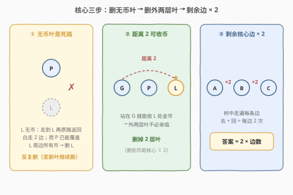
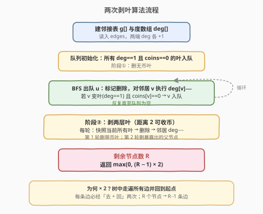
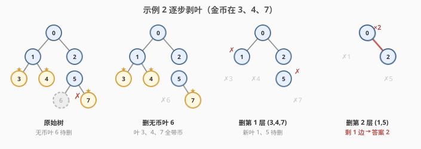

# LeetCode 收集树中金币 题解

## 1. 题目概述

- **标题 / 题号**：收集树中金币（#2603，hard）
- **链接**：https://leetcode.cn/problems/collect-coins-in-a-tree/
- **难度**：困难
- **标签**：树、广度优先搜索、拓扑排序（剥叶）

**题意**：给定一棵 `n` 个节点的**无向无根树**（节点编号 `0` 到 `n-1`，`edges` 长度为 `n-1`），以及长度为 `n` 的数组 `coins`，`coins[i] == 1` 表示节点 `i` 处有一个金币。

你可以从**任意节点**出发，重复执行两种操作：

- **收集**：收集距离当前节点距离 ≤ 2 的所有金币；
- **移动**：移动到树中一个相邻节点（每经过一条边答案 +1）。

目标是**收集所有金币并回到出发节点**，求最少经过的边数（同一条边多次经过，每次都计数）。

**示例 1**：

```text
输入：coins = [1,0,0,0,0,1], edges = [[0,1],[1,2],[2,3],[3,4],[4,5]]
输出：2
解释：路径 0-1-2-3-4-5。从节点 2 出发，可收到节点 0 的币（距离 2），
      移动到节点 3，可收到节点 5 的币（距离 2），再移动回节点 2，共 2 条边。
```

**示例 2**：

```text
输入：coins = [0,0,0,1,1,0,0,1], edges = [[0,1],[0,2],[1,3],[1,4],[2,5],[5,6],[5,7]]
输出：2
解释：金币在节点 3、4、7。从节点 0 出发收 3、4 的币，移动到节点 2 收 7 的币，再回 0，共 2 条边。
```

**约束**：

- `n == coins.length`
- `1 <= n <= 3 * 10^4`
- `0 <= coins[i] <= 1`
- `edges.length == n - 1`，表示一棵合法的树

## 2. 解题思路

### 2.1 暴力思路

枚举出发节点，对每条边「走 / 不走」做状压或 DFS 暴力搜索，状态空间随 `n` 指数爆炸，`n <= 3 * 10^4` 完全不可行。本题的关键不在"怎么走"，而在"**哪些子树根本不必进入**"——把无用的叶子剥掉，剩下的核心树每条边走两遍即为答案。

### 2.2 核心观察：两次剥叶



把问题拆成三个朴素事实：

1. **无币叶是死路**：若一个**叶子节点没有金币**，走到它再原路返回要白走 2 条边，而它的唯一邻居 `P` 已能覆盖它周围所有金币（凡是从该叶子出发距离 ≤2 能收的币，路径必经 `P`，故站在 `P` 同样能收）。所以**反复删除无币叶**——删掉后若邻居变成新的无币叶，继续删。这等价于在树上做一次「按度数」的 BFS 拓扑剥离。

2. **距离 2 可收币 → 外两层叶不必亲临**：删完无币叶后，**剩余树的叶子全都带币**。由于站在某节点可收距离 2 内的币，最外层的带币叶子不必亲自走到——从它的「祖父」节点就能收到。于是再**剥掉两层叶子**（第 1 层 = 当前的带币叶，第 2 层 = 删掉它们后新暴露的叶）。

3. **剩余核心树每条边走两遍**：两次剥叶后剩下的子树，其上每个节点都要被遍历到（核心内的金币需站在其上 / 邻近收集，且删掉的币都在核心某节点的距离 2 内）。在树中**从某点出发走遍所有边再回到原点**，每条边恰走两次（去 + 回），故答案 = `2 * 剩余边数 = 2 * (剩余节点数 - 1)`；若剩余 ≤ 1 个节点则为 0。

> 💡 为什么恰好是 2 层？被删的币要么在第 1 层（带币叶，到最近核心节点距离为 2），要么在第 2 层（其父，到最近核心节点距离为 1），都 ≤ 2，故站在核心即可全部收取；而核心自身的币在遍历时距离 0 收取。两层是"距离 2"对应的最小剥离深度。

> ⚠️ 注意"层"的定义：每轮先**快照**当前所有叶子再统一删除，而非删一个立刻更新再删——否则会多删。这与 [310. 最小高度树](https://leetcode.cn/problems/minimum-height-trees/) 的剥叶找重心是同一手法。

### 2.3 算法流程图



### 2.4 示例演算



以**示例 2**（`coins = [0,0,0,1,1,0,0,1]`，金币在 3、4、7）为例，树形：

```text
        0
       / \
      1   2
     / \   \
    3   4   5
           / \
          6   7
```

- **阶段 ① 删无币叶**：叶子有 3(币)、4(币)、6(无币)、7(币)。删 6；删后 5 的度由 3→2，不再是叶。此时叶子 3、4、7 全带币，停止。
- **阶段 ② 删第 1 层叶**：删除 3、4、7。剩余 0-1、0-2、2-5，新叶子为 1、5。
- **阶段 ③ 删第 2 层叶**：删除 1、5。剩余仅 0-2 一条边。
- **答案**：剩余 2 个节点 → 1 条边 → `2 * 1 = 2`。✓

## 3. 参考代码

### C++（BFS 剥叶 + 两轮快照删除）

```cpp
class Solution {
public:
    int collectTheCoins(vector<int>& coins, vector<vector<int>>& edges) {
        int n = coins.size();
        vector<vector<int>> g(n);
        vector<int> deg(n, 0);
        for (auto& e : edges) {
            g[e[0]].push_back(e[1]);
            g[e[1]].push_back(e[0]);
            deg[e[0]]++;
            deg[e[1]]++;
        }
        vector<int> deleted(n, 0);
        // 阶段①：删无币叶（按度数 BFS 剥离）
        queue<int> q;
        for (int i = 0; i < n; i++)
            if (deg[i] == 1 && coins[i] == 0) q.push(i);
        while (!q.empty()) {
            int u = q.front(); q.pop();
            deleted[u] = 1;
            for (int v : g[u]) {
                if (deleted[v]) continue;
                if (--deg[v] == 1 && coins[v] == 0) q.push(v);
            }
        }
        // 阶段②：剥两层叶（距离 2 可收币）
        for (int t = 0; t < 2; t++) {
            vector<int> leaf;
            for (int i = 0; i < n; i++)
                if (!deleted[i] && deg[i] == 1) leaf.push_back(i);
            for (int u : leaf) {
                deleted[u] = 1;
                for (int v : g[u])
                    if (!deleted[v]) deg[v]--;
            }
        }
        int rem = 0;
        for (int i = 0; i < n; i++) if (!deleted[i]) rem++;
        return max(0, (rem - 1) * 2);
    }
};
```

### Python（BFS 剥叶 + 两轮快照删除）

```python
from collections import deque
from typing import List

class Solution:
    def collectTheCoins(self, coins: List[int], edges: List[List[int]]) -> int:
        n = len(coins)
        g = [[] for _ in range(n)]
        deg = [0] * n
        for a, b in edges:
            g[a].append(b)
            g[b].append(a)
            deg[a] += 1
            deg[b] += 1

        deleted = [False] * n
        # 阶段①：删无币叶
        q = deque(i for i in range(n) if deg[i] == 1 and coins[i] == 0)
        while q:
            u = q.popleft()
            deleted[u] = True
            for v in g[u]:
                if deleted[v]:
                    continue
                deg[v] -= 1
                if deg[v] == 1 and coins[v] == 0:
                    q.append(v)

        # 阶段②：剥两层叶
        for _ in range(2):
            leaf = [i for i in range(n) if not deleted[i] and deg[i] == 1]
            for u in leaf:
                deleted[u] = True
                for v in g[u]:
                    if not deleted[v]:
                        deg[v] -= 1

        rem = sum(1 for i in range(n) if not deleted[i])
        return max(0, (rem - 1) * 2)
```

## 4. 复杂度分析

| 维度 | 复杂度 | 说明 |
|------|--------|------|
| 时间复杂度 | $O(n)$ | 建图 $O(n)$；阶段①每个节点最多入队删除一次，阶段②两轮各扫描一次度数数组 $O(n)$，总计 $O(n)$ |
| 空间复杂度 | $O(n)$ | 邻接表 `g`、度数组 `deg`、`deleted` 标记与队列，均 $O(n)$ |

> 💡 本题本质是**树上的拓扑排序（剥叶）**：用度数当"入度"，叶子当"零入度点"，逐层剥离。`n <= 3 * 10^4` 下 $O(n)$ 轻松通过。

## 5. 扩展：若收集半径变为 k 怎么办？

若把"距离 2"推广为"距离 $k$ 可收币"，只需把阶段②的剥叶轮数从 `2` 改成 `k`（先删无币叶不变，再删 $k$ 层带币叶）。理由相同：被删的币到最近核心节点的距离 $\le k$，故站在核心即可全部收取；核心自身的币在遍历时距离 0 收取。当 $k$ 较大时核心可能被剥空，答案归 0。这揭示了"收集半径"与"剥离深度"的一一对应——半径每增加 1，外层多剥一叶。

## 6. 面试要点

1. **为什么无币叶可以无脑删？**

   - 叶子 `L` 无币时，凡是从 `L` 出发距离 ≤2 能收的币，其路径必经 `L` 的唯一邻居 `P`，故站在 `P` 同样能收（到那些币的距离 ≤1）。走到 `L` 再返回纯亏 2 边且无收益，所以删；删后产生的新无币叶同理，故反复删。

2. **为什么是两层而不是一层或三层？**

   - 收集半径 = 2。第 1 层带币叶到核心节点距离 2，第 2 层（其父）距离 1，都被覆盖；核心节点自身的币遍历时距离 0 收取。两层正好让所有被删币落在某个核心节点的距离 2 内——少一层会漏收，多一层会误删尚能覆盖更多结构的节点、使答案偏大。

3. **"快照删除"和"边删边更新"有何区别？**

   - 一轮内必须先把当前所有叶子收集到列表、再统一删除并更新邻居度数。若删一个就立刻把变成新叶的节点加入本轮删除，会把"第 2 层"并进第 1 层，等价于多删了一层，答案偏小出错。两阶段都靠"快照"保证按层精确剥离。

4. **剩下的核心树为什么答案是 `2 * (节点数 - 1)`？**

   - 树中要"走遍所有边并回到起点"，每条边必经两次（进入子树再退出），故总边数 = `2 * 边数 = 2 * (节点数 - 1)`。剩余 ≤1 节点时无边可走，取 `max(0, ...)`。

5. **和 310 最小高度树 / 207 课程表有什么联系？**

   - 都是"按度数剥叶"的拓扑排序思想：310 删叶子层直至剩 1~2 个重心；207 用入度做 BFS 判环 / 排序；本题用度数剥无币叶再剥两层带币叶。同一模板，不同"删除判据"。

## 同类练习题

| # | 题目 | 与本题的关联 |
|---|------|-------------|
| 310 | [最小高度树](https://leetcode.cn/problems/minimum-height-trees/) | 同样按度数逐层剥叶，剥到剩下树的重心，是本题"剥叶"手法的母题 |
| 207 | [课程表](https://leetcode.cn/problems/course-schedule/)（[题解](../0201-0300/207_课程表.md)） | BFS 拓扑排序按入度剥离，"零入度入队"与本题"叶入队"同构 |
| 802 | [找到最终的安全状态](https://leetcode.cn/problems/find-eventual-safe-states/) | 在反向图上按出度剥叶，找终止于终态的安全节点，剥叶思想的图论变体 |
| 1766 | [互质子树](https://leetcode.cn/problems/tree-of-coprimes/) | 树上 DFS + 祖先栈，虽非剥叶但同为树形遍历与"距离 / 祖先"信息的经典题 |
