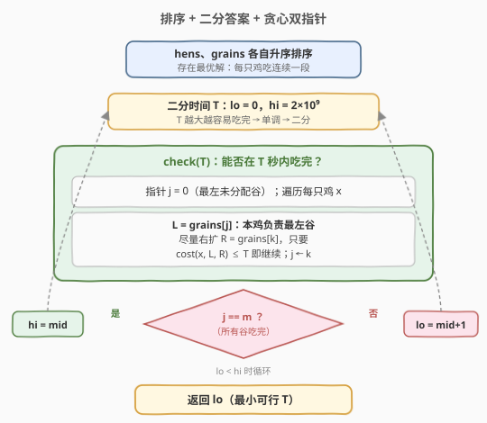
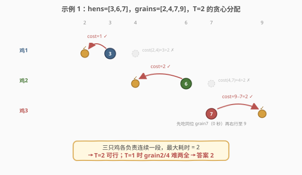

# 吃掉所有谷子的最短时间

- **题目名称**：吃掉所有谷子的最短时间
- **链接**：[2604. 吃掉所有谷子的最短时间 🔒](https://leetcode.cn/problems/minimum-time-to-eat-all-grains/)
- **难度**：困难
- **标签**：数组、双指针、二分查找、排序

## 1. 题目概述

一条线上有 `n` 只母鸡和 `m` 颗谷子。给定两个整数数组 `hens` 和 `grains`，大小分别为 `n` 和 `m`，表示母鸡和谷子的初始位置。

- 若一只母鸡和一颗谷子在同一个位置，则这只母鸡可以吃掉该谷子，**吃掉的时间忽略不计**；一只母鸡可以吃掉多颗谷子。
- 1 秒内一只母鸡可以向左或向右移动 1 个单位；母鸡**同时且独立**地移动。
- 行动得当时，返回吃掉**所有谷子**的**最短时间**。

**示例 1**：

```text
输入：hens = [3,6,7], grains = [2,4,7,9]
输出：2
解释：
- 第一只母鸡在 1 秒内吃掉位置 2 处的谷子。
- 第二只母鸡在 2 秒内吃掉位置 4 处的谷子。
- 第三只母鸡在 2 秒内吃掉位置 7 和 9 处的谷子。
最长时间为 2 秒。可证明 2 秒之前无法吃掉所有谷子。
```

**示例 2**：

```text
输入：hens = [4,6,109,111,213,215], grains = [5,110,214]
输出：1
解释：分别由第 1、4、6 只母鸡各花 1 秒吃掉 5、110、214，其余母鸡不动。
```

**约束条件**：

- $1 \le \textit{hens.length}, \textit{grains.length} \le 2 \times 10^4$
- $0 \le \textit{hens}[i], \textit{grains}[j] \le 10^9$

---

## 2. 解题思路

### 2.1 暴力思路

母鸡和谷子最多各 $2 \times 10^4$，直接枚举「每颗谷子交给哪只鸡」是 $n^m$ 量级，完全不可行。需要抓住两点结构性观察：**最大值最小化 → 二分答案**，以及 **线段覆盖 → 排序后贪心分配**。

### 2.2 核心观察：排序 + 二分答案 + 贪心双指针

![单只母鸡覆盖区间 [L,R] 的最短时间（三种位置关系）](../images/grains_concept.svg)

把问题拆成三个关键事实：

1. **答案单调 → 二分**。设 $T$ 为允许的时间上限。若所有谷子能在 $T$ 秒内被吃完，则 $T+1$ 秒必然也能（鸡原地不动即可）。于是「能否在 $T$ 秒内吃完」具有单调性，可二分最小的可行 $T$。

2. **排序后每只鸡吃连续的一段**。将 `hens`、`grains` 各自升序排序。存在一种最优解，使每只母鸡负责的谷子是 `grains` 中的一段**连续区间**（交换论证：若鸡 A、B 的负责区间交叉，交换其交叉部分不会增加任一只的覆盖跨度，故可调整为不交叉且不劣）。因此可用**贪心**：母鸡从左到右，每只尽量多吃掉左侧剩余的最左谷子，用双指针 $j$ 维护「最左未分配的谷子」。

3. **单只鸡覆盖区间 $[L, R]$ 的最短时间只看两端**。设母鸡位置 $x$，它要负责的谷子中最左为 $L$、最右为 $R$（区间内的谷子都在往返路上经过，免费）。最短时间取决于 $x$ 与 $[L,R]$ 的位置关系：
   - $x \ge R$（鸡在区间右侧）：向左走到 $L$ 即覆盖全部 → 时间 $= x - L$；
   - $x \le L$（鸡在区间左侧）：向右走到 $R$ → 时间 $= R - x$；
   - $L < x < R$（跨越两侧）：需往返覆盖两端，先去近端再去远端 → 时间 $= (R-L) + \min(x-L,\ R-x)$。

> 💡 为什么只看两端？在**一维数轴**上，要访问一组点只需从一端走到另一端，中间点都在路上。所以一只鸡覆盖一段谷子的耗时，只取决于该段最左谷 $L$ 与最右谷 $R$，中间谷子「免费」。

> ⚠️ 跨越情形的两条走法：先左后右耗时 $(x-L)+(R-L)$，先右后左耗时 $(R-x)+(R-L)$，取较小者即 $(R-L)+\min(x-L,R-x)$。

### 2.3 算法流程图



### 2.4 示例演算



以**示例 1**（`hens=[3,6,7]`，`grains=[2,4,7,9]`）为例，二分到 $T=2$ 后执行 `check`：

- **鸡1 @3**：最左未分配谷 $L=\text{grains}[0]=2$。单独吃 grain2：$\text{cost}=|3-2|=1\le2$ ✓；尝试再吃 grain4（$R=4$，跨越：$(4-2)+\min(1,1)=3>2$）✗。鸡1 吃 $\{2\}$，$j\to1$。
- **鸡2 @6**：$L=\text{grains}[1]=4$。单独吃：$6-4=2\le2$ ✓；尝试 grain7（跨越：$(7-4)+\min(2,1)=4>2$）✗。鸡2 吃 $\{4\}$，$j\to2$。
- **鸡3 @7**：$L=\text{grains}[2]=7$。吃 grain7（$0$ 秒）✓；再吃 grain9（$R=9$，全在右侧：$9-7=2\le2$）✓。鸡3 吃 $\{7,9\}$，$j\to4=m$。
- 全部吃完 → $T=2$ 可行。而 $T=1$ 时鸡1 无法同时兼顾 grain2 与 grain4、且无其他鸡可替 → 不可行。**答案 = 2**。

---

## 3. 参考代码

### C++（排序 + 二分 + 双指针贪心）

```cpp
class Solution {
public:
    // 母鸡位置 x 覆盖区间 [L, R] 的最短时间
    long long cost(long long x, long long L, long long R) {
        if (R <= x) return x - L;                 // 全在左侧
        if (L >= x) return R - x;                 // 全在右侧
        return (R - L) + min(x - L, R - x);       // 跨越两侧
    }

    bool check(vector<int>& hens, vector<int>& grains, long long t) {
        int m = grains.size();
        int j = 0;                                // 最左未分配的谷子
        for (int x : hens) {
            if (j >= m) break;
            int start = j;
            while (j < m && cost(x, grains[start], grains[j]) <= t) j++;
        }
        return j >= m;
    }

    int minimumTime(vector<int>& hens, vector<int>& grains) {
        sort(hens.begin(), hens.end());
        sort(grains.begin(), grains.end());
        long long lo = 0, hi = 2e9;               // 上界：最坏单鸡跨越 [0,1e9] 居中 ~1.5e9
        while (lo < hi) {
            long long mid = lo + (hi - lo) / 2;
            if (check(hens, grains, mid)) hi = mid;
            else lo = mid + 1;
        }
        return (int)lo;
    }
};
```

### Python（排序 + 二分 + 双指针贪心）

```python
from typing import List

class Solution:
    def minimumTime(self, hens: List[int], grains: List[int]) -> int:
        hens.sort()
        grains.sort()
        m = len(grains)

        def cost(x: int, L: int, R: int) -> int:
            if R <= x: return x - L               # 全在左侧
            if L >= x: return R - x               # 全在右侧
            return (R - L) + min(x - L, R - x)    # 跨越两侧

        def check(t: int) -> bool:
            j = 0                                 # 最左未分配的谷子
            for x in hens:
                if j >= m:
                    break
                start = j
                while j < m and cost(x, grains[start], grains[j]) <= t:
                    j += 1
            return j >= m

        lo, hi = 0, 2 * 10**9
        while lo < hi:
            mid = (lo + hi) // 2
            if check(mid):
                hi = mid
            else:
                lo = mid + 1
        return lo
```

> ⚠️ `cost` 与位置差最大 $\sim 2\times10^9$，C++ 须用 `long long` 避免 `int` 溢出（Python 整数无此问题）。`return lo` 放在 `while` 之外。

---

## 4. 复杂度分析

| 维度 | 复杂度 | 说明 |
|------|--------|------|
| 时间复杂度 | $O\big((n+m)\log n + (n+m)\log U\big)$ | 排序 $O(n\log n+m\log m)$；二分 $\log U$ 轮，每轮 `check` 双指针整体线性 $O(n+m)$（$j$ 只前进不回退）；$U=10^9$ 为坐标上界 |
| 空间复杂度 | $O(\log n+\log m)$ | 排序所需栈空间（原地排序，无额外大数组） |

> 💡 `check` 内层 `while` 看似嵌套，但 $j$ 单调递增、整体每颗谷最多被扫一次，故单次 `check` 为 $O(n+m)$ 而非 $O(nm)$。这是「双指针/滑动窗口」摊还分析的典型套路。

---

## 5. 扩展：上界为何取 $2\times10^9$ 就够？

单只母鸡覆盖区间 $[L,R]$ 的耗时上界：全左/全右情形 $\le R-L \le 10^9$；跨越情形 $(R-L)+\min(x-L,R-x)$，由 $\min(x-L,R-x)\le\tfrac{R-L}{2}$ 得 $\le 1.5(R-L)\le 1.5\times10^9$。故答案上限为 $1.5\times10^9$，取 `hi=2e9` 留足余量。若想更紧，可令 `hi = 3 * max(坐标差)` 或直接 `2 * 10**9`，二分 $\approx 31$ 轮即可收敛。

另一个常见变体：若题目改为「母鸡吃完后必须**返回出发点**」，则跨越情形变为「往返覆盖两端」$=2(R-L)$，全左/全右情形仍为单程 $\times2$；只需相应改写 `cost`，整体框架不变。

---

## 6. 面试要点

1. **为什么可以二分？**

   - 「能否在 $T$ 秒内吃完」随 $T$ 单调（$T$ 越大越容易），且答案取最小时满足「$T$ 可行 / $T-1$ 不可行」的判定边界，正是二分答案的标准信号。

2. **为什么排序后每只鸡吃连续一段是正确的？**

   - 交换论证：若鸡 A、B 负责的区间交叉（A 吃了 $p_1<p_2$，B 吃了 $q_1<q_2$ 且 $p_1<q_1<p_2<q_2$），把交叉部分（$q_1,p_2$）互换归属，两只鸡各自的覆盖跨度 $[\min,\max]$ 不会变大，故可调整为不交叉且不劣。反复调整得「每只鸡负责连续段」的最优解，于是可用从左到右的贪心。

3. **`check` 里「连第一颗都够不着」为什么要跳过这只鸡？**

   - 当最左未分配谷 $L$ 在鸡 $x$ **右侧**且 $L-x>t$ 时，这只鸡够不着 $L$，应跳过让更靠右（离 $L$ 更近）的鸡尝试；当 $L$ 在鸡**左侧**且 $x-L>t$ 时，更靠右的鸡离 $L$ 更远，跳过也无济于事——最终必然 `false`。两种情形统一由 `while` 条件不成立、`j` 不动、换下一只鸡自然处理，无需特判。

4. **单只鸡的耗时公式怎么记？**

   - 一句话：**只看区间两端 $L,R$ 与鸡位 $x$ 的关系**。鸡在区间外 → 走到远端（单程）；鸡在区间内 → 先去近端再去远端（往返一程 + 跨度），即 $(R-L)+\min(x-L,R-x)$。中间谷子永远免费。

5. **和哪些题同套路？**

   - 「最大化最小值 / 最小化最大值」的二分答案范式（如 [875. 爱吃香蕉的珂珂](../0801-0900/875_爱吃香蕉的珂珂.md)、[1011. 在 D 天内送达包裹的能力](../1001-1100/1011_在D天内送达包裹的能力.md)），叠加「排序 + 双指针贪心验证」就构成本题。

---

## 7. 同类练习题

- [875. 爱吃香蕉的珂珂](https://leetcode.cn/problems/koko-eating-bananas/)：二分答案 + $O(n)$ 贪心验证的母题，`check` 结构与本题同构
- [1011. 在 D 天内送达包裹的能力](https://leetcode.cn/problems/capacity-to-ship-packages-within-d-days/)：二分答案 + 贪心划分（连续段），「最小化最大值」经典
- [410. 分割数组的最大值](https://leetcode.cn/problems/split-array-largest-sum/)：二分答案 + 贪心连续分段，与本题「每只鸡吃连续一段」的贪心验证同思路
- [2616. 最小化数对的最大差值](https://leetcode.cn/problems/minimize-the-maximum-difference-of-pairs/)：同为「最小化最大值」的二分答案 + 排序贪心验证，可对照练习
