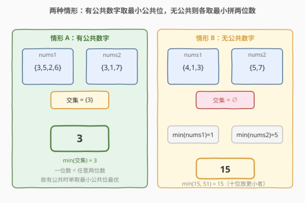
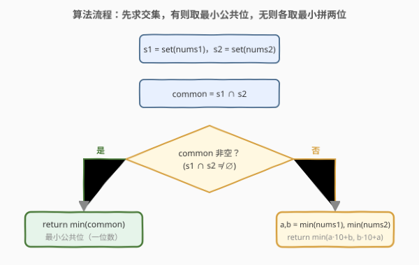
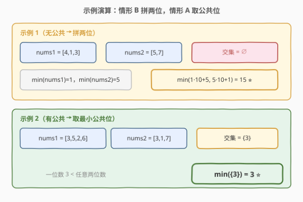

# 从两个数字数组里生成最小数字

- **题目名称**：从两个数字数组里生成最小数字
- **链接**：[2605. 从两个数字数组里生成最小数字](https://leetcode.cn/problems/form-smallest-number-from-two-digit-arrays/)
- **难度**：简单
- **标签**：数组、哈希集合、枚举、贪心

## 1. 题目概述

给你两个只包含 $1$ 到 $9$ 之间数字的数组 `nums1` 和 `nums2`，每个数组中的元素**互不相同**。请返回**最小**的数字，使得两个数组都**至少**包含这个数字的某个数位。

换句话说，结果数字的数位集合 $D$ 要满足：$D \cap \text{nums1} \ne \emptyset$ 且 $D \cap \text{nums2} \ne \emptyset$，且在所有满足此条件的数字中取最小值。

**示例 1**：

```text
输入：nums1 = [4,1,3], nums2 = [5,7]
输出：15
解释：数字 15 的数位 1 在 nums1 中出现，数位 5 在 nums2 中出现。15 是能得到的最小数字。
```

**示例 2**：

```text
输入：nums1 = [3,5,2,6], nums2 = [3,1,7]
输出：3
解释：数字 3 的数位 3 在两个数组中都出现了。
```

**约束条件**：

- $1 \le \text{nums1.length}, \text{nums2.length} \le 9$
- $1 \le \text{nums1[i]}, \text{nums2[i]} \le 9$
- 每个数组中元素**互不相同**

> 💡 关键信号：数字取值只有 $1\sim 9$ 共 $9$ 种，数组长度 $\le 9$。值域极小意味着任何 $O(9)$ 或 $O(9^2)$ 的常数级枚举都可 AC，核心是**分情形讨论**而非高效算法。

---

## 2. 解题思路

### 2.1 暴力思路：枚举所有可能生成的数字

最朴素的思路：既然每个数组只含 $1\sim 9$ 且互异，候选数字的「数位」只能从 $1\sim 9$ 中取。要满足「两数组各至少含一个数位」，结果的数位集合必须至少包含一个 $\text{nums1}$ 中的数位和一个 $\text{nums2}$ 中的数位。于是可以枚举结果的位数 $k \ge 1$，在每个数位上枚举 $1\sim 9$，校验合法性并取最小。但这是指数级的，且**没有抓住问题的单调结构**。

回到本质：位数越多数字越大（一位数 $\le 9$，两位数 $\ge 11$，三位数 $\ge 111$），所以最优解一定在**一位数或两位数**之中。

### 2.2 核心观察：一位数优于两位数，有公共位取最小公共位



分两种情形：

**情形 A：`nums1` 与 `nums2` 有公共数字**（即 $S_1 \cap S_2 \ne \emptyset$，$S_i$ 为数组转集合）。

任取一个公共数字 $d \in S_1 \cap S_2$，则一位数 $d$ 本身就同时是 $S_1$ 与 $S_2$ 的元素，满足条件。一位数 $d \le 9 < 11 \le$ 任意两位数，故最优解必是一位数，取**最小的公共数字** $\min(S_1 \cap S_2)$。

**情形 B：无公共数字**（$S_1 \cap S_2 = \emptyset$）。

一位数不可能同时属于两个不相交的集合，故最优解至少两位。两位数 $10a + b$ 中，要让两个数组各至少含一个数位，只需 $a \in S_1 \cup S_2$、$b \in S_1 \cup S_2$，且 $\{a,b\}$ 同时覆盖两集合即可。最省事且最优的做法是**各取一个数位**：从 $S_1$ 取 $a$、从 $S_2$ 取 $b$（或反之），组成 $10a+b$。

为什么取**各自的最小值** $a = \min(\text{nums1})$、$b = \min(\text{nums2})$？设最终两位为 $10x + y$（$x$ 为十位、$y$ 为个位），要让数字最小，**十位越小越好**，其次个位越小越好。十位候选只能是 $a$ 或 $b$（来自两数组各自的最小值，其它更大值只会让结果更大），故十位取 $\min(a, b)$，个位取 $\max(a, b)$：

$$
\text{ans} = \min(a, b) \times 10 + \max(a, b) = \min(a \times 10 + b,\; b \times 10 + a)
$$

> ⚠️ **为什么不能再小？** 任何满足条件的两位数 $10x + y$ 必有 $x \ge \min(S_1 \cup S_2) = \min(\min a, \min b)$（十位至少是两个数组最小值中较小者），且 $y$ 也受限。具体地，若十位 $x$ 来自某数组，则个位 $y$ 至少来自另一数组，故 $y \ge$ 另一数组的最小值。把更小者放十位、另一者放个位即取得该情形下界，与公式一致。

> 💡 **不会出现需要三位数的情形**：两位数 $11 \le \text{ans} \le 99$，而三位数 $\ge 111$，永远更大。所以无公共时两位数即最优。

### 2.3 算法流程图



三步：

1. 把两数组转集合 $S_1, S_2$；
2. 求 $\text{common} = S_1 \cap S_2$；
3. 若 $\text{common}$ 非空，返回 $\min(\text{common})$；否则令 $a = \min(\text{nums1})$、$b = \min(\text{nums2})$，返回 $\min(a \times 10 + b,\; b \times 10 + a)$。

### 2.4 示例演算



- **示例 1** `nums1 = [4,1,3]`，`nums2 = [5,7]`：$S_1 \cap S_2 = \emptyset$，走情形 B。$a = \min(\text{nums1}) = 1$，$b = \min(\text{nums2}) = 5$，$\min(1 \times 10 + 5,\; 5 \times 10 + 1) = \min(15, 51) = 15$。
- **示例 2** `nums1 = [3,5,2,6]`，`nums2 = [3,1,7]`：$S_1 \cap S_2 = \{3\}$，走情形 A，返回 $\min(\{3\}) = 3$。一位数 $3 < 11 \le$ 任意两位数，无需考虑拼接。

---

## 3. 参考代码

### C++

```cpp
class Solution {
public:
    int minNumber(vector<int>& nums1, vector<int>& nums2) {
        unordered_set<int> s1(nums1.begin(), nums1.end());
        unordered_set<int> s2(nums2.begin(), nums2.end());
        // 情形 A：有公共数字，取最小公共位
        int common = 10;
        for (int d = 1; d <= 9; ++d)
            if (s1.count(d) && s2.count(d))
                common = min(common, d);
        if (common != 10) return common;
        // 情形 B：无公共数字，各取最小拼两位
        int a = *min_element(nums1.begin(), nums1.end());
        int b = *min_element(nums2.begin(), nums2.end());
        return min(a * 10 + b, b * 10 + a);
    }
};
```

> 💡 值域仅 $1\sim 9$，可以直接用 $d$ 从 $1$ 到 $9$ 线性扫公共位，第一个命中即是最小公共位，可直接 `return d`。用哨兵 `common = 10`（大于任何 $1\sim 9$）统一了「未命中」判定，也可改成命中即返回、循环结束再走情形 B，等价。

### Python

```python
class Solution:
    def minNumber(self, nums1: List[int], nums2: List[int]) -> int:
        s1, s2 = set(nums1), set(nums2)
        common = s1 & s2
        if common:                       # 情形 A：有公共数字
            return min(common)
        # 情形 B：无公共数字，各取最小拼两位
        a, b = min(nums1), min(nums2)
        return min(a * 10 + b, b * 10 + a)
```

> 💡 Python 的 `set & set` 直接求交集，`min(common)` 取最小公共位。`min(a*10+b, b*10+a)` 等价于「把更小者放十位」，无需显式比大小后拼接。也可写 `lo, hi = min(a, b), max(a, b); return lo * 10 + hi`，语义更直白。

---

## 4. 复杂度分析

| 维度 | 复杂度 | 说明 |
|------|--------|------|
| **时间复杂度** | $O(n + m)$ | 转集合 $O(n+m)$；求交集与取最小为 $O(n+m)$ 或 $O(9)$；总线性 |
| **空间复杂度** | $O(n + m)$ | 两个哈希集合，$n, m \le 9$，常数级 |

> 💡 实际 $n, m \le 9$、值域 $\le 9$，任何写法都是常数时间、常数空间，重点在分类讨论的正确性而非效率。即使不建集合、直接 $O(9 \times 9)$ 双重循环找公共位，也仅 $81$ 次比较。

---

## 5. 扩展：值域放大与「最小公共元素」泛化

若把数字值域从 $1\sim 9$ 放大到 $1\sim 10^9$，单一位数不再恒优于两位数（一位数可以是 $9$、两位数从 $11$ 起，结论仍成立；但若允许 $0$ 数位则需重审前导零）。核心分类「有公共取最小公共、无公共各取最小拼两位」依然成立，只是 $\min$ 与交集运算需在更大值域上做。

本题是「**最小公共元素**」类问题的退化特例：泛化版本如「在 $k$ 个数组中各取一个元素，组成最小数」，则情形 A 变为「$k$ 个集合的交集非空取最小公共」，情形 B 变为「无公共时需协调 $k$ 个最小值的排列」，复杂度随 $k$ 上升。$k=2$ 时两位拼接即可，$k \ge 3$ 时退化为多位组合的贪心/搜索问题，见 [1198. 找出所有行中最小公共元素](../1101-1200/1198_找出所有行中最小公共元素.md) 的「行间公共」变体。

> 💡 本题的两情形分治是「**单点最优 vs 组合最优**」思想的微缩：有公共位时单点（一位数）即可满足约束且最优；无公共位时必须组合（两位数），并把更小者放到高位。这一「先看能否单点满足、不能再组合」的二分递进在很多极小化构造题中出现。

---

## 6. 面试要点

1. **为什么有公共数字时直接取最小公共位就是全局最优？**

   > 一位数 $d \le 9$，而任何两位数 $\ge 11$、三位数 $\ge 111$。公共数字 $d$ 同时属于两数组，作为一位数天然满足约束，且一位数严格小于任何多位数，故有公共时一位数必最优，取其中最小的那个。

2. **无公共时为什么取各自最小值、并把更小者放十位？**

   > 两位数大小由十位主导。十位必须来自某数组的一个数位，可选下界是两数组最小值中较小者；十位确定后个位需来自另一数组（保证覆盖），其下界是另一数组最小值。故「更小者放十位、另一者放个位」达到该情形下界，即 $\min(a,b)\times 10 + \max(a,b)$。

3. **会不会需要三位数或更多位？**

   > 不会。无公共时两位数即可覆盖两数组（各取一位），且两位数 $\le 99 < 111 \le$ 三位数。更多位只会更大，故两位数即最优。有公共时一位数更优。

4. **为什么不先枚举两位数、再判断合法性？**

   > 枚举两位数 $11\sim 99$ 共 $89$ 种、每种校验覆盖性可行但多此一举。利用「十位越小越好」的结构直接取两数组各自最小值并排序拼接，$O(1)$ 得到最优，无需枚举。这是「**利用单调性直接构造**」对「**枚举后筛选**」的优化。

5. **交集为空时，`min(a*10+b, b*10+a)` 与「排序后拼接」等价吗？**

   > 等价。设 $a \le b$，则 $a \times 10 + b \le b \times 10 + a$（因 $(b-a)\times 9 \ge 0$），`min` 取 $a \times 10 + b$，即更小者 $a$ 在十位。这与 `lo*10+hi`（`lo=min(a,b), hi=max(a,b)`）结果一致，两种写法可互换。

> 💡 **一句话总结**：2605 = 「有公共取最小公共一位数，无公共各取最小拼两位（更小者放十位）」。值域 $1\sim 9$、长度 $\le 9$，重点是分情形正确而非效率；交集非空 $\to \min(S_1\cap S_2)$，否则 $\min(a\cdot10+b,\;b\cdot10+a)$。

---

## 7. 同类练习题

- [349. 两个数组的交集](https://leetcode.cn/problems/intersection-of-two-arrays/)（[题解](../0301-0400/349_两个数组的交集.md)）：集合求交的母题，本题「找公共数字」直接复用 $S_1 \cap S_2$ 的判定
- [599. 两个列表的最小索引总和](https://leetcode.cn/problems/minimum-index-sum-of-two-lists/)（[题解](../0501-0600/599_两个列表的最小索引总和.md)）：在两列表公共元素中按另一指标（索引和）取最优，对照「公共集合 + 最小化」模式
- [1198. 找出所有行中最小公共元素](https://leetcode.cn/problems/find-smallest-common-element-in-all-rows/)（[题解](../1101-1200/1198_找出所有行中最小公共元素.md)）：从「两数组公共」泛化到「所有行公共」，取最小公共元素，本题情形 A 的 $k$ 行推广
- [179. 最大数](https://leetcode.cn/problems/largest-number/)（[题解](../0101-0200/179_最大数.md)）：同为「用给定数位/数字组成最值」，对照「最小拼两位」与「最大拼全排列」的贪心方向相反
