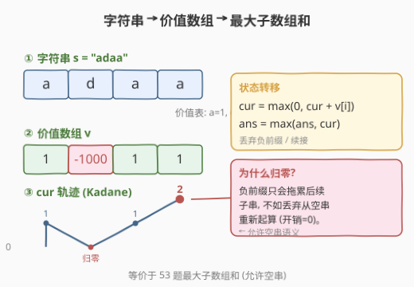
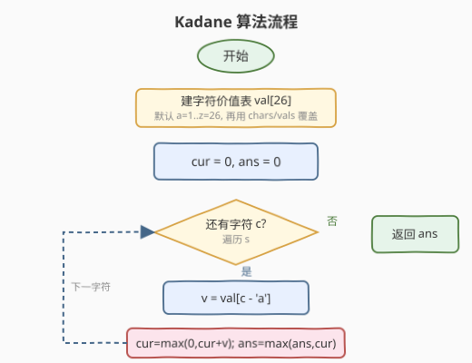
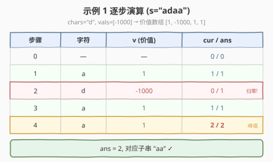

# 找到最大开销的子字符串

- **题目名称**：找到最大开销的子字符串
- **链接**：[2606. 找到最大开销的子字符串](https://leetcode.cn/problems/find-the-substring-with-maximum-cost/)
- **难度**：中等
- **标签**：数组、动态规划、最大子数组和（Kadane）

## 1. 题目概述

给定字符串 `s`、一个**字符互不相同**的字符串 `chars` 和与 `chars` 等长的整数数组 `vals`。每个字符的**价值**定义如下：

- 若字符**不在** `chars` 中，价值为其字母表位置（`'a'=1, 'b'=2, …, 'z'=26`）；
- 若字符在 `chars` 中位置为 `i`，价值为 `vals[i]`（可为负）。

**子字符串的开销** = 子串中所有字符价值之和，**空串开销为 0**。求 `s` 所有子字符串中的最大开销。

**示例 1**：

```text
输入：s = "adaa", chars = "d", vals = [-1000]
输出：2
解释：'a' 价值 1，'d' 价值 -1000。最大开销子串是 "aa"，开销 1+1=2。
```

**示例 2**：

```text
输入：s = "abc", chars = "abc", vals = [-1,-1,-1]
输出：0
解释：'a','b','c' 价值均为 -1，任何非空子串开销都为负，取空串得 0。
```

**约束条件**：

- `1 <= s.length <= 10^5`
- `s` 只包含小写英文字母
- `1 <= chars.length <= 26`，`chars` 字符互不相同
- `vals.length == chars.length`
- `-1000 <= vals[i] <= 1000`

---

## 2. 解题思路

### 2.1 暴力思路

枚举所有 $O(n^2)$ 个子串、逐个求和取最大值，时间 $O(n^3)$ 或前缀和优化到 $O(n^2)$，`n <= 10^5` 不可行。瓶颈在于重复累加——子串 `[l, r]` 的开销与 `[l, r-1]` 仅差一个字符，存在大量重叠子问题。

### 2.2 核心观察：价值数组上的最大子数组和



把 `s` 中每个字符按规则换成价值，得到价值数组 `v[0..n-1]`，则「最大开销子串」**等价于** `v` 上的**最大子数组和**——这正是 [53. 最大子数组和](https://leetcode.cn/problems/maximum-subarray/) 的 Kadane 算法。

与标准 53 题的唯一区别：本题**允许空串（开销 0）**。当某段前缀和降到负数时，与其拖着负累赘往后加，不如**丢弃整段、从空串重新起算**。于是把 Kadane 的状态转移写成：

$$cur = \max(0,\; cur + v[i])$$

即「累加当前字符」与「丢弃到空串（0）」取较大者。`ans` 始终跟踪 `cur` 的历史峰值，自然保证 $\ge 0$。

> 💡 两种写法等价：(a) `cur = max(0, cur+v); ans = max(ans, cur)`（空串融入状态，ans 天然 $\ge 0$）；(b) 标准 `cur = max(v, cur+v); ans = max(0, max cur)`（最后再和 0 比）。本题用 (a) 更简洁。

> ⚠️ 别忘了「价值表」要先把 26 个字母的默认值 `1..26` 填好，再用 `chars/vals` 覆盖对应位置，否则会漏掉未出现于 `chars` 的字符。

### 2.3 算法流程图



### 2.4 示例演算



以**示例 1**（`s = "adaa"`，`chars = "d"`，`vals = [-1000]`）为例，价值数组为 `[1, -1000, 1, 1]`：

| 步骤 | 字符 | 价值 `v` | `cur = max(0, cur+v)` | `ans` | 说明 |
|------|------|----------|------------------------|-------|------|
| 0 | — | — | 0 | 0 | 初始 |
| 1 | `a` | 1 | `max(0, 0+1)=1` | 1 | 累加 |
| 2 | `d` | -1000 | `max(0, 1-1000)=0` | 1 | 负累赘→丢弃归零 |
| 3 | `a` | 1 | `max(0, 0+1)=1` | 1 | 从空串重新起算 |
| 4 | `a` | 1 | `max(0, 1+1)=2` | **2** | 峰值更新 |

最终 `ans = 2`，对应子串 `"aa"`。✓

---

## 3. 参考代码

### C++（Kadane，空串融入状态）

```cpp
class Solution {
public:
    int maximumCostSubstring(string s, string chars, vector<int>& vals) {
        int val[26];
        for (int i = 0; i < 26; i++) val[i] = i + 1;       // 默认 a=1..z=26
        for (int i = 0; i < (int)chars.size(); i++)
            val[chars[i] - 'a'] = vals[i];                 // chars 覆盖
        int cur = 0, ans = 0;
        for (char c : s) {
            int v = val[c - 'a'];
            cur = max(0, cur + v);                          // 丢弃负前缀 / 续接
            ans = max(ans, cur);
        }
        return ans;
    }
};
```

### Python（Kadane，空串融入状态）

```python
class Solution:
    def maximumCostSubstring(self, s: str, chars: str, vals: List[int]) -> int:
        val = [i + 1 for i in range(26)]                   # 默认 a=1..z=26
        for c, x in zip(chars, vals):
            val[ord(c) - 97] = x                           # chars 覆盖
        cur = ans = 0
        for c in s:
            v = val[ord(c) - 97]
            cur = max(0, cur + v)                          # 丢弃负前缀 / 续接
            ans = max(ans, cur)
        return ans
```

---

## 4. 复杂度分析

| 维度 | 复杂度 | 说明 |
|------|--------|------|
| 时间复杂度 | $O(n)$ | 建价值表 $O(26)=O(1)$；一次遍历 `s`，每字符 $O(1)$ 转移，总计 $O(n)$ |
| 空间复杂度 | $O(1)$ | 仅价值表 `val[26]` 与两个滚动变量 `cur/ans`，与 `n` 无关 |

> 💡 本题是 [53. 最大子数组和](https://leetcode.cn/problems/maximum-subarray/) 的「字符映射 + 允许空串」变体：先做字符到价值的线性映射，再套 Kadane。难点不在 DP 而在**识别出它就是最大子数组和**。

---

## 5. 扩展：前缀和视角下的统一理解

Kadane 本质是**前缀和之差的最大化**：记前缀和 $P_0=0,\ P_k=\sum_{i<k} v[i]$，则子串 $[l,r)$ 的开销 $=P_r-P_l$。最大开销 $=\max_r P_r - \min_{l<r} P_l$，即「扫描时维护历史最小前缀和」。本题允许空串即等价于 $P_l$ 可取 $P_0=0$，故 `cur=max(0, cur+v)` 正是在线维护「$P_{当前}-\min P_{历史}$」。

用前缀和写则更直白：

```python
ans = 0; pref = 0; mn = 0
for c in s:
    pref += val[ord(c)-97]
    ans = max(ans, pref - mn)
    mn = min(mn, pref)
return ans
```

两者完全等价，`cur` 相当于 `pref - mn`。Kadane 的「丢弃负前缀」= 前缀和的「更新历史最小值」。

---

## 6. 面试要点

1. **为什么可以丢弃负前缀？**

   - 若前缀和 $cur < 0$，对任意后续位置 $r$，含此前缀的开销 $P_r-P_l$ 必小于 $P_r-0$（不含此前缀）。故负前缀只会拖累后续子串，丢弃后从空串重新起算必然不劣，`cur=max(0,cur+v)` 即此贪心。

2. **允许空串对算法有什么影响？**

   - 标准 53 题要求非空，答案可能是负数（全负数组取最大单元素）。本题允许空串，下界抬到 0：`cur` 归零代表选空串，`ans` 天然 $\ge 0$。用「空串融入状态」的写法无需额外 `max(0, ans)` 兜底。

3. **`chars` 与默认价值冲突时以谁为准？**

   - 题目规定 `chars` 中的字符按 `vals` 取值，其余按字母位置。故先填默认 `1..26`，再用 `vals` 覆盖 `chars` 对应下标——覆盖顺序不能反，否则默认值会盖掉 `vals`。

4. **为什么是 Kadane 而不是区间 DP / 分治？**

   - 最大子数组和有最优子结构：以 `i` 结尾的最大和 $cur_i$ 只依赖 $cur_{i-1}$，状态一维、转移 $O(1)$。区间 DP 的 $O(n^2)$ 与分治的 $O(n\log n)$ 都不如 Kadane 的 $O(n)$，且 Kadane 还能滚动到 $O(1)$ 空间。

5. **负数价值会让答案变成 0 吗？**

   - 会。当所有字符价值都为负（如示例 2），任何非空子串开销都为负，`cur` 始终被压到 0，`ans` 保持 0，即选空串。这正是「允许空串」语义的体现。

---

## 7. 同类练习题

- [53. 最大子数组和](https://leetcode.cn/problems/maximum-subarray/)（[题解](../0001-0100/53_最大子数组和.md)）：Kadane 母题，非空约束；本题是其「字符映射 + 允许空串」的直接变体
- [918. 环形子数组的最大和](https://leetcode.cn/problems/maximum-sum-circular-subarray/)（[题解](../0901-1000/918_环形子数组的最大和.md)）：Kadane 进阶，环上最大 = `total - min_sum`，复用同一累加和思想
- [152. 乘积最大子数组](https://leetcode.cn/problems/maximum-product-subarray/)（[题解](../0101-0200/152_乘积最大子数组.md)）：把「和」换成「积」的滚动 DP 变体，需同时维护最大最小应对负数翻转
- [1746. 经过一次操作后的最大子数组和](https://leetcode.cn/problems/maximum-subarray-sum-after-one-operation/)：Kadane + 一次操作的状态机扩展，同为 $O(n)$ 一维 DP 套路
- [2321. 拼接Beauty串的最大得分](https://leetcode.cn/problems/maximum-score-of-spliced-string/)：把子段整体替换为另一数组对应段，仍是 Kadane 框架（正增量才拼接），延续「负前缀丢弃」思想
