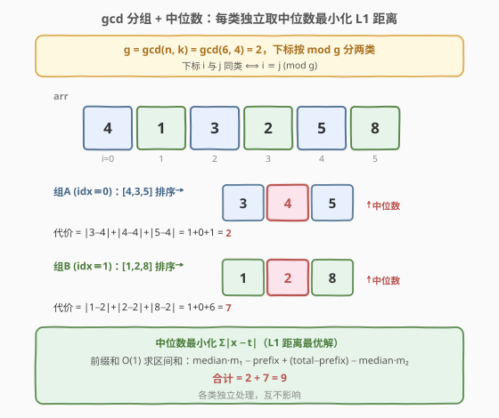
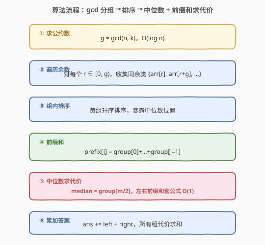

# 使子数组元素和相等

- **题目名称**：使子数组元素和相等
- **链接**：[2607. 使子数组元素和相等](https://leetcode.cn/problems/make-k-subarray-sums-equal/)
- **难度**：中等
- **标签**：数组、数学、数论、排序、中位数、前缀和、gcd

## 1. 题目概述

给你一个下标从 **0** 开始的整数数组 `arr` 和一个整数 `k`。数组 `arr` 是一个**循环数组**：最后一个元素的下一个是首元素，首元素的前一个是末元素。

每次运算可选中任意一个元素，使其值 **加 1 或减 1**（可执行任意次）。要求执行运算后，**每个长度为 $k$ 的子数组**的元素总和都相等，返回所需的最少运算次数。

**示例 1**：

```text
输入：arr = [1,4,1,3], k = 2
输出：1
解释：把下标 1 的元素 4→3（1 次），数组变为 [1,3,1,3]
长度为 2 的 4 个子数组和均为 4。
```

**示例 2**：

```text
输入：arr = [2,5,5,7], k = 3
输出：5
解释：下标 0 的 2→5（3 次），下标 3 的 7→5（2 次），数组变为 [5,5,5,5]
长度为 3 的 4 个子数组和均为 15。
```

**约束条件**：

- $1 \le k \le n = \text{arr.length} \le 10^5$
- $1 \le \text{arr}[i] \le 10^9$

> 💡 **关键观察**：循环数组里「所有长度为 $k$ 的子数组和相等」并不是一个松散的约束——把它写成 $\text{sum}(i) = \text{sum}(i+1)$ 后做差，会得到一个极强的不变量：$\text{arr}[i] = \text{arr}[(i+k) \bmod n]$。于是数组被 $\gcd(n, k)$ 切成若干**等价类**，每类内的元素必须彼此相等。把每类元素变成同一个值的最小代价，正是经典的「取中位数、最小化 $L_1$ 距离」问题（与 2602 同构）。

---

## 2. 解题思路

### 2.1 暴力思路：分组后逐目标值枚举

先承认关键约束 $\text{arr}[i] = \text{arr}[(i+k) \bmod n]$（推导见 2.2），据此把数组分成若干等价类。对每个大小为 $m$ 的类，要让 $m$ 个元素全部相等，**暴力**做法是枚举每个已有值当目标，逐一计算代价：

```python
def cost_brute(group):
    best = float('inf')
    for t in group:                       # 枚举每个候选目标
        best = min(best, sum(abs(x - t) for x in group))
    return best
```

单组 $O(m^2)$；最坏情况 $\gcd(n,k)=1$ 时只有一组、$m=n$，总计 $O(n^2)$，$n = 10^5$ 时约 $10^{10}$ 次运算，**超时**。瓶颈在于「对每个候选目标都重新遍历全组求和」。需要把「逐元素累加」升级为「按中位数一次定解」。

### 2.2 核心观察：等价类 + 中位数

![核心观察：子数组和相等 ⟹ arr[i] = arr[(i+k) mod n]，循环数组被 gcd 切成若干环](../images/2607_cycles_concept.svg)

**关键直觉一：子数组和相等 ⟹ $\text{arr}[i] = \text{arr}[(i+k) \bmod n]$。** 记从下标 $i$ 起的长度为 $k$ 的子数组和为 $\text{sum}(i)$（下标在循环数组上取模）。「所有子数组和相等」只需相邻两者相等，即 $\text{sum}(i) = \text{sum}(i+1)$。两式相减，中间 $k-1$ 项全部抵消：

$$\text{sum}(i+1) - \text{sum}(i) = \text{arr}[(i+k) \bmod n] - \text{arr}[i] = 0 \implies \text{arr}[i] = \text{arr}[(i+k) \bmod n].$$

反之，若 $\text{arr}[i] = \text{arr}[(i+k) \bmod n]$ 对所有 $i$ 成立，则 $\text{sum}(i+1) = \text{sum}(i)$，所有子数组和相等。**约束等价于**：每隔步长 $k$（模 $n$）的位置必须取相同值。

**关键直觉二：步长 $k$ 的轨道 = 同余 $\bmod\, \gcd(n,k)$。** 反复套用约束 $\text{arr}[i] = \text{arr}[(i+k) \bmod n]$，得到 $\text{arr}[i] = \text{arr}[(i + m \cdot k) \bmod n]$ 对一切 $m$ 成立。集合 $\{m \cdot k \bmod n : m \in \mathbb{Z}\}$ 是 $\mathbb{Z}_n$ 中由 $k$ 生成的子群，等于由 $g = \gcd(n, k)$ 生成的子群 $\{0, g, 2g, \dots, n-g\}$。故下标 $i$ 的**轨道**为：

$$\text{orbit}(i) = \{\,i,\ i+g,\ i+2g,\ \dots\,\} \bmod n = \{\,j : j \equiv i \pmod{g}\,\}.$$

即下标按 $\bmod\, g$ 分成 $g$ 个等价类，每类大小 $n/g$，**同类元素必须相等**。

> ⚠️ 当 $k$ 是 $n$ 的倍数时 $g = \gcd(n,k) = n$，每类只有 $1$ 个元素，代价为 $0$——因为此时每个长度为 $k$ 的子数组都恰好转整数圈、覆盖全体元素同样多次，和天然相等。

**关键直觉三：每类取中位数最小化 $L_1$ 距离。** 在一个等价类内，要把所有元素变成同一个值 $t$，代价为 $\sum |\text{arr}[i] - t|$。使该和最小的 $t$ 是这组元素的**中位数**（排序后第 $\lfloor m/2 \rfloor$ 个）。这是「$L_1$ 距离之和」的标准结论：中位数左侧与右侧的元素个数平衡，任何偏离都会让一侧代价增幅大于另一侧的降幅。



**关键直觉四：前缀和 $O(1)$ 算中位数代价。** 组内排序后，取 $\text{mid} = \lfloor m/2 \rfloor$、$\text{median} = \text{group}[\text{mid}]$。预处理前缀和 $\text{prefix}[j] = \text{group}[0] + \cdots + \text{group}[j-1]$、$\text{total} = \text{prefix}[m]$，则：

- **左半**（$j < \text{mid}$，$\text{group}[j] \le \text{median}$）：$\sum (\text{median} - \text{group}[j]) = \text{median} \cdot \text{mid} - \text{prefix}[\text{mid}]$
- **右半**（$j \ge \text{mid}$，$\text{group}[j] \ge \text{median}$）：$\sum (\text{group}[j] - \text{median}) = (\text{total} - \text{prefix}[\text{mid}]) - \text{median} \cdot (m - \text{mid})$

排序去掉绝对值符号后，每类代价在 $O(1)$ 内求出（与 2602 完全同构）。

> 💡 把四步合起来：$\gcd$ 分组 $O(n)$ + 每组排序 $O\!\left(\frac{n}{g} \log \frac{n}{g}\right)$（总计 $\le O(n \log n)$）+ 每组前缀和 $O(n)$ + 每组代价 $O(1)$，总体 $O(n \log n)$。

### 2.3 算法流程图



流程分六阶段：

1. **求公约数**：$g = \gcd(n, k)$，决定等价类个数；
2. **遍历余数**：对每个 $r \in [0, g)$，收集同余类 $\{\text{arr}[r], \text{arr}[r+g], \dots\}$；
3. **组内排序**：每组升序排序，暴露中位数位置；
4. **前缀和**：建 `prefix`，`prefix[j] = prefix[j-1] + group[j-1]`；
5. **中位数求代价**：`median = group[m/2]`，左右前缀和套公式 $O(1)$；
6. **累加答案**：`ans += left + right`，所有组代价求和。

> ⚠️ **数据范围**：$n \le 10^5$，$\text{arr}[i] \le 10^9$。单类代价上界 $\frac{n}{g} \times 10^9$，最坏 $n \times 10^9 = 10^{14}$，**超出 32 位 `int`**（$\approx 2.1 \times 10^9$）。C++ 必须用 `long long` 存代价与前缀和；Python 大整数无此顾虑。

### 2.4 示例演算

![示例演算：arr=[2,5,5,7], k=3, n=4, g=1 单组，中位数 5，代价 5](../images/2607_example_walkthrough.svg)

以示例 2 `arr = [2,5,5,7]`、$k = 3$ 为例。$n = 4$，$g = \gcd(4, 3) = 1$，**仅一个等价类**（全部下标同组，约束 $\text{arr}[i] = \text{arr}[(i+3) \bmod 4]$ 把 4 个位置串成一个环）。

**整组排序**：$[2,5,5,7]$，$m = 4$，$\text{mid} = 2$，$\text{median} = \text{group}[2] = 5$。

前缀和 `prefix = [0, 2, 7, 12, 19]`，$\text{total} = 19$。

| 量 | 计算 | 值 |
|----|------|----|
| 左半 | $\text{median} \cdot \text{mid} - \text{prefix}[\text{mid}] = 5 \times 2 - 7 = 10 - 7$ | $3$ |
| 右半 | $(\text{total} - \text{prefix}[\text{mid}]) - \text{median} \cdot (m - \text{mid}) = (19-7) - 5 \times 2 = 12 - 10$ | $2$ |
| **answer** | $3 + 2$ | **5** ✓ |

验证：$|2-5|+|5-5|+|5-5|+|7-5| = 3+0+0+2 = 5$，与公式一致。

> 💡 再看示例 1 `arr = [1,4,1,3]`、$k = 2$：$g = \gcd(4,2) = 2$。类 A（下标 $0,2$）$=[1,1]$，中位数 $1$，代价 $0$；类 B（下标 $1,3$）$=[4,3]$ 排序 $[3,4]$，中位数 $3$（或 $4$，偶数个时区间内任取），代价 $|4-3|=1$。合计 $0+1=1$ ✓。

---

## 3. 参考代码

### C++（gcd 分组 + 排序 + 前缀和中位数，$O(n \log n)$ / $O(n)$ 额外空间）

```cpp
class Solution {
public:
    long long makeSubKSumEqual(vector<int>& arr, int k) {
        int n = arr.size();
        int g = gcd(n, k);                       // <numeric> 里的 std::gcd
        long long ans = 0;
        for (int i = 0; i < g; ++i) {
            // 收集同余类 {arr[i], arr[i+g], ...}
            vector<int> group;
            for (int j = i; j < n; j += g) group.push_back(arr[j]);
            sort(group.begin(), group.end());
            int m = group.size();
            // 前缀和：prefix[j] = group[0]+...+group[j-1]，prefix[0]=0
            vector<long long> prefix(m + 1, 0);
            for (int j = 0; j < m; ++j) prefix[j + 1] = prefix[j] + group[j];
            long long total = prefix[m];
            int mid = m / 2;
            long long median = group[mid];
            long long left  = median * mid - prefix[mid];                  // 左半 median-group[j]
            long long right = (total - prefix[mid]) - median * (m - mid);  // 右半 group[j]-median
            ans += left + right;
        }
        return ans;
    }
};
```

> 💡 **实现细节**：① `std::gcd`（C++17 起，位于 `<numeric>`）一步求公约数。② `prefix` 长度 $m+1$、`prefix[0]=0` 哨兵，`mid=0` 时左半为空、公式天然成立。③ `median * mid` 与 `median * (m-mid)` 都用 `long long` 参与运算（`median` 已是 `long long`），积可达 $\frac{n}{g} \times 10^9$，安全。④ 各组大小之和 $\sum m = n$，前缀和与排序的总开销分别是 $O(n)$ 与 $\le O(n \log n)$。

### Python（gcd 分组 + 排序 + 前缀和中位数，$O(n \log n)$ / $O(n)$ 额外空间）

```python
class Solution:
    def makeSubKSumEqual(self, arr: List[int], k: int) -> int:
        from math import gcd
        n = len(arr)
        g = gcd(n, k)
        ans = 0
        for i in range(g):
            group = sorted(arr[i:n:g])        # 同余类 {arr[i], arr[i+g], ...}
            m = len(group)
            prefix = [0] * (m + 1)
            for j in range(m):
                prefix[j + 1] = prefix[j] + group[j]
            total = prefix[m]
            mid = m // 2
            median = group[mid]
            left  = median * mid - prefix[mid]                  # 左半 median-group[j]
            right = (total - prefix[mid]) - median * (m - mid)  # 右半 group[j]-median
            ans += left + right
        return ans
```

> 💡 Python 中 `arr[i:n:g]` 切片直接取出下标 $\equiv i \pmod{g}$ 的元素，等价于「同余类」。`math.gcd` 自 Python 3.5 起可用。大整数无溢出，但前缀和数组 $O(n)$ 空间无法省。

---

## 4. 复杂度分析

| 维度 | 复杂度 | 说明 |
|------|--------|------|
| **时间复杂度** | $O(n \log n)$ | $\gcd$ 为 $O(\log n)$；每组排序合计 $\sum \frac{n}{g}\log\frac{n}{g} \le n \log n$；前缀和合计 $O(n)$；每组代价 $O(1)$ |
| **空间复杂度** | $O(n)$ | 各组 `group` 与 `prefix` 逐组分配、用完即弃，峰值 $\le n$（$g=1$ 时整组占 $n$） |
| 对照：暴力 | $O(n^2)$ 时间 | 逐目标值枚举，$g=1$ 时单组 $O(n^2)$，$n=10^5$ 必超时 |

> 💡 $O(n \log n)$ 已是此题最优渐近：排序的 $O(n \log n)$ 一旦付出即不可省（求中位数需有序），而分组、前缀和都是线性。若仅求中位数可用 `nth_element` 在 $O(n)$ 内不排序地定位，但仍需排序来按前缀和 $O(1)$ 求两侧和，故排序在工程上最直接。

---

## 5. 扩展：中位数最优性的直观证明

为什么目标值 $t$ 取**中位数**而非平均数能最小化 $\sum |a_i - t|$？

考虑把 $t$ 在数轴上移动 $+1$：所有 $< t$ 的元素代价各 $+1$，所有 $\ge t$ 的元素代价各 $-1$。设左侧（$< t$）$L$ 个、右侧（$\ge t$）$R$ 个，则总代价变化 $L - R$。

- 当 $L < R$（$t$ 偏左），右移使代价**下降**，应继续右移；
- 当 $L > R$（$t$ 偏右），右移使代价**上升**，应回头左移；
- 当 $L = R$（$t$ 落在中位数处），代价**达到极小**，不再下降。

排序后中位数 $\text{group}[\lfloor m/2 \rfloor]$ 恰使两侧计数平衡（偶数个时区间 $[\text{group}[\lfloor(m-1)/2\rfloor], \text{group}[\lfloor m/2\rfloor]]$ 内任取都最优），故取它即可。

> 💡 **为什么不用平均数？** 平均数最小化的是**平方距离** $\sum (a_i - t)^2$（$L_2$ 范数），中位数最小化的是**绝对距离** $\sum |a_i - t|$（$L_1$ 范数）。本题每次操作 $\pm 1$，代价是线性的 $L_1$，故用中位数。

> 💡 **简化写法**：因为每类只查询一次中位数代价，组内代价也可不必前缀和，直接 $O(m)$ 累加：`sum(abs(x - median) for x in group)`，各组合计仍是 $O(n)$，总复杂度不变。前缀和版的优势在于与 2602 的「多次查询」场景一脉相承，便于迁移。

---

## 6. 面试要点

1. **怎么从「子数组和相等」推出 $\text{arr}[i] = \text{arr}[(i+k) \bmod n]$？**

   > 所有子数组和相等只需相邻相等 $\text{sum}(i) = \text{sum}(i+1)$。两式相减，公共的 $k-1$ 项全部抵消，只剩 $\text{arr}[(i+k) \bmod n] - \text{arr}[i] = 0$。这一步把一个「全局」约束（所有子数组）降维成「局部」约束（相隔 $k$ 的两个位置相等），是整题的破题点。

2. **为什么等价类个数恰是 $\gcd(n, k)$ 而不是 $k$ 或别的？**

   > 反复套约束得到 $\text{arr}[i] = \text{arr}[(i + mk) \bmod n]$。集合 $\{mk \bmod n\}$ 是 $\mathbb{Z}_n$ 中由 $k$ 生成的子群，其阶为 $n/\gcd(n,k)$、等于由 $\gcd(n,k)$ 生成的子群 $\{0, g, 2g, \dots\}$。故轨道为「同余 $\bmod\, g$」，等价类个数 $= g = \gcd(n,k)$。这是群论里「由 $k$ 生成的循环子群 = 由 $\gcd$ 生成的子群」的直接推论。

3. **为什么目标值取中位数而非平均数或最大值？**

   > 代价 $\sum |a_i - t|$ 是 $L_1$ 距离之和，其最优解是**中位数**（平衡左右计数）；平均数优化的是 $L_2$ 平方距离，在此不一定最优。直觉上把 $t$ 从中位数挪开一侧，增加的代价大于另一侧的减少，故中位数是谷底。

4. **$k$ 是 $n$ 的倍数时答案为什么是 $0$？**

   > 此时 $g = \gcd(n, k) = n$，每个等价类只有 $1$ 个元素，无需任何操作。几何上也成立：长度 $k$（$\ge n$，但约束 $k \le n$ 故 $k = n$）的子数组恰好转整圈覆盖全体，每个子数组都是全数组之和，天然相等。

5. **C++ 里前缀和与代价为什么必须用 `long long`？**

   > $\text{arr}[i] \le 10^9$、组大小可达 $n = 10^5$，单项代价或前缀和上界 $\frac{n}{g} \times 10^9 \le 10^{14}$，远超 `INT_MAX`（$\approx 2.1 \times 10^9$）。用 `long long`（64 位）存 `prefix`、`median`、`left`、`right`、`ans` 才安全；`median * mid` 因 `median` 已是 `long long`，乘法按 64 位进行不溢出。

> 💡 **一句话总结**：子数组和相等 ⟺ $\text{arr}[i] = \text{arr}[(i+k) \bmod n]$ ⟺ 按 $\bmod\, \gcd(n,k)$ 分等价类；每类排序取中位数，前缀和 $O(1)$ 算 $\sum|x - \text{median}|$，各组代价求和，总体 $O(n \log n)$。

---

## 7. 同类练习题

- [2602. 使数组元素全部相等的最少操作次数](https://leetcode.cn/problems/minimum-operations-to-make-all-array-elements-equal/)（[题解](../2501-2600/2602_使数组元素全部相等的最少操作次数.md)）：同构题——排序 + 前缀和 + 二分求 $\sum|\text{nums}[i]-q|$；本题是其「按 $\gcd$ 分组 + 中位数」版，中位数即 $q=\text{median}$ 的特例
- [2033. 使网格单值的最少操作次数](https://leetcode.cn/problems/minimum-operations-to-make-a-uni-value-grid/)（[题解](../2001-2100/2033_使网格单值的最少操作次数.md)）：同为「全变同值最小 $L_1$ 代价」取中位数，多一步可达性判定（同余 $\bmod x$）
- [2448. 使数组相等的最小开销](https://leetcode.cn/problems/minimum-cost-to-make-array-equal/)（[题解](../2401-2500/2448_使数组相等的最小开销.md)）：加权版绝对值距离之和，排序 + 前缀和找加权中位数，对照本题等权中位数
- [1497. 检查数组对是否可以被 k 整除](https://leetcode.cn/problems/check-if-array-pairs-are-divisible-by-k/)（[题解](../1401-1500/1497_检查数组对是否可以被k整除.md)）：同余 $\bmod k$ 分组的数论套路，对照本题按 $\gcd$ 分类的思想
- [918. 环形子数组的最大和](https://leetcode.cn/problems/maximum-sum-circular-subarray/)（[题解](../0901-1000/918_最大环形子数组和.md)）：环形数组处理范式（$total - \text{min}$），对照本题循环数组下标取模的建模方式
