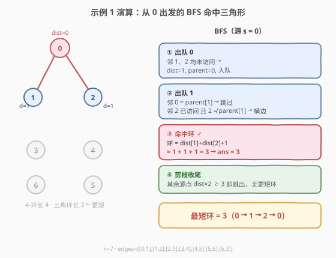

# 图中的最短环

- **题目名称**：图中的最短环
- **链接**：[2608. 图中的最短环](https://leetcode.cn/problems/shortest-cycle-in-a-graph/)
- **难度**：困难
- **标签**：广度优先搜索、图、最短环（girth）

## 1. 题目概述

给定一个含 `n` 个顶点的**无向图**，顶点编号 `0` 到 `n-1`，边由 `edges` 给出，`edges[i] = [ui, vi]` 表示 `ui` 与 `vi` 间有一条边。每对顶点最多一条边、无自环、无重边。

返回图中**最短环**的长度；若不存在环则返回 `-1`。**环**指从某节点出发又回到该节点、且路径中每条边只用一次的闭合路径。

**示例 1**：

```text
输入：n = 7, edges = [[0,1],[1,2],[2,0],[3,4],[4,5],[5,6],[6,3]]
输出：3
解释：最短环为 0 -> 1 -> 2 -> 0，长度 3。
```

**示例 2**：

```text
输入：n = 4, edges = [[0,1],[0,2]]
输出：-1
解释：图是一棵树，无环。
```

**约束条件**：

- `2 <= n <= 1000`
- `1 <= edges.length <= 1000`
- `edges[i].length == 2`
- `0 <= ui, vi < n`，`ui != vi`
- 不存在重复的边

---

## 2. 解题思路

### 2.1 暴力思路

最朴素的是「枚举所有简单环」：从每个点 DFS，记录路径上已访问的边，回到起点即得一个环，取最短。但无向图中的简单环数量随 `n` 指数爆炸，`n <= 1000` 完全不可行。

退一步，利用「**环 = 两条 u→v 路径的并**」这一观察：一条环总可以看成「删掉环上某条边后，两端点之间的一条路径」。于是得到一个朴素但正确的做法——**逐条删边 BFS**：枚举每条边 `(u,v)`，临时删掉它，BFS 求 `u` 到 `v` 的最短路，若可达则环长 = `最短路 + 1`。复杂度 $O(m \cdot (n+m))$，本题规模下约 $2 \times 10^6$ 已经能过。但它对每条边都重跑一次 BFS，重复劳动多，且不够「干净」。

### 2.2 核心观察：逐源 BFS + 横边闭合环

![横边闭合一个环 · 环长 = dist[u]+dist[v]+1](../images/2608_shortest_cycle_bfs_concept.svg)

**一次 BFS 能直接找出「过源点 s 的最短环」**，无需删边。关键在 BFS 的分层性质：

1. 从 `s` 出发做 BFS，得到每个点到 `s` 的最短距离 `dist[]` 与 BFS 树的父指针 `parent[]`。
2. 扫描每条边 `(u, v)`：
   - 若 `v` 未访问 → 它是**树边**，扩展 `dist[v] = dist[u]+1`；
   - 若 `v` 已访问且 **`v != parent[u]`** → 它是**横边（非树边）**，与两条树路径 `s⇝u`、`s⇝v` 一起**闭合出一个环**，环长为

   $$\text{cycle} = \text{dist}[u] + \text{dist}[v] + 1$$

3. 该次 BFS 中所有横边给出的环长取 **min**，即「过 `s` 的最短环」。

> 💡 **为何跳过 `v == parent[u]`？** `parent[u]` 是发现 `u` 的那条树边的另一端，把 `u→parent[u]` 当环走回去只是「原路返回同一条边」，不是合法环。无重边时这一跳就够。

> ⚠️ 注意是 `v != parent[u]` 而非 `dist[v] >= dist[u]`：合法横边可能指向**同层**（给 $2d+1$）或**上一层**（给 $2d$），只要不是来的那条树边都算。

**从每个点都做一次 BFS，取全局最小，就是全图最短环（girth）**。正确性用两个界夹住：

- **下界（算出的值不会比真解小）**：每条横边给出的 `dist[u]+dist[v]+1` 必对应某个真实环（若两条树路径除 `s` 外还共享内部点 `t`，则 `t⇝u ⊕ t⇝v ⊕ (u,v)` 是更短的环，真解只会更小），所以任何一次赋值都 $\geq \text{girth}$，全局 min $\geq$ girth。
- **上界（一定能取到 girth）**：设最短环 $C$ 长为 $L=$ girth，取 $s \in C$。环上离 `s` BFS 距离最远的点 $w$ 满足 $\text{dist}[w] \le \lfloor L/2 \rfloor$；$w$ 的两条环上邻边中至少有一条是横边（`parent[w]` 只占其一），用它闭合得到的环长恰为 $L$（偶数环：邻点在上一层，$= 2\,\text{dist}[w] = L$；奇数环：邻点在同层，$= 2\,\text{dist}[w]+1 = L$）。故全局 min $\le L$。

两界相等 $\Rightarrow$ 全局 min $=$ girth。✓

### 2.3 算法流程图


外加一条**剪枝**：处理节点 `u` 时，它及更远节点能形成的环长 $\ge 2 \cdot \text{dist}[u]$，故一旦 `dist[u] * 2 >= ans` 就可跳出当前源的 BFS（已不可能刷新答案）。由于任何赋给 `ans` 的值都 $\ge$ girth，这条剪枝永不误杀真解。

### 2.4 示例演算



以**示例 1**（`n=7`，含三角环 `0-1-2-0` 与四边环 `3-4-5-6-3`）为例，从 `s=0` 做 BFS：

- `dist[0]=0`，队 `[0]`。
- 出 `0`：邻 `1`、`2` 均未访问 → `dist=1`，`parent=0`，入队。
- 出 `1`：邻 `0 = parent[1]` 跳过；邻 `2` 已访问且 `2 != parent[1]=0` → **横边**，环长 $= \text{dist}[1]+\text{dist}[2]+1 = 1+1+1 = 3$。`ans = 3`。
- 之后任何源的 BFS，一旦 `dist[u]*2 >= 3` 即剪枝跳出，不会再更短。最终返回 `3`。✓

**示例 2**（树，无环）：每个源的 BFS 都遇不到横边，`ans` 始终为 $\infty$，返回 `-1`。✓

---

## 3. 参考代码

### C++（逐源 BFS + 横边检测 + 剪枝）

```cpp
class Solution {
public:
    int findShortestCycle(int n, vector<vector<int>>& edges) {
        vector<vector<int>> g(n);
        for (auto& e : edges) {
            g[e[0]].push_back(e[1]);
            g[e[1]].push_back(e[0]);
        }
        int ans = INT_MAX;
        for (int s = 0; s < n; s++) {
            vector<int> dist(n, -1), par(n, -1);
            queue<int> q;
            dist[s] = 0;
            q.push(s);
            while (!q.empty()) {
                int u = q.front(); q.pop();
                if (dist[u] * 2 >= ans) break;       // 剪枝：不可能更短
                for (int v : g[u]) {
                    if (dist[v] == -1) {            // 树边：扩展
                        dist[v] = dist[u] + 1;
                        par[v] = u;
                        q.push(v);
                    } else if (v != par[u]) {       // 横边：闭合一个环
                        ans = min(ans, dist[u] + dist[v] + 1);
                    }
                }
            }
        }
        return ans == INT_MAX ? -1 : ans;
    }
};
```

### Python（逐源 BFS + 横边检测 + 剪枝）

```python
from collections import deque
from typing import List

class Solution:
    def findShortestCycle(self, n: int, edges: List[List[int]]) -> int:
        g = [[] for _ in range(n)]
        for a, b in edges:
            g[a].append(b)
            g[b].append(a)

        ans = float('inf')
        for s in range(n):
            dist = [-1] * n
            par = [-1] * n
            dist[s] = 0
            q = deque([s])
            while q:
                u = q.popleft()
                if dist[u] * 2 >= ans:          # 剪枝
                    break
                for v in g[u]:
                    if dist[v] == -1:           # 树边：扩展
                        dist[v] = dist[u] + 1
                        par[v] = u
                        q.append(v)
                    elif v != par[u]:           # 横边：闭合一个环
                        ans = min(ans, dist[u] + dist[v] + 1)
        return -1 if ans == float('inf') else ans
```

---

## 4. 复杂度分析

| 维度 | 复杂度 | 说明 |
|------|--------|------|
| 时间复杂度 | $O(n \cdot (n+m))$ | 共 $n$ 个源，每个源一次 BFS 耗 $O(n+m)$；剪枝后实测远低于此上界 |
| 空间复杂度 | $O(n+m)$ | 邻接表 $g$ $O(n+m)$；每次 BFS 的 `dist`/`par`/队列 $O(n)$ |

> 💡 本题 $n, m \le 1000$，$O(n(n+m)) \approx 2 \times 10^6$ 轻松通过。当 $n$ 更大（如 $10^5$）时求精确 girth 较难，需借助「以每点为根时环长下界」等更高级技巧。

---

## 5. 扩展：删边 BFS 与带权 / 有向变体

- **删边 BFS 法**：枚举每条边 `(u,v)`，删边后 BFS 求 `u~v` 最短路，环长 = `路径 + 1`，取 min。正确性直观（环必含其上某条边，删之则环退化为两端点路径），复杂度同为 $O(m(n+m))$，但常数与重复 BFS 更大；适合作为「保底易实现」的对照解。
- **带权图最短环**：把上述 BFS 换成 Dijkstra（逐边删边 + Dijkstra 求 `u~v` 最短路），复杂度 $O(m \cdot m \log n)$；或对每点跑一次 Dijkstra 并在「非树边」`(u,v)` 上取 `dist[u]+dist[v]+w`，思想与本题主解同构。
- **有向图最短环**：对每点跑 BFS/Dijkstra，遇到已访问的出边邻居 `v`（无需排除 parent）即得环 `dist[u]+dist[v]+1`；有向性天然保证方向一致，反而比无向更简单（无 `parent` 歧义）。

---

## 6. 面试要点

1. **为什么单次 BFS 不够，要从每个点都跑？**

   - 一次从 `s` 出发的 BFS 只能发现「**过 `s` 的**」环（横边闭合的两条路径都始于 `s`）。不含 `s` 的环它看不到。所以遍历所有源取最小，才能覆盖全图最短环。

2. **横边给环长 `dist[u]+dist[v]+1`，会不会把非简单路径当环？**

   - 两条树路径 `s⇝u`、`s⇝v` 若共享内部点 `t`，则该「环」不简单，但 `t⇝u ⊕ t⇝v ⊕ (u,v)` 是一条更短的真实环——意味着真解更小，赋值偏大不影响「取全局最小」的正确性。下界论证正基于此。

3. **剪枝 `dist[u]*2 >= ans` 为什么安全？**

   - 处理 `u` 时它能参与的最短环 $\ge 2\,\text{dist}[u]$（横边另一端距离 $\ge \text{dist}[u]-1$）。若该下界已 $\ge$ 当前 `ans`，则 `u` 及更远节点都不可能更优，跳出本源无损。且 `ans` 一旦被赋值就 $\ge$ girth，故剪枝永不误杀真解。

4. **和删边 BFS 法相比优劣？**

   - 两者复杂度同阶 $O(m(n+m))$。本题解（逐源 BFS）每个源只跑一次、且能一次找出「过该源的最短环」，更省；删边法要为每条边重跑，常数大。但删边法正确性更直白，面试时可先讲它再优化到逐源 BFS。

5. **若是树（无环）怎么判？**

   - 所有源的 BFS 都遇不到横边，`ans` 保持 $\infty$，末尾返回 `-1`。本质上「无横边」$\Leftrightarrow$「图是森林」。

---

## 7. 同类练习题

- [1559. 二维网格图中探测环](https://leetcode.cn/problems/detect-cycles-in-2d-grid/)（[题解](../1501-1600/1559_二维网格图中探测环.md)）：网格上同字符 DFS 找环，同为「横边/回边闭合环」的 BFS/DFS 判环思想
- [684. 冗余连接](https://leetcode.cn/problems/redundant-connection/)（[题解](../0601-0700/684_冗余连接.md)）：并查集找「成环的那条边」，另一视角的环检测
- [1192. 寻找关键连接](https://leetcode.cn/problems/critical-connections-in-a-network/)（[题解](../1101-1200/1192_寻找关键连接.md)）：Tarjan 找桥——桥的补集即「在某环上」的边，与求环互为对偶
- [207. 课程表](https://leetcode.cn/problems/course-schedule/)（[题解](../0201-0300/207_课程表.md)）：拓扑排序判环存在性，本题是「判环 + 求最短」的进阶
