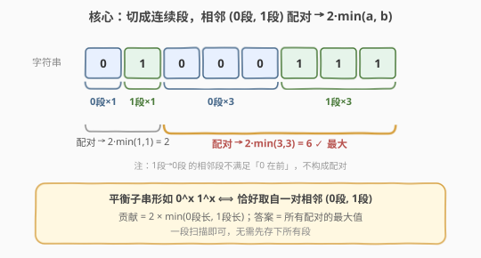
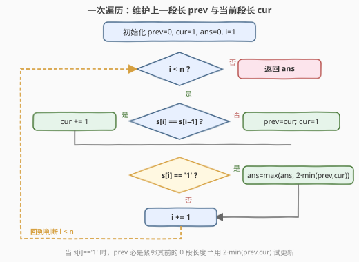
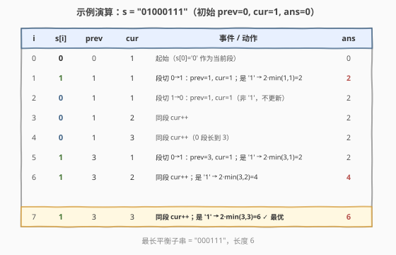

# LeetCode 最长平衡子字符串 题解

## 1. 题目概述

- **标题 / 题号**：最长平衡子字符串（#2609，easy）
- **链接**：https://leetcode.cn/problems/find-the-longest-balanced-substring-of-a-binary-string/
- **难度**：简单
- **标签**：字符串、连续段计数

**题意**：给定一个仅由 `0` 和 `1` 组成的二进制字符串 `s`。如果子字符串中**所有的 `0` 都在 `1` 之前**且 `0` 的数量等于 `1` 的数量，则该子字符串是「平衡」的（空子字符串也算平衡）。返回 `s` 中最长的平衡子字符串的长度。

子字符串是字符串中的一个连续字符序列。

**示例 1**：

```text
输入：s = "01000111"
输出：6
解释：最长的平衡子字符串是 "000111"，长度为 6。
```

**示例 2**：

```text
输入：s = "00111"
输出：4
解释：最长的平衡子字符串是 "0011"，长度为 4。
```

**示例 3**：

```text
输入：s = "111"
输出：0
解释：除空子字符串外不存在其他平衡子字符串，答案为 0。
```

**约束**：

- `1 <= s.length <= 50`
- `s[i]` 为 `'0'` 或 `'1'`

## 2. 解题思路

### 2.1 暴力思路

枚举所有子串 `[i, j]`（共 `O(n^2)` 个），逐个检查它是否形如 `0...01...1` 且 `0`、`1` 数量相等（`O(n)`），取最长。总复杂度 `O(n^3)`，`n <= 50` 时约 $1.25 \times 10^5$ 次操作，能过但不够优雅。关键是利用「0 全在前、1 全在后」的结构，把问题归约到**连续段**上。

### 2.2 核心观察：按连续段配对



平衡子串的形态固定为 $0^x\,1^x$（$x$ 个 `0` 紧接 $x$ 个 `1`）。两个关键观察：

1. **`0` 全来自同一段**：子串中所有 `0` 连续成前缀，因此只能取自同一个「连续 0 段」；同理所有 `1` 取自紧随其后的一个「连续 1 段」。所以**每个平衡子串恰好对应一对相邻的 (0 段, 1 段)**。
2. **取满较短的段最优**：设相邻的 0 段长 $a$、1 段长 $b$，则该配对能贡献的最长平衡子串长为 $2 \cdot \min(a, b)$——从 0 段**末尾**取 $\min(a,b)$ 个 `0`、从 1 段**开头**取 $\min(a,b)$ 个 `1`，恰好相邻拼成合法子串。

> 💡 为什么「1 段在前、0 段在后」的相邻段不算？因为它不满足「所有 0 都在 1 之前」。只有 `0 段 → 1 段` 的顺序才合法。

于是把 `s` 切成连续段，扫一遍相邻的 `(0 段, 1 段)` 配对，取 $2 \cdot \min(a, b)$ 的最大值即为答案。

### 2.3 算法流程图



无需先把所有段存下来——只需维护两个滚动变量：`prev`（上一段长度）和 `cur`（当前段长度）。当字符变化时把 `cur` 交给 `prev`、`cur` 重置为 `1`；每当当前字符是 `'1'`（说明正处于某段 1 中，紧邻的上一段必是 0 段），就用 $2 \cdot \min(prev, cur)$ 试更新答案。

### 2.4 示例演算



以 `s = "01000111"` 为例，初始 `prev=0, cur=1, ans=0`（`s[0]='0'` 作为当前段）：

- `i=1` 遇 `'1'`，段切 `0→1`：`prev=1, cur=1`，是 `'1'` → $2 \cdot \min(1,1)=2$，`ans=2`。
- `i=2..4` 遇 `'0'`：`i=2` 段切 `1→0`（`prev=1, cur=1`），`i=3,4` 同段 `cur` 增至 `3`；非 `'1'` 不更新 `ans`。
- `i=5` 遇 `'1'`，段切 `0→1`：`prev=3, cur=1`，是 `'1'` → $2 \cdot \min(3,1)=2$，`ans` 仍 `2`。
- `i=6,7` 同段 `cur` 增至 `2、3`，是 `'1'` → 分别得 $4、6$，`ans=6`。

最终答案 `6`（子串 `"000111"`）。

## 3. 参考代码

### C++（一次遍历，滚动两变量）

```cpp
class Solution {
  public:
    int findTheLongestBalancedSubstring(string s) {
        int prev = 0, cur = 1, ans = 0; // prev=上一段长, cur=当前段长
        for (int i = 1; i < (int)s.size(); i++) {
            if (s[i] == s[i - 1]) {
                cur++;
            } else {
                prev = cur;
                cur = 1;
            }
            if (s[i] == '1') { // 当前在 1 段，prev 是紧邻的 0 段
                ans = max(ans, 2 * min(prev, cur));
            }
        }
        return ans;
    }
};
```

### Python

```python
class Solution:
    def findTheLongestBalancedSubstring(self, s: str) -> int:
        prev, cur, ans = 0, 1, 0
        for i in range(1, len(s)):
            if s[i] == s[i - 1]:
                cur += 1
            else:
                prev, cur = cur, 1
            if s[i] == '1':
                ans = max(ans, 2 * min(prev, cur))
        return ans
```

> ⚠️ **边界**：`n == 1` 时循环不进入，`ans=0`，正确（单字符无法平衡）。字符串以 `'1'` 开头时，最初几次 `s[i]=='1'` 的 `prev` 仍是 `0`（不存在的「0 段」），$2 \cdot \min(0, cur)=0$，不影响答案。

## 4. 复杂度分析

| 维度 | 复杂度 | 说明 |
|------|--------|------|
| 时间复杂度 | O(n) | 仅一遍扫描，每个字符处理 O(1) |
| 空间复杂度 | O(1) | 只用 `prev`、`cur`、`ans` 三个变量 |

## 5. 扩展：先收集段再扫描的写法

若觉得滚动变量绕，可先把连续段按 `(字符, 长度)` 收集成列表，再遍历相邻配对，逻辑更直白（多用 `O(n)` 空间）：

```cpp
class Solution {
  public:
    int findTheLongestBalancedSubstring(string s) {
        vector<pair<char, int>> runs; // (字符, 长度)
        for (char c : s) {
            if (!runs.empty() && runs.back().first == c) {
                runs.back().second++;
            } else {
                runs.push_back({c, 1});
            }
        }
        int ans = 0;
        for (int i = 0; i + 1 < (int)runs.size(); i++) {
            if (runs[i].first == '0' && runs[i + 1].first == '1') {
                ans = max(ans, 2 * min(runs[i].second, runs[i + 1].second));
            }
        }
        return ans;
    }
};
```

> 💡 两种写法等价：前者把段信息压成两个滚动变量，省去存储；后者显式建模「相邻段配对」，更易讲解、不易写错。

## 6. 面试要点

1. **为什么平衡子串只对应「相邻的 (0 段, 1 段)」配对？**

   - 平衡子串形如 $0^x 1^x$，`0` 连续成前缀必来自单一 0 段，`1` 连续成后缀必来自单一 1 段；又因 `0` 与 `1` 在原串中相邻衔接，故这两段必相邻。

2. **为什么配对贡献是 $2 \cdot \min(a,b)$ 而不是别的？**

   - 受「`0`、`1` 数量相等」约束，能取的 $x \le \min(a,b)$；取 $x=\min(a,b)$ 时子串最长，且从 0 段末尾、1 段开头各取 $x$ 个正好相邻拼接，合法。

3. **字符串以 `1` 开头时初始 `prev=0` 会不会出错？**

   - 不会。`s[i]=='1'` 时若上一段是 `0` 段，`prev` 是其长度；若开头没有 0 段，`prev` 保持 `0`，$2 \cdot \min(0, cur)=0$，自然不计入。

4. **若把条件放宽为「0、1 数量相等但顺序任意」会怎样？**

   - 退化为 [525. 连续数组]：把 `0` 当 $-1$ 求前缀和，哈希记录前缀和首次出现的下标，找同前缀和的最远两点，`O(n)`。本题多了「0 在前」的有序约束，反而更简单——可直接按段计数。

5. **`n` 很大（如 $10^5$）时本解法还成立吗？**

   - 成立，`O(n)` 时间、`O(1)` 空间，与 `n` 无关。题目给 `n <= 50` 只是降低暴力门槛。

## 同类练习题

| # | 题目 | 与本题的关联 |
|---|------|-------------|
| 485 | [最大连续 1 的个数](https://leetcode.cn/problems/max-consecutive-ones/) | 连续段计数的入门题，统计最长 1 段，承接本题「按段」思路。 |
| 525 | [连续数组](https://leetcode.cn/problems/contiguous-array/) | 0/1 等数量但顺序任意，前缀和 + 哈希，对比本题「0 在前」约束下的简化。 |
| 3 | [无重复字符的最长子串](https://leetcode.cn/problems/longest-substring-without-repeating-characters/) | 同为「最长满足某性质的子串」，但用滑动窗口而非分段计数。 |
