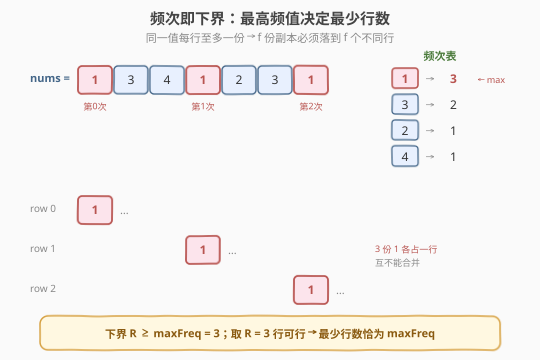
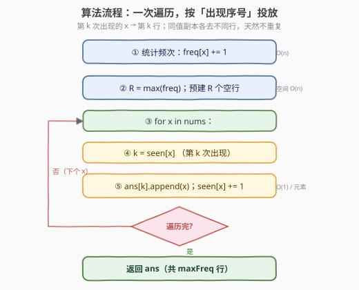

# LeetCode 转换二维数组 题解

## 1. 题目概述

- **标题 / 题号**：转换二维数组（#2610，medium）
- **链接**：https://leetcode.cn/problems/convert-an-array-into-a-2d-array-with-conditions/
- **难度**：中等
- **标签**：数组、哈希表、贪心

**题意**：给定整数数组 `nums`，请构造一个二维数组（数组的数组）满足：

- 二维数组**只**含 `nums` 中的元素，且 `nums` 的每个元素都要用一次（即把 `nums` 作为多重集**完整划分**到各行）；
- 每一行的元素**互不相同**（行内无重复）；
- 行数**尽可能少**。

返回任一合法解。各行长度可以不同。

**示例 1**：

```text
输入：nums = [1,3,4,1,2,3,1]
输出：[[1,3,4,2],[1,3],[1]]
解释：1 出现 3 次，每行至多放一个 1，故至少需要 3 行。
      三行分别为 [1,3,4,2]、[1,3]、[1]，元素总数 4+2+1=7 与 nums 一致。
```

**示例 2**：

```text
输入：nums = [1,2,3,4]
输出：[[4,3,2,1]]
解释：所有元素互异，一行即可。
```

**约束**：

- `1 <= nums.length <= 200`
- `1 <= nums[i] <= nums.length`

> 💡 注意 `nums[i] <= nums.length`——值域与长度同量级，直接用数组计数即可（无需哈希也行）；但哈希写法更通用，且 $n \le 200$ 下两者性能无差。

## 2. 解题思路

### 2.1 暴力思路：模拟「贪心填行」

最朴素的模拟：从左到右扫 `nums`，对每个 `x`，依次检查第 0 行、第 1 行……找到第一个**尚未包含** `x` 的行，把 `x` 放进去；若所有已有行都已含 `x`，就新开一行。这样得到的行数恰好是最少的（理由见 2.2）。问题：每次「某行是否含 `x`」若用线性扫描，复杂度为 $O(n \cdot \text{行数})$；当 `nums` 全相同时（如全 1）会退化到 $O(n^2)$，但 $n \le 200$ 仍可接受。

更糟的暴力是「枚举所有划分」——指数级，不可行。

### 2.2 核心观察：最少行数 = 元素的最大频次



**下界（必须这么多行）**：设值 $x$ 在 `nums` 中出现 $f_x$ 次。由于「每一行内的元素互不相同」，同一个 $x$ 在任何一行里**最多出现一次**。因此 $x$ 的这 $f_x$ 份副本必须被分散到 $f_x$ 个**不同**的行里。于是行数

$$
R \;\ge\; \max_{x}\, f_x \;=\; \text{maxFreq}.
$$

**上界（这么多行够用）**：取 $R = \text{maxFreq}$ 行。对每个值 $x$，把它的**第 $k$ 次出现**（$k = 0,1,\dots,f_x-1$）放进**第 $k$ 行**。由于 $k < f_x \le \text{maxFreq} = R$，行下标合法；又由于同一个 $x$ 的不同副本去到**不同**的行，每行至多含一个 $x$，行内不重复；不同值之间天然不冲突。故 $R = \text{maxFreq}$ 行总是可行。

**结论**：最少行数恰为 $\text{maxFreq} = \max_x f_x$，「第 $k$ 次出现进第 $k$ 行」给出一个合法构造。

> ⚠️ 与「装箱/分组」类问题的区分：这里最小化的是「桶**数量**」而非桶容量，约束是「同值不可同桶」。把每个值想成「要占 $f_x$ 个不同的桶」，桶数就被最大需求决定——这正是[「区间分为最少组数」型问题](../2401-2500/2406_将区间分为最少组数.md)「最少组数 = 最大重叠」的同构逻辑。

### 2.3 算法流程图



两趟线性扫描即可：

1. **第一遍**：统计 `freq[x]`，`R = max(freq.values())`，预建 `R` 个空行；
2. **第二遍**：遍历 `nums`，`k = seen[x]`（`x` 此前已见 `k` 次），把 `x` 追加到第 `k` 行，`seen[x] = k+1`。

> 💡 也可合并成一遍：边扫边按需 `append` 新行——遇到 `x` 时若 `seen[x]` 已达当前行数就新开一行。该写法等价于「第 $k$ 次进第 $k$ 行」，行数自然收敛到 `maxFreq`，不必先扫一遍算上界。

### 2.4 示例演算

![示例演算：nums = [1,3,4,1,2,3,1] 逐元素投放](../images/ca2d_example_walkthrough.svg)

`nums = [1,3,4,1,2,3,1]`，`freq: {1:3, 3:2, 4:1, 2:1}`，`maxFreq = 3`，建 3 行：

| 步 | x | seen[x]（投放前） | 投到行 | row0 | row1 | row2 |
|----|---|-------------------|--------|------|------|------|
| 1 | 1 | 0 | row0 | `[1]` | `[]` | `[]` |
| 2 | 3 | 0 | row0 | `[1,3]` | `[]` | `[]` |
| 3 | 4 | 0 | row0 | `[1,3,4]` | `[]` | `[]` |
| 4 | 1 | 1 | row1 | `[1,3,4]` | `[1]` | `[]` |
| 5 | 2 | 0 | row0 | `[1,3,4,2]` | `[1]` | `[]` |
| 6 | 3 | 1 | row1 | `[1,3,4,2]` | `[1,3]` | `[]` |
| 7 | 1 | 2 | row2 | `[1,3,4,2]` | `[1,3]` | `[1]` |

最终 `[[1,3,4,2],[1,3],[1]]`，共 3 行 $= \text{maxFreq}$。值 `1` 的 3 份副本分别落在 row0/row1/row2，正是「第 $k$ 次进第 $k$ 行」的体现。

## 3. 参考代码

### C++

```cpp
class Solution {
public:
    vector<vector<int>> findMatrix(vector<int>& nums) {
        int n = nums.size();
        vector<int> freq(n + 1, 0);            // 值域 [1, n]，数组计数
        int maxFreq = 0;
        for (int x : nums)
            if (++freq[x] > maxFreq) maxFreq = freq[x];
        vector<vector<int>> ans(maxFreq);      // 预建 maxFreq 行
        vector<int> seen(n + 1, 0);            // seen[x] = 当前已投放的 x 份数
        for (int x : nums) {
            int k = seen[x]++;                  // 第 k 次出现 → 第 k 行
            ans[k].push_back(x);
        }
        return ans;
    }
};
```

### Python

```python
from collections import Counter, defaultdict

class Solution:
    def findMatrix(self, nums: List[int]) -> List[List[int]]:
        freq = Counter(nums)
        rows = max(freq.values())              # 最少行数 = 最大频次
        ans = [[] for _ in range(rows)]
        seen = defaultdict(int)                # seen[x] = 已投放的 x 份数
        for x in nums:
            k = seen[x]                        # 第 k 次出现 → 第 k 行
            ans[k].append(x)
            seen[x] += 1
        return ans
```

> 💡 **为什么「第 $k$ 次进第 $k$ 行」保证行内不重复？** 同一个 $x$ 的不同副本依次取 $k = 0,1,2,\dots$ 各不相同，故进不同行；不同值互不影响。因此每行内任意值至多出现一次。「先算 `maxFreq` 再建行」与「边扫边 append 新行」两种写法在正确性上等价，前者更易讲清下界。

## 4. 复杂度分析

| 维度 | 复杂度 | 说明 |
|------|--------|------|
| 时间复杂度 | $O(n)$ | 两趟线性扫描，每元素 $O(1)$ 哈希/数组操作 |
| 空间复杂度 | $O(n)$ | `freq`/`seen` 计数表 + 输出二维数组，合计存 $n$ 个元素 |

> ⚠️ 计输出空间则 $O(n)$；不计输出，计数表本身也是 $O(n)$（值域 $[1,n]$）。$n \le 200$ 时任何写法都远超所需，本题考点在「下界观察」而非常数优化。

## 5. 扩展：值域受限的「无哈希」写法

由于 `nums[i] <= nums.length`，计数表大小只需 $n+1$，用 `vector<int>` 即可，避免哈希常数与最坏退化。若值域无界（如 $nums[i] \le 10^9$），则改用 `unordered_map`，均摊仍 $O(n)$；若同时要求 $O(1)$ 额外空间（不计输出），则不可行——至少需要 `seen` 表跟踪「第几次出现」。但若允许破坏输入，可把 `nums` 排序后按「同值连续段」分发：排序 $O(n \log n)$ 后，值 $x$ 的连续段长度即 $f_x$，段内第 $k$ 个副本入第 $k$ 行，无需额外计数表（除输出与排序栈空间）。

## 6. 面试要点

1. **为什么最少行数恰好是 `maxFreq`？**

   > 下界：值 $x$ 出现 $f_x$ 次，每行至多 1 个 $x$，故需 $\ge f_x$ 行才能容纳 $x$，$R \ge \max_x f_x$。上界：取 $R = \max f_x$ 行，「第 $k$ 次进第 $k$ 行」是合法构造，故 $R = \max f_x$ 既必要又充分。

2. **「第 $k$ 次出现进第 $k$ 行」为何保证行内不重复？**

   > 同值副本的 $k$ 取 $0,1,\dots,f_x-1$ 互不相同 → 进不同行；不同值间天然不冲突。所以每行内任意值至多一份。注意「行内互异」不要求「列对齐」，各行长度可不同。

3. **能否一遍扫描解决？**

   > 可以：用 `seen` 表边扫边分配，遇到 `x` 时若 `seen[x]` 已达当前行数就新开一行。该写法等价于「第 $k$ 次进第 $k$ 行」，行数自然收敛到 `maxFreq`。预建行需先扫一遍算 `maxFreq`，两遍写法在 $n \le 200$ 下无差异，但更便于讲清下界。

4. **如果要求各行长度尽量均衡呢？**

   > 本题不要求。若需均衡，由于 $f_x \le R$，第 $k$ 次出现取 $k$（$< R$）已天然把高频值摊到尽量多的行；不过「行内互异」不限制行长度，均衡与否不影响合法性。真正约束行长的只有各值的总频次分布。

5. **复杂度能否降到 $O(n)$ 且只用数组（无哈希）？**

   > 因 `nums[i] <= n`，用 `vector<int> freq(n+1)` 即可，$O(n)$ 时间、$O(n)$ 空间，无哈希开销。若值域无界则改用 `unordered_map`，均摊仍 $O(n)$。

> 💡 **一句话总结**：2610 = 「频次即下界 + 第 $k$ 次进第 $k$ 行」。最少行数 $=$ 元素最大频次；把每个值的第 $k$ 次出现放进第 $k$ 行即得合法解，两趟 $O(n)$ 搞定。

## 同类练习题

| # | 题目 | 与本题的关联 |
|---|------|-------------|
| 347 | [前 K 个高频元素](https://leetcode.cn/problems/top-k-frequent-elements/)（[站内题解](../0301-0400/347_前K个高频元素.md)） | 同主题「频次驱动重排」，对照「按频次分桶」与本题「频次决定行数」 |
| 451 | [根据字符出现频率排序](https://leetcode.cn/problems/sort-characters-by-frequency/)（[站内题解](../0401-0500/451_根据字符出现频率排序.md)） | 按频次从高到低输出，桶式按频次分层，与本题「行 = 频次」的映射同构 |
| 1636 | [按照频率将数组升序排序](https://leetcode.cn/problems/sort-array-by-increasing-frequency/)（[站内题解](../1601-1700/1636_按照频率将数组升序排序.md)） | 频率分组排序的简单变体，巩固「频次即分组键」思想 |
| 2406 | [将区间分为最少组数](https://leetcode.cn/problems/divide-intervals-into-minimum-number-of-groups/)（[站内题解](../2401-2500/2406_将区间分为最少组数.md)） | 同类「最少组数 = 最大重叠」的下界论证，与本题「最少行数 = 最大频次」如出一辙 |
