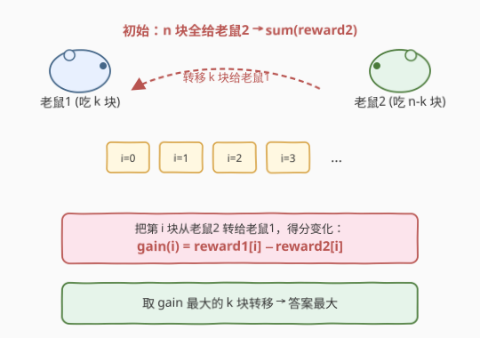
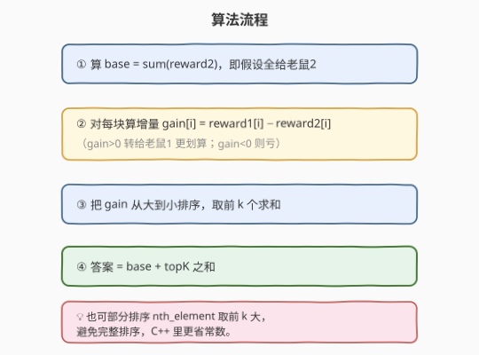
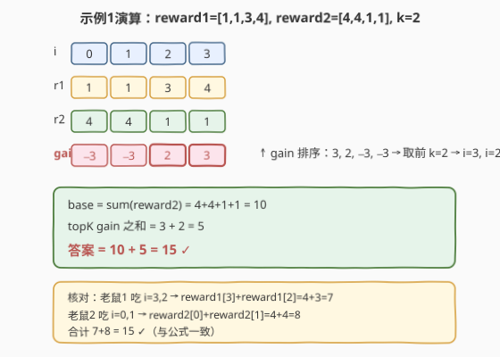

# 老鼠和奶酪

- **题目名称**：老鼠和奶酪
- **链接**：[2611. 老鼠和奶酪](https://leetcode.cn/problems/mice-and-cheese/)
- **难度**：中等
- **标签**：贪心、数组、排序

## 1. 题目概述

有两只老鼠和 `n` 块不同类型的奶酪，每块奶酪都只能被其中一只老鼠吃掉。下标为 `i` 的奶酪被吃掉的得分：

- 如果第一只老鼠吃掉，则得分为 `reward1[i]`；
- 如果第二只老鼠吃掉，则得分为 `reward2[i]`。

给定正整数数组 `reward1`、`reward2` 和非负整数 `k`，请在**第一只老鼠恰好吃掉 `k` 块奶酪**的情况下，返回**最大**总得分。

**示例 1**：

```text
输入：reward1 = [1,1,3,4], reward2 = [4,4,1,1], k = 2
输出：15
解释：第一只老鼠吃掉第 2、3 块奶酪，第二只老鼠吃掉第 0、1 块奶酪。
      总得分 = reward2[0] + reward2[1] + reward1[2] + reward1[3] = 4+4+3+4 = 15。
```

**示例 2**：

```text
输入：reward1 = [1,1], reward2 = [1,1], k = 2
输出：2
解释：第一只老鼠吃掉两块，得分 = reward1[0]+reward1[1] = 2。
```

**约束条件**：

- `1 <= n == reward1.length == reward2.length <= 10^5`
- `1 <= reward1[i], reward2[i] <= 1000`
- `0 <= k <= n`

---

## 2. 解题思路

### 2.1 暴力思路

从 `n` 块中选 `k` 块给老鼠1，方案数为 $\binom{n}{k}$，`n` 可达 $10^5$ 时完全爆炸。暴力枚举所有分配方案不可行，必须发现「选择哪块更划算」的**全局可比度量**。

### 2.2 核心观察：转化增量 + 贪心取 Top-k



把问题从「选哪 k 块」换一个视角：**先假定所有奶酪都归老鼠2**，此时基线分 `base = sum(reward2)`。由于老鼠1 必须恰好吃 `k` 块，等价于我们要把其中 `k` 块**从老鼠2 转给老鼠1**。

每把第 `i` 块从老鼠2 转给老鼠1，得分变化量为：

$$\text{gain}[i] = \text{reward1}[i] - \text{reward2}[i]$$

- `gain[i] > 0`：转给老鼠1 更划算（老鼠1 这块分更高）；
- `gain[i] < 0`：转给老鼠1 亏，但名额必须凑够 `k` 个，只能挑亏得少的。

要使总得分最大，只需让「转移带来的增量之和」最大 → **从 `gain` 数组里挑最大的 `k` 个**。

$$\text{答案} = \sum_{i}\text{reward2}[i] + \max\text{-}k\text{ 之和}\bigl(\text{reward1}[i]-\text{reward2}[i]\bigr)$$

> 💡 为什么这个度量能统一比较？每块奶酪都有且只有一个归宿（被老鼠1 或老鼠2 吃）。把"归宿选择"问题转成"默认归 B、考虑改归 A 的增益"，是经典的**增量贪心**范式——和 [1005. K 次取反后最大数组和](https://leetcode.cn/problems/maximize-sum-of-array-after-k-negations/) 把"翻负"看增量、[2141. 按照时间制作甜点] 取最优增量同源。

### 2.3 算法流程图



### 2.4 示例演算



以**示例 1**（`reward1=[1,1,3,4]`, `reward2=[4,4,1,1]`, `k=2`）为例：

- `base = 4+4+1+1 = 10`；
- `gain = [1−4, 1−4, 3−1, 4−1] = [−3, −3, 2, 3]`；
- 降序排序得 `[3, 2, −3, −3]`，取前 `k=2` 个 → `3 + 2 = 5`；
- 答案 `= 10 + 5 = 15` ✓。

对应分配：`gain` 最大的两块是 `i=3`、`i=2`，给老鼠1；其余 `i=0`、`i=1` 留给老鼠2 → `reward1[3]+reward1[2]+reward2[0]+reward2[1] = 4+3+4+4 = 15`，与公式一致。

---

## 3. 参考代码

### C++（partial_sort 取前 k 大）

```cpp
class Solution {
public:
    int miceAndCheese(vector<int>& reward1, vector<int>& reward2, int k) {
        int n = reward1.size();
        long long base = 0;
        for (int x : reward2) base += x;
        // gain[i] = reward1[i] - reward2[i]，只关心前 k 大
        vector<int> gain(n);
        for (int i = 0; i < n; i++) gain[i] = reward1[i] - reward2[i];
        // nth_element 把前 k 大挪到 [0,k) 区间（内部无序，求和无需有序），期望 O(n)
        nth_element(gain.begin(), gain.begin() + (k - 1), gain.end(), greater<int>());
        long long add = 0;
        for (int i = 0; i < k; i++) add += gain[i];
        return base + add;
    }
};
```

### Python（排序 / 堆）

```python
class Solution:
    def miceAndCheese(self, reward1: List[int], reward2: List[int], k: int) -> int:
        base = sum(reward2)
        gain = sorted((r1 - r2 for r1, r2 in zip(reward1, reward2)), reverse=True)
        return base + sum(gain[:k])
```

> ⚠️ 注意 `reward1`、`reward2` 各元素 ≤ 1000，`n ≤ 10^5`，求和最大约 $10^8$，C++ 用 `long long` 防溢出；Python 整数无限精度无虞。

---

## 4. 复杂度分析

| 维度 | 复杂度 | 说明 |
|------|--------|------|
| 时间复杂度 | $O(n)$ | C++ 用 `nth_element` 是期望 $O(n)$；Python `sorted` 为 $O(n\log n)$，`n=10^5` 仍轻松通过 |
| 空间复杂度 | $O(n)$ | 存 `gain` 数组；若用堆可压到 $O(k)$，但无收益 |

> 💡 C++ 选 `nth_element` 而非 `sort`：题目只需前 `k` 大的**和**，不必给它们排序。`nth_element` 平均 $O(n)$ 把第 `k` 大就位并保证其左侧皆更大，是最贴合此问的"部分排序"原语。

---

## 5. 扩展：若要求方案而非最大得分？

若改成「输出老鼠1 应吃哪些奶酪的下标」，做法不变：把 `gain[i]` 与下标 `i` 配对，按 `gain` 降序取前 `k` 个的下标即为方案。说明本题的**增量贪心不仅求值，也天然给出构造**——这是「比较度量」类贪心的常见附带红利。

---

## 6. 面试要点

1. **为什么增量 `reward1[i]−reward2[i]` 是正确的可比度量？**

   - 每块奶酪最终要么归老鼠1、要么归老鼠2。固定基线为"全归老鼠2"后，决定把第 `i` 块改归老鼠1 的**净效果**就是 `reward1[i]−reward2[i]`，与其它块无关（各块选择相互独立）。各块增量独立可比，故能排序取 Top-k。

2. **`k` 块必须选满，万一有负增量怎么办？**

   - 题目要求"恰好 `k` 块"是硬约束，必须凑足。即便某些 `gain<0` 也得选，那就选「负得最少」的，即按 `gain` 降序排，前 `k` 个里自然包含了所有正增量与必要的最小负增量。贪心在此依旧最优。

3. **能不能改成"每块独立决定给谁、不受 k 约束"？**

   - 那会退化成：每块取 `max(reward1[i], reward2[i])`，是本题 `k` 约束去掉后的特例。本题的难点恰在"恰好 `k` 块"的配额，增量贪心正是把配额分配到边际收益最高的块上。

4. **C++ 为什么用 `nth_element` 而非 `sort`？**

   - `sort` 是 $O(n\log n)$，`nth_element` 期望 $O(n)$ 且只要第 `k` 大就位即可，后续只需把前 `k` 个累加（它们在前 `k` 个位置但内部无序，求和不需有序）。当 `n=10^5` 时常数差距虽不大，但体现"只取所需"的工程意识。

5. **和 1005 K 次取反后最大数组和 有何同构？**

   - 都是「在配额 `k` 内对每个元素做某种变换以最大化总和」。1005 是把最小的负数翻正（增量 `−2x`），本题是把某块从 B 转给 A（增量 `r1−r2`）。同属**按增量排序 + 贪心分配配额**范式。

---

## 7. 同类练习题

- [1005. K 次取反后最大数组和](https://leetcode.cn/problems/maximize-sum-of-array-after-k-negations/)：按"翻负增量"排序贪心分配 `k` 次取反，与本题"按转移增量取 Top-k"同构
- [2141. 按照时间制作甜点](https://leetcode.cn/problems/maximum-running-time-of-n-computers/)：在容量约束下按边际收益分配资源，增量贪心另一变体
- [881. 救生艇](https://leetcode.cn/problems/boats-to-save-people/)：排序后双指针配对，同为"排序 + 贪心决策"系列
- [455. 分发饼干](https://leetcode.cn/problems/assign-cookies/)：排序后贪心匹配，最小饼干配最小胃口，贪心配额分配入门题
