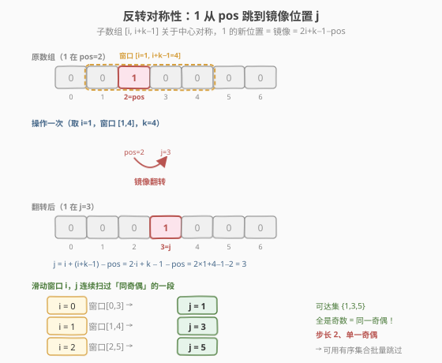
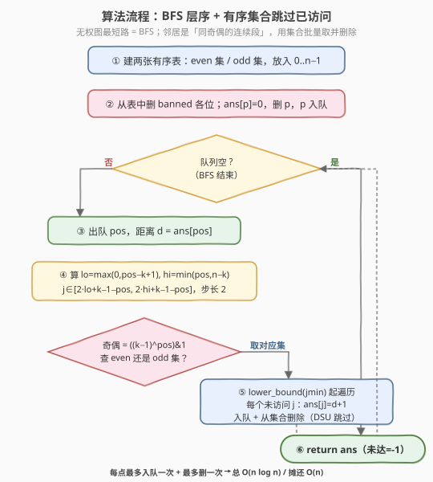

# LeetCode 最少翻转操作数 题解

## 1. 题目概述

- **标题 / 题号**：最少翻转操作数（#2612，hard）
- **链接**：https://leetcode.cn/problems/minimum-reverse-operations/
- **难度**：困难
- **标签**：广度优先搜索、数组、并查集、有序集合、滑动窗口

**题意**：给定整数 `n` 和整数 `p`，表示一个长度为 `n` 的数组 `arr`：除了下标 `p` 处是 `1`，其余位置全是 `0`。再给定整数数组 `banned`（限制位置）。每次操作：

- 若单个 `1` 当前**不在** `banned` 中的位置上，可反转一个大小为 `k` 的**子数组**。

返回长度为 `n` 的答案数组 `answer`，其中 `answer[i]` 是把 `1` 放到位置 `i` 所需的**最少**操作次数；若无法放到 `i`，则为 `-1`。

**示例 1**：

```text
输入：n = 4, p = 0, banned = [1,2], k = 4
输出：[0,-1,-1,1]
解释：1 在位置 0，答案为 0；位置 1、2 被 banned，答案 -1；
      反转整个数组（大小 4），1 从 0 跳到 3，故位置 3 答案为 1。
```

**示例 2**：

```text
输入：n = 5, p = 0, banned = [2,4], k = 3
输出：[0,-1,-1,-1,-1]
解释：从位置 0 唯一可达的镜像位置是 2，但 2 在 banned 中，无法继续扩散。
```

**示例 3**：

```text
输入：n = 4, p = 2, banned = [0,1,3], k = 1
输出：[-1,-1,0,-1]
解释：k=1 时反转大小为 1 的子数组，1 永不移动。
```

**约束**：

- `1 <= n <= 10^5`
- `0 <= p <= n - 1`
- `0 <= banned.length <= n - 1`
- `0 <= banned[i] <= n - 1`
- `1 <= k <= n`
- `banned[i] != p`，且 `banned` 中值互不相同。

> 💡 「最少操作次数」+「无权图」= BFS 的标准信号；难点在于每个位置的邻居是**一段连续区间**，朴素枚举会退化到 $O(n^2)$。

## 2. 解题思路

### 2.1 暴力思路：建图 BFS 但逐个枚举邻居

把每个位置视作节点，从 `pos` 出发的邻居是「所有合法翻转后 1 落到的新位置」。朴素做法：对队列里每个 `pos`，枚举窗口起点 `i`，算出 `j`，若 `j` 未访问则入队。但每个 `pos` 的候选 `i` 有 $O(k)$ 个，最坏 $O(nk)$，$n,k \le 10^5$ 会超时。需要发现邻居的**结构**来批量处理。

### 2.2 核心观察：翻转的对称性 → 邻居是同奇偶的连续段



**关键公式**：反转起点为 `i`、长度为 `k` 的子数组 $[i,\, i+k-1]$。若 `1` 当前在 `pos`（且 $i \le \text{pos} \le i+k-1$），翻转后它落到关于该子数组中心的**镜像位置**：

$$
j = i + (i+k-1) - \text{pos} = 2i + k - 1 - \text{pos}
$$

**合法 `i` 的范围**（窗口须落在 $[0, n-1]$ 内、且须覆盖 `pos`）：

$$
\max(0,\, \text{pos}-k+1) \;\le\; i \;\le\; \min(\text{pos},\, n-k)
$$

记下界 $l$、上界 $h$。当 $i$ 从 $l$ 到 $h$ 逐一增大时，$j = 2i + k - 1 - \text{pos}$ 以**步长 2** 递增，扫过一段连续区间：

$$
j \in \big[\, 2l + k - 1 - \text{pos},\;\; 2h + k - 1 - \text{pos}\,\big], \quad \text{步长 } 2
$$

> ⚠️ 因为 $2i$ 恒为偶数，这一段里**所有 `j` 奇偶性相同**，且奇偶性 $= (k-1-\text{pos}) \bmod 2 = \big((k-1) \oplus \text{pos}\big) \bmod 2$。

于是从 `pos` 出发的邻居不是零散的点，而是**同奇偶的一段连续区间**（去掉 banned 与已访问）。这把「逐个枚举」变成了「**在一段区间里批量取未访问点**」——用一张按奇偶分桶的**有序集合**（或并查集跳表）即可 $O(\log n)$ 定位、$O(1)$ 摊还删除。

> 💡 **奇偶墙**：目标奇偶由 $\big((k-1) \oplus \text{pos}\big)$ 决定。当 $k$ 为奇数时 $k-1$ 为偶，目标奇偶 $=\text{pos}$ 奇偶（**同奇偶互可达**）；$k$ 为偶数时 $k-1$ 为奇，目标奇偶 $=\text{pos}$ 反奇偶（**跨奇偶可达**）。无论哪种，**每一步目标奇偶固定**，故分两张表（even/odd）管理未访问点足矣。

### 2.3 算法流程图



两阶段：

1. **初始化**：建 even/odd 两张有序集合，放入 $0\dots n{-}1$；删去 banned 各位与起点 `p`；`ans[p]=0`，`p` 入队。
2. **BFS**：出队 `pos`（距离 `d`）；算 $l,h$ 与 $[j_{\min}, j_{\max}]$；取目标奇偶对应的那张表，从 `lower_bound(jmin)` 起遍历所有 $\le j_{\max}$ 的未访问点 `j`：置 `ans[j]=d+1`，入队，并从表中删除。队空即止；从未入队的点（含 banned）保持 `-1`。

### 2.4 示例演算

![示例演算：n=6,p=0,banned=[],k=3，奇偶墙使奇位全 -1，偶位逐层扩散](../images/mro_example_walkthrough.svg)

取构造示例 `n=6, p=0, banned=[], k=3`（更能体现奇偶与多层）：

| 层 | 出队 pos | d | 合法 i 范围 | 可达 j（步长2） | 新入队 |
|----|----------|---|------------|-----------------|--------|
| 0 | 0 | 0 | $[0,\,0]$ | $\{2\}$ | 2（d=1） |
| 1 | 2 | 1 | $[0,\,2]$ | $\{0,2,4\}$→去已访 | 4（d=2） |
| 2 | 4 | 2 | $[2,\,3]$ | $\{2,4\}$→全已访 | — |

$k=3$ 奇 $\Rightarrow$ 目标奇偶 $=$ pos 奇偶（同奇偶可达）；起点为偶 $\Rightarrow$ 只能在偶位 $\{0,2,4\}$ 间扩散，奇位 $\{1,3,5\}$ 永不达。最终 `ans = [0,-1,1,-1,2,-1]` ⭐。

对照题目示例 1（`n=4,k=4`）：$k$ 偶 $\Rightarrow$ 目标奇偶 $=$ pos 反奇偶；从偶位 0 出发跨到奇位 3，`ans=[0,-1,-1,1]`，与构造示例的「同奇偶墙」恰成互补。

## 3. 参考代码

### C++（两张 `std::set` 批量删除）

```cpp
class Solution {
  public:
    vector<int> minReverseOperations(int n, int p, vector<int>& banned, int k) {
        vector<int> ans(n, -1);
        set<int> s[2];                       // even / odd 未访问点
        for (int i = 0; i < n; ++i) s[i & 1].insert(i);
        s[p & 1].erase(p);                   // 起点已访问
        for (int b : banned) s[b & 1].erase(b);
        ans[p] = 0;
        queue<int> q;
        q.push(p);
        while (!q.empty()) {
            int pos = q.front(); q.pop();
            int d = ans[pos];
            int l = max(0, pos - k + 1);
            int h = min(pos, n - k);
            if (l > h) continue;
            int jmin = max(2 * l + k - 1 - pos, 0);
            int jmax = min(2 * h + k - 1 - pos, n - 1);
            int parity = ((k - 1) ^ pos) & 1; // 目标奇偶
            auto &st = s[parity];
            auto it = st.lower_bound(jmin);
            while (it != st.end() && *it <= jmax) {
                int j = *it;
                ans[j] = d + 1;
                q.push(j);
                it = st.erase(it);           // 删并取下一个迭代器
            }
        }
        return ans;
    }
};
```

### Python（并查集「跳表」摊还 O(1) 删除）

```python
class Solution:
    def minReverseOperations(self, n: int, p: int, banned: List[int], k: int) -> List[int]:
        ans = [-1] * n
        parent = list(range(n + 2))          # n, n+1 作哨兵

        def find(x):
            while parent[x] != x:
                parent[x] = parent[parent[x]] # 路径压缩（路径折叠）
                x = parent[x]
            return x

        def close(x):                         # 标记 x 已访问：链到 find(x+2)
            parent[x] = find(x + 2)

        for b in banned:
            close(b)
        ans[p] = 0
        close(p)

        q = deque([p])
        while q:
            pos = q.popleft()
            d = ans[pos]
            l = max(0, pos - k + 1)
            h = min(pos, n - k)
            if l > h:
                continue
            jmin = max(2 * l + k - 1 - pos, 0)
            jmax = min(2 * h + k - 1 - pos, n - 1)
            parity = ((k - 1) ^ pos) & 1      # 目标奇偶
            if (jmin & 1) != parity:          # 钳到目标奇偶
                jmin += 1
            j = find(jmin)
            while j <= jmax:                  # find 每次跳到下个同奇偶未访问点
                ans[j] = d + 1
                q.append(j)
                parent[j] = find(j + 2)       # 删除：链向下一个同奇偶点
                j = find(j)
        return ans
```

> 💡 **几处细节**：(1) 目标奇偶 $=\big((k-1)\oplus\text{pos}\big)\mathbin{\&}1$：因 $2i$ 恒偶，$j$ 的奇偶只由 $k-1-\text{pos}$ 决定，而减法与异或在最低位等价（$-b\equiv b\pmod 2$）。(2) C++ 用 `it = st.erase(it)`：`erase` 返回后继迭代器，避免迭代器失效。(3) Python 用并查集「跳表」：`parent[x]=find(x+2)` 把已访问点链向下一个**同奇偶**未访问点（步长 2 保奇偶），`find` 自带路径压缩，删除/查找均摊 $O(1)$，无需 `sortedcontainers`。(4) `jmin` 钳到 $[0,n-1]$ 后奇偶可能翻转，故再补一次 `if (jmin&1)!=parity: jmin+=1`；`jmax` 只作上界，循环条件自然兜底。

## 4. 复杂度分析

| 维度 | 复杂度 | 说明 |
|------|--------|------|
| 时间复杂度 | $O(n \log n)$ | C++ 每点至多入队 1 次、被 `lower_bound`/`erase` 删除 1 次，每次 $O(\log n)$ |
| 时间复杂度 | 摊还 $O(n)$ | Python 并查集 + 路径压缩，每点查找/删除均摊近似 $O(1)$ |
| 空间复杂度 | $O(n)$ | 答案数组、两张集合/并查集 `parent`，均 $O(n)$ |

> ⚠️ $n \le 10^5$：朴素 $O(nk)$ 最坏 $10^{10}$ 必超；集合/并查集把「枚举一段邻居」从 $O(k)$ 降到 $O(\log n)$ 或摊还 $O(1)$，总运算量约 $10^5\sim10^6$，稳过。关键不在于「能否 BFS」，而在于**利用邻居是连续同奇偶段**做批量取删。

## 5. 扩展：两种「跳过已访问」实现对比

邻居是「一段连续同奇偶区间」时，需要在**动态删除**的集合上做区间查询。两种主流实现：

| 实现 | 数据结构 | 单次操作 | 适用语言 | 特点 |
|------|----------|----------|----------|------|
| **有序集合** | 两张 `std::set`（按奇偶分桶） | $O(\log n)$ | C++/Java 等有平衡树的语言 | 代码直观，`lower_bound` + `erase` 一气呵成 |
| **并查集跳表** | `parent[x]=find(x+2)` | 摊还 $\alpha(n) \approx O(1)$ | 无平衡树的语言（Python） | 步长 2 保奇偶，路径压缩后近线性 |

**并查集跳表原理**：把「下一个同奇偶的未访问点」做成一条链。访问 `x` 后令 `parent[x]=find(x+2)`，于是此后任何 `find` 一路跳过已访问段、停在下一个未访问同奇偶点。banned 与已扩散点都预先「闭合」，自然被跳过。其本质是把有序集合的「跳过已删段」操作用并查集的路径压缩摊还到近似 $O(1)$，是**无平衡树语言下的标准替代**（同思路见 [1298. 你能从盒子里获得的最大糖果数](../1201-1300/1298_你能从盒子里获得的最大糖果数.md) 的状态机合并、[547. 省份数量](../0501-0600/547_省份数量.md) 的并查集模板）。

> 💡 另有一种「线段树/树状数组区间改点查」写法：用线段树维护每段奇偶的「剩余未访问数」，二分找下一个未访问点，复杂度同为 $O(n \log n)$ 但常数更大。面试中并查集跳表最简洁，优先掌握。

## 6. 面试要点

1. **为什么是 BFS 而不是 Dijkstra？**

   > 每次操作代价恒为 1，求最少操作次数 = 无权图最短路。无权图最短路 = BFS 层序距离，无需优先队列。只有当边权不等时才需 Dijkstra（对照 [743. 网络延迟时间](../0701-0800/743_网络延迟时间.md)）。

2. **翻转后 `1` 的新位置公式怎么推？**

   > 子数组 $[i, i+k-1]$ 关于中心 $\frac{2i+k-1}{2}$ 对称，`pos` 的镜像即 $i+(i+k-1)-\text{pos}=2i+k-1-\text{pos}$。前提是 $i\le\text{pos}\le i+k-1$（窗口覆盖 `1`），由此得 `i` 的合法范围 $[\max(0,\text{pos}-k+1),\,\min(\text{pos},n-k)]$。

3. **为什么邻居是「同奇偶连续段」？怎么用来加速？**

   > $j=2i+k-1-\text{pos}$，$i$ 每增 1 则 $j$ 增 2，故 $j$ 扫过步长为 2 的一段；$2i$ 恒偶使整段奇偶固定 $=\big((k-1)\oplus\text{pos}\big)\mathbin{\&}1$。于是把邻居视为「按奇偶分桶的有序集合中一段区间」，用 `lower_bound` 定位、批量删除，每点总删除 1 次，避免 $O(k)$ 枚举。

4. **`banned` 位置如何处理？为何永远不会被当作中间态？**

   > 预先把 banned 从两张表删除。它既不会成为答案（始终 `-1`），也不会成为扩散起点——因为「操作要求 1 不在 banned 位」：一旦 `1` 跳到 banned 位就**无法再操作**（被卡死），而该位答案本就是 `-1`，故直接排除即可，不影响对其它位的可达性（BFS 是直接跳转，不存在「经过」banned 的概念）。

5. **没有 `std::set` 的语言怎么做？并查集跳表为什么步长是 2？**

   > 用并查集 `parent[x]=find(x+2)`：步长 2 保证 `find` 始终在**同一奇偶链**上跳，banned/已访问点被预先闭合而自动跳过。路径压缩后每次近似 $O(1)$。若误用步长 1，会把另一奇偶的点也链进来，破坏「同奇偶段」语义，导致查到不可达的点。

> 💡 **一句话总结**：2612 = 「翻转镜像 $j=2i+k-1-\text{pos}$」+「邻居是同奇偶连续段」+「BFS + 有序集合/并查集批量跳过」。把 $O(k)$ 的逐个枚举压成 $O(\log n)$ 或摊还 $O(1)$，是「区间型邻居 BFS」的招牌优化。

## 同类练习题

| # | 题目 | 与本题的关联 |
|---|------|-------------|
| 1306 | [跳跃游戏 III](https://leetcode.cn/problems/jump-game-iii/)（[站内题解](../1301-1400/1306_跳跃游戏%20III.md)） | 数组 BFS + visited 标记的母题，对照本题把「单点邻居」升级为「同奇偶区间邻居」 |
| 1654 | [到家的最少跳跃次数](https://leetcode.cn/problems/minimum-jumps-to-reach-home/)（[站内题解](../1601-1700/1654_到家的最少跳跃次数.md)） | 同为「禁止位置（forbidden/banned）」的数轴 BFS，但跳跃步长固定，对照本题区间型可达 |
| 1345 | [跳跃游戏 IV](https://leetcode.cn/problems/jump-game-iv/)（[站内题解](../1301-1400/1345_跳跃游戏IV.md)） | BFS + 哈希按值分组一次性跳完同值，对照本题「按同奇偶链一次性跳完一段」的集合优化思想 |
| 994 | [腐烂的橘子](https://leetcode.cn/problems/rotting-oranges/)（[站内题解](../0901-1000/994_腐烂的橘子.md)） | 多源 BFS 层序扩散模板，本题单源 BFS 求最少操作次数即层序距离 |
| 547 | [省份数量](https://leetcode.cn/problems/number-of-provinces/)（[站内题解](../0501-0600/547_省份数量.md)） | 并查集基础模板，本题 Python 解的「跳表」复用其路径压缩思想 |
